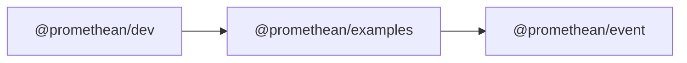

```
<!-- SYMPKG:PKG:BEGIN -->
```
# @promethean/examples
```
**Folder:** `packages/examples`
```
```
**Version:** `0.0.1`
```
```
**Domain:** `_root`
```

## Dependencies
- @promethean/event$../event/README.md
## Dependents
- @promethean/dev$../dev/README.md
```
<!-- SYMPKG:PKG:END -->
```