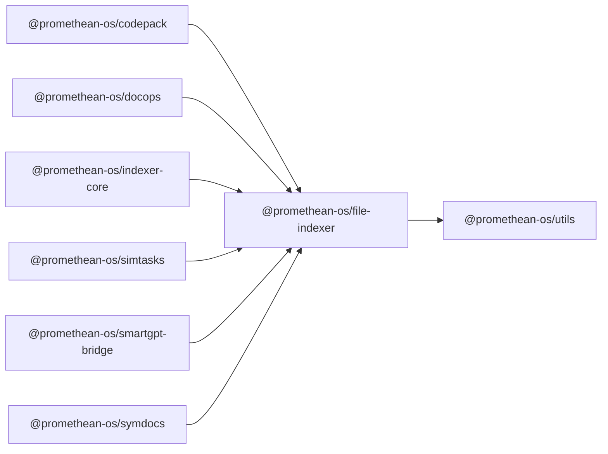

```
<!-- SYMPKG:PKG:BEGIN -->
```
# @promethean-os/file-indexer
```
**Folder:** `packages/file-indexer`
```
```
**Version:** `0.0.1`
```
```
**Domain:** `_root`
```

## Dependencies
- @promethean-os/utils$../utils/README.md
## Dependents
- @promethean-os/codepack$../codepack/README.md
- @promethean-os/docops$../docops/README.md
- @promethean-os/indexer-core$../indexer-core/README.md
- @promethean-os/simtasks$../simtask/README.md
- @promethean-os/smartgpt-bridge$../smartgpt-bridge/README.md
- @promethean-os/symdocs$../symdocs/README.md
```


## 📁 Implementation

### Core Files

- [12](../../../packages/file-indexer/src/12)

### View Source

- [GitHub](https://github.com/promethean-ai/promethean/tree/main/packages/file-indexer/src)
- [VS Code](vscode://file/packages/file-indexer/src)


## 📚 API Reference

### Interfaces

#### [- **index.ts**](../../../packages/file-indexer/src/[src/index.ts](../../../packages/file-indexer/src/index.ts) (8 lines)#L1)

#### [- **path-utils.ts**](../../../packages/file-indexer/src/[src/path-utils.ts](../../../packages/file-indexer/src/path-utils.ts) (110 lines)#L1)

#### [- **runtime.ts**](../../../packages/file-indexer/src/[src/runtime.ts](../../../packages/file-indexer/src/runtime.ts) (263 lines)#L1)

#### [- **scan-files.ts**](../../../packages/file-indexer/src/[src/scan-files.ts](../../../packages/file-indexer/src/scan-files.ts) (69 lines)#L1)

#### [- **tests/scan-files.test.ts**](../../../packages/file-indexer/src/[src/tests/scan-files.test.ts](../../../packages/file-indexer/src/tests/scan-files.test.ts) (155 lines)#L1)

#### [- **types.ts**](../../../packages/file-indexer/src/[src/types.ts](../../../packages/file-indexer/src/types.ts) (41 lines)#L1)

#### [- **normalizeExtensions()**](../../../packages/file-indexer/src/[normalizeExtensions()](../../../packages/file-indexer/src/path-utils.ts#L54)

#### [- **createIgnorePredicate()**](../../../packages/file-indexer/src/[createIgnorePredicate()](../../../packages/file-indexer/src/path-utils.ts#L68)

#### [- **computeTargetFiles()**](../../../packages/file-indexer/src/[computeTargetFiles()](../../../packages/file-indexer/src/runtime.ts#L77)

#### [- **buildDependencies()**](../../../packages/file-indexer/src/[buildDependencies()](../../../packages/file-indexer/src/runtime.ts#L88)

#### [- **processFiles()**](../../../packages/file-indexer/src/[processFiles()](../../../packages/file-indexer/src/runtime.ts#L104)

#### [- **GitHub**](../../../packages/file-indexer/src/[View on GitHub](https#L1)

#### [- **VS Code**](../../../packages/file-indexer/src/[Open in VS Code](vscode#L1)

#### [**Location**](../../../packages/file-indexer/src/[normalizeExtensions()](../../../packages/file-indexer/src/path-utils.ts#L54)

#### [**Description**](../../../packages/file-indexer/src/Key function for normalizeextensions operations.#L1)

#### [**File**](../../../packages/file-indexer/src/`src/path-utils.ts`#L1)

#### [**Location**](../../../packages/file-indexer/src/[createIgnorePredicate()](../../../packages/file-indexer/src/path-utils.ts#L68)

#### [**Description**](../../../packages/file-indexer/src/Key function for createignorepredicate operations.#L1)

#### [**File**](../../../packages/file-indexer/src/`src/path-utils.ts`#L1)

#### [**Location**](../../../packages/file-indexer/src/[computeTargetFiles()](../../../packages/file-indexer/src/runtime.ts#L77)

#### [**Description**](../../../packages/file-indexer/src/Key function for computetargetfiles operations.#L1)

#### [**File**](../../../packages/file-indexer/src/`src/runtime.ts`#L1)

#### [**Location**](../../../packages/file-indexer/src/[buildDependencies()](../../../packages/file-indexer/src/runtime.ts#L88)

#### [**Description**](../../../packages/file-indexer/src/Key function for builddependencies operations.#L1)

#### [**File**](../../../packages/file-indexer/src/`src/runtime.ts`#L1)

#### [**Location**](../../../packages/file-indexer/src/[processFiles()](../../../packages/file-indexer/src/runtime.ts#L104)

#### [**Description**](../../../packages/file-indexer/src/Key function for processfiles operations.#L1)

#### [**File**](../../../packages/file-indexer/src/`src/runtime.ts`#L1)

#### [**Location**](../../../packages/file-indexer/src/[buildResult()](../../../packages/file-indexer/src/runtime.ts#L115)

#### [**Description**](../../../packages/file-indexer/src/Key function for buildresult operations.#L1)

#### [**File**](../../../packages/file-indexer/src/`src/runtime.ts`#L1)

#### [**Location**](../../../packages/file-indexer/src/[createContentPredicate()](../../../packages/file-indexer/src/runtime.ts#L131)

#### [**Description**](../../../packages/file-indexer/src/Key function for createcontentpredicate operations.#L1)

#### [**File**](../../../packages/file-indexer/src/`src/runtime.ts`#L1)

#### [**Location**](../../../packages/file-indexer/src/[normalizeBatchSize()](../../../packages/file-indexer/src/runtime.ts#L144)

#### [**Description**](../../../packages/file-indexer/src/Key function for normalizebatchsize operations.#L1)

#### [**File**](../../../packages/file-indexer/src/`src/runtime.ts`#L1)

#### [**Location**](../../../packages/file-indexer/src/[toProgress()](../../../packages/file-indexer/src/runtime.ts#L160)

#### [**Description**](../../../packages/file-indexer/src/Key function for toprogress operations.#L1)

#### [**File**](../../../packages/file-indexer/src/`src/runtime.ts`#L1)

#### [**Location**](../../../packages/file-indexer/src/[ensureNotAborted()](../../../packages/file-indexer/src/runtime.ts#L171)

#### [**Description**](../../../packages/file-indexer/src/Key function for ensurenotaborted operations.#L1)

#### [**File**](../../../packages/file-indexer/src/`src/runtime.ts`#L1)

#### [**Location**](../../../packages/file-indexer/src/[flushBatch()](../../../packages/file-indexer/src/runtime.ts#L192)

#### [**Description**](../../../packages/file-indexer/src/Key function for flushbatch operations.#L1)

#### [**File**](../../../packages/file-indexer/src/`src/runtime.ts`#L1)

#### [**Location**](../../../packages/file-indexer/src/[scanFiles()](../../../packages/file-indexer/src/scan-files.ts#L20)

#### [**Description**](../../../packages/file-indexer/src/Key function for scanfiles operations.#L1)

#### [**File**](../../../packages/file-indexer/src/`src/scan-files.ts`#L1)

#### [Code links saved to](../../../packages/file-indexer/src//home/err/devel/promethean/tmp/file-indexer-code-links.json#L1)


---

*Enhanced with code links via SYMPKG documentation enhancer*