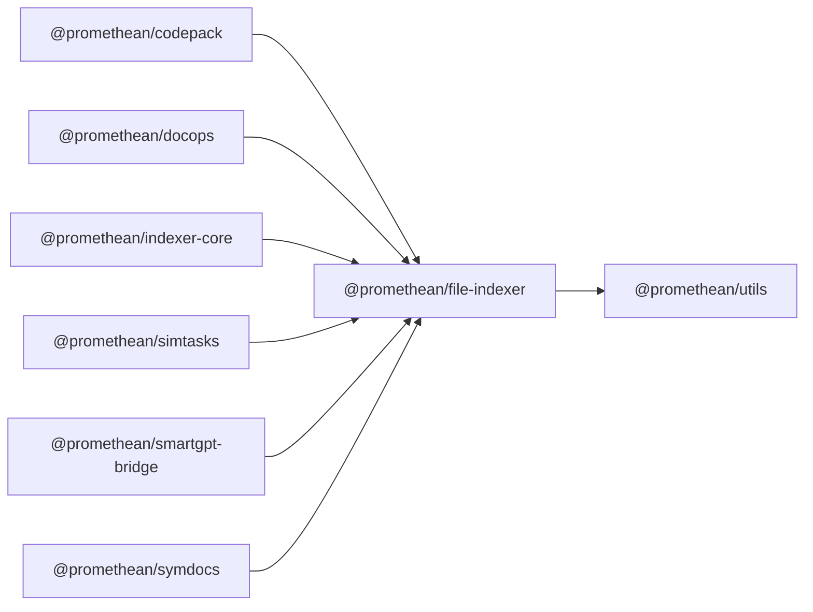

<!-- SYMPKG:PKG:BEGIN -->
# @promethean/file-indexer
**Folder:** `packages/file-indexer`  
**Version:** `0.0.1`  
**Domain:** `_root`

## Dependencies
- [@promethean/utils](../utils/README.md)
## Dependents
- [@promethean/codepack](../codepack/README.md)
- [@promethean/docops](../docops/README.md)
- [@promethean/indexer-core](../indexer-core/README.md)
- [@promethean/simtasks](../simtask/README.md)
- [@promethean/smartgpt-bridge](../smartgpt-bridge/README.md)
- [@promethean/symdocs](../symdocs/README.md)
<!-- SYMPKG:PKG:END -->