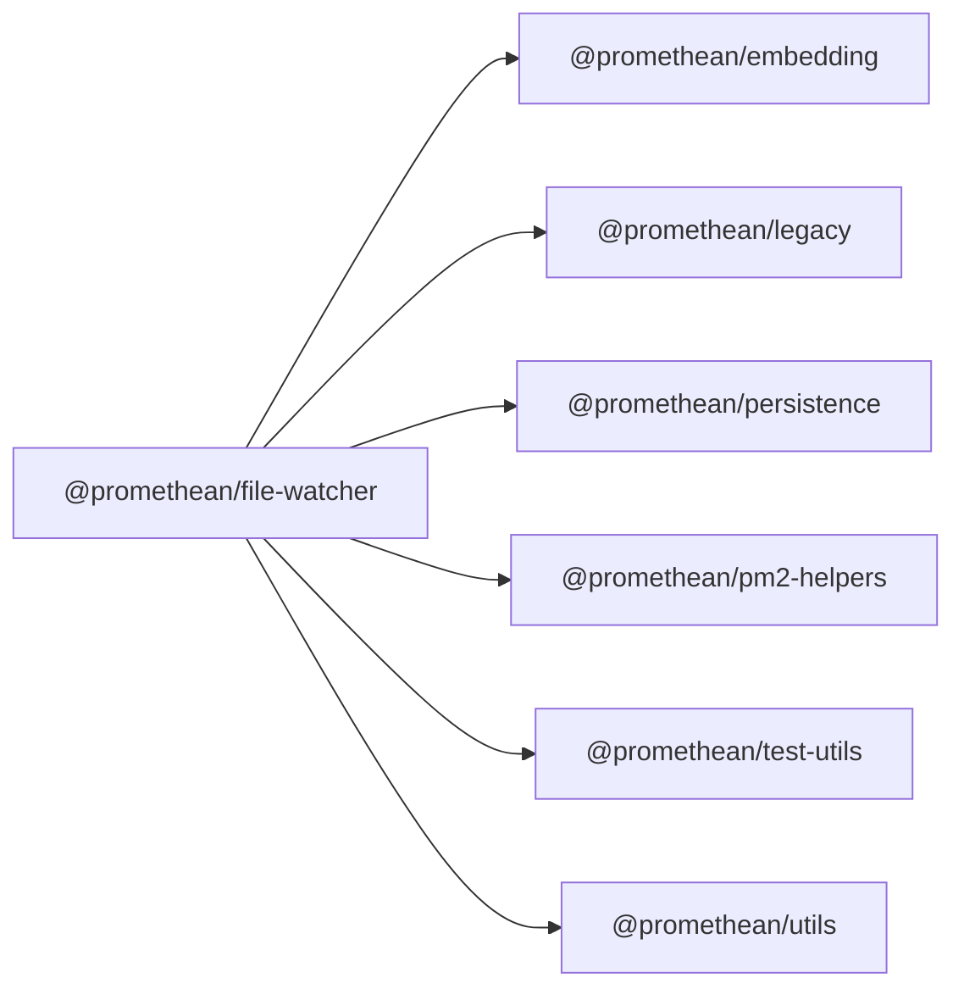

<!-- SYMPKG:PKG:BEGIN -->
# @promethean/file-watcher
**Folder:** `packages/file-watcher`  
**Version:** `0.1.0`  
**Domain:** `_root`

## Dependencies
- [@promethean/embedding](../embedding/README.md)
- [@promethean/legacy](../legacy/README.md)
- [@promethean/persistence](../persistence/README.md)
- [@promethean/pm2-helpers](../pm2-helpers/README.md)
- [@promethean/test-utils](../test-utils/README.md)
- [@promethean/utils](../utils/README.md)
## Dependents
- _None_
<!-- SYMPKG:PKG:END -->