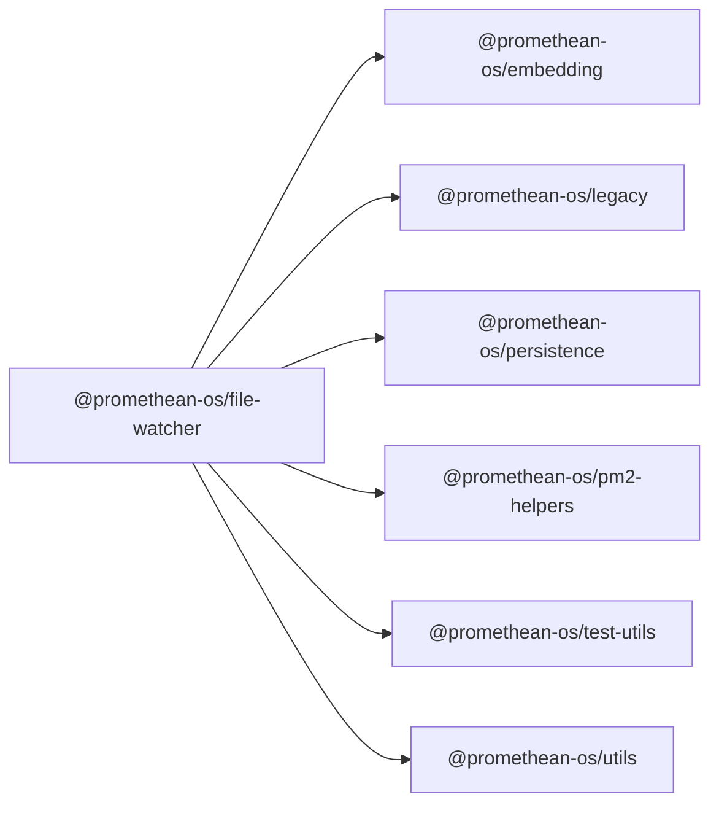

```
<!-- SYMPKG:PKG:BEGIN -->
```
# @promethean-os/file-watcher
```
**Folder:** `packages/file-watcher`
```
```
**Version:** `0.1.0`
```
```
**Domain:** `_root`
```

## Dependencies
- @promethean-os/embedding$../embedding/README.md
- @promethean-os/legacy$../legacy/README.md
- @promethean-os/persistence$../persistence/README.md
- @promethean-os/pm2-helpers$../pm2-helpers/README.md
- @promethean-os/test-utils$../test-utils/README.md
- @promethean-os/utils$../utils/README.md
## Dependents
- _None_
```


## 📁 Implementation

### Core Files

- [7](../../../packages/file-watcher/src/7)

### View Source

- [GitHub](https://github.com/promethean-ai/promethean/tree/main/packages/file-watcher/src)
- [VS Code](vscode://file/packages/file-watcher/src)


## 📚 API Reference

### Interfaces

#### [- **board-watcher.ts**](../../../packages/file-watcher/src/[src/board-watcher.ts](../../../packages/file-watcher/src/board-watcher.ts) (19 lines)#L1)

#### [- **file-lock.ts**](../../../packages/file-watcher/src/[src/file-lock.ts](../../../packages/file-watcher/src/file-lock.ts) (27 lines)#L1)

#### [- **index.ts**](../../../packages/file-watcher/src/[src/index.ts](../../../packages/file-watcher/src/index.ts) (73 lines)#L1)

#### [- **repo-watcher.ts**](../../../packages/file-watcher/src/[src/repo-watcher.ts](../../../packages/file-watcher/src/repo-watcher.ts) (194 lines)#L1)

#### [- **tasks-watcher.ts**](../../../packages/file-watcher/src/[src/tasks-watcher.ts](../../../packages/file-watcher/src/tasks-watcher.ts) (33 lines)#L1)

#### [- **tests/broker.unit.test.ts**](../../../packages/file-watcher/src/[src/tests/broker.unit.test.ts](../../../packages/file-watcher/src/tests/broker.unit.test.ts) (64 lines)#L1)

#### [- **tests/events.test.ts**](../../../packages/file-watcher/src/[src/tests/events.test.ts](../../../packages/file-watcher/src/tests/events.test.ts) (58 lines)#L1)

#### [- **tests/repo-watcher.test.ts**](../../../packages/file-watcher/src/[src/tests/repo-watcher.test.ts](../../../packages/file-watcher/src/tests/repo-watcher.test.ts) (49 lines)#L1)

#### [- **token-client.ts**](../../../packages/file-watcher/src/[src/token-client.ts](../../../packages/file-watcher/src/token-client.ts) (71 lines)#L1)

#### [- **FileLocks**](../../../packages/file-watcher/src/[FileLocks](../../../packages/file-watcher/src/file-lock.ts#L3)

#### [- **createBoardWatcher()**](../../../packages/file-watcher/src/[createBoardWatcher()](../../../packages/file-watcher/src/board-watcher.ts#L9)

#### [- **startFileWatcher()**](../../../packages/file-watcher/src/[startFileWatcher()](../../../packages/file-watcher/src/index.ts#L19)

#### [- **checkGitIgnored()**](../../../packages/file-watcher/src/[checkGitIgnored()](../../../packages/file-watcher/src/repo-watcher.ts#L29)

#### [- **createRepoWatcher()**](../../../packages/file-watcher/src/[createRepoWatcher()](../../../packages/file-watcher/src/repo-watcher.ts#L104)

#### [- **createTasksWatcher()**](../../../packages/file-watcher/src/[createTasksWatcher()](../../../packages/file-watcher/src/tasks-watcher.ts#L17)

#### [- **GitHub**](../../../packages/file-watcher/src/[View on GitHub](https#L1)

#### [- **VS Code**](../../../packages/file-watcher/src/[Open in VS Code](vscode#L1)

#### [**Location**](../../../packages/file-watcher/src/[FileLocks](../../../packages/file-watcher/src/file-lock.ts#L3)

#### [**Description**](../../../packages/file-watcher/src/Main class for filelocks functionality.#L1)

#### [**File**](../../../packages/file-watcher/src/`src/file-lock.ts`#L1)

#### [**Location**](../../../packages/file-watcher/src/[createBoardWatcher()](../../../packages/file-watcher/src/board-watcher.ts#L9)

#### [**Description**](../../../packages/file-watcher/src/Key function for createboardwatcher operations.#L1)

#### [**File**](../../../packages/file-watcher/src/`src/board-watcher.ts`#L1)

#### [**Location**](../../../packages/file-watcher/src/[startFileWatcher()](../../../packages/file-watcher/src/index.ts#L19)

#### [**Description**](../../../packages/file-watcher/src/Key function for startfilewatcher operations.#L1)

#### [**File**](../../../packages/file-watcher/src/`src/index.ts`#L1)

#### [**Location**](../../../packages/file-watcher/src/[checkGitIgnored()](../../../packages/file-watcher/src/repo-watcher.ts#L29)

#### [**Description**](../../../packages/file-watcher/src/Key function for checkgitignored operations.#L1)

#### [**File**](../../../packages/file-watcher/src/`src/repo-watcher.ts`#L1)

#### [**Location**](../../../packages/file-watcher/src/[createRepoWatcher()](../../../packages/file-watcher/src/repo-watcher.ts#L104)

#### [**Description**](../../../packages/file-watcher/src/Key function for createrepowatcher operations.#L1)

#### [**File**](../../../packages/file-watcher/src/`src/repo-watcher.ts`#L1)

#### [**Location**](../../../packages/file-watcher/src/[createTasksWatcher()](../../../packages/file-watcher/src/tasks-watcher.ts#L17)

#### [**Description**](../../../packages/file-watcher/src/Key function for createtaskswatcher operations.#L1)

#### [**File**](../../../packages/file-watcher/src/`src/tasks-watcher.ts`#L1)

#### [**Location**](../../../packages/file-watcher/src/[createTokenProviderFromEnv()](../../../packages/file-watcher/src/token-client.ts#L41)

#### [**Description**](../../../packages/file-watcher/src/Key function for createtokenproviderfromenv operations.#L1)

#### [**File**](../../../packages/file-watcher/src/`src/token-client.ts`#L1)

#### [Code links saved to](../../../packages/file-watcher/src//home/err/devel/promethean/tmp/file-watcher-code-links.json#L1)


---

*Enhanced with code links via SYMPKG documentation enhancer*