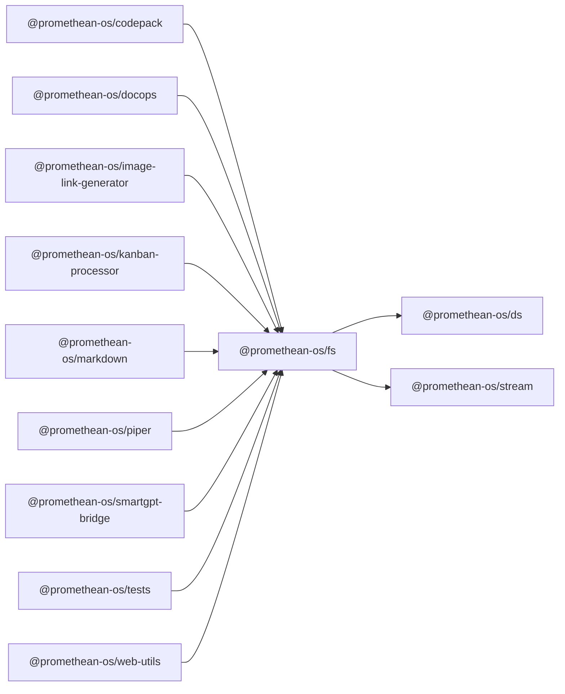

```
<!-- SYMPKG:PKG:BEGIN -->
```
# @promethean-os/fs
```
**Folder:** `packages/fs`
```
```
**Version:** `0.0.1`
```
```
**Domain:** `_root`
```

## Dependencies
- @promethean-os/ds$../ds/README.md
- @promethean-os/stream$../stream/README.md
## Dependents
- @promethean-os/codepack$../codepack/README.md
- @promethean-os/docops$../docops/README.md
- @promethean-os/image-link-generator$../image-link-generator/README.md
- @promethean-os/kanban-processor$../kanban-processor/README.md
- @promethean-os/markdown$../markdown/README.md
- @promethean-os/piper$../piper/README.md
- @promethean-os/smartgpt-bridge$../smartgpt-bridge/README.md
- @promethean-os/tests$../tests/README.md
- @promethean-os/web-utils$../web-utils/README.md
```


## 📁 Implementation

### Core Files

- [24](../../../packages/fs/src/24)

### View Source

- [GitHub](https://github.com/promethean-ai/promethean/tree/main/packages/fs/src)
- [VS Code](vscode://file/packages/fs/src)


## 📚 API Reference

### Interfaces

#### [- **ecs.ts**](../../../packages/fs/src/[src/ecs.ts](../../../packages/fs/src/ecs.ts) (236 lines)#L1)

#### [- **ensureDir.ts**](../../../packages/fs/src/[src/ensureDir.ts](../../../packages/fs/src/ensureDir.ts) (6 lines)#L1)

#### [- **fileExplorer.ts**](../../../packages/fs/src/[src/fileExplorer.ts](../../../packages/fs/src/fileExplorer.ts) (46 lines)#L1)

#### [- **index.ts**](../../../packages/fs/src/[src/index.ts](../../../packages/fs/src/index.ts) (22 lines)#L1)

#### [- **mirrorTransform.ts**](../../../packages/fs/src/[src/mirrorTransform.ts](../../../packages/fs/src/mirrorTransform.ts) (283 lines)#L1)

#### [- **mirrorWrite.ts**](../../../packages/fs/src/[src/mirrorWrite.ts](../../../packages/fs/src/mirrorWrite.ts) (491 lines)#L1)

#### [- **pathUtils.ts**](../../../packages/fs/src/[src/pathUtils.ts](../../../packages/fs/src/pathUtils.ts) (7 lines)#L1)

#### [- **snapshot.ts**](../../../packages/fs/src/[src/snapshot.ts](../../../packages/fs/src/snapshot.ts) (122 lines)#L1)

#### [- **streamTree.ts**](../../../packages/fs/src/[src/streamTree.ts](../../../packages/fs/src/streamTree.ts) (198 lines)#L1)

#### [- **streamTreeConcurrent.ts**](../../../packages/fs/src/[src/streamTreeConcurrent.ts](../../../packages/fs/src/streamTreeConcurrent.ts) (200 lines)#L1)

#### [- **streamTreeGeneratorsConcurrent.ts**](../../../packages/fs/src/[src/streamTreeGeneratorsConcurrent.ts](../../../packages/fs/src/streamTreeGeneratorsConcurrent.ts) (267 lines)#L1)

#### [- **tests/ecs.test.ts**](../../../packages/fs/src/[src/tests/ecs.test.ts](../../../packages/fs/src/tests/ecs.test.ts) (116 lines)#L1)

#### [- **tests/ensureDir.test.ts**](../../../packages/fs/src/[src/tests/ensureDir.test.ts](../../../packages/fs/src/tests/ensureDir.test.ts) (15 lines)#L1)

#### [- **tests/streamTreeConcurrent.test.ts**](../../../packages/fs/src/[src/tests/streamTreeConcurrent.test.ts](../../../packages/fs/src/tests/streamTreeConcurrent.test.ts) (25 lines)#L1)

#### [- **tree.ts**](../../../packages/fs/src/[src/tree.ts](../../../packages/fs/src/tree.ts) (222 lines)#L1)

#### [- **util.ts**](../../../packages/fs/src/[src/util.ts](../../../packages/fs/src/util.ts) (119 lines)#L1)

#### [- **writeOperations.ts**](../../../packages/fs/src/[src/writeOperations.ts](../../../packages/fs/src/writeOperations.ts) (75 lines)#L1)

#### [- **AsyncQueue**](../../../packages/fs/src/[AsyncQueue](../../../packages/fs/src/streamTreeGeneratorsConcurrent.ts#L48)

#### [- **registerFsComponents()**](../../../packages/fs/src/[registerFsComponents()](../../../packages/fs/src/ecs.ts#L67)

#### [- **initFsEcs()**](../../../packages/fs/src/[initFsEcs()](../../../packages/fs/src/ecs.ts#L87)

#### [- **ensureDir()**](../../../packages/fs/src/[ensureDir()](../../../packages/fs/src/ensureDir.ts#L3)

#### [- **listDir()**](../../../packages/fs/src/[listDir()](../../../packages/fs/src/fileExplorer.ts#L21)

#### [- **readFile()**](../../../packages/fs/src/[readFile()](../../../packages/fs/src/fileExplorer.ts#L33)

#### [- **GitHub**](../../../packages/fs/src/[View on GitHub](https#L1)

#### [- **VS Code**](../../../packages/fs/src/[Open in VS Code](vscode#L1)

#### [**Location**](../../../packages/fs/src/[AsyncQueue](../../../packages/fs/src/streamTreeGeneratorsConcurrent.ts#L48)

#### [**Description**](../../../packages/fs/src/Main class for asyncqueue functionality.#L1)

#### [**File**](../../../packages/fs/src/`src/streamTreeGeneratorsConcurrent.ts`#L1)

#### [**Location**](../../../packages/fs/src/[registerFsComponents()](../../../packages/fs/src/ecs.ts#L67)

#### [**Description**](../../../packages/fs/src/Key function for registerfscomponents operations.#L1)

#### [**File**](../../../packages/fs/src/`src/ecs.ts`#L1)

#### [**Location**](../../../packages/fs/src/[initFsEcs()](../../../packages/fs/src/ecs.ts#L87)

#### [**Description**](../../../packages/fs/src/Key function for initfsecs operations.#L1)

#### [**File**](../../../packages/fs/src/`src/ecs.ts`#L1)

#### [**Location**](../../../packages/fs/src/[ensureDir()](../../../packages/fs/src/ensureDir.ts#L3)

#### [**Description**](../../../packages/fs/src/Key function for ensuredir operations.#L1)

#### [**File**](../../../packages/fs/src/`src/ensureDir.ts`#L1)

#### [**Location**](../../../packages/fs/src/[listDir()](../../../packages/fs/src/fileExplorer.ts#L21)

#### [**Description**](../../../packages/fs/src/Key function for listdir operations.#L1)

#### [**File**](../../../packages/fs/src/`src/fileExplorer.ts`#L1)

#### [**Location**](../../../packages/fs/src/[readFile()](../../../packages/fs/src/fileExplorer.ts#L33)

#### [**Description**](../../../packages/fs/src/Key function for readfile operations.#L1)

#### [**File**](../../../packages/fs/src/`src/fileExplorer.ts`#L1)

#### [**Location**](../../../packages/fs/src/[searchFiles()](../../../packages/fs/src/fileExplorer.ts#L41)

#### [**Description**](../../../packages/fs/src/Key function for searchfiles operations.#L1)

#### [**File**](../../../packages/fs/src/`src/fileExplorer.ts`#L1)

#### [**Location**](../../../packages/fs/src/[mirrorTree()](../../../packages/fs/src/mirrorTransform.ts#L75)

#### [**Description**](../../../packages/fs/src/Key function for mirrortree operations.#L1)

#### [**File**](../../../packages/fs/src/`src/mirrorTransform.ts`#L1)

#### [**Location**](../../../packages/fs/src/[mapLines()](../../../packages/fs/src/mirrorTransform.ts#L268)

#### [**Description**](../../../packages/fs/src/Key function for maplines operations.#L1)

#### [**File**](../../../packages/fs/src/`src/mirrorTransform.ts`#L1)

#### [**Location**](../../../packages/fs/src/[mirrorWithHandler()](../../../packages/fs/src/mirrorWrite.ts#L100)

#### [**Description**](../../../packages/fs/src/Key function for mirrorwithhandler operations.#L1)

#### [**File**](../../../packages/fs/src/`src/mirrorWrite.ts`#L1)

#### [**Location**](../../../packages/fs/src/[normalizeRelative()](../../../packages/fs/src/pathUtils.ts#L3)

#### [**Description**](../../../packages/fs/src/Key function for normalizerelative operations.#L1)

#### [**File**](../../../packages/fs/src/`src/pathUtils.ts`#L1)

#### [**Location**](../../../packages/fs/src/[loadEntries()](../../../packages/fs/src/snapshot.ts#L15)

#### [**Description**](../../../packages/fs/src/Key function for loadentries operations.#L1)

#### [**File**](../../../packages/fs/src/`src/snapshot.ts`#L1)

#### [**Location**](../../../packages/fs/src/[normalizeEntry()](../../../packages/fs/src/snapshot.ts#L30)

#### [**Description**](../../../packages/fs/src/Key function for normalizeentry operations.#L1)

#### [**File**](../../../packages/fs/src/`src/snapshot.ts`#L1)

#### [**Location**](../../../packages/fs/src/[maybeLoadContents()](../../../packages/fs/src/snapshot.ts#L38)

#### [**Description**](../../../packages/fs/src/Key function for maybeloadcontents operations.#L1)

#### [**File**](../../../packages/fs/src/`src/snapshot.ts`#L1)

#### [**Location**](../../../packages/fs/src/[computeSnapshotHash()](../../../packages/fs/src/snapshot.ts#L72)

#### [**Description**](../../../packages/fs/src/Key function for computesnapshothash operations.#L1)

#### [**File**](../../../packages/fs/src/`src/snapshot.ts`#L1)

#### [**Location**](../../../packages/fs/src/[buildTree()](../../../packages/fs/src/tree.ts#L167)

#### [**Description**](../../../packages/fs/src/Key function for buildtree operations.#L1)

#### [**File**](../../../packages/fs/src/`src/tree.ts`#L1)

#### [**Location**](../../../packages/fs/src/[flattenTree()](../../../packages/fs/src/tree.ts#L176)

#### [**Description**](../../../packages/fs/src/Key function for flattentree operations.#L1)

#### [**File**](../../../packages/fs/src/`src/tree.ts`#L1)

#### [**Location**](../../../packages/fs/src/[filterTree()](../../../packages/fs/src/tree.ts#L185)

#### [**Description**](../../../packages/fs/src/Key function for filtertree operations.#L1)

#### [**File**](../../../packages/fs/src/`src/tree.ts`#L1)

#### [**Location**](../../../packages/fs/src/[collapseSingleChildDirs()](../../../packages/fs/src/tree.ts#L201)

#### [**Description**](../../../packages/fs/src/Key function for collapsesinglechilddirs operations.#L1)

#### [**File**](../../../packages/fs/src/`src/tree.ts`#L1)

#### [**Location**](../../../packages/fs/src/[walkDir()](../../../packages/fs/src/util.ts#L100)

#### [**Description**](../../../packages/fs/src/Key function for walkdir operations.#L1)

#### [**File**](../../../packages/fs/src/`src/util.ts`#L1)

#### [**Location**](../../../packages/fs/src/[listFiles()](../../../packages/fs/src/util.ts#L109)

#### [**Description**](../../../packages/fs/src/Key function for listfiles operations.#L1)

#### [**File**](../../../packages/fs/src/`src/util.ts`#L1)

#### [**Location**](../../../packages/fs/src/[listDirs()](../../../packages/fs/src/util.ts#L116)

#### [**Description**](../../../packages/fs/src/Key function for listdirs operations.#L1)

#### [**File**](../../../packages/fs/src/`src/util.ts`#L1)

#### [**Location**](../../../packages/fs/src/[applyOperationsSequentially()](../../../packages/fs/src/writeOperations.ts#L14)

#### [**Description**](../../../packages/fs/src/Key function for applyoperationssequentially operations.#L1)

#### [**File**](../../../packages/fs/src/`src/writeOperations.ts`#L1)

#### [**Location**](../../../packages/fs/src/[applyOperation()](../../../packages/fs/src/writeOperations.ts#L35)

#### [**Description**](../../../packages/fs/src/Key function for applyoperation operations.#L1)

#### [**File**](../../../packages/fs/src/`src/writeOperations.ts`#L1)

#### [**Location**](../../../packages/fs/src/[hashOperations()](../../../packages/fs/src/writeOperations.ts#L62)

#### [**Description**](../../../packages/fs/src/Key function for hashoperations operations.#L1)

#### [**File**](../../../packages/fs/src/`src/writeOperations.ts`#L1)

#### [Code links saved to](../../../packages/fs/src//home/err/devel/promethean/tmp/fs-code-links.json#L1)


---

*Enhanced with code links via SYMPKG documentation enhancer*