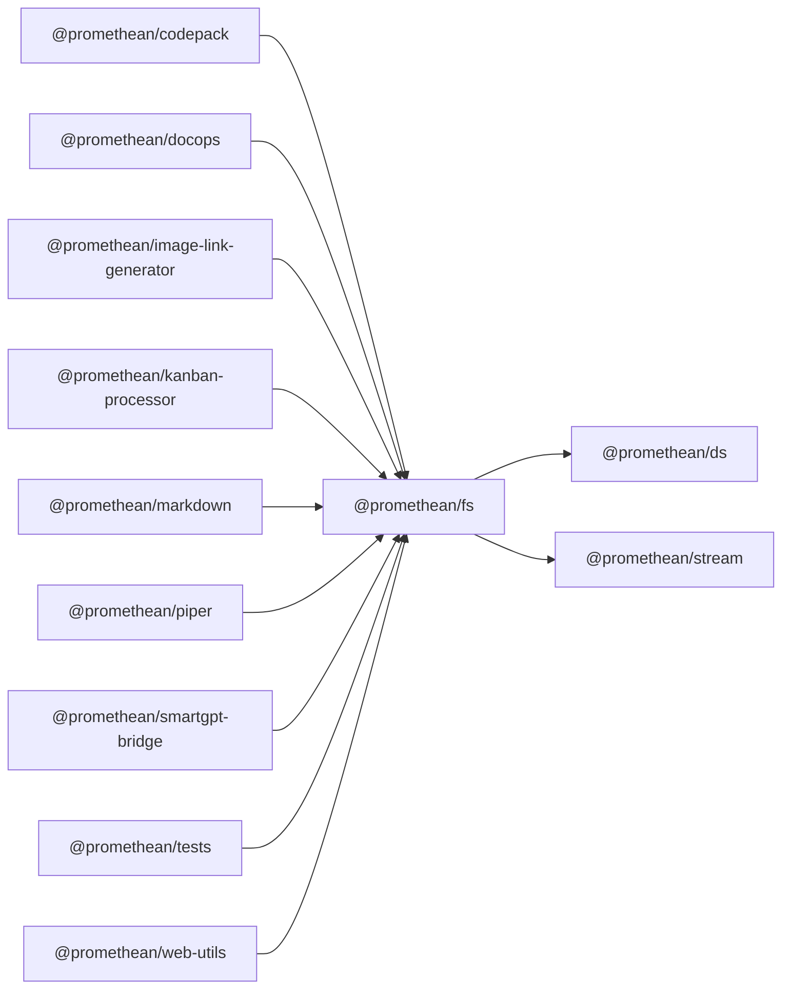

<!-- SYMPKG:PKG:BEGIN -->
# @promethean/fs
**Folder:** `packages/fs`  
**Version:** `0.0.1`  
**Domain:** `_root`

## Dependencies
- [@promethean/ds](../ds/README.md)
- [@promethean/stream](../stream/README.md)
## Dependents
- [@promethean/codepack](../codepack/README.md)
- [@promethean/docops](../docops/README.md)
- [@promethean/image-link-generator](../image-link-generator/README.md)
- [@promethean/kanban-processor](../kanban-processor/README.md)
- [@promethean/markdown](../markdown/README.md)
- [@promethean/piper](../piper/README.md)
- [@promethean/smartgpt-bridge](../smartgpt-bridge/README.md)
- [@promethean/tests](../tests/README.md)
- [@promethean/web-utils](../web-utils/README.md)
<!-- SYMPKG:PKG:END -->