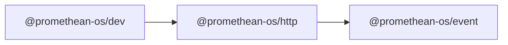

```
<!-- SYMPKG:PKG:BEGIN -->
```
# @promethean-os/http
```
**Folder:** `packages/http`
```
```
**Version:** `0.0.1`
```
```
**Domain:** `_root`
```

## Dependencies
- @promethean-os/event$../event/README.md
## Dependents
- @promethean-os/dev$../dev/README.md
```


## 📁 Implementation

### Core Files

- [4](../../../packages/http/src/4)

### View Source

- [GitHub](https://github.com/promethean-ai/promethean/tree/main/packages/http/src)
- [VS Code](vscode://file/packages/http/src)


## 📚 API Reference

### Interfaces

#### [- **hf.ts**](../../../packages/http/src/[src/hf.ts](../../../packages/http/src/hf.ts) (104 lines)#L1)

#### [- **index.ts**](../../../packages/http/src/[src/index.ts](../../../packages/http/src/index.ts) (4 lines)#L1)

#### [- **publish.ts**](../../../packages/http/src/[src/publish.ts](../../../packages/http/src/publish.ts) (102 lines)#L1)

#### [- **replay.ts**](../../../packages/http/src/[src/replay.ts](../../../packages/http/src/replay.ts) (266 lines)#L1)

#### [- **tests/hf.test.ts**](../../../packages/http/src/[src/tests/hf.test.ts](../../../packages/http/src/tests/hf.test.ts) (66 lines)#L1)

#### [- **HuggingFaceClient**](../../../packages/http/src/[HuggingFaceClient](../../../packages/http/src/hf.ts#L73)

#### [- **HttpError**](../../../packages/http/src/[HttpError](../../../packages/http/src/replay.ts#L14)

#### [- **createHfClient()**](../../../packages/http/src/[createHfClient()](../../../packages/http/src/hf.ts#L103)

#### [- **startHttpPublisher()**](../../../packages/http/src/[startHttpPublisher()](../../../packages/http/src/publish.ts#L61)

#### [- **startReplayAPI()**](../../../packages/http/src/[startReplayAPI()](../../../packages/http/src/replay.ts#L247)

#### [- **GitHub**](../../../packages/http/src/[View on GitHub](https#L1)

#### [- **VS Code**](../../../packages/http/src/[Open in VS Code](vscode#L1)

#### [**Location**](../../../packages/http/src/[HuggingFaceClient](../../../packages/http/src/hf.ts#L73)

#### [**Description**](../../../packages/http/src/Main class for huggingfaceclient functionality.#L1)

#### [**File**](../../../packages/http/src/`src/hf.ts`#L1)

#### [**Location**](../../../packages/http/src/[HttpError](../../../packages/http/src/replay.ts#L14)

#### [**Description**](../../../packages/http/src/Main class for httperror functionality.#L1)

#### [**File**](../../../packages/http/src/`src/replay.ts`#L1)

#### [**Location**](../../../packages/http/src/[createHfClient()](../../../packages/http/src/hf.ts#L103)

#### [**Description**](../../../packages/http/src/Key function for createhfclient operations.#L1)

#### [**File**](../../../packages/http/src/`src/hf.ts`#L1)

#### [**Location**](../../../packages/http/src/[startHttpPublisher()](../../../packages/http/src/publish.ts#L61)

#### [**Description**](../../../packages/http/src/Key function for starthttppublisher operations.#L1)

#### [**File**](../../../packages/http/src/`src/publish.ts`#L1)

#### [**Location**](../../../packages/http/src/[startReplayAPI()](../../../packages/http/src/replay.ts#L247)

#### [**Description**](../../../packages/http/src/Key function for startreplayapi operations.#L1)

#### [**File**](../../../packages/http/src/`src/replay.ts`#L1)

#### [Code links saved to](../../../packages/http/src//home/err/devel/promethean/tmp/http-code-links.json#L1)


---

*Enhanced with code links via SYMPKG documentation enhancer*