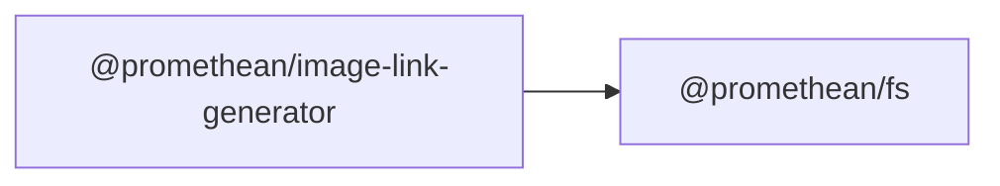

$$
<!-- SYMPKG:PKG:BEGIN -->
$$
# @promethean/image-link-generator
**Folder:** `packages/image-link-generator`  
$$
**Version:** `0.0.1`
$$
$$
**Domain:** `_root`
$$

## Dependencies
- $@promethean/fs$$../fs/README.md$
## Dependents
- _None_
$$
<!-- SYMPKG:PKG:END -->
$$