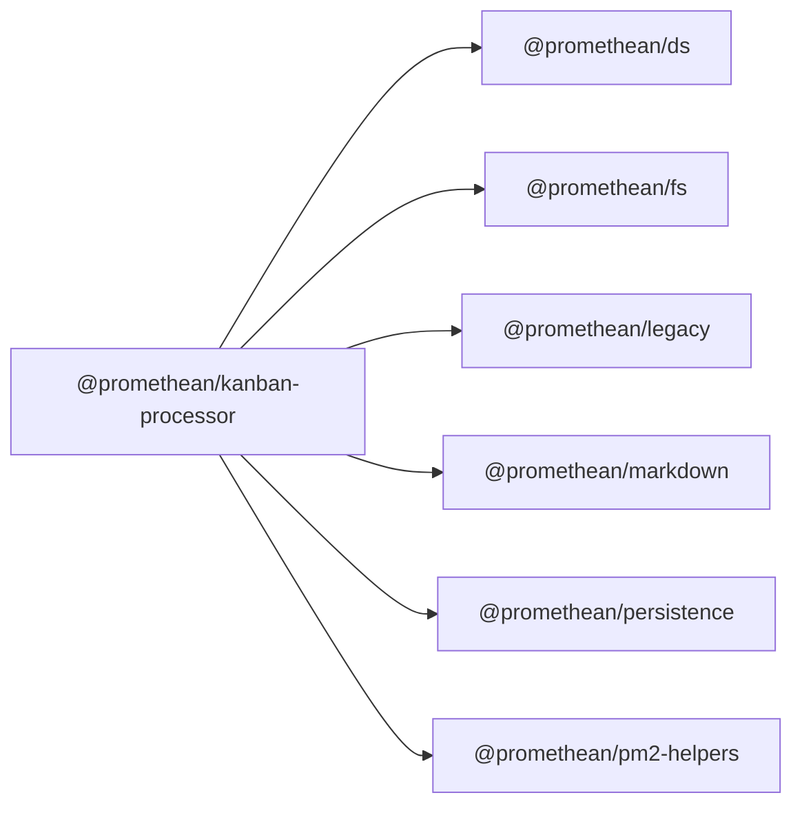

$$
<!-- SYMPKG:PKG:BEGIN -->
$$
# @promethean/kanban-processor
$$
**Folder:** `packages/kanban-processor`
$$
$$
**Version:** `0.1.0`
$$
$$
**Domain:** `_root`
$$

## Dependencies
- $@promethean/ds$$../ds/README.md$
- $@promethean/fs$$../fs/README.md$
- $@promethean/legacy$$../legacy/README.md$
- $@promethean/markdown$$../markdown/README.md$
- $@promethean/persistence$$../persistence/README.md$
- $@promethean/pm2-helpers$$../pm2-helpers/README.md$
## Dependents
- _None_
$$
<!-- SYMPKG:PKG:END -->
$$