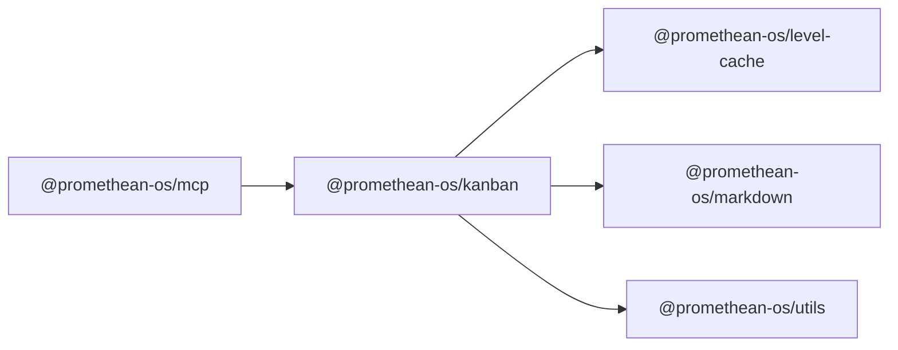

```
<!-- SYMPKG:PKG:BEGIN -->
```
# @promethean-os/kanban
```
**Folder:** `packages/kanban`
```
```
**Version:** `0.1.0`
```
```
**Domain:** `_root`
```

## Dependencies
- @promethean-os/level-cache$../level-cache/README.md
- @promethean-os/markdown$../markdown/README.md
- @promethean-os/utils$../utils/README.md
## Dependents
- @promethean-os/mcp$../mcp/README.md
```


## 📁 Implementation

### Core Files

- [637](../../../packages/kanban/src/637)

### View Source

- [GitHub](https://github.com/promethean-ai/promethean/tree/main/packages/kanban/src)
- [VS Code](vscode://file/packages/kanban/src)


## 📚 API Reference

### Interfaces

#### [- **board/config/health-config-api.ts**](../../../packages/kanban/src/[src/board/config/health-config-api.ts](../../../packages/kanban/src/board/config/health-config-api.ts) (98 lines)#L1)

#### [- **board/config/health-config-manager.ts**](../../../packages/kanban/src/[src/board/config/health-config-manager.ts](../../../packages/kanban/src/board/config/health-config-manager.ts) (304 lines)#L1)

#### [- **board/config/health-config.ts**](../../../packages/kanban/src/[src/board/config/health-config.ts](../../../packages/kanban/src/board/config/health-config.ts) (205 lines)#L1)

#### [- **board/config/merge.ts**](../../../packages/kanban/src/[src/board/config/merge.ts](../../../packages/kanban/src/board/config/merge.ts) (208 lines)#L1)

#### [- **board/config/shared.ts**](../../../packages/kanban/src/[src/board/config/shared.ts](../../../packages/kanban/src/board/config/shared.ts) (140 lines)#L1)

#### [- **board/config/sources.ts**](../../../packages/kanban/src/[src/board/config/sources.ts](../../../packages/kanban/src/board/config/sources.ts) (261 lines)#L1)

#### [- **board/config.ts**](../../../packages/kanban/src/[src/board/config.ts](../../../packages/kanban/src/board/config.ts) (61 lines)#L1)

#### [- **board/event-log/event-creator.ts**](../../../packages/kanban/src/[src/board/event-log/event-creator.ts](../../../packages/kanban/src/board/event-log/event-creator.ts) (26 lines)#L1)

#### [- **board/event-log/file-operations.ts**](../../../packages/kanban/src/[src/board/event-log/file-operations.ts](../../../packages/kanban/src/board/event-log/file-operations.ts) (48 lines)#L1)

#### [- **board/event-log/index.ts**](../../../packages/kanban/src/[src/board/event-log/index.ts](../../../packages/kanban/src/board/event-log/index.ts) (70 lines)#L1)

#### [- **board/event-log/stats.ts**](../../../packages/kanban/src/[src/board/event-log/stats.ts](../../../packages/kanban/src/board/event-log/stats.ts) (27 lines)#L1)

#### [- **board/event-log/task-history.ts**](../../../packages/kanban/src/[src/board/event-log/task-history.ts](../../../packages/kanban/src/board/event-log/task-history.ts) (75 lines)#L1)

#### [- **board/event-log/types.ts**](../../../packages/kanban/src/[src/board/event-log/types.ts](../../../packages/kanban/src/board/event-log/types.ts) (28 lines)#L1)

#### [- **board/indexer.ts**](../../../packages/kanban/src/[src/board/indexer.ts](../../../packages/kanban/src/board/indexer.ts) (379 lines)#L1)

#### [- **board/lints.ts**](../../../packages/kanban/src/[src/board/lints.ts](../../../packages/kanban/src/board/lints.ts) (183 lines)#L1)

#### [- **board/migrate.ts**](../../../packages/kanban/src/[src/board/migrate.ts](../../../packages/kanban/src/board/migrate.ts) (79 lines)#L1)

#### [- **board/performance-test.ts**](../../../packages/kanban/src/[src/board/performance-test.ts](../../../packages/kanban/src/board/performance-test.ts) (112 lines)#L1)

#### [- **board/projector.ts**](../../../packages/kanban/src/[src/board/projector.ts](../../../packages/kanban/src/board/projector.ts) (334 lines)#L1)

#### [- **board/task-cache.ts**](../../../packages/kanban/src/[src/board/task-cache.ts](../../../packages/kanban/src/board/task-cache.ts) (408 lines)#L1)

#### [- **board/task-operations.ts**](../../../packages/kanban/src/[src/board/task-operations.ts](../../../packages/kanban/src/board/task-operations.ts) (220 lines)#L1)

#### [- **board/test-cache.ts**](../../../packages/kanban/src/[src/board/test-cache.ts](../../../packages/kanban/src/board/test-cache.ts) (70 lines)#L1)

#### [- **board/types.ts**](../../../packages/kanban/src/[src/board/types.ts](../../../packages/kanban/src/board/types.ts) (40 lines)#L1)

#### [- **cli/command-handlers.ts**](../../../packages/kanban/src/[src/cli/command-handlers.ts](../../../packages/kanban/src/cli/command-handlers.ts) (2793 lines)#L1)

#### [- **cli/health-config-commands.ts**](../../../packages/kanban/src/[src/cli/health-config-commands.ts](../../../packages/kanban/src/cli/health-config-commands.ts) (13 lines)#L1)

#### [- **cli.ts**](../../../packages/kanban/src/[src/cli.ts](../../../packages/kanban/src/cli.ts) (275 lines)#L1)

#### [- **index.ts**](../../../packages/kanban/src/[src/index.ts](../../../packages/kanban/src/index.ts) (19 lines)#L1)

#### [- **lib/actions/boards/count-tasks.ts**](../../../packages/kanban/src/[src/lib/actions/boards/count-tasks.ts](../../../packages/kanban/src/lib/actions/boards/count-tasks.ts) (18 lines)#L1)

#### [- **lib/actions/boards/index.ts**](../../../packages/kanban/src/[src/lib/actions/boards/index.ts](../../../packages/kanban/src/lib/actions/boards/index.ts) (31 lines)#L1)

#### [- **lib/actions/boards/load-board.ts**](../../../packages/kanban/src/[src/lib/actions/boards/load-board.ts](../../../packages/kanban/src/lib/actions/boards/load-board.ts) (26 lines)#L1)

#### [- **lib/actions/boards/query-board.ts**](../../../packages/kanban/src/[src/lib/actions/boards/query-board.ts](../../../packages/kanban/src/lib/actions/boards/query-board.ts) (95 lines)#L1)

#### [- **lib/actions/boards/regenerate.ts**](../../../packages/kanban/src/[src/lib/actions/boards/regenerate.ts](../../../packages/kanban/src/lib/actions/boards/regenerate.ts) (72 lines)#L1)

#### [- **lib/actions/boards/save-board.ts**](../../../packages/kanban/src/[src/lib/actions/boards/save-board.ts](../../../packages/kanban/src/lib/actions/boards/save-board.ts) (24 lines)#L1)

#### [- **lib/actions/cards/create-card.ts**](../../../packages/kanban/src/[src/lib/actions/cards/create-card.ts](../../../packages/kanban/src/lib/actions/cards/create-card.ts) (67 lines)#L1)

#### [- **lib/actions/cards/find-cards.ts**](../../../packages/kanban/src/[src/lib/actions/cards/find-cards.ts](../../../packages/kanban/src/lib/actions/cards/find-cards.ts) (29 lines)#L1)

#### [- **lib/actions/cards/index.ts**](../../../packages/kanban/src/[src/lib/actions/cards/index.ts](../../../packages/kanban/src/lib/actions/cards/index.ts) (43 lines)#L1)

#### [- **lib/actions/cards/move-card.ts**](../../../packages/kanban/src/[src/lib/actions/cards/move-card.ts](../../../packages/kanban/src/lib/actions/cards/move-card.ts) (76 lines)#L1)

#### [- **lib/actions/cards/remove-card.ts**](../../../packages/kanban/src/[src/lib/actions/cards/remove-card.ts](../../../packages/kanban/src/lib/actions/cards/remove-card.ts) (35 lines)#L1)

#### [- **lib/actions/cards/update-card.ts**](../../../packages/kanban/src/[src/lib/actions/cards/update-card.ts](../../../packages/kanban/src/lib/actions/cards/update-card.ts) (65 lines)#L1)

#### [- **lib/actions/columns/create-column.ts**](../../../packages/kanban/src/[src/lib/actions/columns/create-column.ts](../../../packages/kanban/src/lib/actions/columns/create-column.ts) (41 lines)#L1)

#### [- **lib/actions/columns/get-column.ts**](../../../packages/kanban/src/[src/lib/actions/columns/get-column.ts](../../../packages/kanban/src/lib/actions/columns/get-column.ts) (19 lines)#L1)

#### [- **lib/actions/columns/get-tasks-by-column.ts**](../../../packages/kanban/src/[src/lib/actions/columns/get-tasks-by-column.ts](../../../packages/kanban/src/lib/actions/columns/get-tasks-by-column.ts) (20 lines)#L1)

#### [- **lib/actions/columns/index.ts**](../../../packages/kanban/src/[src/lib/actions/columns/index.ts](../../../packages/kanban/src/lib/actions/columns/index.ts) (20 lines)#L1)

#### [- **lib/actions/columns/list-columns.ts**](../../../packages/kanban/src/[src/lib/actions/columns/list-columns.ts](../../../packages/kanban/src/lib/actions/columns/list-columns.ts) (18 lines)#L1)

#### [- **lib/actions/columns/remove-column.ts**](../../../packages/kanban/src/[src/lib/actions/columns/remove-column.ts](../../../packages/kanban/src/lib/actions/columns/remove-column.ts) (26 lines)#L1)

#### [- **lib/actions/index.ts**](../../../packages/kanban/src/[src/lib/actions/index.ts](../../../packages/kanban/src/lib/actions/index.ts) (118 lines)#L1)

#### [- **lib/actions/search/generate-board-by-tags.ts**](../../../packages/kanban/src/[src/lib/actions/search/generate-board-by-tags.ts](../../../packages/kanban/src/lib/actions/search/generate-board-by-tags.ts) (71 lines)#L1)

#### [- **lib/actions/search/index-for-search.ts**](../../../packages/kanban/src/[src/lib/actions/search/index-for-search.ts](../../../packages/kanban/src/lib/actions/search/index-for-search.ts) (123 lines)#L1)

#### [- **lib/actions/search/index-tasks.ts**](../../../packages/kanban/src/[src/lib/actions/search/index-tasks.ts](../../../packages/kanban/src/lib/actions/search/index-tasks.ts) (38 lines)#L1)

#### [- **lib/actions/search/index.ts**](../../../packages/kanban/src/[src/lib/actions/search/index.ts](../../../packages/kanban/src/lib/actions/search/index.ts) (14 lines)#L1)

#### [- **lib/actions/search/search-board.ts**](../../../packages/kanban/src/[src/lib/actions/search/search-board.ts](../../../packages/kanban/src/lib/actions/search/search-board.ts) (52 lines)#L1)

#### [- **lib/actions/search/search-tasks.ts**](../../../packages/kanban/src/[src/lib/actions/search/search-tasks.ts](../../../packages/kanban/src/lib/actions/search/search-tasks.ts) (88 lines)#L1)

#### [- **lib/actions/sync/index.ts**](../../../packages/kanban/src/[src/lib/actions/sync/index.ts](../../../packages/kanban/src/lib/actions/sync/index.ts) (4 lines)#L1)

#### [- **lib/actions/sync/pull-from-files.ts**](../../../packages/kanban/src/[src/lib/actions/sync/pull-from-files.ts](../../../packages/kanban/src/lib/actions/sync/pull-from-files.ts) (111 lines)#L1)

#### [- **lib/actions/sync/push-to-files.ts**](../../../packages/kanban/src/[src/lib/actions/sync/push-to-files.ts](../../../packages/kanban/src/lib/actions/sync/push-to-files.ts) (107 lines)#L1)

#### [- **lib/actions/sync/sync-board-and-tasks.ts**](../../../packages/kanban/src/[src/lib/actions/sync/sync-board-and-tasks.ts](../../../packages/kanban/src/lib/actions/sync/sync-board-and-tasks.ts) (31 lines)#L1)

#### [- **lib/actions/tasks/archive-task.ts**](../../../packages/kanban/src/[src/lib/actions/tasks/archive-task.ts](../../../packages/kanban/src/lib/actions/tasks/archive-task.ts) (78 lines)#L1)

#### [- **lib/actions/tasks/create-task.ts**](../../../packages/kanban/src/[src/lib/actions/tasks/create-task.ts](../../../packages/kanban/src/lib/actions/tasks/create-task.ts) (286 lines)#L1)

#### [- **lib/actions/tasks/delete-task.ts**](../../../packages/kanban/src/[src/lib/actions/tasks/delete-task.ts](../../../packages/kanban/src/lib/actions/tasks/delete-task.ts) (69 lines)#L1)

#### [- **lib/actions/tasks/find-task-by-id.ts**](../../../packages/kanban/src/[src/lib/actions/tasks/find-task-by-id.ts](../../../packages/kanban/src/lib/actions/tasks/find-task-by-id.ts) (25 lines)#L1)

#### [- **lib/actions/tasks/find-task-by-title.ts**](../../../packages/kanban/src/[src/lib/actions/tasks/find-task-by-title.ts](../../../packages/kanban/src/lib/actions/tasks/find-task-by-title.ts) (25 lines)#L1)

#### [- **lib/actions/tasks/index.ts**](../../../packages/kanban/src/[src/lib/actions/tasks/index.ts](../../../packages/kanban/src/lib/actions/tasks/index.ts) (28 lines)#L1)

#### [- **lib/actions/tasks/merge-tasks.ts**](../../../packages/kanban/src/[src/lib/actions/tasks/merge-tasks.ts](../../../packages/kanban/src/lib/actions/tasks/merge-tasks.ts) (106 lines)#L1)

#### [- **lib/actions/tasks/read-tasks-folder.ts**](../../../packages/kanban/src/[src/lib/actions/tasks/read-tasks-folder.ts](../../../packages/kanban/src/lib/actions/tasks/read-tasks-folder.ts) (328 lines)#L1)

#### [- **lib/actions/tasks/rename-task.ts**](../../../packages/kanban/src/[src/lib/actions/tasks/rename-task.ts](../../../packages/kanban/src/lib/actions/tasks/rename-task.ts) (74 lines)#L1)

#### [- **lib/actions/tasks/update-description.ts**](../../../packages/kanban/src/[src/lib/actions/tasks/update-description.ts](../../../packages/kanban/src/lib/actions/tasks/update-description.ts) (83 lines)#L1)

#### [- **lib/actions/transitions/index.ts**](../../../packages/kanban/src/[src/lib/actions/transitions/index.ts](../../../packages/kanban/src/lib/actions/transitions/index.ts) (11 lines)#L1)

#### [- **lib/actions/transitions/move-task.ts**](../../../packages/kanban/src/[src/lib/actions/transitions/move-task.ts](../../../packages/kanban/src/lib/actions/transitions/move-task.ts) (108 lines)#L1)

#### [- **lib/actions/transitions/update-status.ts**](../../../packages/kanban/src/[src/lib/actions/transitions/update-status.ts](../../../packages/kanban/src/lib/actions/transitions/update-status.ts) (160 lines)#L1)

#### [- **lib/actions/types/board.ts**](../../../packages/kanban/src/[src/lib/actions/types/board.ts](../../../packages/kanban/src/lib/actions/types/board.ts) (59 lines)#L1)

#### [- **lib/actions/types/card.ts**](../../../packages/kanban/src/[src/lib/actions/types/card.ts](../../../packages/kanban/src/lib/actions/types/card.ts) (137 lines)#L1)

#### [- **lib/actions/types/column.ts**](../../../packages/kanban/src/[src/lib/actions/types/column.ts](../../../packages/kanban/src/lib/actions/types/column.ts) (50 lines)#L1)

#### [- **lib/actions/types/index.ts**](../../../packages/kanban/src/[src/lib/actions/types/index.ts](../../../packages/kanban/src/lib/actions/types/index.ts) (46 lines)#L1)

#### [- **lib/agent-assignment/types.ts**](../../../packages/kanban/src/[src/lib/agent-assignment/types.ts](../../../packages/kanban/src/lib/agent-assignment/types.ts) (511 lines)#L1)

#### [- **lib/code-review/analyzers/ai-analyzer.ts**](../../../packages/kanban/src/[src/lib/code-review/analyzers/ai-analyzer.ts](../../../packages/kanban/src/lib/code-review/analyzers/ai-analyzer.ts) (368 lines)#L1)

#### [- **lib/code-review/analyzers/eslint-analyzer.ts**](../../../packages/kanban/src/[src/lib/code-review/analyzers/eslint-analyzer.ts](../../../packages/kanban/src/lib/code-review/analyzers/eslint-analyzer.ts) (251 lines)#L1)

#### [- **lib/code-review/analyzers/security-analyzer.ts**](../../../packages/kanban/src/[src/lib/code-review/analyzers/security-analyzer.ts](../../../packages/kanban/src/lib/code-review/analyzers/security-analyzer.ts) (474 lines)#L1)

#### [- **lib/code-review/analyzers/typescript-analyzer.ts**](../../../packages/kanban/src/[src/lib/code-review/analyzers/typescript-analyzer.ts](../../../packages/kanban/src/lib/code-review/analyzers/typescript-analyzer.ts) (295 lines)#L1)

#### [- **lib/code-review/cache/review-cache.ts**](../../../packages/kanban/src/[src/lib/code-review/cache/review-cache.ts](../../../packages/kanban/src/lib/code-review/cache/review-cache.ts) (168 lines)#L1)

#### [- **lib/code-review/index.ts**](../../../packages/kanban/src/[src/lib/code-review/index.ts](../../../packages/kanban/src/lib/code-review/index.ts) (138 lines)#L1)

#### [- **lib/code-review/integration/kanban-integration.ts**](../../../packages/kanban/src/[src/lib/code-review/integration/kanban-integration.ts](../../../packages/kanban/src/lib/code-review/integration/kanban-integration.ts) (303 lines)#L1)

#### [- **lib/code-review/rules-engine.ts**](../../../packages/kanban/src/[src/lib/code-review/rules-engine.ts](../../../packages/kanban/src/lib/code-review/rules-engine.ts) (845 lines)#L1)

#### [- **lib/code-review/types.ts**](../../../packages/kanban/src/[src/lib/code-review/types.ts](../../../packages/kanban/src/lib/code-review/types.ts) (336 lines)#L1)

#### [- **lib/core/columns.ts**](../../../packages/kanban/src/[src/lib/core/columns.ts](../../../packages/kanban/src/lib/core/columns.ts) (49 lines)#L1)

#### [- **lib/core/constants.ts**](../../../packages/kanban/src/[src/lib/core/constants.ts](../../../packages/kanban/src/lib/core/constants.ts) (33 lines)#L1)

#### [- **lib/core/slugs.ts**](../../../packages/kanban/src/[src/lib/core/slugs.ts](../../../packages/kanban/src/lib/core/slugs.ts) (104 lines)#L1)

#### [- **lib/core/task-utils.ts**](../../../packages/kanban/src/[src/lib/core/task-utils.ts](../../../packages/kanban/src/lib/core/task-utils.ts) (60 lines)#L1)

#### [- **lib/core/types.ts**](../../../packages/kanban/src/[src/lib/core/types.ts](../../../packages/kanban/src/lib/core/types.ts) (132 lines)#L1)

#### [- **lib/dev-server.ts**](../../../packages/kanban/src/[src/lib/dev-server.ts](../../../packages/kanban/src/lib/dev-server.ts) (507 lines)#L1)

#### [- **lib/directory-adapter/adapter.ts**](../../../packages/kanban/src/[src/lib/directory-adapter/adapter.ts](../../../packages/kanban/src/lib/directory-adapter/adapter.ts) (855 lines)#L1)

#### [- **lib/directory-adapter/backup.ts**](../../../packages/kanban/src/[src/lib/directory-adapter/backup.ts](../../../packages/kanban/src/lib/directory-adapter/backup.ts) (378 lines)#L1)

#### [- **lib/directory-adapter/config.ts**](../../../packages/kanban/src/[src/lib/directory-adapter/config.ts](../../../packages/kanban/src/lib/directory-adapter/config.ts) (156 lines)#L1)

#### [- **lib/directory-adapter/index.ts**](../../../packages/kanban/src/[src/lib/directory-adapter/index.ts](../../../packages/kanban/src/lib/directory-adapter/index.ts) (45 lines)#L1)

#### [- **lib/directory-adapter/security.ts**](../../../packages/kanban/src/[src/lib/directory-adapter/security.ts](../../../packages/kanban/src/lib/directory-adapter/security.ts) (369 lines)#L1)

#### [- **lib/directory-adapter/tests/security.test.ts**](../../../packages/kanban/src/[src/lib/directory-adapter/tests/security.test.ts](../../../packages/kanban/src/lib/directory-adapter/tests/security.test.ts) (227 lines)#L1)

#### [- **lib/directory-adapter/types.ts**](../../../packages/kanban/src/[src/lib/directory-adapter/types.ts](../../../packages/kanban/src/lib/directory-adapter/types.ts) (303 lines)#L1)

#### [- **lib/epic.ts**](../../../packages/kanban/src/[src/lib/epic.ts](../../../packages/kanban/src/lib/epic.ts) (300 lines)#L1)

#### [- **lib/factories/board-factory.ts**](../../../packages/kanban/src/[src/lib/factories/board-factory.ts](../../../packages/kanban/src/lib/factories/board-factory.ts) (98 lines)#L1)

#### [- **lib/factories/card-factory.ts**](../../../packages/kanban/src/[src/lib/factories/card-factory.ts](../../../packages/kanban/src/lib/factories/card-factory.ts) (86 lines)#L1)

#### [- **lib/factories/column-factory.ts**](../../../packages/kanban/src/[src/lib/factories/column-factory.ts](../../../packages/kanban/src/lib/factories/column-factory.ts) (78 lines)#L1)

#### [- **lib/factories/index.ts**](../../../packages/kanban/src/[src/lib/factories/index.ts](../../../packages/kanban/src/lib/factories/index.ts) (19 lines)#L1)

#### [- **lib/file-watcher.ts**](../../../packages/kanban/src/[src/lib/file-watcher.ts](../../../packages/kanban/src/lib/file-watcher.ts) (255 lines)#L1)

#### [- **lib/git-event-reconstructor.ts**](../../../packages/kanban/src/[src/lib/git-event-reconstructor.ts](../../../packages/kanban/src/lib/git-event-reconstructor.ts) (102 lines)#L1)

#### [- **lib/git-sync.ts**](../../../packages/kanban/src/[src/lib/git-sync.ts](../../../packages/kanban/src/lib/git-sync.ts) (235 lines)#L1)

#### [- **lib/heal/context-enhancement.ts**](../../../packages/kanban/src/[src/lib/heal/context-enhancement.ts](../../../packages/kanban/src/lib/heal/context-enhancement.ts) (484 lines)#L1)

#### [- **lib/heal/damage-pattern-dsl.ts**](../../../packages/kanban/src/[src/lib/heal/damage-pattern-dsl.ts](../../../packages/kanban/src/lib/heal/damage-pattern-dsl.ts) (90 lines)#L1)

#### [- **lib/heal/git-tag-manager.ts**](../../../packages/kanban/src/[src/lib/heal/git-tag-manager.ts](../../../packages/kanban/src/lib/heal/git-tag-manager.ts) (272 lines)#L1)

#### [- **lib/heal/git-workflow.ts**](../../../packages/kanban/src/[src/lib/heal/git-workflow.ts](../../../packages/kanban/src/lib/heal/git-workflow.ts) (222 lines)#L1)

#### [- **lib/heal/heal-command.ts**](../../../packages/kanban/src/[src/lib/heal/heal-command.ts](../../../packages/kanban/src/lib/heal/heal-command.ts) (569 lines)#L1)

#### [- **lib/heal/llm-types.d.ts**](../../../packages/kanban/src/[src/lib/heal/llm-types.d.ts](../../../packages/kanban/src/lib/heal/llm-types.d.ts) (9 lines)#L1)

#### [- **lib/heal/scar-context-builder.ts**](../../../packages/kanban/src/[src/lib/heal/scar-context-builder.ts](../../../packages/kanban/src/lib/heal/scar-context-builder.ts) (926 lines)#L1)

#### [- **lib/heal/scar-context-types.ts**](../../../packages/kanban/src/[src/lib/heal/scar-context-types.ts](../../../packages/kanban/src/lib/heal/scar-context-types.ts) (143 lines)#L1)

#### [- **lib/heal/scar-file-manager.ts**](../../../packages/kanban/src/[src/lib/heal/scar-file-manager.ts](../../../packages/kanban/src/lib/heal/scar-file-manager.ts) (494 lines)#L1)

#### [- **lib/heal/scar-history-manager.ts**](../../../packages/kanban/src/[src/lib/heal/scar-history-manager.ts](../../../packages/kanban/src/lib/heal/scar-history-manager.ts) (734 lines)#L1)

#### [- **lib/heal/type-guards.ts**](../../../packages/kanban/src/[src/lib/heal/type-guards.ts](../../../packages/kanban/src/lib/heal/type-guards.ts) (239 lines)#L1)

#### [- **lib/heal/utils/commit-message-generator.ts**](../../../packages/kanban/src/[src/lib/heal/utils/commit-message-generator.ts](../../../packages/kanban/src/lib/heal/utils/commit-message-generator.ts) (439 lines)#L1)

#### [- **lib/heal/utils/git-utils.ts**](../../../packages/kanban/src/[src/lib/heal/utils/git-utils.ts](../../../packages/kanban/src/lib/heal/utils/git-utils.ts) (176 lines)#L1)

#### [- **lib/healing/agent-integration.ts**](../../../packages/kanban/src/[src/lib/healing/agent-integration.ts](../../../packages/kanban/src/lib/healing/agent-integration.ts) (182 lines)#L1)

#### [- **lib/healing/kanban-healing-coordinator.ts**](../../../packages/kanban/src/[src/lib/healing/kanban-healing-coordinator.ts](../../../packages/kanban/src/lib/healing/kanban-healing-coordinator.ts) (561 lines)#L1)

#### [- **lib/healing/kanban-search-fix.ts**](../../../packages/kanban/src/[src/lib/healing/kanban-search-fix.ts](../../../packages/kanban/src/lib/healing/kanban-search-fix.ts) (83 lines)#L1)

#### [- **lib/index.ts**](../../../packages/kanban/src/[src/lib/index.ts](../../../packages/kanban/src/lib/index.ts) (32 lines)#L1)

#### [- **lib/jsonl.ts**](../../../packages/kanban/src/[src/lib/jsonl.ts](../../../packages/kanban/src/lib/jsonl.ts) (10 lines)#L1)

#### [- **lib/kanban-compatibility.ts**](../../../packages/kanban/src/[src/lib/kanban-compatibility.ts](../../../packages/kanban/src/lib/kanban-compatibility.ts) (518 lines)#L1)

#### [- **lib/kanban.ts**](../../../packages/kanban/src/[src/lib/kanban.ts](../../../packages/kanban/src/lib/kanban.ts) (6 lines)#L1)

#### [- **lib/markdown-output.ts**](../../../packages/kanban/src/[src/lib/markdown-output.ts](../../../packages/kanban/src/lib/markdown-output.ts) (301 lines)#L1)

#### [- **lib/pantheon/column-normalizer.ts**](../../../packages/kanban/src/[src/lib/pantheon/column-normalizer.ts](../../../packages/kanban/src/lib/pantheon/column-normalizer.ts) (348 lines)#L1)

#### [- **lib/pantheon/runtime.ts**](../../../packages/kanban/src/[src/lib/pantheon/runtime.ts](../../../packages/kanban/src/lib/pantheon/runtime.ts) (119 lines)#L1)

#### [- **lib/rebuild-event-log-command.ts**](../../../packages/kanban/src/[src/lib/rebuild-event-log-command.ts](../../../packages/kanban/src/lib/rebuild-event-log-command.ts) (194 lines)#L1)

#### [- **lib/safe-rule-evaluation.ts**](../../../packages/kanban/src/[src/lib/safe-rule-evaluation.ts](../../../packages/kanban/src/lib/safe-rule-evaluation.ts) (311 lines)#L1)

#### [- **lib/serializers/board.ts**](../../../packages/kanban/src/[src/lib/serializers/board.ts](../../../packages/kanban/src/lib/serializers/board.ts) (153 lines)#L1)

#### [- **lib/serializers/index.ts**](../../../packages/kanban/src/[src/lib/serializers/index.ts](../../../packages/kanban/src/lib/serializers/index.ts) (23 lines)#L1)

#### [- **lib/serializers/markdown-formatter.ts**](../../../packages/kanban/src/[src/lib/serializers/markdown-formatter.ts](../../../packages/kanban/src/lib/serializers/markdown-formatter.ts) (83 lines)#L1)

#### [- **lib/serializers/markdown-parser.ts**](../../../packages/kanban/src/[src/lib/serializers/markdown-parser.ts](../../../packages/kanban/src/lib/serializers/markdown-parser.ts) (195 lines)#L1)

#### [- **lib/serializers/markdown-serializer.ts**](../../../packages/kanban/src/[src/lib/serializers/markdown-serializer.ts](../../../packages/kanban/src/lib/serializers/markdown-serializer.ts) (90 lines)#L1)

#### [- **lib/serializers/task-frontmatter.ts**](../../../packages/kanban/src/[src/lib/serializers/task-frontmatter.ts](../../../packages/kanban/src/lib/serializers/task-frontmatter.ts) (76 lines)#L1)

#### [- **lib/serializers/template-serializer.ts**](../../../packages/kanban/src/[src/lib/serializers/template-serializer.ts](../../../packages/kanban/src/lib/serializers/template-serializer.ts) (133 lines)#L1)

#### [- **lib/status-normalization.ts**](../../../packages/kanban/src/[src/lib/status-normalization.ts](../../../packages/kanban/src/lib/status-normalization.ts) (230 lines)#L1)

#### [- **lib/task-complexity.ts**](../../../packages/kanban/src/[src/lib/task-complexity.ts](../../../packages/kanban/src/lib/task-complexity.ts) (688 lines)#L1)

#### [- **lib/task-content/ai.ts**](../../../packages/kanban/src/[src/lib/task-content/ai.ts](../../../packages/kanban/src/lib/task-content/ai.ts) (444 lines)#L1)

#### [- **lib/task-content/editor.ts**](../../../packages/kanban/src/[src/lib/task-content/editor.ts](../../../packages/kanban/src/lib/task-content/editor.ts) (225 lines)#L1)

#### [- **lib/task-content/index.ts**](../../../packages/kanban/src/[src/lib/task-content/index.ts](../../../packages/kanban/src/lib/task-content/index.ts) (373 lines)#L1)

#### [- **lib/task-content/lifecycle.ts**](../../../packages/kanban/src/[src/lib/task-content/lifecycle.ts](../../../packages/kanban/src/lib/task-content/lifecycle.ts) (415 lines)#L1)

#### [- **lib/task-content/parser.ts**](../../../packages/kanban/src/[src/lib/task-content/parser.ts](../../../packages/kanban/src/lib/task-content/parser.ts) (276 lines)#L1)

#### [- **lib/task-content/types.ts**](../../../packages/kanban/src/[src/lib/task-content/types.ts](../../../packages/kanban/src/lib/task-content/types.ts) (233 lines)#L1)

#### [- **lib/task-git-tracker.ts**](../../../packages/kanban/src/[src/lib/task-git-tracker.ts](../../../packages/kanban/src/lib/task-git-tracker.ts) (123 lines)#L1)

#### [- **lib/task-tools.ts**](../../../packages/kanban/src/[src/lib/task-tools.ts](../../../packages/kanban/src/lib/task-tools.ts) (550 lines)#L1)

#### [- **lib/testing-transition/ai-analyzer.ts**](../../../packages/kanban/src/[src/lib/testing-transition/ai-analyzer.ts](../../../packages/kanban/src/lib/testing-transition/ai-analyzer.ts) (106 lines)#L1)

#### [- **lib/testing-transition/comprehensive-scorer.ts**](../../../packages/kanban/src/[src/lib/testing-transition/comprehensive-scorer.ts](../../../packages/kanban/src/lib/testing-transition/comprehensive-scorer.ts) (438 lines)#L1)

#### [- **lib/testing-transition/coverage-analyzer.ts**](../../../packages/kanban/src/[src/lib/testing-transition/coverage-analyzer.ts](../../../packages/kanban/src/lib/testing-transition/coverage-analyzer.ts) (124 lines)#L1)

#### [- **lib/testing-transition/index.ts**](../../../packages/kanban/src/[src/lib/testing-transition/index.ts](../../../packages/kanban/src/lib/testing-transition/index.ts) (265 lines)#L1)

#### [- **lib/testing-transition/quality-scorer.ts**](../../../packages/kanban/src/[src/lib/testing-transition/quality-scorer.ts](../../../packages/kanban/src/lib/testing-transition/quality-scorer.ts) (280 lines)#L1)

#### [- **lib/testing-transition/report-generator.ts**](../../../packages/kanban/src/[src/lib/testing-transition/report-generator.ts](../../../packages/kanban/src/lib/testing-transition/report-generator.ts) (63 lines)#L1)

#### [- **lib/testing-transition/requirement-mapper.ts**](../../../packages/kanban/src/[src/lib/testing-transition/requirement-mapper.ts](../../../packages/kanban/src/lib/testing-transition/requirement-mapper.ts) (26 lines)#L1)

#### [- **lib/testing-transition/types.ts**](../../../packages/kanban/src/[src/lib/testing-transition/types.ts](../../../packages/kanban/src/lib/testing-transition/types.ts) (280 lines)#L1)

#### [- **lib/transition-rules-functional.ts**](../../../packages/kanban/src/[src/lib/transition-rules-functional.ts](../../../packages/kanban/src/lib/transition-rules-functional.ts) (684 lines)#L1)

#### [- **lib/transition-rules.ts**](../../../packages/kanban/src/[src/lib/transition-rules.ts](../../../packages/kanban/src/lib/transition-rules.ts) (298 lines)#L1)

#### [- **lib/types.ts**](../../../packages/kanban/src/[src/lib/types.ts](../../../packages/kanban/src/lib/types.ts) (147 lines)#L1)

#### [- **lib/ui-server.ts**](../../../packages/kanban/src/[src/lib/ui-server.ts](../../../packages/kanban/src/lib/ui-server.ts) (458 lines)#L1)

#### [- **lib/utils/index.ts**](../../../packages/kanban/src/[src/lib/utils/index.ts](../../../packages/kanban/src/lib/utils/index.ts) (28 lines)#L1)

#### [- **lib/utils/logger.ts**](../../../packages/kanban/src/[src/lib/utils/logger.ts](../../../packages/kanban/src/lib/utils/logger.ts) (124 lines)#L1)

#### [- **lib/utils/string-utils.ts**](../../../packages/kanban/src/[src/lib/utils/string-utils.ts](../../../packages/kanban/src/lib/utils/string-utils.ts) (66 lines)#L1)

#### [- **lib/utils/task-content.ts**](../../../packages/kanban/src/[src/lib/utils/task-content.ts](../../../packages/kanban/src/lib/utils/task-content.ts) (27 lines)#L1)

#### [- **lib/validation/audit-scar-generator.ts**](../../../packages/kanban/src/[src/lib/validation/audit-scar-generator.ts](../../../packages/kanban/src/lib/validation/audit-scar-generator.ts) (297 lines)#L1)

#### [- **lib/validation/audit-scar-integration.ts**](../../../packages/kanban/src/[src/lib/validation/audit-scar-integration.ts](../../../packages/kanban/src/lib/validation/audit-scar-integration.ts) (145 lines)#L1)

#### [- **lib/validation/git-integration.ts**](../../../packages/kanban/src/[src/lib/validation/git-integration.ts](../../../packages/kanban/src/lib/validation/git-integration.ts) (160 lines)#L1)

#### [- **lib/validation/index.ts**](../../../packages/kanban/src/[src/lib/validation/index.ts](../../../packages/kanban/src/lib/validation/index.ts) (44 lines)#L1)

#### [- **lib/validation/integration.test.ts**](../../../packages/kanban/src/[src/lib/validation/integration.test.ts](../../../packages/kanban/src/lib/validation/integration.test.ts) (309 lines)#L1)

#### [- **lib/validation/p0-security-validator.test.ts**](../../../packages/kanban/src/[src/lib/validation/p0-security-validator.test.ts](../../../packages/kanban/src/lib/validation/p0-security-validator.test.ts) (602 lines)#L1)

#### [- **lib/validation/p0-security-validator.ts**](../../../packages/kanban/src/[src/lib/validation/p0-security-validator.ts](../../../packages/kanban/src/lib/validation/p0-security-validator.ts) (506 lines)#L1)

#### [- **lib/wip-enforcement.ts**](../../../packages/kanban/src/[src/lib/wip-enforcement.ts](../../../packages/kanban/src/lib/wip-enforcement.ts) (705 lines)#L1)

#### [- **process/config.ts**](../../../packages/kanban/src/[src/process/config.ts](../../../packages/kanban/src/process/config.ts) (26 lines)#L1)

#### [- **process/docguard.ts**](../../../packages/kanban/src/[src/process/docguard.ts](../../../packages/kanban/src/process/docguard.ts) (151 lines)#L1)

#### [- **process/github.ts**](../../../packages/kanban/src/[src/process/github.ts](../../../packages/kanban/src/process/github.ts) (53 lines)#L1)

#### [- **process/sync.ts**](../../../packages/kanban/src/[src/process/sync.ts](../../../packages/kanban/src/process/sync.ts) (66 lines)#L1)

#### [- **process/types.ts**](../../../packages/kanban/src/[src/process/types.ts](../../../packages/kanban/src/process/types.ts) (21 lines)#L1)

#### [- **scripts/migrate-labels-to-tags.ts**](../../../packages/kanban/src/[src/scripts/migrate-labels-to-tags.ts](../../../packages/kanban/src/scripts/migrate-labels-to-tags.ts) (138 lines)#L1)

#### [- **scripts/pending_count.ts**](../../../packages/kanban/src/[src/scripts/pending_count.ts](../../../packages/kanban/src/scripts/pending_count.ts) (18 lines)#L1)

#### [- **scripts/wip-sheriff.ts**](../../../packages/kanban/src/[src/scripts/wip-sheriff.ts](../../../packages/kanban/src/scripts/wip-sheriff.ts) (294 lines)#L1)

#### [- **test-utils/cli-test-utils.ts**](../../../packages/kanban/src/[src/test-utils/cli-test-utils.ts](../../../packages/kanban/src/test-utils/cli-test-utils.ts) (259 lines)#L1)

#### [- **test-utils/helpers.ts**](../../../packages/kanban/src/[src/test-utils/helpers.ts](../../../packages/kanban/src/test-utils/helpers.ts) (80 lines)#L1)

#### [- **tests/agent-integration.test.ts**](../../../packages/kanban/src/[src/tests/agent-integration.test.ts](../../../packages/kanban/src/tests/agent-integration.test.ts) (41 lines)#L1)

#### [- **tests/board.test.ts**](../../../packages/kanban/src/[src/tests/board.test.ts](../../../packages/kanban/src/tests/board.test.ts) (389 lines)#L1)

#### [- **tests/bulk-import-duplication.test.ts**](../../../packages/kanban/src/[src/tests/bulk-import-duplication.test.ts](../../../packages/kanban/src/tests/bulk-import-duplication.test.ts) (147 lines)#L1)

#### [- **tests/cli-config.test.ts**](../../../packages/kanban/src/[src/tests/cli-config.test.ts](../../../packages/kanban/src/tests/cli-config.test.ts) (14 lines)#L1)

#### [- **tests/clojure-only.test.ts**](../../../packages/kanban/src/[src/tests/clojure-only.test.ts](../../../packages/kanban/src/tests/clojure-only.test.ts) (183 lines)#L1)

#### [- **tests/column-key-normalization.test.ts**](../../../packages/kanban/src/[src/tests/column-key-normalization.test.ts](../../../packages/kanban/src/tests/column-key-normalization.test.ts) (77 lines)#L1)

#### [- **tests/column-normalizer.test.ts**](../../../packages/kanban/src/[src/tests/column-normalizer.test.ts](../../../packages/kanban/src/tests/column-normalizer.test.ts) (79 lines)#L1)

#### [- **tests/command-handlers.test.ts**](../../../packages/kanban/src/[src/tests/command-handlers.test.ts](../../../packages/kanban/src/tests/command-handlers.test.ts) (247 lines)#L1)

#### [- **tests/commit-message-generator.test.ts**](../../../packages/kanban/src/[src/tests/commit-message-generator.test.ts](../../../packages/kanban/src/tests/commit-message-generator.test.ts) (354 lines)#L1)

#### [- **tests/config-resolution.test.ts**](../../../packages/kanban/src/[src/tests/config-resolution.test.ts](../../../packages/kanban/src/tests/config-resolution.test.ts) (16 lines)#L1)

#### [- **tests/createTask.test.ts**](../../../packages/kanban/src/[src/tests/createTask.test.ts](../../../packages/kanban/src/tests/createTask.test.ts) (143 lines)#L1)

#### [- **tests/deduplication.test.ts**](../../../packages/kanban/src/[src/tests/deduplication.test.ts](../../../packages/kanban/src/tests/deduplication.test.ts) (140 lines)#L1)

#### [- **tests/delete-whitespace.test.ts**](../../../packages/kanban/src/[src/tests/delete-whitespace.test.ts](../../../packages/kanban/src/tests/delete-whitespace.test.ts) (129 lines)#L1)

#### [- **tests/dev-server.test.ts**](../../../packages/kanban/src/[src/tests/dev-server.test.ts](../../../packages/kanban/src/tests/dev-server.test.ts) (151 lines)#L1)

#### [- **tests/event-log.test.ts**](../../../packages/kanban/src/[src/tests/event-log.test.ts](../../../packages/kanban/src/tests/event-log.test.ts) (97 lines)#L1)

#### [- **tests/file-duplication-bug-regression.test.ts**](../../../packages/kanban/src/[src/tests/file-duplication-bug-regression.test.ts](../../../packages/kanban/src/tests/file-duplication-bug-regression.test.ts) (375 lines)#L1)

#### [- **tests/file-watcher.test.ts**](../../../packages/kanban/src/[src/tests/file-watcher.test.ts](../../../packages/kanban/src/tests/file-watcher.test.ts) (97 lines)#L1)

#### [- **tests/git-sync.test.ts**](../../../packages/kanban/src/[src/tests/git-sync.test.ts](../../../packages/kanban/src/tests/git-sync.test.ts) (123 lines)#L1)

#### [- **tests/git-utils.test.ts**](../../../packages/kanban/src/[src/tests/git-utils.test.ts](../../../packages/kanban/src/tests/git-utils.test.ts) (50 lines)#L1)

#### [- **tests/git-workflow-integration.test.ts**](../../../packages/kanban/src/[src/tests/git-workflow-integration.test.ts](../../../packages/kanban/src/tests/git-workflow-integration.test.ts) (439 lines)#L1)

#### [- **tests/heal-command.test.ts**](../../../packages/kanban/src/[src/tests/heal-command.test.ts](../../../packages/kanban/src/tests/heal-command.test.ts) (428 lines)#L1)

#### [- **tests/indexer.test.ts**](../../../packages/kanban/src/[src/tests/indexer.test.ts](../../../packages/kanban/src/tests/indexer.test.ts) (159 lines)#L1)

#### [- **tests/label-parsing.test.ts**](../../../packages/kanban/src/[src/tests/label-parsing.test.ts](../../../packages/kanban/src/tests/label-parsing.test.ts) (97 lines)#L1)

#### [- **tests/markdown-output.test.ts**](../../../packages/kanban/src/[src/tests/markdown-output.test.ts](../../../packages/kanban/src/tests/markdown-output.test.ts) (302 lines)#L1)

#### [- **tests/move-commands-basic.test.ts**](../../../packages/kanban/src/[src/tests/move-commands-basic.test.ts](../../../packages/kanban/src/tests/move-commands-basic.test.ts) (196 lines)#L1)

#### [- **tests/move-commands-e2e-simple.test.ts**](../../../packages/kanban/src/[src/tests/move-commands-e2e-simple.test.ts](../../../packages/kanban/src/tests/move-commands-e2e-simple.test.ts) (298 lines)#L1)

#### [- **tests/move-commands-edge-cases-simple.test.ts**](../../../packages/kanban/src/[src/tests/move-commands-edge-cases-simple.test.ts](../../../packages/kanban/src/tests/move-commands-edge-cases-simple.test.ts) (289 lines)#L1)

#### [- **tests/move-commands-integration-simple.test.ts**](../../../packages/kanban/src/[src/tests/move-commands-integration-simple.test.ts](../../../packages/kanban/src/tests/move-commands-integration-simple.test.ts) (255 lines)#L1)

#### [- **tests/pull.test.ts**](../../../packages/kanban/src/[src/tests/pull.test.ts](../../../packages/kanban/src/tests/pull.test.ts) (106 lines)#L1)

#### [- **tests/push.test.ts**](../../../packages/kanban/src/[src/tests/push.test.ts](../../../packages/kanban/src/tests/push.test.ts) (90 lines)#L1)

#### [- **tests/regenerate.test.ts**](../../../packages/kanban/src/[src/tests/regenerate.test.ts](../../../packages/kanban/src/tests/regenerate.test.ts) (154 lines)#L1)

#### [- **tests/safe-rule-evaluation.test.ts**](../../../packages/kanban/src/[src/tests/safe-rule-evaluation.test.ts](../../../packages/kanban/src/tests/safe-rule-evaluation.test.ts) (106 lines)#L1)

#### [- **tests/scar-context-builder.test.ts**](../../../packages/kanban/src/[src/tests/scar-context-builder.test.ts](../../../packages/kanban/src/tests/scar-context-builder.test.ts) (551 lines)#L1)

#### [- **tests/scar-context-types.test.ts**](../../../packages/kanban/src/[src/tests/scar-context-types.test.ts](../../../packages/kanban/src/tests/scar-context-types.test.ts) (274 lines)#L1)

#### [- **tests/scar-file-manager.test.ts**](../../../packages/kanban/src/[src/tests/scar-file-manager.test.ts](../../../packages/kanban/src/tests/scar-file-manager.test.ts) (383 lines)#L1)

#### [- **tests/starting-status-validation.test.ts**](../../../packages/kanban/src/[src/tests/starting-status-validation.test.ts](../../../packages/kanban/src/tests/starting-status-validation.test.ts) (279 lines)#L1)

#### [- **tests/sync.test.ts**](../../../packages/kanban/src/[src/tests/sync.test.ts](../../../packages/kanban/src/tests/sync.test.ts) (276 lines)#L1)

#### [- **tests/task-complexity.test.ts**](../../../packages/kanban/src/[src/tests/task-complexity.test.ts](../../../packages/kanban/src/tests/task-complexity.test.ts) (68 lines)#L1)

#### [- **tests/task-content-ai.test.ts**](../../../packages/kanban/src/[src/tests/task-content-ai.test.ts](../../../packages/kanban/src/tests/task-content-ai.test.ts) (48 lines)#L1)

#### [- **tests/task-content-editor.test.ts**](../../../packages/kanban/src/[src/tests/task-content-editor.test.ts](../../../packages/kanban/src/tests/task-content-editor.test.ts) (193 lines)#L1)

#### [- **tests/task-content-lifecycle.test.ts**](../../../packages/kanban/src/[src/tests/task-content-lifecycle.test.ts](../../../packages/kanban/src/tests/task-content-lifecycle.test.ts) (202 lines)#L1)

#### [- **tests/task-content-manager.test.ts**](../../../packages/kanban/src/[src/tests/task-content-manager.test.ts](../../../packages/kanban/src/tests/task-content-manager.test.ts) (171 lines)#L1)

#### [- **tests/task-content-parser.test.ts**](../../../packages/kanban/src/[src/tests/task-content-parser.test.ts](../../../packages/kanban/src/tests/task-content-parser.test.ts) (113 lines)#L1)

#### [- **tests/task-duplication-integration.test.ts**](../../../packages/kanban/src/[src/tests/task-duplication-integration.test.ts](../../../packages/kanban/src/tests/task-duplication-integration.test.ts) (369 lines)#L1)

#### [- **tests/task-duplication-regression.test.ts**](../../../packages/kanban/src/[src/tests/task-duplication-regression.test.ts](../../../packages/kanban/src/tests/task-duplication-regression.test.ts) (294 lines)#L1)

#### [- **tests/task-tools.test.ts**](../../../packages/kanban/src/[src/tests/task-tools.test.ts](../../../packages/kanban/src/tests/task-tools.test.ts) (118 lines)#L1)

#### [- **tests/testing-transition-ai.test.ts**](../../../packages/kanban/src/[src/tests/testing-transition-ai.test.ts](../../../packages/kanban/src/tests/testing-transition-ai.test.ts) (43 lines)#L1)

#### [- **tests/timestamp-preservation.test.ts**](../../../packages/kanban/src/[src/tests/timestamp-preservation.test.ts](../../../packages/kanban/src/tests/timestamp-preservation.test.ts) (103 lines)#L1)

#### [- **tests/transition-rules.test.ts**](../../../packages/kanban/src/[src/tests/transition-rules.test.ts](../../../packages/kanban/src/tests/transition-rules.test.ts) (253 lines)#L1)

#### [- **tests/ui-server.test.ts**](../../../packages/kanban/src/[src/tests/ui-server.test.ts](../../../packages/kanban/src/tests/ui-server.test.ts) (100 lines)#L1)

#### [- **tests/validateStartingStatus.test.ts**](../../../packages/kanban/src/[src/tests/validateStartingStatus.test.ts](../../../packages/kanban/src/tests/validateStartingStatus.test.ts) (118 lines)#L1)

#### [- **tests/wip-enforcement.test.ts**](../../../packages/kanban/src/[src/tests/wip-enforcement.test.ts](../../../packages/kanban/src/tests/wip-enforcement.test.ts) (376 lines)#L1)

#### [- **types/nbb.d.ts**](../../../packages/kanban/src/[src/types/nbb.d.ts](../../../packages/kanban/src/types/nbb.d.ts) (18 lines)#L1)

#### [- **HealthConfigAPI**](../../../packages/kanban/src/[HealthConfigAPI](../../../packages/kanban/src/board/config/health-config-api.ts#L4)

#### [- **HealthConfigManager**](../../../packages/kanban/src/[HealthConfigManager](../../../packages/kanban/src/board/config/health-config-manager.ts#L19)

#### [- **ConfigValidator**](../../../packages/kanban/src/[ConfigValidator](../../../packages/kanban/src/board/config/health-config-manager.ts#L236)

#### [- **LmdbTaskCache**](../../../packages/kanban/src/[LmdbTaskCache](../../../packages/kanban/src/board/task-cache.ts#L59)

#### [- **TaskOperations**](../../../packages/kanban/src/[TaskOperations](../../../packages/kanban/src/board/task-operations.ts#L23)

#### [- **HealthThresholdSchema()**](../../../packages/kanban/src/[HealthThresholdSchema()](../../../packages/kanban/src/board/config/health-config.ts#L4)

#### [- **AlertChannelSchema()**](../../../packages/kanban/src/[AlertChannelSchema()](../../../packages/kanban/src/board/config/health-config.ts#L21)

#### [- **HealthRuleSchema()**](../../../packages/kanban/src/[HealthRuleSchema()](../../../packages/kanban/src/board/config/health-config.ts#L27)

#### [- **HealthMonitoringConfigSchema()**](../../../packages/kanban/src/[HealthMonitoringConfigSchema()](../../../packages/kanban/src/board/config/health-config.ts#L36)

#### [- **EnvironmentConfigSchema()**](../../../packages/kanban/src/[EnvironmentConfigSchema()](../../../packages/kanban/src/board/config/health-config.ts#L65)

#### [- **GitHub**](../../../packages/kanban/src/[View on GitHub](https#L1)

#### [- **VS Code**](../../../packages/kanban/src/[Open in VS Code](vscode#L1)

#### [**Location**](../../../packages/kanban/src/[HealthConfigAPI](../../../packages/kanban/src/board/config/health-config-api.ts#L4)

#### [**Description**](../../../packages/kanban/src/Main class for healthconfigapi functionality.#L1)

#### [**File**](../../../packages/kanban/src/`src/board/config/health-config-api.ts`#L1)

#### [**Location**](../../../packages/kanban/src/[HealthConfigManager](../../../packages/kanban/src/board/config/health-config-manager.ts#L19)

#### [**Description**](../../../packages/kanban/src/Main class for healthconfigmanager functionality.#L1)

#### [**File**](../../../packages/kanban/src/`src/board/config/health-config-manager.ts`#L1)

#### [**Location**](../../../packages/kanban/src/[ConfigValidator](../../../packages/kanban/src/board/config/health-config-manager.ts#L236)

#### [**Description**](../../../packages/kanban/src/Main class for configvalidator functionality.#L1)

#### [**File**](../../../packages/kanban/src/`src/board/config/health-config-manager.ts`#L1)

#### [**Location**](../../../packages/kanban/src/[LmdbTaskCache](../../../packages/kanban/src/board/task-cache.ts#L59)

#### [**Description**](../../../packages/kanban/src/Main class for lmdbtaskcache functionality.#L1)

#### [**File**](../../../packages/kanban/src/`src/board/task-cache.ts`#L1)

#### [**Location**](../../../packages/kanban/src/[TaskOperations](../../../packages/kanban/src/board/task-operations.ts#L23)

#### [**Description**](../../../packages/kanban/src/Main class for taskoperations functionality.#L1)

#### [**File**](../../../packages/kanban/src/`src/board/task-operations.ts`#L1)

#### [**Location**](../../../packages/kanban/src/[CommandUsageError](../../../packages/kanban/src/cli/command-handlers.ts#L74)

#### [**Description**](../../../packages/kanban/src/Main class for commandusageerror functionality.#L1)

#### [**File**](../../../packages/kanban/src/`src/cli/command-handlers.ts`#L1)

#### [**Description**](../../../packages/kanban/src/Main class for commandnotfounderror functionality.#L1)

#### [**File**](../../../packages/kanban/src/`src/cli/command-handlers.ts`#L1)

#### [**Location**](../../../packages/kanban/src/[AssignmentError](../../../packages/kanban/src/lib/agent-assignment/types.ts#L484)

#### [**Description**](../../../packages/kanban/src/Main class for assignmenterror functionality.#L1)

#### [**File**](../../../packages/kanban/src/`src/lib/agent-assignment/types.ts`#L1)

#### [**Location**](../../../packages/kanban/src/[CapabilityError](../../../packages/kanban/src/lib/agent-assignment/types.ts#L495)

#### [**Description**](../../../packages/kanban/src/Main class for capabilityerror functionality.#L1)

#### [**File**](../../../packages/kanban/src/`src/lib/agent-assignment/types.ts`#L1)

#### [**Location**](../../../packages/kanban/src/[WorkloadError](../../../packages/kanban/src/lib/agent-assignment/types.ts#L501)

#### [**Description**](../../../packages/kanban/src/Main class for workloaderror functionality.#L1)

#### [**File**](../../../packages/kanban/src/`src/lib/agent-assignment/types.ts`#L1)

#### [**Location**](../../../packages/kanban/src/[ConstraintError](../../../packages/kanban/src/lib/agent-assignment/types.ts#L507)

#### [**Description**](../../../packages/kanban/src/Main class for constrainterror functionality.#L1)

#### [**File**](../../../packages/kanban/src/`src/lib/agent-assignment/types.ts`#L1)

#### [**Location**](../../../packages/kanban/src/[AIAnalyzer](../../../packages/kanban/src/lib/code-review/analyzers/ai-analyzer.ts#L22)

#### [**Description**](../../../packages/kanban/src/Main class for aianalyzer functionality.#L1)

#### [**File**](../../../packages/kanban/src/`src/lib/code-review/analyzers/ai-analyzer.ts`#L1)

#### [**Location**](../../../packages/kanban/src/[ESLintAnalyzer](../../../packages/kanban/src/lib/code-review/analyzers/eslint-analyzer.ts#L26)

#### [**Description**](../../../packages/kanban/src/Main class for eslintanalyzer functionality.#L1)

#### [**File**](../../../packages/kanban/src/`src/lib/code-review/analyzers/eslint-analyzer.ts`#L1)

#### [**Location**](../../../packages/kanban/src/[SecurityAnalyzer](../../../packages/kanban/src/lib/code-review/analyzers/security-analyzer.ts#L25)

#### [**Description**](../../../packages/kanban/src/Main class for securityanalyzer functionality.#L1)

#### [**File**](../../../packages/kanban/src/`src/lib/code-review/analyzers/security-analyzer.ts`#L1)

#### [**Location**](../../../packages/kanban/src/[TypeScriptAnalyzer](../../../packages/kanban/src/lib/code-review/analyzers/typescript-analyzer.ts#L25)

#### [**Description**](../../../packages/kanban/src/Main class for typescriptanalyzer functionality.#L1)

#### [**File**](../../../packages/kanban/src/`src/lib/code-review/analyzers/typescript-analyzer.ts`#L1)

#### [**Location**](../../../packages/kanban/src/[ReviewCache](../../../packages/kanban/src/lib/code-review/cache/review-cache.ts#L19)

#### [**Description**](../../../packages/kanban/src/Main class for reviewcache functionality.#L1)

#### [**File**](../../../packages/kanban/src/`src/lib/code-review/cache/review-cache.ts`#L1)

#### [**Location**](../../../packages/kanban/src/[KanbanCodeReviewIntegration](../../../packages/kanban/src/lib/code-review/integration/kanban-integration.ts#L16)

#### [**Description**](../../../packages/kanban/src/Main class for kanbancodereviewintegration functionality.#L1)

#### [**File**](../../../packages/kanban/src/`src/lib/code-review/integration/kanban-integration.ts`#L1)

#### [**Location**](../../../packages/kanban/src/[CodeReviewRulesEngine](../../../packages/kanban/src/lib/code-review/rules-engine.ts#L39)

#### [**Description**](../../../packages/kanban/src/Main class for codereviewrulesengine functionality.#L1)

#### [**File**](../../../packages/kanban/src/`src/lib/code-review/rules-engine.ts`#L1)

#### [**Location**](../../../packages/kanban/src/[KanbanDevServer](../../../packages/kanban/src/lib/dev-server.ts#L79)

#### [**Description**](../../../packages/kanban/src/Main class for kanbandevserver functionality.#L1)

#### [**File**](../../../packages/kanban/src/`src/lib/dev-server.ts`#L1)

#### [**Location**](../../../packages/kanban/src/[DirectoryAdapter](../../../packages/kanban/src/lib/directory-adapter/adapter.ts#L35)

#### [**Description**](../../../packages/kanban/src/Main class for directoryadapter functionality.#L1)

#### [**File**](../../../packages/kanban/src/`src/lib/directory-adapter/adapter.ts`#L1)

#### [**Location**](../../../packages/kanban/src/[TaskBackupManager](../../../packages/kanban/src/lib/directory-adapter/backup.ts#L40)

#### [**Description**](../../../packages/kanban/src/Main class for taskbackupmanager functionality.#L1)

#### [**File**](../../../packages/kanban/src/`src/lib/directory-adapter/backup.ts`#L1)

#### [**Location**](../../../packages/kanban/src/[TaskSecurityValidator](../../../packages/kanban/src/lib/directory-adapter/security.ts#L32)

#### [**Description**](../../../packages/kanban/src/Main class for tasksecurityvalidator functionality.#L1)

#### [**File**](../../../packages/kanban/src/`src/lib/directory-adapter/security.ts`#L1)

#### [**Location**](../../../packages/kanban/src/[DirectoryAdapterError](../../../packages/kanban/src/lib/directory-adapter/types.ts#L253)

#### [**Description**](../../../packages/kanban/src/Main class for directoryadaptererror functionality.#L1)

#### [**File**](../../../packages/kanban/src/`src/lib/directory-adapter/types.ts`#L1)

#### [**Location**](../../../packages/kanban/src/[SecurityValidationError](../../../packages/kanban/src/lib/directory-adapter/types.ts#L266)

#### [**Description**](../../../packages/kanban/src/Main class for securityvalidationerror functionality.#L1)

#### [**File**](../../../packages/kanban/src/`src/lib/directory-adapter/types.ts`#L1)

#### [**Description**](../../../packages/kanban/src/Main class for filenotfounderror functionality.#L1)

#### [**File**](../../../packages/kanban/src/`src/lib/directory-adapter/types.ts`#L1)

#### [**Location**](../../../packages/kanban/src/[FilePermissionError](../../../packages/kanban/src/lib/directory-adapter/types.ts#L285)

#### [**Description**](../../../packages/kanban/src/Main class for filepermissionerror functionality.#L1)

#### [**File**](../../../packages/kanban/src/`src/lib/directory-adapter/types.ts`#L1)

#### [**Location**](../../../packages/kanban/src/[FileCorruptionError](../../../packages/kanban/src/lib/directory-adapter/types.ts#L292)

#### [**Description**](../../../packages/kanban/src/Main class for filecorruptionerror functionality.#L1)

#### [**File**](../../../packages/kanban/src/`src/lib/directory-adapter/types.ts`#L1)

#### [**Location**](../../../packages/kanban/src/[KanbanFileWatcher](../../../packages/kanban/src/lib/file-watcher.ts#L81)

#### [**Description**](../../../packages/kanban/src/Main class for kanbanfilewatcher functionality.#L1)

#### [**File**](../../../packages/kanban/src/`src/lib/file-watcher.ts`#L1)

#### [**Location**](../../../packages/kanban/src/[provides](../../../packages/kanban/src/lib/git-event-reconstructor.ts#L13)

#### [**Description**](../../../packages/kanban/src/Main class for provides functionality.#L1)

#### [**File**](../../../packages/kanban/src/`src/lib/git-event-reconstructor.ts`#L1)

#### [**Location**](../../../packages/kanban/src/[GitEventReconstructor](../../../packages/kanban/src/lib/git-event-reconstructor.ts#L16)

#### [**Description**](../../../packages/kanban/src/Main class for giteventreconstructor functionality.#L1)

#### [**File**](../../../packages/kanban/src/`src/lib/git-event-reconstructor.ts`#L1)

#### [**Location**](../../../packages/kanban/src/[provides](../../../packages/kanban/src/lib/git-sync.ts#L43)

#### [**Description**](../../../packages/kanban/src/Main class for provides functionality.#L1)

#### [**File**](../../../packages/kanban/src/`src/lib/git-sync.ts`#L1)

#### [**Location**](../../../packages/kanban/src/[KanbanGitSync](../../../packages/kanban/src/lib/git-sync.ts#L46)

#### [**Description**](../../../packages/kanban/src/Main class for kanbangitsync functionality.#L1)

#### [**File**](../../../packages/kanban/src/`src/lib/git-sync.ts`#L1)

#### [**Location**](../../../packages/kanban/src/[ContextEnhancementEngine](../../../packages/kanban/src/lib/heal/context-enhancement.ts#L134)

#### [**Description**](../../../packages/kanban/src/Main class for contextenhancementengine functionality.#L1)

#### [**File**](../../../packages/kanban/src/`src/lib/heal/context-enhancement.ts`#L1)

#### [**Location**](../../../packages/kanban/src/[provides](../../../packages/kanban/src/lib/heal/git-tag-manager.ts#L49)

#### [**Description**](../../../packages/kanban/src/Main class for provides functionality.#L1)

#### [**File**](../../../packages/kanban/src/`src/lib/heal/git-tag-manager.ts`#L1)

#### [**Location**](../../../packages/kanban/src/[GitTagManager](../../../packages/kanban/src/lib/heal/git-tag-manager.ts#L52)

#### [**Description**](../../../packages/kanban/src/Main class for gittagmanager functionality.#L1)

#### [**File**](../../../packages/kanban/src/`src/lib/heal/git-tag-manager.ts`#L1)

#### [**Location**](../../../packages/kanban/src/[provides](../../../packages/kanban/src/lib/heal/git-workflow.ts#L62)

#### [**Description**](../../../packages/kanban/src/Main class for provides functionality.#L1)

#### [**File**](../../../packages/kanban/src/`src/lib/heal/git-workflow.ts`#L1)

#### [**Location**](../../../packages/kanban/src/[GitWorkflow](../../../packages/kanban/src/lib/heal/git-workflow.ts#L65)

#### [**Description**](../../../packages/kanban/src/Main class for gitworkflow functionality.#L1)

#### [**File**](../../../packages/kanban/src/`src/lib/heal/git-workflow.ts`#L1)

#### [**Location**](../../../packages/kanban/src/[HealCommand](../../../packages/kanban/src/lib/heal/heal-command.ts#L83)

#### [**Description**](../../../packages/kanban/src/Main class for healcommand functionality.#L1)

#### [**File**](../../../packages/kanban/src/`src/lib/heal/heal-command.ts`#L1)

#### [**Location**](../../../packages/kanban/src/[ScarContextBuilder](../../../packages/kanban/src/lib/heal/scar-context-builder.ts#L139)

#### [**Description**](../../../packages/kanban/src/Main class for scarcontextbuilder functionality.#L1)

#### [**File**](../../../packages/kanban/src/`src/lib/heal/scar-context-builder.ts`#L1)

#### [**Location**](../../../packages/kanban/src/[ScarFileManager](../../../packages/kanban/src/lib/heal/scar-file-manager.ts#L59)

#### [**Description**](../../../packages/kanban/src/Main class for scarfilemanager functionality.#L1)

#### [**File**](../../../packages/kanban/src/`src/lib/heal/scar-file-manager.ts`#L1)

#### [**Location**](../../../packages/kanban/src/[ScarHistoryManager](../../../packages/kanban/src/lib/heal/scar-history-manager.ts#L80)

#### [**Description**](../../../packages/kanban/src/Main class for scarhistorymanager functionality.#L1)

#### [**File**](../../../packages/kanban/src/`src/lib/heal/scar-history-manager.ts`#L1)

#### [**Location**](../../../packages/kanban/src/[CommitMessageGenerator](../../../packages/kanban/src/lib/heal/utils/commit-message-generator.ts#L40)

#### [**Description**](../../../packages/kanban/src/Main class for commitmessagegenerator functionality.#L1)

#### [**File**](../../../packages/kanban/src/`src/lib/heal/utils/commit-message-generator.ts`#L1)

#### [**Location**](../../../packages/kanban/src/[provides](../../../packages/kanban/src/lib/heal/utils/git-utils.ts#L31)

#### [**Description**](../../../packages/kanban/src/Main class for provides functionality.#L1)

#### [**File**](../../../packages/kanban/src/`src/lib/heal/utils/git-utils.ts`#L1)

#### [**Location**](../../../packages/kanban/src/[GitUtils](../../../packages/kanban/src/lib/heal/utils/git-utils.ts#L34)

#### [**Description**](../../../packages/kanban/src/Main class for gitutils functionality.#L1)

#### [**File**](../../../packages/kanban/src/`src/lib/heal/utils/git-utils.ts`#L1)

#### [**Location**](../../../packages/kanban/src/[KanbanHealingCoordinator](../../../packages/kanban/src/lib/healing/kanban-healing-coordinator.ts#L96)

#### [**Description**](../../../packages/kanban/src/Main class for kanbanhealingcoordinator functionality.#L1)

#### [**File**](../../../packages/kanban/src/`src/lib/healing/kanban-healing-coordinator.ts`#L1)

#### [**Location**](../../../packages/kanban/src/[TaskAIManager](../../../packages/kanban/src/lib/task-content/ai.ts#L31)

#### [**Description**](../../../packages/kanban/src/Main class for taskaimanager functionality.#L1)

#### [**File**](../../../packages/kanban/src/`src/lib/task-content/ai.ts`#L1)

#### [**Location**](../../../packages/kanban/src/[FileBasedTaskCache](../../../packages/kanban/src/lib/task-content/index.ts#L34)

#### [**Description**](../../../packages/kanban/src/Main class for filebasedtaskcache functionality.#L1)

#### [**File**](../../../packages/kanban/src/`src/lib/task-content/index.ts`#L1)

#### [**Location**](../../../packages/kanban/src/[TaskContentManager](../../../packages/kanban/src/lib/task-content/index.ts#L132)

#### [**Description**](../../../packages/kanban/src/Main class for taskcontentmanager functionality.#L1)

#### [**File**](../../../packages/kanban/src/`src/lib/task-content/index.ts`#L1)

#### [**Location**](../../../packages/kanban/src/[TaskLifecycleManager](../../../packages/kanban/src/lib/task-content/lifecycle.ts#L24)

#### [**Description**](../../../packages/kanban/src/Main class for tasklifecyclemanager functionality.#L1)

#### [**File**](../../../packages/kanban/src/`src/lib/task-content/lifecycle.ts`#L1)

#### [**Location**](../../../packages/kanban/src/[provides](../../../packages/kanban/src/lib/task-git-tracker.ts#L18)

#### [**Description**](../../../packages/kanban/src/Main class for provides functionality.#L1)

#### [**File**](../../../packages/kanban/src/`src/lib/task-git-tracker.ts`#L1)

#### [**Location**](../../../packages/kanban/src/[TaskGitTracker](../../../packages/kanban/src/lib/task-git-tracker.ts#L21)

#### [**Description**](../../../packages/kanban/src/Main class for taskgittracker functionality.#L1)

#### [**File**](../../../packages/kanban/src/`src/lib/task-git-tracker.ts`#L1)

#### [**Location**](../../../packages/kanban/src/[ComprehensiveScorer](../../../packages/kanban/src/lib/testing-transition/comprehensive-scorer.ts#L19)

#### [**Description**](../../../packages/kanban/src/Main class for comprehensivescorer functionality.#L1)

#### [**File**](../../../packages/kanban/src/`src/lib/testing-transition/comprehensive-scorer.ts`#L1)

#### [**Location**](../../../packages/kanban/src/[is](../../../packages/kanban/src/lib/transition-rules.ts#L11)

#### [**Description**](../../../packages/kanban/src/Main class for is functionality.#L1)

#### [**File**](../../../packages/kanban/src/`src/lib/transition-rules.ts`#L1)

#### [**Location**](../../../packages/kanban/src/[is](../../../packages/kanban/src/lib/transition-rules.ts#L53)

#### [**Description**](../../../packages/kanban/src/Main class for is functionality.#L1)

#### [**File**](../../../packages/kanban/src/`src/lib/transition-rules.ts`#L1)

#### [**Location**](../../../packages/kanban/src/[TransitionRulesEngine](../../../packages/kanban/src/lib/transition-rules.ts#L55)

#### [**Description**](../../../packages/kanban/src/Main class for transitionrulesengine functionality.#L1)

#### [**File**](../../../packages/kanban/src/`src/lib/transition-rules.ts`#L1)

#### [**Location**](../../../packages/kanban/src/[RequestTooLargeError](../../../packages/kanban/src/lib/ui-server.ts#L106)

#### [**Description**](../../../packages/kanban/src/Main class for requesttoolargeerror functionality.#L1)

#### [**File**](../../../packages/kanban/src/`src/lib/ui-server.ts`#L1)

#### [**Location**](../../../packages/kanban/src/[AuditScarGenerator](../../../packages/kanban/src/lib/validation/audit-scar-generator.ts#L51)

#### [**Description**](../../../packages/kanban/src/Main class for auditscargenerator functionality.#L1)

#### [**File**](../../../packages/kanban/src/`src/lib/validation/audit-scar-generator.ts`#L1)

#### [**Location**](../../../packages/kanban/src/[provides](../../../packages/kanban/src/lib/validation/git-integration.ts#L33)

#### [**Description**](../../../packages/kanban/src/Main class for provides functionality.#L1)

#### [**File**](../../../packages/kanban/src/`src/lib/validation/git-integration.ts`#L1)

#### [**Location**](../../../packages/kanban/src/[GitValidator](../../../packages/kanban/src/lib/validation/git-integration.ts#L36)

#### [**Description**](../../../packages/kanban/src/Main class for gitvalidator functionality.#L1)

#### [**File**](../../../packages/kanban/src/`src/lib/validation/git-integration.ts`#L1)

#### [**Location**](../../../packages/kanban/src/[P0SecurityValidator](../../../packages/kanban/src/lib/validation/p0-security-validator.ts#L51)

#### [**Description**](../../../packages/kanban/src/Main class for p0securityvalidator functionality.#L1)

#### [**File**](../../../packages/kanban/src/`src/lib/validation/p0-security-validator.ts`#L1)

#### [**Location**](../../../packages/kanban/src/[WIPLimitEnforcement](../../../packages/kanban/src/lib/wip-enforcement.ts#L91)

#### [**Description**](../../../packages/kanban/src/Main class for wiplimitenforcement functionality.#L1)

#### [**File**](../../../packages/kanban/src/`src/lib/wip-enforcement.ts`#L1)

#### [**Location**](../../../packages/kanban/src/[FakeWatcher](../../../packages/kanban/src/tests/dev-server.test.ts#L14)

#### [**Description**](../../../packages/kanban/src/Main class for fakewatcher functionality.#L1)

#### [**File**](../../../packages/kanban/src/`src/tests/dev-server.test.ts`#L1)

#### [**Location**](../../../packages/kanban/src/[FakeGitSync](../../../packages/kanban/src/tests/dev-server.test.ts#L40)

#### [**Description**](../../../packages/kanban/src/Main class for fakegitsync functionality.#L1)

#### [**File**](../../../packages/kanban/src/`src/tests/dev-server.test.ts`#L1)

#### [**Location**](../../../packages/kanban/src/[FakeWebSocket](../../../packages/kanban/src/tests/dev-server.test.ts#L67)

#### [**Description**](../../../packages/kanban/src/Main class for fakewebsocket functionality.#L1)

#### [**File**](../../../packages/kanban/src/`src/tests/dev-server.test.ts`#L1)

#### [**Location**](../../../packages/kanban/src/[FakeWebSocketServer](../../../packages/kanban/src/tests/dev-server.test.ts#L81)

#### [**Description**](../../../packages/kanban/src/Main class for fakewebsocketserver functionality.#L1)

#### [**File**](../../../packages/kanban/src/`src/tests/dev-server.test.ts`#L1)

#### [**Location**](../../../packages/kanban/src/[HealthThresholdSchema()](../../../packages/kanban/src/board/config/health-config.ts#L4)

#### [**Description**](../../../packages/kanban/src/Key function for healththresholdschema operations.#L1)

#### [**File**](../../../packages/kanban/src/`src/board/config/health-config.ts`#L1)

#### [**Location**](../../../packages/kanban/src/[AlertChannelSchema()](../../../packages/kanban/src/board/config/health-config.ts#L21)

#### [**Description**](../../../packages/kanban/src/Key function for alertchannelschema operations.#L1)

#### [**File**](../../../packages/kanban/src/`src/board/config/health-config.ts`#L1)

#### [**Location**](../../../packages/kanban/src/[HealthRuleSchema()](../../../packages/kanban/src/board/config/health-config.ts#L27)

#### [**Description**](../../../packages/kanban/src/Key function for healthruleschema operations.#L1)

#### [**File**](../../../packages/kanban/src/`src/board/config/health-config.ts`#L1)

#### [**Location**](../../../packages/kanban/src/[HealthMonitoringConfigSchema()](../../../packages/kanban/src/board/config/health-config.ts#L36)

#### [**Description**](../../../packages/kanban/src/Key function for healthmonitoringconfigschema operations.#L1)

#### [**File**](../../../packages/kanban/src/`src/board/config/health-config.ts`#L1)

#### [**Location**](../../../packages/kanban/src/[EnvironmentConfigSchema()](../../../packages/kanban/src/board/config/health-config.ts#L65)

#### [**Description**](../../../packages/kanban/src/Key function for environmentconfigschema operations.#L1)

#### [**File**](../../../packages/kanban/src/`src/board/config/health-config.ts`#L1)

#### [**Location**](../../../packages/kanban/src/[KanbanHealthConfigSchema()](../../../packages/kanban/src/board/config/health-config.ts#L142)

#### [**Description**](../../../packages/kanban/src/Key function for kanbanhealthconfigschema operations.#L1)

#### [**File**](../../../packages/kanban/src/`src/board/config/health-config.ts`#L1)

#### [**Location**](../../../packages/kanban/src/[DEFAULT_HEALTH_CONFIG()](../../../packages/kanban/src/board/config/health-config.ts#L160)

#### [**Description**](../../../packages/kanban/src/Key function for default_health_config operations.#L1)

#### [**File**](../../../packages/kanban/src/`src/board/config/health-config.ts`#L1)

#### [**Location**](../../../packages/kanban/src/[mergeConfig()](../../../packages/kanban/src/board/config/merge.ts#L187)

#### [**Description**](../../../packages/kanban/src/Key function for mergeconfig operations.#L1)

#### [**File**](../../../packages/kanban/src/`src/board/config/merge.ts`#L1)

#### [**Location**](../../../packages/kanban/src/[DEFAULT_CONFIG_BASENAME()](../../../packages/kanban/src/board/config/shared.ts#L33)

#### [**Description**](../../../packages/kanban/src/Key function for default_config_basename operations.#L1)

#### [**File**](../../../packages/kanban/src/`src/board/config/shared.ts`#L1)

#### [**Location**](../../../packages/kanban/src/[CONFIG_SEARCH_PATHS()](../../../packages/kanban/src/board/config/shared.ts#L35)

#### [**Description**](../../../packages/kanban/src/Key function for config_search_paths operations.#L1)

#### [**File**](../../../packages/kanban/src/`src/board/config/shared.ts`#L1)

#### [**Location**](../../../packages/kanban/src/[MARKERS()](../../../packages/kanban/src/board/config/shared.ts#L42)

#### [**Description**](../../../packages/kanban/src/Key function for markers operations.#L1)

#### [**File**](../../../packages/kanban/src/`src/board/config/shared.ts`#L1)

#### [**Location**](../../../packages/kanban/src/[ENV_KEYS()](../../../packages/kanban/src/board/config/shared.ts#L44)

#### [**Description**](../../../packages/kanban/src/Key function for env_keys operations.#L1)

#### [**File**](../../../packages/kanban/src/`src/board/config/shared.ts`#L1)

#### [**Location**](../../../packages/kanban/src/[ARG_KEYS()](../../../packages/kanban/src/board/config/shared.ts#L57)

#### [**Description**](../../../packages/kanban/src/Key function for arg_keys operations.#L1)

#### [**File**](../../../packages/kanban/src/`src/board/config/shared.ts`#L1)

#### [**Location**](../../../packages/kanban/src/[ARRAY_KEYS()](../../../packages/kanban/src/board/config/shared.ts#L76)

#### [**Description**](../../../packages/kanban/src/Key function for array_keys operations.#L1)

#### [**File**](../../../packages/kanban/src/`src/board/config/shared.ts`#L1)

#### [**Location**](../../../packages/kanban/src/[resolveWithBase()](../../../packages/kanban/src/board/config/shared.ts#L97)

#### [**Description**](../../../packages/kanban/src/Key function for resolvewithbase operations.#L1)

#### [**File**](../../../packages/kanban/src/`src/board/config/shared.ts`#L1)

#### [**Location**](../../../packages/kanban/src/[parseList()](../../../packages/kanban/src/board/config/shared.ts#L100)

#### [**Description**](../../../packages/kanban/src/Key function for parselist operations.#L1)

#### [**File**](../../../packages/kanban/src/`src/board/config/shared.ts`#L1)

#### [**Location**](../../../packages/kanban/src/[normalizeExts()](../../../packages/kanban/src/board/config/shared.ts#L108)

#### [**Description**](../../../packages/kanban/src/Key function for normalizeexts operations.#L1)

#### [**File**](../../../packages/kanban/src/`src/board/config/shared.ts`#L1)

#### [**Location**](../../../packages/kanban/src/[arrayHasKey()](../../../packages/kanban/src/board/config/shared.ts#L114)

#### [**Description**](../../../packages/kanban/src/Key function for arrayhaskey operations.#L1)

#### [**File**](../../../packages/kanban/src/`src/board/config/shared.ts`#L1)

#### [**Location**](../../../packages/kanban/src/[defaultConfigForRepo()](../../../packages/kanban/src/board/config/shared.ts#L116)

#### [**Description**](../../../packages/kanban/src/Key function for defaultconfigforrepo operations.#L1)

#### [**File**](../../../packages/kanban/src/`src/board/config/shared.ts`#L1)

#### [**Location**](../../../packages/kanban/src/[parseEnvConfig()](../../../packages/kanban/src/board/config/sources.ts#L131)

#### [**Description**](../../../packages/kanban/src/Key function for parseenvconfig operations.#L1)

#### [**File**](../../../packages/kanban/src/`src/board/config/sources.ts`#L1)

#### [**Location**](../../../packages/kanban/src/[parseArgv()](../../../packages/kanban/src/board/config/sources.ts#L160)

#### [**Description**](../../../packages/kanban/src/Key function for parseargv operations.#L1)

#### [**File**](../../../packages/kanban/src/`src/board/config/sources.ts`#L1)

#### [**Location**](../../../packages/kanban/src/[findConfigPath()](../../../packages/kanban/src/board/config/sources.ts#L216)

#### [**Description**](../../../packages/kanban/src/Key function for findconfigpath operations.#L1)

#### [**File**](../../../packages/kanban/src/`src/board/config/sources.ts`#L1)

#### [**Location**](../../../packages/kanban/src/[resolveRepo()](../../../packages/kanban/src/board/config/sources.ts#L246)

#### [**Description**](../../../packages/kanban/src/Key function for resolverepo operations.#L1)

#### [**File**](../../../packages/kanban/src/`src/board/config/sources.ts`#L1)

#### [**Location**](../../../packages/kanban/src/[loadKanbanConfig()](../../../packages/kanban/src/board/config.ts#L29)

#### [**Description**](../../../packages/kanban/src/Key function for loadkanbanconfig operations.#L1)

#### [**File**](../../../packages/kanban/src/`src/board/config.ts`#L1)

#### [**Location**](../../../packages/kanban/src/[createTransitionEvent()](../../../packages/kanban/src/board/event-log/event-creator.ts#L11)

#### [**Description**](../../../packages/kanban/src/Key function for createtransitionevent operations.#L1)

#### [**File**](../../../packages/kanban/src/`src/board/event-log/event-creator.ts`#L1)

#### [**Location**](../../../packages/kanban/src/[makeLogPath()](../../../packages/kanban/src/board/event-log/file-operations.ts#L8)

#### [**Description**](../../../packages/kanban/src/Key function for makelogpath operations.#L1)

#### [**File**](../../../packages/kanban/src/`src/board/event-log/file-operations.ts`#L1)

#### [**Location**](../../../packages/kanban/src/[ensureLogDirectory()](../../../packages/kanban/src/board/event-log/file-operations.ts#L11)

#### [**Description**](../../../packages/kanban/src/Key function for ensurelogdirectory operations.#L1)

#### [**File**](../../../packages/kanban/src/`src/board/event-log/file-operations.ts`#L1)

#### [**Location**](../../../packages/kanban/src/[readEventLog()](../../../packages/kanban/src/board/event-log/file-operations.ts#L23)

#### [**Description**](../../../packages/kanban/src/Key function for readeventlog operations.#L1)

#### [**File**](../../../packages/kanban/src/`src/board/event-log/file-operations.ts`#L1)

#### [**Location**](../../../packages/kanban/src/[writeEvent()](../../../packages/kanban/src/board/event-log/file-operations.ts#L36)

#### [**Description**](../../../packages/kanban/src/Key function for writeevent operations.#L1)

#### [**File**](../../../packages/kanban/src/`src/board/event-log/file-operations.ts`#L1)

#### [**Location**](../../../packages/kanban/src/[clearLog()](../../../packages/kanban/src/board/event-log/file-operations.ts#L44)

#### [**Description**](../../../packages/kanban/src/Key function for clearlog operations.#L1)

#### [**File**](../../../packages/kanban/src/`src/board/event-log/file-operations.ts`#L1)

#### [**Location**](../../../packages/kanban/src/[makeEventLogManager()](../../../packages/kanban/src/board/event-log/index.ts#L19)

#### [**Description**](../../../packages/kanban/src/Key function for makeeventlogmanager operations.#L1)

#### [**File**](../../../packages/kanban/src/`src/board/event-log/index.ts`#L1)

#### [**Location**](../../../packages/kanban/src/[getLogStats()](../../../packages/kanban/src/board/event-log/stats.ts#L4)

#### [**Description**](../../../packages/kanban/src/Key function for getlogstats operations.#L1)

#### [**File**](../../../packages/kanban/src/`src/board/event-log/stats.ts`#L1)

#### [**Location**](../../../packages/kanban/src/[getTaskHistory()](../../../packages/kanban/src/board/event-log/task-history.ts#L4)

#### [**Description**](../../../packages/kanban/src/Key function for gettaskhistory operations.#L1)

#### [**File**](../../../packages/kanban/src/`src/board/event-log/task-history.ts`#L1)

#### [**Location**](../../../packages/kanban/src/[replayTaskTransitions()](../../../packages/kanban/src/board/event-log/task-history.ts#L12)

#### [**Description**](../../../packages/kanban/src/Key function for replaytasktransitions operations.#L1)

#### [**File**](../../../packages/kanban/src/`src/board/event-log/task-history.ts`#L1)

#### [**Location**](../../../packages/kanban/src/[getAllTaskHistories()](../../../packages/kanban/src/board/event-log/task-history.ts#L62)

#### [**Description**](../../../packages/kanban/src/Key function for getalltaskhistories operations.#L1)

#### [**File**](../../../packages/kanban/src/`src/board/event-log/task-history.ts`#L1)

#### [**Location**](../../../packages/kanban/src/[indexTasks()](../../../packages/kanban/src/board/indexer.ts#L110)

#### [**Description**](../../../packages/kanban/src/Key function for indextasks operations.#L1)

#### [**File**](../../../packages/kanban/src/`src/board/indexer.ts`#L1)

#### [**Location**](../../../packages/kanban/src/[serializeTasks()](../../../packages/kanban/src/board/indexer.ts#L150)

#### [**Description**](../../../packages/kanban/src/Key function for serializetasks operations.#L1)

#### [**File**](../../../packages/kanban/src/`src/board/indexer.ts`#L1)

#### [**Location**](../../../packages/kanban/src/[refreshTaskIndex()](../../../packages/kanban/src/board/indexer.ts#L172)

#### [**Description**](../../../packages/kanban/src/Key function for refreshtaskindex operations.#L1)

#### [**File**](../../../packages/kanban/src/`src/board/indexer.ts`#L1)

#### [**Location**](../../../packages/kanban/src/[writeIndexFile()](../../../packages/kanban/src/board/indexer.ts#L184)

#### [**Description**](../../../packages/kanban/src/Key function for writeindexfile operations.#L1)

#### [**File**](../../../packages/kanban/src/`src/board/indexer.ts`#L1)

#### [**Location**](../../../packages/kanban/src/[createTaskCacheOptions()](../../../packages/kanban/src/board/indexer.ts#L201)

#### [**Description**](../../../packages/kanban/src/Key function for createtaskcacheoptions operations.#L1)

#### [**File**](../../../packages/kanban/src/`src/board/indexer.ts`#L1)

#### [**Location**](../../../packages/kanban/src/[indexTasksToCache()](../../../packages/kanban/src/board/indexer.ts#L214)

#### [**Description**](../../../packages/kanban/src/Key function for indextaskstocache operations.#L1)

#### [**File**](../../../packages/kanban/src/`src/board/indexer.ts`#L1)

#### [**Location**](../../../packages/kanban/src/[migrateJsonlToCache()](../../../packages/kanban/src/board/indexer.ts#L269)

#### [**Description**](../../../packages/kanban/src/Key function for migratejsonltocache operations.#L1)

#### [**File**](../../../packages/kanban/src/`src/board/indexer.ts`#L1)

#### [**Location**](../../../packages/kanban/src/[runIndexer()](../../../packages/kanban/src/board/indexer.ts#L317)

#### [**Description**](../../../packages/kanban/src/Key function for runindexer operations.#L1)

#### [**File**](../../../packages/kanban/src/`src/board/indexer.ts`#L1)

#### [**Location**](../../../packages/kanban/src/[createTaskCache()](../../../packages/kanban/src/board/task-cache.ts#L406)

#### [**Description**](../../../packages/kanban/src/Key function for createtaskcache operations.#L1)

#### [**File**](../../../packages/kanban/src/`src/board/task-cache.ts`#L1)

#### [**Location**](../../../packages/kanban/src/[indexedTaskToTask()](../../../packages/kanban/src/board/task-operations.ts#L8)

#### [**Description**](../../../packages/kanban/src/Key function for indexedtasktotask operations.#L1)

#### [**File**](../../../packages/kanban/src/`src/board/task-operations.ts`#L1)

#### [**Location**](../../../packages/kanban/src/[createTaskOperations()](../../../packages/kanban/src/board/task-operations.ts#L217)

#### [**Description**](../../../packages/kanban/src/Key function for createtaskoperations operations.#L1)

#### [**File**](../../../packages/kanban/src/`src/board/task-operations.ts`#L1)

#### [**Location**](../../../packages/kanban/src/[COMMAND_HANDLERS()](../../../packages/kanban/src/cli/command-handlers.ts#L2722)

#### [**Description**](../../../packages/kanban/src/Key function for command_handlers operations.#L1)

#### [**File**](../../../packages/kanban/src/`src/cli/command-handlers.ts`#L1)

#### [**Location**](../../../packages/kanban/src/[AVAILABLE_COMMANDS()](../../../packages/kanban/src/cli/command-handlers.ts#L2774)

#### [**Description**](../../../packages/kanban/src/Key function for available_commands operations.#L1)

#### [**File**](../../../packages/kanban/src/`src/cli/command-handlers.ts`#L1)

#### [**Location**](../../../packages/kanban/src/[REMOTE_COMMANDS()](../../../packages/kanban/src/cli/command-handlers.ts#L2778)

#### [**Description**](../../../packages/kanban/src/Key function for remote_commands operations.#L1)

#### [**File**](../../../packages/kanban/src/`src/cli/command-handlers.ts`#L1)

#### [**Location**](../../../packages/kanban/src/[executeCommand()](../../../packages/kanban/src/cli/command-handlers.ts#L2782)

#### [**Description**](../../../packages/kanban/src/Key function for executecommand operations.#L1)

#### [**File**](../../../packages/kanban/src/`src/cli/command-handlers.ts`#L1)

#### [**Location**](../../../packages/kanban/src/[countTasks()](../../../packages/kanban/src/lib/actions/boards/count-tasks.ts#L12)

#### [**Description**](../../../packages/kanban/src/Key function for counttasks operations.#L1)

#### [**File**](../../../packages/kanban/src/`src/lib/actions/boards/count-tasks.ts`#L1)

#### [**Location**](../../../packages/kanban/src/[loadBoard()](../../../packages/kanban/src/lib/actions/boards/load-board.ts#L13)

#### [**Description**](../../../packages/kanban/src/Key function for loadboard operations.#L1)

#### [**File**](../../../packages/kanban/src/`src/lib/actions/boards/load-board.ts`#L1)

#### [**Location**](../../../packages/kanban/src/[getFrontmatter()](../../../packages/kanban/src/lib/actions/boards/query-board.ts#L23)

#### [**Description**](../../../packages/kanban/src/Key function for getfrontmatter operations.#L1)

#### [**File**](../../../packages/kanban/src/`src/lib/actions/boards/query-board.ts`#L1)

#### [**Location**](../../../packages/kanban/src/[setFrontmatter()](../../../packages/kanban/src/lib/actions/boards/query-board.ts#L38)

#### [**Description**](../../../packages/kanban/src/Key function for setfrontmatter operations.#L1)

#### [**File**](../../../packages/kanban/src/`src/lib/actions/boards/query-board.ts`#L1)

#### [**Location**](../../../packages/kanban/src/[getKanbanSettings()](../../../packages/kanban/src/lib/actions/boards/query-board.ts#L55)

#### [**Description**](../../../packages/kanban/src/Key function for getkanbansettings operations.#L1)

#### [**File**](../../../packages/kanban/src/`src/lib/actions/boards/query-board.ts`#L1)

#### [**Location**](../../../packages/kanban/src/[setKanbanSettings()](../../../packages/kanban/src/lib/actions/boards/query-board.ts#L72)

#### [**Description**](../../../packages/kanban/src/Key function for setkanbansettings operations.#L1)

#### [**File**](../../../packages/kanban/src/`src/lib/actions/boards/query-board.ts`#L1)

#### [**Location**](../../../packages/kanban/src/[listColumns()](../../../packages/kanban/src/lib/actions/boards/query-board.ts#L86)

#### [**Description**](../../../packages/kanban/src/Key function for listcolumns operations.#L1)

#### [**File**](../../../packages/kanban/src/`src/lib/actions/boards/query-board.ts`#L1)

#### [**Location**](../../../packages/kanban/src/[regenerateBoard()](../../../packages/kanban/src/lib/actions/boards/regenerate.ts#L16)

#### [**Description**](../../../packages/kanban/src/Key function for regenerateboard operations.#L1)

#### [**File**](../../../packages/kanban/src/`src/lib/actions/boards/regenerate.ts`#L1)

#### [**Location**](../../../packages/kanban/src/[saveBoard()](../../../packages/kanban/src/lib/actions/boards/save-board.ts#L13)

#### [**Description**](../../../packages/kanban/src/Key function for saveboard operations.#L1)

#### [**File**](../../../packages/kanban/src/`src/lib/actions/boards/save-board.ts`#L1)

#### [**Location**](../../../packages/kanban/src/[createCard()](../../../packages/kanban/src/lib/actions/cards/create-card.ts#L19)

#### [**Description**](../../../packages/kanban/src/Key function for createcard operations.#L1)

#### [**File**](../../../packages/kanban/src/`src/lib/actions/cards/create-card.ts`#L1)

#### [**Location**](../../../packages/kanban/src/[findCards()](../../../packages/kanban/src/lib/actions/cards/find-cards.ts#L13)

#### [**Description**](../../../packages/kanban/src/Key function for findcards operations.#L1)

#### [**File**](../../../packages/kanban/src/`src/lib/actions/cards/find-cards.ts`#L1)

#### [**Location**](../../../packages/kanban/src/[moveCard()](../../../packages/kanban/src/lib/actions/cards/move-card.ts#L14)

#### [**Description**](../../../packages/kanban/src/Key function for movecard operations.#L1)

#### [**File**](../../../packages/kanban/src/`src/lib/actions/cards/move-card.ts`#L1)

#### [**Location**](../../../packages/kanban/src/[removeCard()](../../../packages/kanban/src/lib/actions/cards/remove-card.ts#L13)

#### [**Description**](../../../packages/kanban/src/Key function for removecard operations.#L1)

#### [**File**](../../../packages/kanban/src/`src/lib/actions/cards/remove-card.ts`#L1)

#### [**Location**](../../../packages/kanban/src/[updateCard()](../../../packages/kanban/src/lib/actions/cards/update-card.ts#L15)

#### [**Description**](../../../packages/kanban/src/Key function for updatecard operations.#L1)

#### [**File**](../../../packages/kanban/src/`src/lib/actions/cards/update-card.ts`#L1)

#### [**Location**](../../../packages/kanban/src/[createColumn()](../../../packages/kanban/src/lib/actions/columns/create-column.ts#L14)

#### [**Description**](../../../packages/kanban/src/Key function for createcolumn operations.#L1)

#### [**File**](../../../packages/kanban/src/`src/lib/actions/columns/create-column.ts`#L1)

#### [**Location**](../../../packages/kanban/src/[getColumn()](../../../packages/kanban/src/lib/actions/columns/get-column.ts#L13)

#### [**Description**](../../../packages/kanban/src/Key function for getcolumn operations.#L1)

#### [**File**](../../../packages/kanban/src/`src/lib/actions/columns/get-column.ts`#L1)

#### [**Location**](../../../packages/kanban/src/[getTasksByColumn()](../../../packages/kanban/src/lib/actions/columns/get-tasks-by-column.ts#L13)

#### [**Description**](../../../packages/kanban/src/Key function for gettasksbycolumn operations.#L1)

#### [**File**](../../../packages/kanban/src/`src/lib/actions/columns/get-tasks-by-column.ts`#L1)

#### [**Location**](../../../packages/kanban/src/[listColumnsInBoard()](../../../packages/kanban/src/lib/actions/columns/list-columns.ts#L8)

#### [**Description**](../../../packages/kanban/src/Key function for listcolumnsinboard operations.#L1)

#### [**File**](../../../packages/kanban/src/`src/lib/actions/columns/list-columns.ts`#L1)

#### [**Location**](../../../packages/kanban/src/[removeColumn()](../../../packages/kanban/src/lib/actions/columns/remove-column.ts#L13)

#### [**Description**](../../../packages/kanban/src/Key function for removecolumn operations.#L1)

#### [**File**](../../../packages/kanban/src/`src/lib/actions/columns/remove-column.ts`#L1)

#### [**Location**](../../../packages/kanban/src/[generateBoardByTags()](../../../packages/kanban/src/lib/actions/search/generate-board-by-tags.ts#L20)

#### [**Description**](../../../packages/kanban/src/Key function for generateboardbytags operations.#L1)

#### [**File**](../../../packages/kanban/src/`src/lib/actions/search/generate-board-by-tags.ts`#L1)

#### [**Location**](../../../packages/kanban/src/[indexForSearch()](../../../packages/kanban/src/lib/actions/search/index-for-search.ts#L90)

#### [**Description**](../../../packages/kanban/src/Key function for indexforsearch operations.#L1)

#### [**File**](../../../packages/kanban/src/`src/lib/actions/search/index-for-search.ts`#L1)

#### [**Location**](../../../packages/kanban/src/[indexKanbanTasks()](../../../packages/kanban/src/lib/actions/search/index-tasks.ts#L16)

#### [**Description**](../../../packages/kanban/src/Key function for indexkanbantasks operations.#L1)

#### [**File**](../../../packages/kanban/src/`src/lib/actions/search/index-tasks.ts`#L1)

#### [**Location**](../../../packages/kanban/src/[searchBoard()](../../../packages/kanban/src/lib/actions/search/search-board.ts#L20)

#### [**Description**](../../../packages/kanban/src/Key function for searchboard operations.#L1)

#### [**File**](../../../packages/kanban/src/`src/lib/actions/search/search-board.ts`#L1)

#### [**Location**](../../../packages/kanban/src/[searchTasks()](../../../packages/kanban/src/lib/actions/search/search-tasks.ts#L69)

#### [**Description**](../../../packages/kanban/src/Key function for searchtasks operations.#L1)

#### [**File**](../../../packages/kanban/src/`src/lib/actions/search/search-tasks.ts`#L1)

#### [**Location**](../../../packages/kanban/src/[pullFromFiles()](../../../packages/kanban/src/lib/actions/sync/pull-from-files.ts#L19)

#### [**Description**](../../../packages/kanban/src/Key function for pullfromfiles operations.#L1)

#### [**File**](../../../packages/kanban/src/`src/lib/actions/sync/pull-from-files.ts`#L1)

#### [**Location**](../../../packages/kanban/src/[pushToFiles()](../../../packages/kanban/src/lib/actions/sync/push-to-files.ts#L21)

#### [**Description**](../../../packages/kanban/src/Key function for pushtofiles operations.#L1)

#### [**File**](../../../packages/kanban/src/`src/lib/actions/sync/push-to-files.ts`#L1)

#### [**Location**](../../../packages/kanban/src/[syncBoardAndTasks()](../../../packages/kanban/src/lib/actions/sync/sync-board-and-tasks.ts#L17)

#### [**Description**](../../../packages/kanban/src/Key function for syncboardandtasks operations.#L1)

#### [**File**](../../../packages/kanban/src/`src/lib/actions/sync/sync-board-and-tasks.ts`#L1)

#### [**Location**](../../../packages/kanban/src/[archiveTask()](../../../packages/kanban/src/lib/actions/tasks/archive-task.ts#L42)

#### [**Description**](../../../packages/kanban/src/Key function for archivetask operations.#L1)

#### [**File**](../../../packages/kanban/src/`src/lib/actions/tasks/archive-task.ts`#L1)

#### [**Location**](../../../packages/kanban/src/[createTaskAction()](../../../packages/kanban/src/lib/actions/tasks/create-task.ts#L102)

#### [**Description**](../../../packages/kanban/src/Key function for createtaskaction operations.#L1)

#### [**File**](../../../packages/kanban/src/`src/lib/actions/tasks/create-task.ts`#L1)

#### [**Location**](../../../packages/kanban/src/[deleteTask()](../../../packages/kanban/src/lib/actions/tasks/delete-task.ts#L38)

#### [**Description**](../../../packages/kanban/src/Key function for deletetask operations.#L1)

#### [**File**](../../../packages/kanban/src/`src/lib/actions/tasks/delete-task.ts`#L1)

#### [**Location**](../../../packages/kanban/src/[findTaskById()](../../../packages/kanban/src/lib/actions/tasks/find-task-by-id.ts#L14)

#### [**Description**](../../../packages/kanban/src/Key function for findtaskbyid operations.#L1)

#### [**File**](../../../packages/kanban/src/`src/lib/actions/tasks/find-task-by-id.ts`#L1)

#### [**Location**](../../../packages/kanban/src/[findTaskByTitle()](../../../packages/kanban/src/lib/actions/tasks/find-task-by-title.ts#L14)

#### [**Description**](../../../packages/kanban/src/Key function for findtaskbytitle operations.#L1)

#### [**File**](../../../packages/kanban/src/`src/lib/actions/tasks/find-task-by-title.ts`#L1)

#### [**Location**](../../../packages/kanban/src/[mergeTasks()](../../../packages/kanban/src/lib/actions/tasks/merge-tasks.ts#L39)

#### [**Description**](../../../packages/kanban/src/Key function for mergetasks operations.#L1)

#### [**File**](../../../packages/kanban/src/`src/lib/actions/tasks/merge-tasks.ts`#L1)

#### [**Location**](../../../packages/kanban/src/[readTasksFolder()](../../../packages/kanban/src/lib/actions/tasks/read-tasks-folder.ts#L235)

#### [**Description**](../../../packages/kanban/src/Key function for readtasksfolder operations.#L1)

#### [**File**](../../../packages/kanban/src/`src/lib/actions/tasks/read-tasks-folder.ts`#L1)

#### [**Location**](../../../packages/kanban/src/[renameTask()](../../../packages/kanban/src/lib/actions/tasks/rename-task.ts#L36)

#### [**Description**](../../../packages/kanban/src/Key function for renametask operations.#L1)

#### [**File**](../../../packages/kanban/src/`src/lib/actions/tasks/rename-task.ts`#L1)

#### [**Location**](../../../packages/kanban/src/[updateTaskDescription()](../../../packages/kanban/src/lib/actions/tasks/update-description.ts#L44)

#### [**Description**](../../../packages/kanban/src/Key function for updatetaskdescription operations.#L1)

#### [**File**](../../../packages/kanban/src/`src/lib/actions/tasks/update-description.ts`#L1)

#### [**Location**](../../../packages/kanban/src/[moveTask()](../../../packages/kanban/src/lib/actions/transitions/move-task.ts#L50)

#### [**Description**](../../../packages/kanban/src/Key function for movetask operations.#L1)

#### [**File**](../../../packages/kanban/src/`src/lib/actions/transitions/move-task.ts`#L1)

#### [**Location**](../../../packages/kanban/src/[updateStatus()](../../../packages/kanban/src/lib/actions/transitions/update-status.ts#L85)

#### [**Description**](../../../packages/kanban/src/Key function for updatestatus operations.#L1)

#### [**File**](../../../packages/kanban/src/`src/lib/actions/transitions/update-status.ts`#L1)

#### [**Location**](../../../packages/kanban/src/[DEFAULT_CODE_REVIEW_CONFIG()](../../../packages/kanban/src/lib/code-review/index.ts#L71)

#### [**Description**](../../../packages/kanban/src/Key function for default_code_review_config operations.#L1)

#### [**File**](../../../packages/kanban/src/`src/lib/code-review/index.ts`#L1)

#### [**Location**](../../../packages/kanban/src/[createCodeReviewSystem()](../../../packages/kanban/src/lib/code-review/index.ts#L122)

#### [**Description**](../../../packages/kanban/src/Key function for createcodereviewsystem operations.#L1)

#### [**File**](../../../packages/kanban/src/`src/lib/code-review/index.ts`#L1)

#### [**Location**](../../../packages/kanban/src/[integrateWithKanban()](../../../packages/kanban/src/lib/code-review/index.ts#L134)

#### [**Description**](../../../packages/kanban/src/Key function for integratewithkanban operations.#L1)

#### [**File**](../../../packages/kanban/src/`src/lib/code-review/index.ts`#L1)

#### [**Location**](../../../packages/kanban/src/[createCodeReviewRulesEngine()](../../../packages/kanban/src/lib/code-review/rules-engine.ts#L823)

#### [**Description**](../../../packages/kanban/src/Key function for createcodereviewrulesengine operations.#L1)

#### [**File**](../../../packages/kanban/src/`src/lib/code-review/rules-engine.ts`#L1)

#### [**Location**](../../../packages/kanban/src/[mergeColumnsCaseInsensitive()](../../../packages/kanban/src/lib/core/columns.ts#L4)

#### [**Description**](../../../packages/kanban/src/Key function for mergecolumnscaseinsensitive operations.#L1)

#### [**File**](../../../packages/kanban/src/`src/lib/core/columns.ts`#L1)

#### [**Location**](../../../packages/kanban/src/[STOPWORDS()](../../../packages/kanban/src/lib/core/constants.ts#L5)

#### [**Description**](../../../packages/kanban/src/Key function for stopwords operations.#L1)

#### [**File**](../../../packages/kanban/src/`src/lib/core/constants.ts`#L1)

#### [**Location**](../../../packages/kanban/src/[BLOCKED_BY_HEADING()](../../../packages/kanban/src/lib/core/constants.ts#L29)

#### [**Description**](../../../packages/kanban/src/Key function for blocked_by_heading operations.#L1)

#### [**File**](../../../packages/kanban/src/`src/lib/core/constants.ts`#L1)

#### [**Location**](../../../packages/kanban/src/[BLOCKS_HEADING()](../../../packages/kanban/src/lib/core/constants.ts#L30)

#### [**Description**](../../../packages/kanban/src/Key function for blocks_heading operations.#L1)

#### [**File**](../../../packages/kanban/src/`src/lib/core/constants.ts`#L1)

#### [**Location**](../../../packages/kanban/src/[NOW_ISO()](../../../packages/kanban/src/lib/core/constants.ts#L32)

#### [**Description**](../../../packages/kanban/src/Key function for now_iso operations.#L1)

#### [**File**](../../../packages/kanban/src/`src/lib/core/constants.ts`#L1)

#### [**Location**](../../../packages/kanban/src/[fallbackFileBase()](../../../packages/kanban/src/lib/core/slugs.ts#L6)

#### [**Description**](../../../packages/kanban/src/Key function for fallbackfilebase operations.#L1)

#### [**File**](../../../packages/kanban/src/`src/lib/core/slugs.ts`#L1)

#### [**Location**](../../../packages/kanban/src/[isFallbackSlug()](../../../packages/kanban/src/lib/core/slugs.ts#L8)

#### [**Description**](../../../packages/kanban/src/Key function for isfallbackslug operations.#L1)

#### [**File**](../../../packages/kanban/src/`src/lib/core/slugs.ts`#L1)

#### [**Location**](../../../packages/kanban/src/[deriveFileBaseFromTask()](../../../packages/kanban/src/lib/core/slugs.ts#L15)

#### [**Description**](../../../packages/kanban/src/Key function for derivefilebasefromtask operations.#L1)

#### [**File**](../../../packages/kanban/src/`src/lib/core/slugs.ts`#L1)

#### [**Location**](../../../packages/kanban/src/[ensureTaskFileBase()](../../../packages/kanban/src/lib/core/slugs.ts#L29)

#### [**Description**](../../../packages/kanban/src/Key function for ensuretaskfilebase operations.#L1)

#### [**File**](../../../packages/kanban/src/`src/lib/core/slugs.ts`#L1)

#### [**Location**](../../../packages/kanban/src/[resolveTaskSlug()](../../../packages/kanban/src/lib/core/slugs.ts#L37)

#### [**Description**](../../../packages/kanban/src/Key function for resolvetaskslug operations.#L1)

#### [**File**](../../../packages/kanban/src/`src/lib/core/slugs.ts`#L1)

#### [**Location**](../../../packages/kanban/src/[slugMatchesSourcePath()](../../../packages/kanban/src/lib/core/slugs.ts#L53)

#### [**Description**](../../../packages/kanban/src/Key function for slugmatchessourcepath operations.#L1)

#### [**File**](../../../packages/kanban/src/`src/lib/core/slugs.ts`#L1)

#### [**Location**](../../../packages/kanban/src/[ensureUniqueFileBase()](../../../packages/kanban/src/lib/core/slugs.ts#L75)

#### [**Description**](../../../packages/kanban/src/Key function for ensureuniquefilebase operations.#L1)

#### [**File**](../../../packages/kanban/src/`src/lib/core/slugs.ts`#L1)

#### [**Location**](../../../packages/kanban/src/[locateTask()](../../../packages/kanban/src/lib/core/task-utils.ts#L9)

#### [**Description**](../../../packages/kanban/src/Key function for locatetask operations.#L1)

#### [**File**](../../../packages/kanban/src/`src/lib/core/task-utils.ts`#L1)

#### [**Location**](../../../packages/kanban/src/[resolveTaskFilePath()](../../../packages/kanban/src/lib/core/task-utils.ts#L19)

#### [**Description**](../../../packages/kanban/src/Key function for resolvetaskfilepath operations.#L1)

#### [**File**](../../../packages/kanban/src/`src/lib/core/task-utils.ts`#L1)

#### [**Location**](../../../packages/kanban/src/[assignStableSlugs()](../../../packages/kanban/src/lib/core/task-utils.ts#L37)

#### [**Description**](../../../packages/kanban/src/Key function for assignstableslugs operations.#L1)

#### [**File**](../../../packages/kanban/src/`src/lib/core/task-utils.ts`#L1)

#### [**Location**](../../../packages/kanban/src/[columnStatusKey()](../../../packages/kanban/src/lib/core/task-utils.ts#L59)

#### [**Description**](../../../packages/kanban/src/Key function for columnstatuskey operations.#L1)

#### [**File**](../../../packages/kanban/src/`src/lib/core/task-utils.ts`#L1)

#### [**Location**](../../../packages/kanban/src/[createDirectoryAdapter()](../../../packages/kanban/src/lib/directory-adapter/adapter.ts#L849)

#### [**Description**](../../../packages/kanban/src/Key function for createdirectoryadapter operations.#L1)

#### [**File**](../../../packages/kanban/src/`src/lib/directory-adapter/adapter.ts`#L1)

#### [**Location**](../../../packages/kanban/src/[createBackupManager()](../../../packages/kanban/src/lib/directory-adapter/backup.ts#L375)

#### [**Description**](../../../packages/kanban/src/Key function for createbackupmanager operations.#L1)

#### [**File**](../../../packages/kanban/src/`src/lib/directory-adapter/backup.ts`#L1)

#### [**Location**](../../../packages/kanban/src/[DEFAULT_SECURITY_CONFIG()](../../../packages/kanban/src/lib/directory-adapter/config.ts#L10)

#### [**Description**](../../../packages/kanban/src/Key function for default_security_config operations.#L1)

#### [**File**](../../../packages/kanban/src/`src/lib/directory-adapter/config.ts`#L1)

#### [**Location**](../../../packages/kanban/src/[DEFAULT_DIRECTORY_ADAPTER_CONFIG()](../../../packages/kanban/src/lib/directory-adapter/config.ts#L23)

#### [**Description**](../../../packages/kanban/src/Key function for default_directory_adapter_config operations.#L1)

#### [**File**](../../../packages/kanban/src/`src/lib/directory-adapter/config.ts`#L1)

#### [**Location**](../../../packages/kanban/src/[DEVELOPMENT_CONFIG()](../../../packages/kanban/src/lib/directory-adapter/config.ts#L47)

#### [**Description**](../../../packages/kanban/src/Key function for development_config operations.#L1)

#### [**File**](../../../packages/kanban/src/`src/lib/directory-adapter/config.ts`#L1)

#### [**Location**](../../../packages/kanban/src/[PRODUCTION_CONFIG()](../../../packages/kanban/src/lib/directory-adapter/config.ts#L63)

#### [**Description**](../../../packages/kanban/src/Key function for production_config operations.#L1)

#### [**File**](../../../packages/kanban/src/`src/lib/directory-adapter/config.ts`#L1)

#### [**Location**](../../../packages/kanban/src/[TEST_CONFIG()](../../../packages/kanban/src/lib/directory-adapter/config.ts#L84)

#### [**Description**](../../../packages/kanban/src/Key function for test_config operations.#L1)

#### [**File**](../../../packages/kanban/src/`src/lib/directory-adapter/config.ts`#L1)

#### [**Location**](../../../packages/kanban/src/[getConfig()](../../../packages/kanban/src/lib/directory-adapter/config.ts#L114)

#### [**Description**](../../../packages/kanban/src/Key function for getconfig operations.#L1)

#### [**File**](../../../packages/kanban/src/`src/lib/directory-adapter/config.ts`#L1)

#### [**Location**](../../../packages/kanban/src/[createConfig()](../../../packages/kanban/src/lib/directory-adapter/config.ts#L131)

#### [**Description**](../../../packages/kanban/src/Key function for createconfig operations.#L1)

#### [**File**](../../../packages/kanban/src/`src/lib/directory-adapter/config.ts`#L1)

#### [**Location**](../../../packages/kanban/src/[DEFAULT_SECURITY_OPTIONS()](../../../packages/kanban/src/lib/directory-adapter/security.ts#L19)

#### [**Description**](../../../packages/kanban/src/Key function for default_security_options operations.#L1)

#### [**File**](../../../packages/kanban/src/`src/lib/directory-adapter/security.ts`#L1)

#### [**Location**](../../../packages/kanban/src/[createSecurityValidator()](../../../packages/kanban/src/lib/directory-adapter/security.ts#L365)

#### [**Description**](../../../packages/kanban/src/Key function for createsecurityvalidator operations.#L1)

#### [**File**](../../../packages/kanban/src/`src/lib/directory-adapter/security.ts`#L1)

#### [**Location**](../../../packages/kanban/src/[isEpic()](../../../packages/kanban/src/lib/epic.ts#L13)

#### [**Description**](../../../packages/kanban/src/Key function for isepic operations.#L1)

#### [**File**](../../../packages/kanban/src/`src/lib/epic.ts`#L1)

#### [**Location**](../../../packages/kanban/src/[isSubtask()](../../../packages/kanban/src/lib/epic.ts#L20)

#### [**Description**](../../../packages/kanban/src/Key function for issubtask operations.#L1)

#### [**File**](../../../packages/kanban/src/`src/lib/epic.ts`#L1)

#### [**Location**](../../../packages/kanban/src/[getEpicSubtasks()](../../../packages/kanban/src/lib/epic.ts#L27)

#### [**Description**](../../../packages/kanban/src/Key function for getepicsubtasks operations.#L1)

#### [**File**](../../../packages/kanban/src/`src/lib/epic.ts`#L1)

#### [**Location**](../../../packages/kanban/src/[getSubtaskEpic()](../../../packages/kanban/src/lib/epic.ts#L42)

#### [**Description**](../../../packages/kanban/src/Key function for getsubtaskepic operations.#L1)

#### [**File**](../../../packages/kanban/src/`src/lib/epic.ts`#L1)

#### [**Location**](../../../packages/kanban/src/[calculateEpicStatus()](../../../packages/kanban/src/lib/epic.ts#L50)

#### [**Description**](../../../packages/kanban/src/Key function for calculateepicstatus operations.#L1)

#### [**File**](../../../packages/kanban/src/`src/lib/epic.ts`#L1)

#### [**Location**](../../../packages/kanban/src/[validateEpicTransition()](../../../packages/kanban/src/lib/epic.ts#L82)

#### [**Description**](../../../packages/kanban/src/Key function for validateepictransition operations.#L1)

#### [**File**](../../../packages/kanban/src/`src/lib/epic.ts`#L1)

#### [**Location**](../../../packages/kanban/src/[addSubtaskToEpic()](../../../packages/kanban/src/lib/epic.ts#L147)

#### [**Description**](../../../packages/kanban/src/Key function for addsubtasktoepic operations.#L1)

#### [**File**](../../../packages/kanban/src/`src/lib/epic.ts`#L1)

#### [**Location**](../../../packages/kanban/src/[removeSubtaskFromEpic()](../../../packages/kanban/src/lib/epic.ts#L201)

#### [**Description**](../../../packages/kanban/src/Key function for removesubtaskfromepic operations.#L1)

#### [**File**](../../../packages/kanban/src/`src/lib/epic.ts`#L1)

#### [**Location**](../../../packages/kanban/src/[createEpic()](../../../packages/kanban/src/lib/epic.ts#L242)

#### [**Description**](../../../packages/kanban/src/Key function for createepic operations.#L1)

#### [**File**](../../../packages/kanban/src/`src/lib/epic.ts`#L1)

#### [**Location**](../../../packages/kanban/src/[updateEpicStatus()](../../../packages/kanban/src/lib/epic.ts#L266)

#### [**Description**](../../../packages/kanban/src/Key function for updateepicstatus operations.#L1)

#### [**File**](../../../packages/kanban/src/`src/lib/epic.ts`#L1)

#### [**Location**](../../../packages/kanban/src/[getAllEpics()](../../../packages/kanban/src/lib/epic.ts#L274)

#### [**Description**](../../../packages/kanban/src/Key function for getallepics operations.#L1)

#### [**File**](../../../packages/kanban/src/`src/lib/epic.ts`#L1)

#### [**Location**](../../../packages/kanban/src/[getAllSubtasks()](../../../packages/kanban/src/lib/epic.ts#L289)

#### [**Description**](../../../packages/kanban/src/Key function for getallsubtasks operations.#L1)

#### [**File**](../../../packages/kanban/src/`src/lib/epic.ts`#L1)

#### [**Location**](../../../packages/kanban/src/[createBoardWithDependencies()](../../../packages/kanban/src/lib/factories/board-factory.ts#L37)

#### [**Description**](../../../packages/kanban/src/Key function for createboardwithdependencies operations.#L1)

#### [**File**](../../../packages/kanban/src/`src/lib/factories/board-factory.ts`#L1)

#### [**Location**](../../../packages/kanban/src/[createBoardFromMarkdown()](../../../packages/kanban/src/lib/factories/board-factory.ts#L80)

#### [**Description**](../../../packages/kanban/src/Key function for createboardfrommarkdown operations.#L1)

#### [**File**](../../../packages/kanban/src/`src/lib/factories/board-factory.ts`#L1)

#### [**Location**](../../../packages/kanban/src/[createCard()](../../../packages/kanban/src/lib/factories/card-factory.ts#L37)

#### [**Description**](../../../packages/kanban/src/Key function for createcard operations.#L1)

#### [**File**](../../../packages/kanban/src/`src/lib/factories/card-factory.ts`#L1)

#### [**Location**](../../../packages/kanban/src/[createCardFromTask()](../../../packages/kanban/src/lib/factories/card-factory.ts#L59)

#### [**Description**](../../../packages/kanban/src/Key function for createcardfromtask operations.#L1)

#### [**File**](../../../packages/kanban/src/`src/lib/factories/card-factory.ts`#L1)

#### [**Location**](../../../packages/kanban/src/[createColumn()](../../../packages/kanban/src/lib/factories/column-factory.ts#L25)

#### [**Description**](../../../packages/kanban/src/Key function for createcolumn operations.#L1)

#### [**File**](../../../packages/kanban/src/`src/lib/factories/column-factory.ts`#L1)

#### [**Location**](../../../packages/kanban/src/[createColumnState()](../../../packages/kanban/src/lib/factories/column-factory.ts#L43)

#### [**Description**](../../../packages/kanban/src/Key function for createcolumnstate operations.#L1)

#### [**File**](../../../packages/kanban/src/`src/lib/factories/column-factory.ts`#L1)

#### [**Location**](../../../packages/kanban/src/[createStandardKanbanColumns()](../../../packages/kanban/src/lib/factories/column-factory.ts#L61)

#### [**Description**](../../../packages/kanban/src/Key function for createstandardkanbancolumns operations.#L1)

#### [**File**](../../../packages/kanban/src/`src/lib/factories/column-factory.ts`#L1)

#### [**Location**](../../../packages/kanban/src/[makeGitEventReconstructor()](../../../packages/kanban/src/lib/git-event-reconstructor.ts#L92)

#### [**Description**](../../../packages/kanban/src/Key function for makegiteventreconstructor operations.#L1)

#### [**File**](../../../packages/kanban/src/`src/lib/git-event-reconstructor.ts`#L1)

#### [**Location**](../../../packages/kanban/src/[DEFAULT_GIT_SYNC_OPTIONS()](../../../packages/kanban/src/lib/git-sync.ts#L212)

#### [**Description**](../../../packages/kanban/src/Key function for default_git_sync_options operations.#L1)

#### [**File**](../../../packages/kanban/src/`src/lib/git-sync.ts`#L1)

#### [**Location**](../../../packages/kanban/src/[createKanbanGitSync()](../../../packages/kanban/src/lib/git-sync.ts#L223)

#### [**Description**](../../../packages/kanban/src/Key function for createkanbangitsync operations.#L1)

#### [**File**](../../../packages/kanban/src/`src/lib/git-sync.ts`#L1)

#### [**Location**](../../../packages/kanban/src/[createContextEnhancementEngine()](../../../packages/kanban/src/lib/heal/context-enhancement.ts#L460)

#### [**Description**](../../../packages/kanban/src/Key function for createcontextenhancementengine operations.#L1)

#### [**File**](../../../packages/kanban/src/`src/lib/heal/context-enhancement.ts`#L1)

#### [**Location**](../../../packages/kanban/src/[DEFAULT_ENHANCEMENT_OPTIONS()](../../../packages/kanban/src/lib/heal/context-enhancement.ts#L469)

#### [**Description**](../../../packages/kanban/src/Key function for default_enhancement_options operations.#L1)

#### [**File**](../../../packages/kanban/src/`src/lib/heal/context-enhancement.ts`#L1)

#### [**Location**](../../../packages/kanban/src/[DEFAULT_GIT_TAG_MANAGER_OPTIONS()](../../../packages/kanban/src/lib/heal/git-tag-manager.ts#L254)

#### [**Description**](../../../packages/kanban/src/Key function for default_git_tag_manager_options operations.#L1)

#### [**File**](../../../packages/kanban/src/`src/lib/heal/git-tag-manager.ts`#L1)

#### [**Location**](../../../packages/kanban/src/[createGitTagManager()](../../../packages/kanban/src/lib/heal/git-tag-manager.ts#L265)

#### [**Description**](../../../packages/kanban/src/Key function for creategittagmanager operations.#L1)

#### [**File**](../../../packages/kanban/src/`src/lib/heal/git-tag-manager.ts`#L1)

#### [**Location**](../../../packages/kanban/src/[createGitWorkflow()](../../../packages/kanban/src/lib/heal/git-workflow.ts#L218)

#### [**Description**](../../../packages/kanban/src/Key function for creategitworkflow operations.#L1)

#### [**File**](../../../packages/kanban/src/`src/lib/heal/git-workflow.ts`#L1)

#### [**Location**](../../../packages/kanban/src/[createHealCommand()](../../../packages/kanban/src/lib/heal/heal-command.ts#L553)

#### [**Description**](../../../packages/kanban/src/Key function for createhealcommand operations.#L1)

#### [**File**](../../../packages/kanban/src/`src/lib/heal/heal-command.ts`#L1)

#### [**Location**](../../../packages/kanban/src/[DEFAULT_HEAL_COMMAND_OPTIONS()](../../../packages/kanban/src/lib/heal/heal-command.ts#L560)

#### [**Description**](../../../packages/kanban/src/Key function for default_heal_command_options operations.#L1)

#### [**File**](../../../packages/kanban/src/`src/lib/heal/heal-command.ts`#L1)

#### [**Location**](../../../packages/kanban/src/[generate()](../../../packages/kanban/src/lib/heal/llm-types.d.ts#L3)

#### [**Description**](../../../packages/kanban/src/Key function for generate operations.#L1)

#### [**File**](../../../packages/kanban/src/`src/lib/heal/llm-types.d.ts`#L1)

#### [**Location**](../../../packages/kanban/src/[createScarContextBuilder()](../../../packages/kanban/src/lib/heal/scar-context-builder.ts#L905)

#### [**Description**](../../../packages/kanban/src/Key function for createscarcontextbuilder operations.#L1)

#### [**File**](../../../packages/kanban/src/`src/lib/heal/scar-context-builder.ts`#L1)

#### [**Location**](../../../packages/kanban/src/[DEFAULT_SCAR_CONTEXT_OPTIONS()](../../../packages/kanban/src/lib/heal/scar-context-builder.ts#L916)

#### [**Description**](../../../packages/kanban/src/Key function for default_scar_context_options operations.#L1)

#### [**File**](../../../packages/kanban/src/`src/lib/heal/scar-context-builder.ts`#L1)

#### [**Location**](../../../packages/kanban/src/[createScarFileManager()](../../../packages/kanban/src/lib/heal/scar-file-manager.ts#L492)

#### [**Description**](../../../packages/kanban/src/Key function for createscarfilemanager operations.#L1)

#### [**File**](../../../packages/kanban/src/`src/lib/heal/scar-file-manager.ts`#L1)

#### [**Location**](../../../packages/kanban/src/[createScarHistoryManager()](../../../packages/kanban/src/lib/heal/scar-history-manager.ts#L728)

#### [**Description**](../../../packages/kanban/src/Key function for createscarhistorymanager operations.#L1)

#### [**File**](../../../packages/kanban/src/`src/lib/heal/scar-history-manager.ts`#L1)

#### [**Location**](../../../packages/kanban/src/[isEventLogEntry()](../../../packages/kanban/src/lib/heal/type-guards.ts#L19)

#### [**Description**](../../../packages/kanban/src/Key function for iseventlogentry operations.#L1)

#### [**File**](../../../packages/kanban/src/`src/lib/heal/type-guards.ts`#L1)

#### [**Location**](../../../packages/kanban/src/[isScarRecord()](../../../packages/kanban/src/lib/heal/type-guards.ts#L34)

#### [**Description**](../../../packages/kanban/src/Key function for isscarrecord operations.#L1)

#### [**File**](../../../packages/kanban/src/`src/lib/heal/type-guards.ts`#L1)

#### [**Location**](../../../packages/kanban/src/[isSearchResult()](../../../packages/kanban/src/lib/heal/type-guards.ts#L49)

#### [**Description**](../../../packages/kanban/src/Key function for issearchresult operations.#L1)

#### [**File**](../../../packages/kanban/src/`src/lib/heal/type-guards.ts`#L1)

#### [**Location**](../../../packages/kanban/src/[isLLMOperation()](../../../packages/kanban/src/lib/heal/type-guards.ts#L65)

#### [**Description**](../../../packages/kanban/src/Key function for isllmoperation operations.#L1)

#### [**File**](../../../packages/kanban/src/`src/lib/heal/type-guards.ts`#L1)

#### [**Location**](../../../packages/kanban/src/[isGitCommit()](../../../packages/kanban/src/lib/heal/type-guards.ts#L79)

#### [**Description**](../../../packages/kanban/src/Key function for isgitcommit operations.#L1)

#### [**File**](../../../packages/kanban/src/`src/lib/heal/type-guards.ts`#L1)

#### [**Location**](../../../packages/kanban/src/[isHealingStatus()](../../../packages/kanban/src/lib/heal/type-guards.ts#L95)

#### [**Description**](../../../packages/kanban/src/Key function for ishealingstatus operations.#L1)

#### [**File**](../../../packages/kanban/src/`src/lib/heal/type-guards.ts`#L1)

#### [**Location**](../../../packages/kanban/src/[isHealingResult()](../../../packages/kanban/src/lib/heal/type-guards.ts#L105)

#### [**Description**](../../../packages/kanban/src/Key function for ishealingresult operations.#L1)

#### [**File**](../../../packages/kanban/src/`src/lib/heal/type-guards.ts`#L1)

#### [**Location**](../../../packages/kanban/src/[isScarContext()](../../../packages/kanban/src/lib/heal/type-guards.ts#L122)

#### [**Description**](../../../packages/kanban/src/Key function for isscarcontext operations.#L1)

#### [**File**](../../../packages/kanban/src/`src/lib/heal/type-guards.ts`#L1)

#### [**Location**](../../../packages/kanban/src/[validateScarContextIntegrity()](../../../packages/kanban/src/lib/heal/type-guards.ts#L146)

#### [**Description**](../../../packages/kanban/src/Key function for validatescarcontextintegrity operations.#L1)

#### [**File**](../../../packages/kanban/src/`src/lib/heal/type-guards.ts`#L1)

#### [**Location**](../../../packages/kanban/src/[createEventLogEntry()](../../../packages/kanban/src/lib/heal/type-guards.ts#L209)

#### [**Description**](../../../packages/kanban/src/Key function for createeventlogentry operations.#L1)

#### [**File**](../../../packages/kanban/src/`src/lib/heal/type-guards.ts`#L1)

#### [**Location**](../../../packages/kanban/src/[createScarRecord()](../../../packages/kanban/src/lib/heal/type-guards.ts#L225)

#### [**Description**](../../../packages/kanban/src/Key function for createscarrecord operations.#L1)

#### [**File**](../../../packages/kanban/src/`src/lib/heal/type-guards.ts`#L1)

#### [**Location**](../../../packages/kanban/src/[createCommitMessageGenerator()](../../../packages/kanban/src/lib/heal/utils/commit-message-generator.ts#L437)

#### [**Description**](../../../packages/kanban/src/Key function for createcommitmessagegenerator operations.#L1)

#### [**File**](../../../packages/kanban/src/`src/lib/heal/utils/commit-message-generator.ts`#L1)

#### [**Location**](../../../packages/kanban/src/[runAgentOperations()](../../../packages/kanban/src/lib/healing/agent-integration.ts#L28)

#### [**Description**](../../../packages/kanban/src/Key function for runagentoperations operations.#L1)

#### [**File**](../../../packages/kanban/src/`src/lib/healing/agent-integration.ts`#L1)

#### [**Location**](../../../packages/kanban/src/[runAgentRecommendations()](../../../packages/kanban/src/lib/healing/agent-integration.ts#L45)

#### [**Description**](../../../packages/kanban/src/Key function for runagentrecommendations operations.#L1)

#### [**File**](../../../packages/kanban/src/`src/lib/healing/agent-integration.ts`#L1)

#### [**Location**](../../../packages/kanban/src/[createKanbanHealingCoordinator()](../../../packages/kanban/src/lib/healing/kanban-healing-coordinator.ts#L546)

#### [**Description**](../../../packages/kanban/src/Key function for createkanbanhealingcoordinator operations.#L1)

#### [**File**](../../../packages/kanban/src/`src/lib/healing/kanban-healing-coordinator.ts`#L1)

#### [**Location**](../../../packages/kanban/src/[DEFAULT_COORDINATOR_CONFIG()](../../../packages/kanban/src/lib/healing/kanban-healing-coordinator.ts#L555)

#### [**Description**](../../../packages/kanban/src/Key function for default_coordinator_config operations.#L1)

#### [**File**](../../../packages/kanban/src/`src/lib/healing/kanban-healing-coordinator.ts`#L1)

#### [**Location**](../../../packages/kanban/src/[safeTaskMap()](../../../packages/kanban/src/lib/healing/kanban-search-fix.ts#L14)

#### [**Description**](../../../packages/kanban/src/Key function for safetaskmap operations.#L1)

#### [**File**](../../../packages/kanban/src/`src/lib/healing/kanban-search-fix.ts`#L1)

#### [**Location**](../../../packages/kanban/src/[isValidTask()](../../../packages/kanban/src/lib/healing/kanban-search-fix.ts#L35)

#### [**Description**](../../../packages/kanban/src/Key function for isvalidtask operations.#L1)

#### [**File**](../../../packages/kanban/src/`src/lib/healing/kanban-search-fix.ts`#L1)

#### [**Location**](../../../packages/kanban/src/[formatSearchResults()](../../../packages/kanban/src/lib/healing/kanban-search-fix.ts#L49)

#### [**Description**](../../../packages/kanban/src/Key function for formatsearchresults operations.#L1)

#### [**File**](../../../packages/kanban/src/`src/lib/healing/kanban-search-fix.ts`#L1)

#### [**Location**](../../../packages/kanban/src/[patchMarkdownOutput()](../../../packages/kanban/src/lib/healing/kanban-search-fix.ts#L78)

#### [**Description**](../../../packages/kanban/src/Key function for patchmarkdownoutput operations.#L1)

#### [**File**](../../../packages/kanban/src/`src/lib/healing/kanban-search-fix.ts`#L1)

#### [**Location**](../../../packages/kanban/src/[printJSONL()](../../../packages/kanban/src/lib/jsonl.ts#L1)

#### [**Description**](../../../packages/kanban/src/Key function for printjsonl operations.#L1)

#### [**File**](../../../packages/kanban/src/`src/lib/jsonl.ts`#L1)

#### [**Location**](../../../packages/kanban/src/[countTasks()](../../../packages/kanban/src/lib/kanban-compatibility.ts#L84)

#### [**Description**](../../../packages/kanban/src/Key function for counttasks operations.#L1)

#### [**File**](../../../packages/kanban/src/`src/lib/kanban-compatibility.ts`#L1)

#### [**Location**](../../../packages/kanban/src/[loadBoard()](../../../packages/kanban/src/lib/kanban-compatibility.ts#L113)

#### [**Description**](../../../packages/kanban/src/Key function for loadboard operations.#L1)

#### [**File**](../../../packages/kanban/src/`src/lib/kanban-compatibility.ts`#L1)

#### [**Location**](../../../packages/kanban/src/[updateStatus()](../../../packages/kanban/src/lib/kanban-compatibility.ts#L127)

#### [**Description**](../../../packages/kanban/src/Key function for updatestatus operations.#L1)

#### [**File**](../../../packages/kanban/src/`src/lib/kanban-compatibility.ts`#L1)

#### [**Location**](../../../packages/kanban/src/[moveTask()](../../../packages/kanban/src/lib/kanban-compatibility.ts#L154)

#### [**Description**](../../../packages/kanban/src/Key function for movetask operations.#L1)

#### [**File**](../../../packages/kanban/src/`src/lib/kanban-compatibility.ts`#L1)

#### [**Location**](../../../packages/kanban/src/[createTask()](../../../packages/kanban/src/lib/kanban-compatibility.ts#L190)

#### [**Description**](../../../packages/kanban/src/Key function for createtask operations.#L1)

#### [**File**](../../../packages/kanban/src/`src/lib/kanban-compatibility.ts`#L1)

#### [**Location**](../../../packages/kanban/src/[archiveTask()](../../../packages/kanban/src/lib/kanban-compatibility.ts#L240)

#### [**Description**](../../../packages/kanban/src/Key function for archivetask operations.#L1)

#### [**File**](../../../packages/kanban/src/`src/lib/kanban-compatibility.ts`#L1)

#### [**Location**](../../../packages/kanban/src/[findTaskById()](../../../packages/kanban/src/lib/kanban-compatibility.ts#L307)

#### [**Description**](../../../packages/kanban/src/Key function for findtaskbyid operations.#L1)

#### [**File**](../../../packages/kanban/src/`src/lib/kanban-compatibility.ts`#L1)

#### [**Location**](../../../packages/kanban/src/[findTaskByTitle()](../../../packages/kanban/src/lib/kanban-compatibility.ts#L315)

#### [**Description**](../../../packages/kanban/src/Key function for findtaskbytitle operations.#L1)

#### [**File**](../../../packages/kanban/src/`src/lib/kanban-compatibility.ts`#L1)

#### [**Location**](../../../packages/kanban/src/[getColumn()](../../../packages/kanban/src/lib/kanban-compatibility.ts#L325)

#### [**Description**](../../../packages/kanban/src/Key function for getcolumn operations.#L1)

#### [**File**](../../../packages/kanban/src/`src/lib/kanban-compatibility.ts`#L1)

#### [**Location**](../../../packages/kanban/src/[getTasksByColumn()](../../../packages/kanban/src/lib/kanban-compatibility.ts#L340)

#### [**Description**](../../../packages/kanban/src/Key function for gettasksbycolumn operations.#L1)

#### [**File**](../../../packages/kanban/src/`src/lib/kanban-compatibility.ts`#L1)

#### [**Location**](../../../packages/kanban/src/[pullFromTasks()](../../../packages/kanban/src/lib/kanban-compatibility.ts#L345)

#### [**Description**](../../../packages/kanban/src/Key function for pullfromtasks operations.#L1)

#### [**File**](../../../packages/kanban/src/`src/lib/kanban-compatibility.ts`#L1)

#### [**Location**](../../../packages/kanban/src/[pushToTasks()](../../../packages/kanban/src/lib/kanban-compatibility.ts#L354)

#### [**Description**](../../../packages/kanban/src/Key function for pushtotasks operations.#L1)

#### [**File**](../../../packages/kanban/src/`src/lib/kanban-compatibility.ts`#L1)

#### [**Location**](../../../packages/kanban/src/[syncBoardAndTasks()](../../../packages/kanban/src/lib/kanban-compatibility.ts#L361)

#### [**Description**](../../../packages/kanban/src/Key function for syncboardandtasks operations.#L1)

#### [**File**](../../../packages/kanban/src/`src/lib/kanban-compatibility.ts`#L1)

#### [**Location**](../../../packages/kanban/src/[regenerateBoard()](../../../packages/kanban/src/lib/kanban-compatibility.ts#L378)

#### [**Description**](../../../packages/kanban/src/Key function for regenerateboard operations.#L1)

#### [**File**](../../../packages/kanban/src/`src/lib/kanban-compatibility.ts`#L1)

#### [**Location**](../../../packages/kanban/src/[generateBoardByTags()](../../../packages/kanban/src/lib/kanban-compatibility.ts#L389)

#### [**Description**](../../../packages/kanban/src/Key function for generateboardbytags operations.#L1)

#### [**File**](../../../packages/kanban/src/`src/lib/kanban-compatibility.ts`#L1)

#### [**Location**](../../../packages/kanban/src/[indexForSearch()](../../../packages/kanban/src/lib/kanban-compatibility.ts#L398)

#### [**Description**](../../../packages/kanban/src/Key function for indexforsearch operations.#L1)

#### [**File**](../../../packages/kanban/src/`src/lib/kanban-compatibility.ts`#L1)

#### [**Location**](../../../packages/kanban/src/[searchTasks()](../../../packages/kanban/src/lib/kanban-compatibility.ts#L411)

#### [**Description**](../../../packages/kanban/src/Key function for searchtasks operations.#L1)

#### [**File**](../../../packages/kanban/src/`src/lib/kanban-compatibility.ts`#L1)

#### [**Location**](../../../packages/kanban/src/[deleteTask()](../../../packages/kanban/src/lib/kanban-compatibility.ts#L415)

#### [**Description**](../../../packages/kanban/src/Key function for deletetask operations.#L1)

#### [**File**](../../../packages/kanban/src/`src/lib/kanban-compatibility.ts`#L1)

#### [**Location**](../../../packages/kanban/src/[updateTaskDescription()](../../../packages/kanban/src/lib/kanban-compatibility.ts#L430)

#### [**Description**](../../../packages/kanban/src/Key function for updatetaskdescription operations.#L1)

#### [**File**](../../../packages/kanban/src/`src/lib/kanban-compatibility.ts`#L1)

#### [**Location**](../../../packages/kanban/src/[renameTask()](../../../packages/kanban/src/lib/kanban-compatibility.ts#L447)

#### [**Description**](../../../packages/kanban/src/Key function for renametask operations.#L1)

#### [**File**](../../../packages/kanban/src/`src/lib/kanban-compatibility.ts`#L1)

#### [**Location**](../../../packages/kanban/src/[readTasksFolder()](../../../packages/kanban/src/lib/kanban-compatibility.ts#L465)

#### [**Description**](../../../packages/kanban/src/Key function for readtasksfolder operations.#L1)

#### [**File**](../../../packages/kanban/src/`src/lib/kanban-compatibility.ts`#L1)

#### [**Location**](../../../packages/kanban/src/[toFrontmatter()](../../../packages/kanban/src/lib/kanban-compatibility.ts#L474)

#### [**Description**](../../../packages/kanban/src/Key function for tofrontmatter operations.#L1)

#### [**File**](../../../packages/kanban/src/`src/lib/kanban-compatibility.ts`#L1)

#### [**Location**](../../../packages/kanban/src/[validateStartingStatus()](../../../packages/kanban/src/lib/kanban-compatibility.ts#L497)

#### [**Description**](../../../packages/kanban/src/Key function for validatestartingstatus operations.#L1)

#### [**File**](../../../packages/kanban/src/`src/lib/kanban-compatibility.ts`#L1)

#### [**Location**](../../../packages/kanban/src/[columnKey()](../../../packages/kanban/src/lib/kanban-compatibility.ts#L515)

#### [**Description**](../../../packages/kanban/src/Key function for columnkey operations.#L1)

#### [**File**](../../../packages/kanban/src/`src/lib/kanban-compatibility.ts`#L1)

#### [**Location**](../../../packages/kanban/src/[formatTask()](../../../packages/kanban/src/lib/markdown-output.ts#L14)

#### [**Description**](../../../packages/kanban/src/Key function for formattask operations.#L1)

#### [**File**](../../../packages/kanban/src/`src/lib/markdown-output.ts`#L1)

#### [**Location**](../../../packages/kanban/src/[formatTaskList()](../../../packages/kanban/src/lib/markdown-output.ts#L36)

#### [**Description**](../../../packages/kanban/src/Key function for formattasklist operations.#L1)

#### [**File**](../../../packages/kanban/src/`src/lib/markdown-output.ts`#L1)

#### [**Location**](../../../packages/kanban/src/[formatTaskBoard()](../../../packages/kanban/src/lib/markdown-output.ts#L59)

#### [**Description**](../../../packages/kanban/src/Key function for formattaskboard operations.#L1)

#### [**File**](../../../packages/kanban/src/`src/lib/markdown-output.ts`#L1)

#### [**Location**](../../../packages/kanban/src/[formatBoard()](../../../packages/kanban/src/lib/markdown-output.ts#L93)

#### [**Description**](../../../packages/kanban/src/Key function for formatboard operations.#L1)

#### [**File**](../../../packages/kanban/src/`src/lib/markdown-output.ts`#L1)

#### [**Location**](../../../packages/kanban/src/[formatSearchResults()](../../../packages/kanban/src/lib/markdown-output.ts#L122)

#### [**Description**](../../../packages/kanban/src/Key function for formatsearchresults operations.#L1)

#### [**File**](../../../packages/kanban/src/`src/lib/markdown-output.ts`#L1)

#### [**Location**](../../../packages/kanban/src/[formatTaskCount()](../../../packages/kanban/src/lib/markdown-output.ts#L137)

#### [**Description**](../../../packages/kanban/src/Key function for formattaskcount operations.#L1)

#### [**File**](../../../packages/kanban/src/`src/lib/markdown-output.ts`#L1)

#### [**Location**](../../../packages/kanban/src/[formatAuditResults()](../../../packages/kanban/src/lib/markdown-output.ts#L155)

#### [**Description**](../../../packages/kanban/src/Key function for formatauditresults operations.#L1)

#### [**File**](../../../packages/kanban/src/`src/lib/markdown-output.ts`#L1)

#### [**Location**](../../../packages/kanban/src/[formatTableCell()](../../../packages/kanban/src/lib/markdown-output.ts#L188)

#### [**Description**](../../../packages/kanban/src/Key function for formattablecell operations.#L1)

#### [**File**](../../../packages/kanban/src/`src/lib/markdown-output.ts`#L1)

#### [**Location**](../../../packages/kanban/src/[formatTable()](../../../packages/kanban/src/lib/markdown-output.ts#L233)

#### [**Description**](../../../packages/kanban/src/Key function for formattable operations.#L1)

#### [**File**](../../../packages/kanban/src/`src/lib/markdown-output.ts`#L1)

#### [**Location**](../../../packages/kanban/src/[printMarkdown()](../../../packages/kanban/src/lib/markdown-output.ts#L257)

#### [**Description**](../../../packages/kanban/src/Key function for printmarkdown operations.#L1)

#### [**File**](../../../packages/kanban/src/`src/lib/markdown-output.ts`#L1)

#### [**Location**](../../../packages/kanban/src/[analyzeColumnNormalization()](../../../packages/kanban/src/lib/pantheon/column-normalizer.ts#L263)

#### [**Description**](../../../packages/kanban/src/Key function for analyzecolumnnormalization operations.#L1)

#### [**File**](../../../packages/kanban/src/`src/lib/pantheon/column-normalizer.ts`#L1)

#### [**Location**](../../../packages/kanban/src/[applyColumnNormalization()](../../../packages/kanban/src/lib/pantheon/column-normalizer.ts#L280)

#### [**Description**](../../../packages/kanban/src/Key function for applycolumnnormalization operations.#L1)

#### [**File**](../../../packages/kanban/src/`src/lib/pantheon/column-normalizer.ts`#L1)

#### [**Location**](../../../packages/kanban/src/[runPantheonComputation()](../../../packages/kanban/src/lib/pantheon/runtime.ts#L22)

#### [**Description**](../../../packages/kanban/src/Key function for runpantheoncomputation operations.#L1)

#### [**File**](../../../packages/kanban/src/`src/lib/pantheon/runtime.ts`#L1)

#### [**Location**](../../../packages/kanban/src/[createRebuildEventLogCommand()](../../../packages/kanban/src/lib/rebuild-event-log-command.ts#L23)

#### [**Description**](../../../packages/kanban/src/Key function for createrebuildeventlogcommand operations.#L1)

#### [**File**](../../../packages/kanban/src/`src/lib/rebuild-event-log-command.ts`#L1)

#### [**Location**](../../../packages/kanban/src/[validateTaskWithZod()](../../../packages/kanban/src/lib/safe-rule-evaluation.ts#L97)

#### [**Description**](../../../packages/kanban/src/Key function for validatetaskwithzod operations.#L1)

#### [**File**](../../../packages/kanban/src/`src/lib/safe-rule-evaluation.ts`#L1)

#### [**Location**](../../../packages/kanban/src/[validateBoardWithZod()](../../../packages/kanban/src/lib/safe-rule-evaluation.ts#L125)

#### [**Description**](../../../packages/kanban/src/Key function for validateboardwithzod operations.#L1)

#### [**File**](../../../packages/kanban/src/`src/lib/safe-rule-evaluation.ts`#L1)

#### [**Location**](../../../packages/kanban/src/[safeEvaluateTransition()](../../../packages/kanban/src/lib/safe-rule-evaluation.ts#L280)

#### [**Description**](../../../packages/kanban/src/Key function for safeevaluatetransition operations.#L1)

#### [**File**](../../../packages/kanban/src/`src/lib/safe-rule-evaluation.ts`#L1)

#### [**Location**](../../../packages/kanban/src/[writeBoard()](../../../packages/kanban/src/lib/serializers/board.ts#L89)

#### [**Description**](../../../packages/kanban/src/Key function for writeboard operations.#L1)

#### [**File**](../../../packages/kanban/src/`src/lib/serializers/board.ts`#L1)

#### [**Location**](../../../packages/kanban/src/[maybeRefreshIndex()](../../../packages/kanban/src/lib/serializers/board.ts#L102)

#### [**Description**](../../../packages/kanban/src/Key function for mayberefreshindex operations.#L1)

#### [**File**](../../../packages/kanban/src/`src/lib/serializers/board.ts`#L1)

#### [**Location**](../../../packages/kanban/src/[ensureColumn()](../../../packages/kanban/src/lib/serializers/board.ts#L116)

#### [**Description**](../../../packages/kanban/src/Key function for ensurecolumn operations.#L1)

#### [**File**](../../../packages/kanban/src/`src/lib/serializers/board.ts`#L1)

#### [**Location**](../../../packages/kanban/src/[assignSlugsToBoard()](../../../packages/kanban/src/lib/serializers/board.ts#L133)

#### [**Description**](../../../packages/kanban/src/Key function for assignslugstoboard operations.#L1)

#### [**File**](../../../packages/kanban/src/`src/lib/serializers/board.ts`#L1)

#### [**Location**](../../../packages/kanban/src/[serializeBoardToMarkdown()](../../../packages/kanban/src/lib/serializers/board.ts#L144)

#### [**Description**](../../../packages/kanban/src/Key function for serializeboardtomarkdown operations.#L1)

#### [**File**](../../../packages/kanban/src/`src/lib/serializers/board.ts`#L1)

#### [**Location**](../../../packages/kanban/src/[formatCardLine()](../../../packages/kanban/src/lib/serializers/markdown-formatter.ts#L37)

#### [**Description**](../../../packages/kanban/src/Key function for formatcardline operations.#L1)

#### [**File**](../../../packages/kanban/src/`src/lib/serializers/markdown-formatter.ts`#L1)

#### [**Location**](../../../packages/kanban/src/[formatSettingsBlock()](../../../packages/kanban/src/lib/serializers/markdown-formatter.ts#L44)

#### [**Description**](../../../packages/kanban/src/Key function for formatsettingsblock operations.#L1)

#### [**File**](../../../packages/kanban/src/`src/lib/serializers/markdown-formatter.ts`#L1)

#### [**Location**](../../../packages/kanban/src/[formatColumn()](../../../packages/kanban/src/lib/serializers/markdown-formatter.ts#L50)

#### [**Description**](../../../packages/kanban/src/Key function for formatcolumn operations.#L1)

#### [**File**](../../../packages/kanban/src/`src/lib/serializers/markdown-formatter.ts`#L1)

#### [**Location**](../../../packages/kanban/src/[formatMarkdown()](../../../packages/kanban/src/lib/serializers/markdown-formatter.ts#L62)

#### [**Description**](../../../packages/kanban/src/Key function for formatmarkdown operations.#L1)

#### [**File**](../../../packages/kanban/src/`src/lib/serializers/markdown-formatter.ts`#L1)

#### [**Location**](../../../packages/kanban/src/[parseMarkdown()](../../../packages/kanban/src/lib/serializers/markdown-parser.ts#L183)

#### [**Description**](../../../packages/kanban/src/Key function for parsemarkdown operations.#L1)

#### [**File**](../../../packages/kanban/src/`src/lib/serializers/markdown-parser.ts`#L1)

#### [**Location**](../../../packages/kanban/src/[formatSectionBlock()](../../../packages/kanban/src/lib/serializers/markdown-serializer.ts#L12)

#### [**Description**](../../../packages/kanban/src/Key function for formatsectionblock operations.#L1)

#### [**File**](../../../packages/kanban/src/`src/lib/serializers/markdown-serializer.ts`#L1)

#### [**Location**](../../../packages/kanban/src/[setSectionItems()](../../../packages/kanban/src/lib/serializers/markdown-serializer.ts#L20)

#### [**Description**](../../../packages/kanban/src/Key function for setsectionitems operations.#L1)

#### [**File**](../../../packages/kanban/src/`src/lib/serializers/markdown-serializer.ts`#L1)

#### [**Location**](../../../packages/kanban/src/[ensureSectionExists()](../../../packages/kanban/src/lib/serializers/markdown-serializer.ts#L38)

#### [**Description**](../../../packages/kanban/src/Key function for ensuresectionexists operations.#L1)

#### [**File**](../../../packages/kanban/src/`src/lib/serializers/markdown-serializer.ts`#L1)

#### [**Location**](../../../packages/kanban/src/[parseSectionItems()](../../../packages/kanban/src/lib/serializers/markdown-serializer.ts#L59)

#### [**Description**](../../../packages/kanban/src/Key function for parsesectionitems operations.#L1)

#### [**File**](../../../packages/kanban/src/`src/lib/serializers/markdown-serializer.ts`#L1)

#### [**Location**](../../../packages/kanban/src/[mergeSectionItems()](../../../packages/kanban/src/lib/serializers/markdown-serializer.ts#L76)

#### [**Description**](../../../packages/kanban/src/Key function for mergesectionitems operations.#L1)

#### [**File**](../../../packages/kanban/src/`src/lib/serializers/markdown-serializer.ts`#L1)

#### [**Location**](../../../packages/kanban/src/[toFrontmatter()](../../../packages/kanban/src/lib/serializers/task-frontmatter.ts#L20)

#### [**Description**](../../../packages/kanban/src/Key function for tofrontmatter operations.#L1)

#### [**File**](../../../packages/kanban/src/`src/lib/serializers/task-frontmatter.ts`#L1)

#### [**Location**](../../../packages/kanban/src/[applyTemplateReplacements()](../../../packages/kanban/src/lib/serializers/template-serializer.ts#L11)

#### [**Description**](../../../packages/kanban/src/Key function for applytemplatereplacements operations.#L1)

#### [**File**](../../../packages/kanban/src/`src/lib/serializers/template-serializer.ts`#L1)

#### [**Location**](../../../packages/kanban/src/[processTemplateContent()](../../../packages/kanban/src/lib/serializers/template-serializer.ts#L103)

#### [**Description**](../../../packages/kanban/src/Key function for processtemplatecontent operations.#L1)

#### [**File**](../../../packages/kanban/src/`src/lib/serializers/template-serializer.ts`#L1)

#### [**Location**](../../../packages/kanban/src/[normalizeStatusWithAI()](../../../packages/kanban/src/lib/status-normalization.ts#L42)

#### [**Description**](../../../packages/kanban/src/Key function for normalizestatuswithai operations.#L1)

#### [**File**](../../../packages/kanban/src/`src/lib/status-normalization.ts`#L1)

#### [**Location**](../../../packages/kanban/src/[isValidStartingStatus()](../../../packages/kanban/src/lib/status-normalization.ts#L179)

#### [**Description**](../../../packages/kanban/src/Key function for isvalidstartingstatus operations.#L1)

#### [**File**](../../../packages/kanban/src/`src/lib/status-normalization.ts`#L1)

#### [**Location**](../../../packages/kanban/src/[validateAndNormalizeStatus()](../../../packages/kanban/src/lib/status-normalization.ts#L189)

#### [**Description**](../../../packages/kanban/src/Key function for validateandnormalizestatus operations.#L1)

#### [**File**](../../../packages/kanban/src/`src/lib/status-normalization.ts`#L1)

#### [**Location**](../../../packages/kanban/src/[estimateBatchComplexity()](../../../packages/kanban/src/lib/task-complexity.ts#L583)

#### [**Description**](../../../packages/kanban/src/Key function for estimatebatchcomplexity operations.#L1)

#### [**File**](../../../packages/kanban/src/`src/lib/task-complexity.ts`#L1)

#### [**Location**](../../../packages/kanban/src/[getTasksForLocalModel()](../../../packages/kanban/src/lib/task-complexity.ts#L640)

#### [**Description**](../../../packages/kanban/src/Key function for gettasksforlocalmodel operations.#L1)

#### [**File**](../../../packages/kanban/src/`src/lib/task-complexity.ts`#L1)

#### [**Location**](../../../packages/kanban/src/[saveComplexityEstimates()](../../../packages/kanban/src/lib/task-complexity.ts#L652)

#### [**Description**](../../../packages/kanban/src/Key function for savecomplexityestimates operations.#L1)

#### [**File**](../../../packages/kanban/src/`src/lib/task-complexity.ts`#L1)

#### [**Location**](../../../packages/kanban/src/[createTaskAIManager()](../../../packages/kanban/src/lib/task-content/ai.ts#L441)

#### [**Description**](../../../packages/kanban/src/Key function for createtaskaimanager operations.#L1)

#### [**File**](../../../packages/kanban/src/`src/lib/task-content/ai.ts`#L1)

#### [**Location**](../../../packages/kanban/src/[updateTaskBody()](../../../packages/kanban/src/lib/task-content/editor.ts#L25)

#### [**Description**](../../../packages/kanban/src/Key function for updatetaskbody operations.#L1)

#### [**File**](../../../packages/kanban/src/`src/lib/task-content/editor.ts`#L1)

#### [**Location**](../../../packages/kanban/src/[updateTaskSection()](../../../packages/kanban/src/lib/task-content/editor.ts#L102)

#### [**Description**](../../../packages/kanban/src/Key function for updatetasksection operations.#L1)

#### [**File**](../../../packages/kanban/src/`src/lib/task-content/editor.ts`#L1)

#### [**Location**](../../../packages/kanban/src/[getTaskSections()](../../../packages/kanban/src/lib/task-content/editor.ts#L198)

#### [**Description**](../../../packages/kanban/src/Key function for gettasksections operations.#L1)

#### [**File**](../../../packages/kanban/src/`src/lib/task-content/editor.ts`#L1)

#### [**Location**](../../../packages/kanban/src/[getTaskSection()](../../../packages/kanban/src/lib/task-content/editor.ts#L216)

#### [**Description**](../../../packages/kanban/src/Key function for gettasksection operations.#L1)

#### [**File**](../../../packages/kanban/src/`src/lib/task-content/editor.ts`#L1)

#### [**Location**](../../../packages/kanban/src/[createTaskLifecycleManager()](../../../packages/kanban/src/lib/task-content/index.ts#L336)

#### [**Description**](../../../packages/kanban/src/Key function for createtasklifecyclemanager operations.#L1)

#### [**File**](../../../packages/kanban/src/`src/lib/task-content/index.ts`#L1)

#### [**Location**](../../../packages/kanban/src/[createTaskContentManager()](../../../packages/kanban/src/lib/task-content/index.ts#L347)

#### [**Description**](../../../packages/kanban/src/Key function for createtaskcontentmanager operations.#L1)

#### [**File**](../../../packages/kanban/src/`src/lib/task-content/index.ts`#L1)

#### [**Location**](../../../packages/kanban/src/[readTaskFile()](../../../packages/kanban/src/lib/task-content/parser.ts#L11)

#### [**Description**](../../../packages/kanban/src/Key function for readtaskfile operations.#L1)

#### [**File**](../../../packages/kanban/src/`src/lib/task-content/parser.ts`#L1)

#### [**Location**](../../../packages/kanban/src/[parseTaskContent()](../../../packages/kanban/src/lib/task-content/parser.ts#L35)

#### [**Description**](../../../packages/kanban/src/Key function for parsetaskcontent operations.#L1)

#### [**File**](../../../packages/kanban/src/`src/lib/task-content/parser.ts`#L1)

#### [**Location**](../../../packages/kanban/src/[findSection()](../../../packages/kanban/src/lib/task-content/parser.ts#L103)

#### [**Description**](../../../packages/kanban/src/Key function for findsection operations.#L1)

#### [**File**](../../../packages/kanban/src/`src/lib/task-content/parser.ts`#L1)

#### [**Location**](../../../packages/kanban/src/[validateTaskContent()](../../../packages/kanban/src/lib/task-content/parser.ts#L110)

#### [**Description**](../../../packages/kanban/src/Key function for validatetaskcontent operations.#L1)

#### [**File**](../../../packages/kanban/src/`src/lib/task-content/parser.ts`#L1)

#### [**Location**](../../../packages/kanban/src/[analyzeTaskContent()](../../../packages/kanban/src/lib/task-content/parser.ts#L172)

#### [**Description**](../../../packages/kanban/src/Key function for analyzetaskcontent operations.#L1)

#### [**File**](../../../packages/kanban/src/`src/lib/task-content/parser.ts`#L1)

#### [**Location**](../../../packages/kanban/src/[createBackup()](../../../packages/kanban/src/lib/task-content/parser.ts#L223)

#### [**Description**](../../../packages/kanban/src/Key function for createbackup operations.#L1)

#### [**File**](../../../packages/kanban/src/`src/lib/task-content/parser.ts`#L1)

#### [**Location**](../../../packages/kanban/src/[updateTimestamp()](../../../packages/kanban/src/lib/task-content/parser.ts#L239)

#### [**Description**](../../../packages/kanban/src/Key function for updatetimestamp operations.#L1)

#### [**File**](../../../packages/kanban/src/`src/lib/task-content/parser.ts`#L1)

#### [**Location**](../../../packages/kanban/src/[generateDiff()](../../../packages/kanban/src/lib/task-content/parser.ts#L249)

#### [**Description**](../../../packages/kanban/src/Key function for generatediff operations.#L1)

#### [**File**](../../../packages/kanban/src/`src/lib/task-content/parser.ts`#L1)

#### [**Location**](../../../packages/kanban/src/[defaultTaskGitTracker()](../../../packages/kanban/src/lib/task-git-tracker.ts#L100)

#### [**Description**](../../../packages/kanban/src/Key function for defaulttaskgittracker operations.#L1)

#### [**File**](../../../packages/kanban/src/`src/lib/task-git-tracker.ts`#L1)

#### [**Location**](../../../packages/kanban/src/[updateTaskCommitTracking()](../../../packages/kanban/src/lib/task-git-tracker.ts#L105)

#### [**Description**](../../../packages/kanban/src/Key function for updatetaskcommittracking operations.#L1)

#### [**File**](../../../packages/kanban/src/`src/lib/task-git-tracker.ts`#L1)

#### [**Location**](../../../packages/kanban/src/[validateTaskCommitTracking()](../../../packages/kanban/src/lib/task-git-tracker.ts#L117)

#### [**Description**](../../../packages/kanban/src/Key function for validatetaskcommittracking operations.#L1)

#### [**File**](../../../packages/kanban/src/`src/lib/task-git-tracker.ts`#L1)

#### [**Location**](../../../packages/kanban/src/[compareTasks()](../../../packages/kanban/src/lib/task-tools.ts#L54)

#### [**Description**](../../../packages/kanban/src/Key function for comparetasks operations.#L1)

#### [**File**](../../../packages/kanban/src/`src/lib/task-tools.ts`#L1)

#### [**Location**](../../../packages/kanban/src/[suggestTaskBreakdown()](../../../packages/kanban/src/lib/task-tools.ts#L196)

#### [**Description**](../../../packages/kanban/src/Key function for suggesttaskbreakdown operations.#L1)

#### [**File**](../../../packages/kanban/src/`src/lib/task-tools.ts`#L1)

#### [**Location**](../../../packages/kanban/src/[prioritizeTasks()](../../../packages/kanban/src/lib/task-tools.ts#L333)

#### [**Description**](../../../packages/kanban/src/Key function for prioritizetasks operations.#L1)

#### [**File**](../../../packages/kanban/src/`src/lib/task-tools.ts`#L1)

#### [**Location**](../../../packages/kanban/src/[analyzeWithAI()](../../../packages/kanban/src/lib/testing-transition/ai-analyzer.ts#L7)

#### [**Description**](../../../packages/kanban/src/Key function for analyzewithai operations.#L1)

#### [**File**](../../../packages/kanban/src/`src/lib/testing-transition/ai-analyzer.ts`#L1)

#### [**Location**](../../../packages/kanban/src/[defaultScorer()](../../../packages/kanban/src/lib/testing-transition/comprehensive-scorer.ts#L437)

#### [**Description**](../../../packages/kanban/src/Key function for defaultscorer operations.#L1)

#### [**File**](../../../packages/kanban/src/`src/lib/testing-transition/comprehensive-scorer.ts`#L1)

#### [**Location**](../../../packages/kanban/src/[analyzeCoverage()](../../../packages/kanban/src/lib/testing-transition/coverage-analyzer.ts#L8)

#### [**Description**](../../../packages/kanban/src/Key function for analyzecoverage operations.#L1)

#### [**File**](../../../packages/kanban/src/`src/lib/testing-transition/coverage-analyzer.ts`#L1)

#### [**Location**](../../../packages/kanban/src/[runComprehensiveTestingTransition()](../../../packages/kanban/src/lib/testing-transition/index.ts#L36)

#### [**Description**](../../../packages/kanban/src/Key function for runcomprehensivetestingtransition operations.#L1)

#### [**File**](../../../packages/kanban/src/`src/lib/testing-transition/index.ts`#L1)

#### [**Location**](../../../packages/kanban/src/[runTestingTransition()](../../../packages/kanban/src/lib/testing-transition/index.ts#L112)

#### [**Description**](../../../packages/kanban/src/Key function for runtestingtransition operations.#L1)

#### [**File**](../../../packages/kanban/src/`src/lib/testing-transition/index.ts`#L1)

#### [**Location**](../../../packages/kanban/src/[calculateQualityScore()](../../../packages/kanban/src/lib/testing-transition/quality-scorer.ts#L18)

#### [**Description**](../../../packages/kanban/src/Key function for calculatequalityscore operations.#L1)

#### [**File**](../../../packages/kanban/src/`src/lib/testing-transition/quality-scorer.ts`#L1)

#### [**Location**](../../../packages/kanban/src/[analyzeTestQuality()](../../../packages/kanban/src/lib/testing-transition/quality-scorer.ts#L69)

#### [**Description**](../../../packages/kanban/src/Key function for analyzetestquality operations.#L1)

#### [**File**](../../../packages/kanban/src/`src/lib/testing-transition/quality-scorer.ts`#L1)

#### [**Location**](../../../packages/kanban/src/[generateReport()](../../../packages/kanban/src/lib/testing-transition/report-generator.ts#L9)

#### [**Description**](../../../packages/kanban/src/Key function for generatereport operations.#L1)

#### [**File**](../../../packages/kanban/src/`src/lib/testing-transition/report-generator.ts`#L1)

#### [**Location**](../../../packages/kanban/src/[mapRequirements()](../../../packages/kanban/src/lib/testing-transition/requirement-mapper.ts#L9)

#### [**Description**](../../../packages/kanban/src/Key function for maprequirements operations.#L1)

#### [**File**](../../../packages/kanban/src/`src/lib/testing-transition/requirement-mapper.ts`#L1)

#### [**Location**](../../../packages/kanban/src/[validateMappings()](../../../packages/kanban/src/lib/testing-transition/requirement-mapper.ts#L24)

#### [**Description**](../../../packages/kanban/src/Key function for validatemappings operations.#L1)

#### [**File**](../../../packages/kanban/src/`src/lib/testing-transition/requirement-mapper.ts`#L1)

#### [**Location**](../../../packages/kanban/src/[createTransitionRulesEngineState()](../../../packages/kanban/src/lib/transition-rules-functional.ts#L71)

#### [**Description**](../../../packages/kanban/src/Key function for createtransitionrulesenginestate operations.#L1)

#### [**File**](../../../packages/kanban/src/`src/lib/transition-rules-functional.ts`#L1)

#### [**Location**](../../../packages/kanban/src/[initializeTransitionRulesEngine()](../../../packages/kanban/src/lib/transition-rules-functional.ts#L138)

#### [**Description**](../../../packages/kanban/src/Key function for initializetransitionrulesengine operations.#L1)

#### [**File**](../../../packages/kanban/src/`src/lib/transition-rules-functional.ts`#L1)

#### [**Location**](../../../packages/kanban/src/[validateTransition()](../../../packages/kanban/src/lib/transition-rules-functional.ts#L163)

#### [**Description**](../../../packages/kanban/src/Key function for validatetransition operations.#L1)

#### [**File**](../../../packages/kanban/src/`src/lib/transition-rules-functional.ts`#L1)

#### [**Location**](../../../packages/kanban/src/[getValidTransitions()](../../../packages/kanban/src/lib/transition-rules-functional.ts#L303)

#### [**Description**](../../../packages/kanban/src/Key function for getvalidtransitions operations.#L1)

#### [**File**](../../../packages/kanban/src/`src/lib/transition-rules-functional.ts`#L1)

#### [**Location**](../../../packages/kanban/src/[debugTransition()](../../../packages/kanban/src/lib/transition-rules-functional.ts#L312)

#### [**Description**](../../../packages/kanban/src/Key function for debugtransition operations.#L1)

#### [**File**](../../../packages/kanban/src/`src/lib/transition-rules-functional.ts`#L1)

#### [**Location**](../../../packages/kanban/src/[showProcessFlow()](../../../packages/kanban/src/lib/transition-rules-functional.ts#L341)

#### [**Description**](../../../packages/kanban/src/Key function for showprocessflow operations.#L1)

#### [**File**](../../../packages/kanban/src/`src/lib/transition-rules-functional.ts`#L1)

#### [**Location**](../../../packages/kanban/src/[validateTestingToReviewTransition()](../../../packages/kanban/src/lib/transition-rules-functional.ts#L377)

#### [**Description**](../../../packages/kanban/src/Key function for validatetestingtoreviewtransition operations.#L1)

#### [**File**](../../../packages/kanban/src/`src/lib/transition-rules-functional.ts`#L1)

#### [**Location**](../../../packages/kanban/src/[extractTestingInfo()](../../../packages/kanban/src/lib/transition-rules-functional.ts#L418)

#### [**Description**](../../../packages/kanban/src/Key function for extracttestinginfo operations.#L1)

#### [**File**](../../../packages/kanban/src/`src/lib/transition-rules-functional.ts`#L1)

#### [**Location**](../../../packages/kanban/src/[getTransitionsOverview()](../../../packages/kanban/src/lib/transition-rules-functional.ts#L452)

#### [**Description**](../../../packages/kanban/src/Key function for gettransitionsoverview operations.#L1)

#### [**File**](../../../packages/kanban/src/`src/lib/transition-rules-functional.ts`#L1)

#### [**Location**](../../../packages/kanban/src/[normalizeColumnName()](../../../packages/kanban/src/lib/transition-rules-functional.ts#L490)

#### [**Description**](../../../packages/kanban/src/Key function for normalizecolumnname operations.#L1)

#### [**File**](../../../packages/kanban/src/`src/lib/transition-rules-functional.ts`#L1)

#### [**Location**](../../../packages/kanban/src/[findTransitionRule()](../../../packages/kanban/src/lib/transition-rules-functional.ts#L499)

#### [**Description**](../../../packages/kanban/src/Key function for findtransitionrule operations.#L1)

#### [**File**](../../../packages/kanban/src/`src/lib/transition-rules-functional.ts`#L1)

#### [**Location**](../../../packages/kanban/src/[isBackwardTransition()](../../../packages/kanban/src/lib/transition-rules-functional.ts#L507)

#### [**Description**](../../../packages/kanban/src/Key function for isbackwardtransition operations.#L1)

#### [**File**](../../../packages/kanban/src/`src/lib/transition-rules-functional.ts`#L1)

#### [**Location**](../../../packages/kanban/src/[evaluateGlobalRule()](../../../packages/kanban/src/lib/transition-rules-functional.ts#L528)

#### [**Description**](../../../packages/kanban/src/Key function for evaluateglobalrule operations.#L1)

#### [**File**](../../../packages/kanban/src/`src/lib/transition-rules-functional.ts`#L1)

#### [**Location**](../../../packages/kanban/src/[evaluateWipLimit()](../../../packages/kanban/src/lib/transition-rules-functional.ts#L549)

#### [**Description**](../../../packages/kanban/src/Key function for evaluatewiplimit operations.#L1)

#### [**File**](../../../packages/kanban/src/`src/lib/transition-rules-functional.ts`#L1)

#### [**Location**](../../../packages/kanban/src/[evaluateTaskExistence()](../../../packages/kanban/src/lib/transition-rules-functional.ts#L558)

#### [**Description**](../../../packages/kanban/src/Key function for evaluatetaskexistence operations.#L1)

#### [**File**](../../../packages/kanban/src/`src/lib/transition-rules-functional.ts`#L1)

#### [**Location**](../../../packages/kanban/src/[evaluateCustomCheck()](../../../packages/kanban/src/lib/transition-rules-functional.ts#L566)

#### [**Description**](../../../packages/kanban/src/Key function for evaluatecustomcheck operations.#L1)

#### [**File**](../../../packages/kanban/src/`src/lib/transition-rules-functional.ts`#L1)

#### [**Location**](../../../packages/kanban/src/[evaluateCustomRule()](../../../packages/kanban/src/lib/transition-rules-functional.ts#L581)

#### [**Description**](../../../packages/kanban/src/Key function for evaluatecustomrule operations.#L1)

#### [**File**](../../../packages/kanban/src/`src/lib/transition-rules-functional.ts`#L1)

#### [**Location**](../../../packages/kanban/src/[createTransitionRulesEngine()](../../../packages/kanban/src/lib/transition-rules.ts#L255)

#### [**Description**](../../../packages/kanban/src/Key function for createtransitionrulesengine operations.#L1)

#### [**File**](../../../packages/kanban/src/`src/lib/transition-rules.ts`#L1)

#### [**Location**](../../../packages/kanban/src/[createKanbanUiServer()](../../../packages/kanban/src/lib/ui-server.ts#L412)

#### [**Description**](../../../packages/kanban/src/Key function for createkanbanuiserver operations.#L1)

#### [**File**](../../../packages/kanban/src/`src/lib/ui-server.ts`#L1)

#### [**Location**](../../../packages/kanban/src/[serveKanbanUI()](../../../packages/kanban/src/lib/ui-server.ts#L420)

#### [**Description**](../../../packages/kanban/src/Key function for servekanbanui operations.#L1)

#### [**File**](../../../packages/kanban/src/`src/lib/ui-server.ts`#L1)

#### [**Location**](../../../packages/kanban/src/[clamp()](../../../packages/kanban/src/lib/utils/index.ts#L6)

#### [**Description**](../../../packages/kanban/src/Key function for clamp operations.#L1)

#### [**File**](../../../packages/kanban/src/`src/lib/utils/index.ts`#L1)

#### [**Location**](../../../packages/kanban/src/[normalizeName()](../../../packages/kanban/src/lib/utils/index.ts#L9)

#### [**Description**](../../../packages/kanban/src/Key function for normalizename operations.#L1)

#### [**File**](../../../packages/kanban/src/`src/lib/utils/index.ts`#L1)

#### [**Location**](../../../packages/kanban/src/[normalizeTags()](../../../packages/kanban/src/lib/utils/index.ts#L11)

#### [**Description**](../../../packages/kanban/src/Key function for normalizetags operations.#L1)

#### [**File**](../../../packages/kanban/src/`src/lib/utils/index.ts`#L1)

#### [**Location**](../../../packages/kanban/src/[normalizeLinks()](../../../packages/kanban/src/lib/utils/index.ts#L17)

#### [**Description**](../../../packages/kanban/src/Key function for normalizelinks operations.#L1)

#### [**File**](../../../packages/kanban/src/`src/lib/utils/index.ts`#L1)

#### [**Location**](../../../packages/kanban/src/[normalizeAttrs()](../../../packages/kanban/src/lib/utils/index.ts#L20)

#### [**Description**](../../../packages/kanban/src/Key function for normalizeattrs operations.#L1)

#### [**File**](../../../packages/kanban/src/`src/lib/utils/index.ts`#L1)

#### [**Location**](../../../packages/kanban/src/[freezeRecord()](../../../packages/kanban/src/lib/utils/index.ts#L27)

#### [**Description**](../../../packages/kanban/src/Key function for freezerecord operations.#L1)

#### [**File**](../../../packages/kanban/src/`src/lib/utils/index.ts`#L1)

#### [**Location**](../../../packages/kanban/src/[setLogLevel()](../../../packages/kanban/src/lib/utils/logger.ts#L41)

#### [**Description**](../../../packages/kanban/src/Key function for setloglevel operations.#L1)

#### [**File**](../../../packages/kanban/src/`src/lib/utils/logger.ts`#L1)

#### [**Location**](../../../packages/kanban/src/[getLogLevel()](../../../packages/kanban/src/lib/utils/logger.ts#L49)

#### [**Description**](../../../packages/kanban/src/Key function for getloglevel operations.#L1)

#### [**File**](../../../packages/kanban/src/`src/lib/utils/logger.ts`#L1)

#### [**Location**](../../../packages/kanban/src/[error()](../../../packages/kanban/src/lib/utils/logger.ts#L67)

#### [**Description**](../../../packages/kanban/src/Key function for error operations.#L1)

#### [**File**](../../../packages/kanban/src/`src/lib/utils/logger.ts`#L1)

#### [**Location**](../../../packages/kanban/src/[warn()](../../../packages/kanban/src/lib/utils/logger.ts#L78)

#### [**Description**](../../../packages/kanban/src/Key function for warn operations.#L1)

#### [**File**](../../../packages/kanban/src/`src/lib/utils/logger.ts`#L1)

#### [**Location**](../../../packages/kanban/src/[info()](../../../packages/kanban/src/lib/utils/logger.ts#L89)

#### [**Description**](../../../packages/kanban/src/Key function for info operations.#L1)

#### [**File**](../../../packages/kanban/src/`src/lib/utils/logger.ts`#L1)

#### [**Location**](../../../packages/kanban/src/[debug()](../../../packages/kanban/src/lib/utils/logger.ts#L100)

#### [**Description**](../../../packages/kanban/src/Key function for debug operations.#L1)

#### [**File**](../../../packages/kanban/src/`src/lib/utils/logger.ts`#L1)

#### [**Location**](../../../packages/kanban/src/[log()](../../../packages/kanban/src/lib/utils/logger.ts#L111)

#### [**Description**](../../../packages/kanban/src/Key function for log operations.#L1)

#### [**File**](../../../packages/kanban/src/`src/lib/utils/logger.ts`#L1)

#### [**Location**](../../../packages/kanban/src/[stripDiacritics()](../../../packages/kanban/src/lib/utils/string-utils.ts#L8)

#### [**Description**](../../../packages/kanban/src/Key function for stripdiacritics operations.#L1)

#### [**File**](../../../packages/kanban/src/`src/lib/utils/string-utils.ts`#L1)

#### [**Location**](../../../packages/kanban/src/[sanitizeFileNameBase()](../../../packages/kanban/src/lib/utils/string-utils.ts#L11)

#### [**Description**](../../../packages/kanban/src/Key function for sanitizefilenamebase operations.#L1)

#### [**File**](../../../packages/kanban/src/`src/lib/utils/string-utils.ts`#L1)

#### [**Location**](../../../packages/kanban/src/[stripTrailingCount()](../../../packages/kanban/src/lib/utils/string-utils.ts#L21)

#### [**Description**](../../../packages/kanban/src/Key function for striptrailingcount operations.#L1)

#### [**File**](../../../packages/kanban/src/`src/lib/utils/string-utils.ts`#L1)

#### [**Location**](../../../packages/kanban/src/[normalizeColumnDisplayName()](../../../packages/kanban/src/lib/utils/string-utils.ts#L24)

#### [**Description**](../../../packages/kanban/src/Key function for normalizecolumndisplayname operations.#L1)

#### [**File**](../../../packages/kanban/src/`src/lib/utils/string-utils.ts`#L1)

#### [**Location**](../../../packages/kanban/src/[columnKey()](../../../packages/kanban/src/lib/utils/string-utils.ts#L29)

#### [**Description**](../../../packages/kanban/src/Key function for columnkey operations.#L1)

#### [**File**](../../../packages/kanban/src/`src/lib/utils/string-utils.ts`#L1)

#### [**Location**](../../../packages/kanban/src/[tokenizeForLabels()](../../../packages/kanban/src/lib/utils/string-utils.ts#L36)

#### [**Description**](../../../packages/kanban/src/Key function for tokenizeforlabels operations.#L1)

#### [**File**](../../../packages/kanban/src/`src/lib/utils/string-utils.ts`#L1)

#### [**Location**](../../../packages/kanban/src/[generateAutoLabels()](../../../packages/kanban/src/lib/utils/string-utils.ts#L43)

#### [**Description**](../../../packages/kanban/src/Key function for generateautolabels operations.#L1)

#### [**File**](../../../packages/kanban/src/`src/lib/utils/string-utils.ts`#L1)

#### [**Location**](../../../packages/kanban/src/[escapeRegExp()](../../../packages/kanban/src/lib/utils/string-utils.ts#L64)

#### [**Description**](../../../packages/kanban/src/Key function for escaperegexp operations.#L1)

#### [**File**](../../../packages/kanban/src/`src/lib/utils/string-utils.ts`#L1)

#### [**Location**](../../../packages/kanban/src/[uniqueStrings()](../../../packages/kanban/src/lib/utils/task-content.ts#L6)

#### [**Description**](../../../packages/kanban/src/Key function for uniquestrings operations.#L1)

#### [**File**](../../../packages/kanban/src/`src/lib/utils/task-content.ts`#L1)

#### [**Location**](../../../packages/kanban/src/[wikiLinkForTask()](../../../packages/kanban/src/lib/utils/task-content.ts#L15)

#### [**Description**](../../../packages/kanban/src/Key function for wikilinkfortask operations.#L1)

#### [**File**](../../../packages/kanban/src/`src/lib/utils/task-content.ts`#L1)

#### [**Location**](../../../packages/kanban/src/[ensureTaskContent()](../../../packages/kanban/src/lib/utils/task-content.ts#L21)

#### [**Description**](../../../packages/kanban/src/Key function for ensuretaskcontent operations.#L1)

#### [**File**](../../../packages/kanban/src/`src/lib/utils/task-content.ts`#L1)

#### [**Location**](../../../packages/kanban/src/[createAuditScarGenerator()](../../../packages/kanban/src/lib/validation/audit-scar-generator.ts#L278)

#### [**Description**](../../../packages/kanban/src/Key function for createauditscargenerator operations.#L1)

#### [**File**](../../../packages/kanban/src/`src/lib/validation/audit-scar-generator.ts`#L1)

#### [**Location**](../../../packages/kanban/src/[defaultAuditScarGenerator()](../../../packages/kanban/src/lib/validation/audit-scar-generator.ts#L285)

#### [**Description**](../../../packages/kanban/src/Key function for defaultauditscargenerator operations.#L1)

#### [**File**](../../../packages/kanban/src/`src/lib/validation/audit-scar-generator.ts`#L1)

#### [**Location**](../../../packages/kanban/src/[generateAuditValidationScar()](../../../packages/kanban/src/lib/validation/audit-scar-generator.ts#L290)

#### [**Description**](../../../packages/kanban/src/Key function for generateauditvalidationscar operations.#L1)

#### [**File**](../../../packages/kanban/src/`src/lib/validation/audit-scar-generator.ts`#L1)

#### [**Location**](../../../packages/kanban/src/[handleCreateTaskAuditScar()](../../../packages/kanban/src/lib/validation/audit-scar-integration.ts#L24)

#### [**Description**](../../../packages/kanban/src/Key function for handlecreatetaskauditscar operations.#L1)

#### [**File**](../../../packages/kanban/src/`src/lib/validation/audit-scar-integration.ts`#L1)

#### [**Location**](../../../packages/kanban/src/[handleUpdateStatusAuditScar()](../../../packages/kanban/src/lib/validation/audit-scar-integration.ts#L59)

#### [**Description**](../../../packages/kanban/src/Key function for handleupdatestatusauditscar operations.#L1)

#### [**File**](../../../packages/kanban/src/`src/lib/validation/audit-scar-integration.ts`#L1)

#### [**Location**](../../../packages/kanban/src/[handleValidationRepairScar()](../../../packages/kanban/src/lib/validation/audit-scar-integration.ts#L96)

#### [**Description**](../../../packages/kanban/src/Key function for handlevalidationrepairscar operations.#L1)

#### [**File**](../../../packages/kanban/src/`src/lib/validation/audit-scar-integration.ts`#L1)

#### [**Location**](../../../packages/kanban/src/[shouldGenerateAuditScar()](../../../packages/kanban/src/lib/validation/audit-scar-integration.ts#L132)

#### [**Description**](../../../packages/kanban/src/Key function for shouldgenerateauditscar operations.#L1)

#### [**File**](../../../packages/kanban/src/`src/lib/validation/audit-scar-integration.ts`#L1)

#### [**Location**](../../../packages/kanban/src/[DEFAULT_AUDIT_SCAR_OPTIONS()](../../../packages/kanban/src/lib/validation/audit-scar-integration.ts#L142)

#### [**Description**](../../../packages/kanban/src/Key function for default_audit_scar_options operations.#L1)

#### [**File**](../../../packages/kanban/src/`src/lib/validation/audit-scar-integration.ts`#L1)

#### [**Location**](../../../packages/kanban/src/[defaultGitValidator()](../../../packages/kanban/src/lib/validation/git-integration.ts#L143)

#### [**Description**](../../../packages/kanban/src/Key function for defaultgitvalidator operations.#L1)

#### [**File**](../../../packages/kanban/src/`src/lib/validation/git-integration.ts`#L1)

#### [**Location**](../../../packages/kanban/src/[hasTaskCodeChanges()](../../../packages/kanban/src/lib/validation/git-integration.ts#L148)

#### [**Description**](../../../packages/kanban/src/Key function for hastaskcodechanges operations.#L1)

#### [**File**](../../../packages/kanban/src/`src/lib/validation/git-integration.ts`#L1)

#### [**Location**](../../../packages/kanban/src/[getTaskCommits()](../../../packages/kanban/src/lib/validation/git-integration.ts#L156)

#### [**Description**](../../../packages/kanban/src/Key function for gettaskcommits operations.#L1)

#### [**File**](../../../packages/kanban/src/`src/lib/validation/git-integration.ts`#L1)

#### [**Location**](../../../packages/kanban/src/[createP0SecurityValidator()](../../../packages/kanban/src/lib/validation/p0-security-validator.ts#L39)

#### [**Description**](../../../packages/kanban/src/Key function for createp0securityvalidator operations.#L1)

#### [**File**](../../../packages/kanban/src/`src/lib/validation/p0-security-validator.ts`#L1)

#### [**Location**](../../../packages/kanban/src/[defaultP0SecurityValidator()](../../../packages/kanban/src/lib/validation/p0-security-validator.ts#L492)

#### [**Description**](../../../packages/kanban/src/Key function for defaultp0securityvalidator operations.#L1)

#### [**File**](../../../packages/kanban/src/`src/lib/validation/p0-security-validator.ts`#L1)

#### [**Location**](../../../packages/kanban/src/[validateP0SecurityTask()](../../../packages/kanban/src/lib/validation/p0-security-validator.ts#L497)

#### [**Description**](../../../packages/kanban/src/Key function for validatep0securitytask operations.#L1)

#### [**File**](../../../packages/kanban/src/`src/lib/validation/p0-security-validator.ts`#L1)

#### [**Location**](../../../packages/kanban/src/[createWIPLimitEnforcement()](../../../packages/kanban/src/lib/wip-enforcement.ts#L698)

#### [**Description**](../../../packages/kanban/src/Key function for createwiplimitenforcement operations.#L1)

#### [**File**](../../../packages/kanban/src/`src/lib/wip-enforcement.ts`#L1)

#### [**Location**](../../../packages/kanban/src/[readYaml()](../../../packages/kanban/src/process/config.ts#L7)

#### [**Description**](../../../packages/kanban/src/Key function for readyaml operations.#L1)

#### [**File**](../../../packages/kanban/src/`src/process/config.ts`#L1)

#### [**Location**](../../../packages/kanban/src/[readTaskFrontmatter()](../../../packages/kanban/src/process/config.ts#L13)

#### [**Description**](../../../packages/kanban/src/Key function for readtaskfrontmatter operations.#L1)

#### [**File**](../../../packages/kanban/src/`src/process/config.ts`#L1)

#### [**Location**](../../../packages/kanban/src/[listMarkdownTasks()](../../../packages/kanban/src/process/config.ts#L19)

#### [**Description**](../../../packages/kanban/src/Key function for listmarkdowntasks operations.#L1)

#### [**File**](../../../packages/kanban/src/`src/process/config.ts`#L1)

#### [**Location**](../../../packages/kanban/src/[docguard()](../../../packages/kanban/src/process/docguard.ts#L70)

#### [**Description**](../../../packages/kanban/src/Key function for docguard operations.#L1)

#### [**File**](../../../packages/kanban/src/`src/process/docguard.ts`#L1)

#### [**Location**](../../../packages/kanban/src/[makeGh()](../../../packages/kanban/src/process/github.ts#L14)

#### [**Description**](../../../packages/kanban/src/Key function for makegh operations.#L1)

#### [**File**](../../../packages/kanban/src/`src/process/github.ts`#L1)

#### [**Location**](../../../packages/kanban/src/[processSync()](../../../packages/kanban/src/process/sync.ts#L27)

#### [**Description**](../../../packages/kanban/src/Key function for processsync operations.#L1)

#### [**File**](../../../packages/kanban/src/`src/process/sync.ts`#L1)

#### [**Location**](../../../packages/kanban/src/[loadBoardFixture()](../../../packages/kanban/src/test-utils/cli-test-utils.ts#L45)

#### [**Description**](../../../packages/kanban/src/Key function for loadboardfixture operations.#L1)

#### [**File**](../../../packages/kanban/src/`src/test-utils/cli-test-utils.ts`#L1)

#### [**Location**](../../../packages/kanban/src/[setupBoardFromFixture()](../../../packages/kanban/src/test-utils/cli-test-utils.ts#L53)

#### [**Description**](../../../packages/kanban/src/Key function for setupboardfromfixture operations.#L1)

#### [**File**](../../../packages/kanban/src/`src/test-utils/cli-test-utils.ts`#L1)

#### [**Location**](../../../packages/kanban/src/[executeKanbanCommand()](../../../packages/kanban/src/test-utils/cli-test-utils.ts#L78)

#### [**Description**](../../../packages/kanban/src/Key function for executekanbancommand operations.#L1)

#### [**File**](../../../packages/kanban/src/`src/test-utils/cli-test-utils.ts`#L1)

#### [**Location**](../../../packages/kanban/src/[getTaskOrder()](../../../packages/kanban/src/test-utils/cli-test-utils.ts#L118)

#### [**Description**](../../../packages/kanban/src/Key function for gettaskorder operations.#L1)

#### [**File**](../../../packages/kanban/src/`src/test-utils/cli-test-utils.ts`#L1)

#### [**Location**](../../../packages/kanban/src/[verifyBoardPersistence()](../../../packages/kanban/src/test-utils/cli-test-utils.ts#L132)

#### [**Description**](../../../packages/kanban/src/Key function for verifyboardpersistence operations.#L1)

#### [**File**](../../../packages/kanban/src/`src/test-utils/cli-test-utils.ts`#L1)

#### [**Location**](../../../packages/kanban/src/[measurePerformance()](../../../packages/kanban/src/test-utils/cli-test-utils.ts#L164)

#### [**Description**](../../../packages/kanban/src/Key function for measureperformance operations.#L1)

#### [**File**](../../../packages/kanban/src/`src/test-utils/cli-test-utils.ts`#L1)

#### [**Location**](../../../packages/kanban/src/[createLargeBoard()](../../../packages/kanban/src/test-utils/cli-test-utils.ts#L180)

#### [**Description**](../../../packages/kanban/src/Key function for createlargeboard operations.#L1)

#### [**File**](../../../packages/kanban/src/`src/test-utils/cli-test-utils.ts`#L1)

#### [**Location**](../../../packages/kanban/src/[generateRandomUuid()](../../../packages/kanban/src/test-utils/cli-test-utils.ts#L214)

#### [**Description**](../../../packages/kanban/src/Key function for generaterandomuuid operations.#L1)

#### [**File**](../../../packages/kanban/src/`src/test-utils/cli-test-utils.ts`#L1)

#### [**Location**](../../../packages/kanban/src/[verifyTaskExists()](../../../packages/kanban/src/test-utils/cli-test-utils.ts#L221)

#### [**Description**](../../../packages/kanban/src/Key function for verifytaskexists operations.#L1)

#### [**File**](../../../packages/kanban/src/`src/test-utils/cli-test-utils.ts`#L1)

#### [**Location**](../../../packages/kanban/src/[getTaskPosition()](../../../packages/kanban/src/test-utils/cli-test-utils.ts#L240)

#### [**Description**](../../../packages/kanban/src/Key function for gettaskposition operations.#L1)

#### [**File**](../../../packages/kanban/src/`src/test-utils/cli-test-utils.ts`#L1)

#### [**Location**](../../../packages/kanban/src/[makeTask()](../../../packages/kanban/src/test-utils/helpers.ts#L9)

#### [**Description**](../../../packages/kanban/src/Key function for maketask operations.#L1)

#### [**File**](../../../packages/kanban/src/`src/test-utils/helpers.ts`#L1)

#### [**Location**](../../../packages/kanban/src/[makeBoard()](../../../packages/kanban/src/test-utils/helpers.ts#L21)

#### [**Description**](../../../packages/kanban/src/Key function for makeboard operations.#L1)

#### [**File**](../../../packages/kanban/src/`src/test-utils/helpers.ts`#L1)

#### [**Location**](../../../packages/kanban/src/[withTempDir()](../../../packages/kanban/src/test-utils/helpers.ts#L23)

#### [**Description**](../../../packages/kanban/src/Key function for withtempdir operations.#L1)

#### [**File**](../../../packages/kanban/src/`src/test-utils/helpers.ts`#L1)

#### [**Location**](../../../packages/kanban/src/[writeTaskFile()](../../../packages/kanban/src/test-utils/helpers.ts#L31)

#### [**Description**](../../../packages/kanban/src/Key function for writetaskfile operations.#L1)

#### [**File**](../../../packages/kanban/src/`src/test-utils/helpers.ts`#L1)

#### [**Location**](../../../packages/kanban/src/[getTaskFileByUuid()](../../../packages/kanban/src/test-utils/helpers.ts#L55)

#### [**Description**](../../../packages/kanban/src/Key function for gettaskfilebyuuid operations.#L1)

#### [**File**](../../../packages/kanban/src/`src/test-utils/helpers.ts`#L1)

#### [**Location**](../../../packages/kanban/src/[snapshotTaskFiles()](../../../packages/kanban/src/test-utils/helpers.ts#L70)

#### [**Description**](../../../packages/kanban/src/Key function for snapshottaskfiles operations.#L1)

#### [**File**](../../../packages/kanban/src/`src/test-utils/helpers.ts`#L1)

#### [**Location**](../../../packages/kanban/src/[ConfigManagerOptions](../../../packages/kanban/src/board/config/health-config-manager.ts#L7)

#### [**Description**](../../../packages/kanban/src/Type definition for configmanageroptions.#L1)

#### [**File**](../../../packages/kanban/src/`src/board/config/health-config-manager.ts`#L1)

#### [**Location**](../../../packages/kanban/src/[ConfigValidationResult](../../../packages/kanban/src/board/config/health-config-manager.ts#L13)

#### [**Description**](../../../packages/kanban/src/Type definition for configvalidationresult.#L1)

#### [**File**](../../../packages/kanban/src/`src/board/config/health-config-manager.ts`#L1)

#### [**Location**](../../../packages/kanban/src/[ExtendedKanbanConfig](../../../packages/kanban/src/board/config/health-config.ts#L155)

#### [**Description**](../../../packages/kanban/src/Type definition for extendedkanbanconfig.#L1)

#### [**File**](../../../packages/kanban/src/`src/board/config/health-config.ts`#L1)

#### [**Location**](../../../packages/kanban/src/[TaskCache](../../../packages/kanban/src/board/task-cache.ts#L8)

#### [**Description**](../../../packages/kanban/src/Type definition for taskcache.#L1)

#### [**File**](../../../packages/kanban/src/`src/board/task-cache.ts`#L1)

#### [**Location**](../../../packages/kanban/src/[TaskAnalysis](../../../packages/kanban/src/lib/agent-assignment/types.ts#L9)

#### [**Description**](../../../packages/kanban/src/Type definition for taskanalysis.#L1)

#### [**File**](../../../packages/kanban/src/`src/lib/agent-assignment/types.ts`#L1)

#### [**Location**](../../../packages/kanban/src/[TaskComplexity](../../../packages/kanban/src/lib/agent-assignment/types.ts#L33)

#### [**Description**](../../../packages/kanban/src/Type definition for taskcomplexity.#L1)

#### [**File**](../../../packages/kanban/src/`src/lib/agent-assignment/types.ts`#L1)

#### [**Location**](../../../packages/kanban/src/[ComplexityFactor](../../../packages/kanban/src/lib/agent-assignment/types.ts#L39)

#### [**Description**](../../../packages/kanban/src/Type definition for complexityfactor.#L1)

#### [**File**](../../../packages/kanban/src/`src/lib/agent-assignment/types.ts`#L1)

#### [**Location**](../../../packages/kanban/src/[ResourceRequirement](../../../packages/kanban/src/lib/agent-assignment/types.ts#L46)

#### [**Description**](../../../packages/kanban/src/Type definition for resourcerequirement.#L1)

#### [**File**](../../../packages/kanban/src/`src/lib/agent-assignment/types.ts`#L1)

#### [**Location**](../../../packages/kanban/src/[EnvironmentConstraint](../../../packages/kanban/src/lib/agent-assignment/types.ts#L53)

#### [**Description**](../../../packages/kanban/src/Type definition for environmentconstraint.#L1)

#### [**File**](../../../packages/kanban/src/`src/lib/agent-assignment/types.ts`#L1)

#### [**Location**](../../../packages/kanban/src/[AgentPreference](../../../packages/kanban/src/lib/agent-assignment/types.ts#L59)

#### [**Description**](../../../packages/kanban/src/Type definition for agentpreference.#L1)

#### [**File**](../../../packages/kanban/src/`src/lib/agent-assignment/types.ts`#L1)

#### [**Location**](../../../packages/kanban/src/[CollaborationRequirement](../../../packages/kanban/src/lib/agent-assignment/types.ts#L65)

#### [**Description**](../../../packages/kanban/src/Type definition for collaborationrequirement.#L1)

#### [**File**](../../../packages/kanban/src/`src/lib/agent-assignment/types.ts`#L1)

#### [**Location**](../../../packages/kanban/src/[AgentInstance](../../../packages/kanban/src/lib/agent-assignment/types.ts#L72)

#### [**Description**](../../../packages/kanban/src/Type definition for agentinstance.#L1)

#### [**File**](../../../packages/kanban/src/`src/lib/agent-assignment/types.ts`#L1)

#### [**Location**](../../../packages/kanban/src/[AgentCapability](../../../packages/kanban/src/lib/agent-assignment/types.ts#L87)

#### [**Description**](../../../packages/kanban/src/Type definition for agentcapability.#L1)

#### [**File**](../../../packages/kanban/src/`src/lib/agent-assignment/types.ts`#L1)

#### [**Location**](../../../packages/kanban/src/[CurrentWorkload](../../../packages/kanban/src/lib/agent-assignment/types.ts#L98)

#### [**Description**](../../../packages/kanban/src/Type definition for currentworkload.#L1)

#### [**File**](../../../packages/kanban/src/`src/lib/agent-assignment/types.ts`#L1)

#### [**Location**](../../../packages/kanban/src/[AssignedTask](../../../packages/kanban/src/lib/agent-assignment/types.ts#L106)

#### [**Description**](../../../packages/kanban/src/Type definition for assignedtask.#L1)

#### [**File**](../../../packages/kanban/src/`src/lib/agent-assignment/types.ts`#L1)

#### [**Location**](../../../packages/kanban/src/[PerformanceMetrics](../../../packages/kanban/src/lib/agent-assignment/types.ts#L115)

#### [**Description**](../../../packages/kanban/src/Type definition for performancemetrics.#L1)

#### [**File**](../../../packages/kanban/src/`src/lib/agent-assignment/types.ts`#L1)

#### [**Location**](../../../packages/kanban/src/[ResourceMetrics](../../../packages/kanban/src/lib/agent-assignment/types.ts#L125)

#### [**Description**](../../../packages/kanban/src/Type definition for resourcemetrics.#L1)

#### [**File**](../../../packages/kanban/src/`src/lib/agent-assignment/types.ts`#L1)

#### [**Location**](../../../packages/kanban/src/[PerformanceEntry](../../../packages/kanban/src/lib/agent-assignment/types.ts#L131)

#### [**Description**](../../../packages/kanban/src/Type definition for performanceentry.#L1)

#### [**File**](../../../packages/kanban/src/`src/lib/agent-assignment/types.ts`#L1)

#### [**Location**](../../../packages/kanban/src/[AgentPermissions](../../../packages/kanban/src/lib/agent-assignment/types.ts#L140)

#### [**Description**](../../../packages/kanban/src/Type definition for agentpermissions.#L1)

#### [**File**](../../../packages/kanban/src/`src/lib/agent-assignment/types.ts`#L1)

#### [**Location**](../../../packages/kanban/src/[ResourceAllocation](../../../packages/kanban/src/lib/agent-assignment/types.ts#L148)

#### [**Description**](../../../packages/kanban/src/Type definition for resourceallocation.#L1)

#### [**File**](../../../packages/kanban/src/`src/lib/agent-assignment/types.ts`#L1)

#### [**Location**](../../../packages/kanban/src/[LearningProfile](../../../packages/kanban/src/lib/agent-assignment/types.ts#L162)

#### [**Description**](../../../packages/kanban/src/Type definition for learningprofile.#L1)

#### [**File**](../../../packages/kanban/src/`src/lib/agent-assignment/types.ts`#L1)

#### [**Location**](../../../packages/kanban/src/[LearningEntry](../../../packages/kanban/src/lib/agent-assignment/types.ts#L170)

#### [**Description**](../../../packages/kanban/src/Type definition for learningentry.#L1)

#### [**File**](../../../packages/kanban/src/`src/lib/agent-assignment/types.ts`#L1)

#### [**Location**](../../../packages/kanban/src/[AvailabilityInfo](../../../packages/kanban/src/lib/agent-assignment/types.ts#L177)

#### [**Description**](../../../packages/kanban/src/Type definition for availabilityinfo.#L1)

#### [**File**](../../../packages/kanban/src/`src/lib/agent-assignment/types.ts`#L1)

#### [**Location**](../../../packages/kanban/src/[TimeWindow](../../../packages/kanban/src/lib/agent-assignment/types.ts#L185)

#### [**Description**](../../../packages/kanban/src/Type definition for timewindow.#L1)

#### [**File**](../../../packages/kanban/src/`src/lib/agent-assignment/types.ts`#L1)

#### [**Location**](../../../packages/kanban/src/[CostProfile](../../../packages/kanban/src/lib/agent-assignment/types.ts#L191)

#### [**Description**](../../../packages/kanban/src/Type definition for costprofile.#L1)

#### [**File**](../../../packages/kanban/src/`src/lib/agent-assignment/types.ts`#L1)

#### [**Location**](../../../packages/kanban/src/[CostDiscount](../../../packages/kanban/src/lib/agent-assignment/types.ts#L198)

#### [**Description**](../../../packages/kanban/src/Type definition for costdiscount.#L1)

#### [**File**](../../../packages/kanban/src/`src/lib/agent-assignment/types.ts`#L1)

#### [**Location**](../../../packages/kanban/src/[AgentMetadata](../../../packages/kanban/src/lib/agent-assignment/types.ts#L204)

#### [**Description**](../../../packages/kanban/src/Type definition for agentmetadata.#L1)

#### [**File**](../../../packages/kanban/src/`src/lib/agent-assignment/types.ts`#L1)

#### [**Location**](../../../packages/kanban/src/[AgentDiscoveryQuery](../../../packages/kanban/src/lib/agent-assignment/types.ts#L215)

#### [**Description**](../../../packages/kanban/src/Type definition for agentdiscoveryquery.#L1)

#### [**File**](../../../packages/kanban/src/`src/lib/agent-assignment/types.ts`#L1)

#### [**Location**](../../../packages/kanban/src/[AgentCandidate](../../../packages/kanban/src/lib/agent-assignment/types.ts#L225)

#### [**Description**](../../../packages/kanban/src/Type definition for agentcandidate.#L1)

#### [**File**](../../../packages/kanban/src/`src/lib/agent-assignment/types.ts`#L1)

#### [**Location**](../../../packages/kanban/src/[CostEstimate](../../../packages/kanban/src/lib/agent-assignment/types.ts#L236)

#### [**Description**](../../../packages/kanban/src/Type definition for costestimate.#L1)

#### [**File**](../../../packages/kanban/src/`src/lib/agent-assignment/types.ts`#L1)

#### [**Location**](../../../packages/kanban/src/[CostBreakdown](../../../packages/kanban/src/lib/agent-assignment/types.ts#L243)

#### [**Description**](../../../packages/kanban/src/Type definition for costbreakdown.#L1)

#### [**File**](../../../packages/kanban/src/`src/lib/agent-assignment/types.ts`#L1)

#### [**Location**](../../../packages/kanban/src/[RiskFactor](../../../packages/kanban/src/lib/agent-assignment/types.ts#L249)

#### [**Description**](../../../packages/kanban/src/Type definition for riskfactor.#L1)

#### [**File**](../../../packages/kanban/src/`src/lib/agent-assignment/types.ts`#L1)

#### [**Location**](../../../packages/kanban/src/[AssignmentDecision](../../../packages/kanban/src/lib/agent-assignment/types.ts#L257)

#### [**Description**](../../../packages/kanban/src/Type definition for assignmentdecision.#L1)

#### [**File**](../../../packages/kanban/src/`src/lib/agent-assignment/types.ts`#L1)

#### [**Location**](../../../packages/kanban/src/[AssignmentReasoning](../../../packages/kanban/src/lib/agent-assignment/types.ts#L268)

#### [**Description**](../../../packages/kanban/src/Type definition for assignmentreasoning.#L1)

#### [**File**](../../../packages/kanban/src/`src/lib/agent-assignment/types.ts`#L1)

#### [**Location**](../../../packages/kanban/src/[AlternativeAssignment](../../../packages/kanban/src/lib/agent-assignment/types.ts#L275)

#### [**Description**](../../../packages/kanban/src/Type definition for alternativeassignment.#L1)

#### [**File**](../../../packages/kanban/src/`src/lib/agent-assignment/types.ts`#L1)

#### [**Location**](../../../packages/kanban/src/[RiskAssessment](../../../packages/kanban/src/lib/agent-assignment/types.ts#L282)

#### [**Description**](../../../packages/kanban/src/Type definition for riskassessment.#L1)

#### [**File**](../../../packages/kanban/src/`src/lib/agent-assignment/types.ts`#L1)

#### [**Location**](../../../packages/kanban/src/[ExpectedOutcome](../../../packages/kanban/src/lib/agent-assignment/types.ts#L289)

#### [**Description**](../../../packages/kanban/src/Type definition for expectedoutcome.#L1)

#### [**File**](../../../packages/kanban/src/`src/lib/agent-assignment/types.ts`#L1)

#### [**Location**](../../../packages/kanban/src/[AssignmentMetadata](../../../packages/kanban/src/lib/agent-assignment/types.ts#L297)

#### [**Description**](../../../packages/kanban/src/Type definition for assignmentmetadata.#L1)

#### [**File**](../../../packages/kanban/src/`src/lib/agent-assignment/types.ts`#L1)

#### [**Location**](../../../packages/kanban/src/[AuditEntry](../../../packages/kanban/src/lib/agent-assignment/types.ts#L305)

#### [**Description**](../../../packages/kanban/src/Type definition for auditentry.#L1)

#### [**File**](../../../packages/kanban/src/`src/lib/agent-assignment/types.ts`#L1)

#### [**Location**](../../../packages/kanban/src/[CapabilityMatchScore](../../../packages/kanban/src/lib/agent-assignment/types.ts#L313)

#### [**Description**](../../../packages/kanban/src/Type definition for capabilitymatchscore.#L1)

#### [**File**](../../../packages/kanban/src/`src/lib/agent-assignment/types.ts`#L1)

#### [**Location**](../../../packages/kanban/src/[CapabilityScore](../../../packages/kanban/src/lib/agent-assignment/types.ts#L320)

#### [**Description**](../../../packages/kanban/src/Type definition for capabilityscore.#L1)

#### [**File**](../../../packages/kanban/src/`src/lib/agent-assignment/types.ts`#L1)

#### [**Location**](../../../packages/kanban/src/[WorkloadBalanceScore](../../../packages/kanban/src/lib/agent-assignment/types.ts#L329)

#### [**Description**](../../../packages/kanban/src/Type definition for workloadbalancescore.#L1)

#### [**File**](../../../packages/kanban/src/`src/lib/agent-assignment/types.ts`#L1)

#### [**Location**](../../../packages/kanban/src/[LearningOpportunityScore](../../../packages/kanban/src/lib/agent-assignment/types.ts#L338)

#### [**Description**](../../../packages/kanban/src/Type definition for learningopportunityscore.#L1)

#### [**File**](../../../packages/kanban/src/`src/lib/agent-assignment/types.ts`#L1)

#### [**Location**](../../../packages/kanban/src/[LearningScore](../../../packages/kanban/src/lib/agent-assignment/types.ts#L344)

#### [**Description**](../../../packages/kanban/src/Type definition for learningscore.#L1)

#### [**File**](../../../packages/kanban/src/`src/lib/agent-assignment/types.ts`#L1)

#### [**Location**](../../../packages/kanban/src/[AssignmentScore](../../../packages/kanban/src/lib/agent-assignment/types.ts#L352)

#### [**Description**](../../../packages/kanban/src/Type definition for assignmentscore.#L1)

#### [**File**](../../../packages/kanban/src/`src/lib/agent-assignment/types.ts`#L1)

#### [**Location**](../../../packages/kanban/src/[ScoreBreakdown](../../../packages/kanban/src/lib/agent-assignment/types.ts#L359)

#### [**Description**](../../../packages/kanban/src/Type definition for scorebreakdown.#L1)

#### [**File**](../../../packages/kanban/src/`src/lib/agent-assignment/types.ts`#L1)

#### [**Location**](../../../packages/kanban/src/[AssignmentWeights](../../../packages/kanban/src/lib/agent-assignment/types.ts#L369)

#### [**Description**](../../../packages/kanban/src/Type definition for assignmentweights.#L1)

#### [**File**](../../../packages/kanban/src/`src/lib/agent-assignment/types.ts`#L1)

#### [**Location**](../../../packages/kanban/src/[AssignmentStrategy](../../../packages/kanban/src/lib/agent-assignment/types.ts#L378)

#### [**Description**](../../../packages/kanban/src/Type definition for assignmentstrategy.#L1)

#### [**File**](../../../packages/kanban/src/`src/lib/agent-assignment/types.ts`#L1)

#### [**Location**](../../../packages/kanban/src/[ConstraintConfig](../../../packages/kanban/src/lib/agent-assignment/types.ts#L386)

#### [**Description**](../../../packages/kanban/src/Type definition for constraintconfig.#L1)

#### [**File**](../../../packages/kanban/src/`src/lib/agent-assignment/types.ts`#L1)

#### [**Location**](../../../packages/kanban/src/[OptimizationGoal](../../../packages/kanban/src/lib/agent-assignment/types.ts#L393)

#### [**Description**](../../../packages/kanban/src/Type definition for optimizationgoal.#L1)

#### [**File**](../../../packages/kanban/src/`src/lib/agent-assignment/types.ts`#L1)

#### [**Location**](../../../packages/kanban/src/[AssignmentPerformance](../../../packages/kanban/src/lib/agent-assignment/types.ts#L400)

#### [**Description**](../../../packages/kanban/src/Type definition for assignmentperformance.#L1)

#### [**File**](../../../packages/kanban/src/`src/lib/agent-assignment/types.ts`#L1)

#### [**Location**](../../../packages/kanban/src/[CapabilityImprovement](../../../packages/kanban/src/lib/agent-assignment/types.ts#L430)

#### [**Description**](../../../packages/kanban/src/Type definition for capabilityimprovement.#L1)

#### [**File**](../../../packages/kanban/src/`src/lib/agent-assignment/types.ts`#L1)

#### [**Location**](../../../packages/kanban/src/[AssignmentLearningModel](../../../packages/kanban/src/lib/agent-assignment/types.ts#L439)

#### [**Description**](../../../packages/kanban/src/Type definition for assignmentlearningmodel.#L1)

#### [**File**](../../../packages/kanban/src/`src/lib/agent-assignment/types.ts`#L1)

#### [**Location**](../../../packages/kanban/src/[AssignmentPattern](../../../packages/kanban/src/lib/agent-assignment/types.ts#L446)

#### [**Description**](../../../packages/kanban/src/Type definition for assignmentpattern.#L1)

#### [**File**](../../../packages/kanban/src/`src/lib/agent-assignment/types.ts`#L1)

#### [**Location**](../../../packages/kanban/src/[KanbanTaskAssignment](../../../packages/kanban/src/lib/agent-assignment/types.ts#L455)

#### [**Description**](../../../packages/kanban/src/Type definition for kanbantaskassignment.#L1)

#### [**File**](../../../packages/kanban/src/`src/lib/agent-assignment/types.ts`#L1)

#### [**Location**](../../../packages/kanban/src/[AgentWIPLimit](../../../packages/kanban/src/lib/agent-assignment/types.ts#L466)

#### [**Description**](../../../packages/kanban/src/Type definition for agentwiplimit.#L1)

#### [**File**](../../../packages/kanban/src/`src/lib/agent-assignment/types.ts`#L1)

#### [**Location**](../../../packages/kanban/src/[AIAnalyzerConfig](../../../packages/kanban/src/lib/code-review/analyzers/ai-analyzer.ts#L11)

#### [**Description**](../../../packages/kanban/src/Type definition for aianalyzerconfig.#L1)

#### [**File**](../../../packages/kanban/src/`src/lib/code-review/analyzers/ai-analyzer.ts`#L1)

#### [**Location**](../../../packages/kanban/src/[ESLintAnalyzerConfig](../../../packages/kanban/src/lib/code-review/analyzers/eslint-analyzer.ts#L16)

#### [**Description**](../../../packages/kanban/src/Type definition for eslintanalyzerconfig.#L1)

#### [**File**](../../../packages/kanban/src/`src/lib/code-review/analyzers/eslint-analyzer.ts`#L1)

#### [**Location**](../../../packages/kanban/src/[SecurityAnalyzerConfig](../../../packages/kanban/src/lib/code-review/analyzers/security-analyzer.ts#L16)

#### [**Description**](../../../packages/kanban/src/Type definition for securityanalyzerconfig.#L1)

#### [**File**](../../../packages/kanban/src/`src/lib/code-review/analyzers/security-analyzer.ts`#L1)

#### [**Location**](../../../packages/kanban/src/[TypeScriptAnalyzerConfig](../../../packages/kanban/src/lib/code-review/analyzers/typescript-analyzer.ts#L15)

#### [**Description**](../../../packages/kanban/src/Type definition for typescriptanalyzerconfig.#L1)

#### [**File**](../../../packages/kanban/src/`src/lib/code-review/analyzers/typescript-analyzer.ts`#L1)

#### [**Location**](../../../packages/kanban/src/[CacheConfig](../../../packages/kanban/src/lib/code-review/cache/review-cache.ts#L10)

#### [**Description**](../../../packages/kanban/src/Type definition for cacheconfig.#L1)

#### [**File**](../../../packages/kanban/src/`src/lib/code-review/cache/review-cache.ts`#L1)

#### [**Location**](../../../packages/kanban/src/[CodeReviewRequest](../../../packages/kanban/src/lib/code-review/types.ts#L16)

#### [**Description**](../../../packages/kanban/src/Type definition for codereviewrequest.#L1)

#### [**File**](../../../packages/kanban/src/`src/lib/code-review/types.ts`#L1)

#### [**Location**](../../../packages/kanban/src/[CodeReviewContext](../../../packages/kanban/src/lib/code-review/types.ts#L24)

#### [**Description**](../../../packages/kanban/src/Type definition for codereviewcontext.#L1)

#### [**File**](../../../packages/kanban/src/`src/lib/code-review/types.ts`#L1)

#### [**Location**](../../../packages/kanban/src/[CodeReviewResult](../../../packages/kanban/src/lib/code-review/types.ts#L33)

#### [**Description**](../../../packages/kanban/src/Type definition for codereviewresult.#L1)

#### [**File**](../../../packages/kanban/src/`src/lib/code-review/types.ts`#L1)

#### [**Location**](../../../packages/kanban/src/[CodeReviewViolation](../../../packages/kanban/src/lib/code-review/types.ts#L45)

#### [**Description**](../../../packages/kanban/src/Type definition for codereviewviolation.#L1)

#### [**File**](../../../packages/kanban/src/`src/lib/code-review/types.ts`#L1)

#### [**Location**](../../../packages/kanban/src/[CodeReviewSuggestion](../../../packages/kanban/src/lib/code-review/types.ts#L59)

#### [**Description**](../../../packages/kanban/src/Type definition for codereviewsuggestion.#L1)

#### [**File**](../../../packages/kanban/src/`src/lib/code-review/types.ts`#L1)

#### [**Location**](../../../packages/kanban/src/[CodeReviewMetrics](../../../packages/kanban/src/lib/code-review/types.ts#L71)

#### [**Description**](../../../packages/kanban/src/Type definition for codereviewmetrics.#L1)

#### [**File**](../../../packages/kanban/src/`src/lib/code-review/types.ts`#L1)

#### [**Location**](../../../packages/kanban/src/[ActionItem](../../../packages/kanban/src/lib/code-review/types.ts#L84)

#### [**Description**](../../../packages/kanban/src/Type definition for actionitem.#L1)

#### [**File**](../../../packages/kanban/src/`src/lib/code-review/types.ts`#L1)

#### [**Location**](../../../packages/kanban/src/[CodeReviewRule](../../../packages/kanban/src/lib/code-review/types.ts#L95)

#### [**Description**](../../../packages/kanban/src/Type definition for codereviewrule.#L1)

#### [**File**](../../../packages/kanban/src/`src/lib/code-review/types.ts`#L1)

#### [**Location**](../../../packages/kanban/src/[CodeReviewConfig](../../../packages/kanban/src/lib/code-review/types.ts#L114)

#### [**Description**](../../../packages/kanban/src/Type definition for codereviewconfig.#L1)

#### [**File**](../../../packages/kanban/src/`src/lib/code-review/types.ts`#L1)

#### [**Location**](../../../packages/kanban/src/[TransitionCodeReviewConfig](../../../packages/kanban/src/lib/code-review/types.ts#L175)

#### [**Description**](../../../packages/kanban/src/Type definition for transitioncodereviewconfig.#L1)

#### [**File**](../../../packages/kanban/src/`src/lib/code-review/types.ts`#L1)

#### [**Location**](../../../packages/kanban/src/[ESLintResult](../../../packages/kanban/src/lib/code-review/types.ts#L189)

#### [**Description**](../../../packages/kanban/src/Type definition for eslintresult.#L1)

#### [**File**](../../../packages/kanban/src/`src/lib/code-review/types.ts`#L1)

#### [**Location**](../../../packages/kanban/src/[ESLintMessage](../../../packages/kanban/src/lib/code-review/types.ts#L198)

#### [**Description**](../../../packages/kanban/src/Type definition for eslintmessage.#L1)

#### [**File**](../../../packages/kanban/src/`src/lib/code-review/types.ts`#L1)

#### [**Location**](../../../packages/kanban/src/[TypeScriptResult](../../../packages/kanban/src/lib/code-review/types.ts#L214)

#### [**Description**](../../../packages/kanban/src/Type definition for typescriptresult.#L1)

#### [**File**](../../../packages/kanban/src/`src/lib/code-review/types.ts`#L1)

#### [**Location**](../../../packages/kanban/src/[TypeScriptDiagnostic](../../../packages/kanban/src/lib/code-review/types.ts#L222)

#### [**Description**](../../../packages/kanban/src/Type definition for typescriptdiagnostic.#L1)

#### [**File**](../../../packages/kanban/src/`src/lib/code-review/types.ts`#L1)

#### [**Location**](../../../packages/kanban/src/[TypeScriptRelatedInformation](../../../packages/kanban/src/lib/code-review/types.ts#L233)

#### [**Description**](../../../packages/kanban/src/Type definition for typescriptrelatedinformation.#L1)

#### [**File**](../../../packages/kanban/src/`src/lib/code-review/types.ts`#L1)

#### [**Location**](../../../packages/kanban/src/[SecurityResult](../../../packages/kanban/src/lib/code-review/types.ts#L243)

#### [**Description**](../../../packages/kanban/src/Type definition for securityresult.#L1)

#### [**File**](../../../packages/kanban/src/`src/lib/code-review/types.ts`#L1)

#### [**Location**](../../../packages/kanban/src/[SecurityFinding](../../../packages/kanban/src/lib/code-review/types.ts#L255)

#### [**Description**](../../../packages/kanban/src/Type definition for securityfinding.#L1)

#### [**File**](../../../packages/kanban/src/`src/lib/code-review/types.ts`#L1)

#### [**Location**](../../../packages/kanban/src/[AIAnalysisResult](../../../packages/kanban/src/lib/code-review/types.ts#L271)

#### [**Description**](../../../packages/kanban/src/Type definition for aianalysisresult.#L1)

#### [**File**](../../../packages/kanban/src/`src/lib/code-review/types.ts`#L1)

#### [**Location**](../../../packages/kanban/src/[ReviewCacheEntry](../../../packages/kanban/src/lib/code-review/types.ts#L286)

#### [**Description**](../../../packages/kanban/src/Type definition for reviewcacheentry.#L1)

#### [**File**](../../../packages/kanban/src/`src/lib/code-review/types.ts`#L1)

#### [**Location**](../../../packages/kanban/src/[KanbanTransitionReviewRequest](../../../packages/kanban/src/lib/code-review/types.ts#L296)

#### [**Description**](../../../packages/kanban/src/Type definition for kanbantransitionreviewrequest.#L1)

#### [**File**](../../../packages/kanban/src/`src/lib/code-review/types.ts`#L1)

#### [**Location**](../../../packages/kanban/src/[KanbanTransitionReviewResult](../../../packages/kanban/src/lib/code-review/types.ts#L305)

#### [**Description**](../../../packages/kanban/src/Type definition for kanbantransitionreviewresult.#L1)

#### [**File**](../../../packages/kanban/src/`src/lib/code-review/types.ts`#L1)

#### [**Location**](../../../packages/kanban/src/[AgentWorkflowReviewStep](../../../packages/kanban/src/lib/code-review/types.ts#L315)

#### [**Description**](../../../packages/kanban/src/Type definition for agentworkflowreviewstep.#L1)

#### [**File**](../../../packages/kanban/src/`src/lib/code-review/types.ts`#L1)

#### [**Location**](../../../packages/kanban/src/[ReviewWorkflow](../../../packages/kanban/src/lib/code-review/types.ts#L325)

#### [**Description**](../../../packages/kanban/src/Type definition for reviewworkflow.#L1)

#### [**File**](../../../packages/kanban/src/`src/lib/code-review/types.ts`#L1)

#### [**Location**](../../../packages/kanban/src/[BaseFrontmatter](../../../packages/kanban/src/lib/core/types.ts#L7)

#### [**Description**](../../../packages/kanban/src/Type definition for basefrontmatter.#L1)

#### [**File**](../../../packages/kanban/src/`src/lib/core/types.ts`#L1)

#### [**Location**](../../../packages/kanban/src/[TaskEstimates](../../../packages/kanban/src/lib/core/types.ts#L13)

#### [**Description**](../../../packages/kanban/src/Type definition for taskestimates.#L1)

#### [**File**](../../../packages/kanban/src/`src/lib/core/types.ts`#L1)

#### [**Location**](../../../packages/kanban/src/[Task](../../../packages/kanban/src/lib/core/types.ts#L20)

#### [**Description**](../../../packages/kanban/src/Type definition for task.#L1)

#### [**File**](../../../packages/kanban/src/`src/lib/core/types.ts`#L1)

#### [**Location**](../../../packages/kanban/src/[ColumnData](../../../packages/kanban/src/lib/core/types.ts#L42)

#### [**Description**](../../../packages/kanban/src/Type definition for columndata.#L1)

#### [**File**](../../../packages/kanban/src/`src/lib/core/types.ts`#L1)

#### [**Location**](../../../packages/kanban/src/[Board](../../../packages/kanban/src/lib/core/types.ts#L50)

#### [**Description**](../../../packages/kanban/src/Type definition for board.#L1)

#### [**File**](../../../packages/kanban/src/`src/lib/core/types.ts`#L1)

#### [**Location**](../../../packages/kanban/src/[EpicTask](../../../packages/kanban/src/lib/core/types.ts#L56)

#### [**Description**](../../../packages/kanban/src/Type definition for epictask.#L1)

#### [**File**](../../../packages/kanban/src/`src/lib/core/types.ts`#L1)

#### [**Location**](../../../packages/kanban/src/[CreateTaskInput](../../../packages/kanban/src/lib/core/types.ts#L60)

#### [**Description**](../../../packages/kanban/src/Type definition for createtaskinput.#L1)

#### [**File**](../../../packages/kanban/src/`src/lib/core/types.ts`#L1)

#### [**Location**](../../../packages/kanban/src/[UpdateTaskInput](../../../packages/kanban/src/lib/core/types.ts#L76)

#### [**Description**](../../../packages/kanban/src/Type definition for updatetaskinput.#L1)

#### [**File**](../../../packages/kanban/src/`src/lib/core/types.ts`#L1)

#### [**Location**](../../../packages/kanban/src/[MoveTaskInput](../../../packages/kanban/src/lib/core/types.ts#L92)

#### [**Description**](../../../packages/kanban/src/Type definition for movetaskinput.#L1)

#### [**File**](../../../packages/kanban/src/`src/lib/core/types.ts`#L1)

#### [**Location**](../../../packages/kanban/src/[TaskFilter](../../../packages/kanban/src/lib/core/types.ts#L98)

#### [**Description**](../../../packages/kanban/src/Type definition for taskfilter.#L1)

#### [**File**](../../../packages/kanban/src/`src/lib/core/types.ts`#L1)

#### [**Location**](../../../packages/kanban/src/[TaskValidationResult](../../../packages/kanban/src/lib/core/types.ts#L108)

#### [**Description**](../../../packages/kanban/src/Type definition for taskvalidationresult.#L1)

#### [**File**](../../../packages/kanban/src/`src/lib/core/types.ts`#L1)

#### [**Location**](../../../packages/kanban/src/[BackupConfig](../../../packages/kanban/src/lib/directory-adapter/backup.ts#L14)

#### [**Description**](../../../packages/kanban/src/Type definition for backupconfig.#L1)

#### [**File**](../../../packages/kanban/src/`src/lib/directory-adapter/backup.ts`#L1)

#### [**Location**](../../../packages/kanban/src/[BackupMetadata](../../../packages/kanban/src/lib/directory-adapter/backup.ts#L24)

#### [**Description**](../../../packages/kanban/src/Type definition for backupmetadata.#L1)

#### [**File**](../../../packages/kanban/src/`src/lib/directory-adapter/backup.ts`#L1)

#### [**Location**](../../../packages/kanban/src/[PathValidationResult](../../../packages/kanban/src/lib/directory-adapter/types.ts#L33)

#### [**Description**](../../../packages/kanban/src/Type definition for pathvalidationresult.#L1)

#### [**File**](../../../packages/kanban/src/`src/lib/directory-adapter/types.ts`#L1)

#### [**Location**](../../../packages/kanban/src/[FileOperationContext](../../../packages/kanban/src/lib/directory-adapter/types.ts#L43)

#### [**Description**](../../../packages/kanban/src/Type definition for fileoperationcontext.#L1)

#### [**File**](../../../packages/kanban/src/`src/lib/directory-adapter/types.ts`#L1)

#### [**Location**](../../../packages/kanban/src/[SecurityOptions](../../../packages/kanban/src/lib/directory-adapter/types.ts#L55)

#### [**Description**](../../../packages/kanban/src/Type definition for securityoptions.#L1)

#### [**File**](../../../packages/kanban/src/`src/lib/directory-adapter/types.ts`#L1)

#### [**Location**](../../../packages/kanban/src/[DirectoryAdapterConfig](../../../packages/kanban/src/lib/directory-adapter/types.ts#L68)

#### [**Description**](../../../packages/kanban/src/Type definition for directoryadapterconfig.#L1)

#### [**File**](../../../packages/kanban/src/`src/lib/directory-adapter/types.ts`#L1)

#### [**Location**](../../../packages/kanban/src/[FileOperationResult](../../../packages/kanban/src/lib/directory-adapter/types.ts#L97)

#### [**Description**](../../../packages/kanban/src/Type definition for fileoperationresult.#L1)

#### [**File**](../../../packages/kanban/src/`src/lib/directory-adapter/types.ts`#L1)

#### [**Location**](../../../packages/kanban/src/[TaskFileOperations](../../../packages/kanban/src/lib/directory-adapter/types.ts#L114)

#### [**Description**](../../../packages/kanban/src/Type definition for taskfileoperations.#L1)

#### [**File**](../../../packages/kanban/src/`src/lib/directory-adapter/types.ts`#L1)

#### [**Location**](../../../packages/kanban/src/[ListOptions](../../../packages/kanban/src/lib/directory-adapter/types.ts#L150)

#### [**Description**](../../../packages/kanban/src/Type definition for listoptions.#L1)

#### [**File**](../../../packages/kanban/src/`src/lib/directory-adapter/types.ts`#L1)

#### [**Location**](../../../packages/kanban/src/[SearchOptions](../../../packages/kanban/src/lib/directory-adapter/types.ts#L171)

#### [**Description**](../../../packages/kanban/src/Type definition for searchoptions.#L1)

#### [**File**](../../../packages/kanban/src/`src/lib/directory-adapter/types.ts`#L1)

#### [**Location**](../../../packages/kanban/src/[AuditLogEntry](../../../packages/kanban/src/lib/directory-adapter/types.ts#L181)

#### [**Description**](../../../packages/kanban/src/Type definition for auditlogentry.#L1)

#### [**File**](../../../packages/kanban/src/`src/lib/directory-adapter/types.ts`#L1)

#### [**Location**](../../../packages/kanban/src/[SecurityValidator](../../../packages/kanban/src/lib/directory-adapter/types.ts#L197)

#### [**Description**](../../../packages/kanban/src/Type definition for securityvalidator.#L1)

#### [**File**](../../../packages/kanban/src/`src/lib/directory-adapter/types.ts`#L1)

#### [**Location**](../../../packages/kanban/src/[BackupManager](../../../packages/kanban/src/lib/directory-adapter/types.ts#L211)

#### [**Description**](../../../packages/kanban/src/Type definition for backupmanager.#L1)

#### [**File**](../../../packages/kanban/src/`src/lib/directory-adapter/types.ts`#L1)

#### [**Location**](../../../packages/kanban/src/[PerformanceMetrics](../../../packages/kanban/src/lib/directory-adapter/types.ts#L228)

#### [**Description**](../../../packages/kanban/src/Type definition for performancemetrics.#L1)

#### [**File**](../../../packages/kanban/src/`src/lib/directory-adapter/types.ts`#L1)

#### [**Location**](../../../packages/kanban/src/[DirectoryAdapterEvents](../../../packages/kanban/src/lib/directory-adapter/types.ts#L240)

#### [**Description**](../../../packages/kanban/src/Type definition for directoryadapterevents.#L1)

#### [**File**](../../../packages/kanban/src/`src/lib/directory-adapter/types.ts`#L1)

#### [**Location**](../../../packages/kanban/src/[BoardFactoryDependencies](../../../packages/kanban/src/lib/factories/board-factory.ts#L16)

#### [**Description**](../../../packages/kanban/src/Type definition for boardfactorydependencies.#L1)

#### [**File**](../../../packages/kanban/src/`src/lib/factories/board-factory.ts`#L1)

#### [**Location**](../../../packages/kanban/src/[CreateBoardInput](../../../packages/kanban/src/lib/factories/board-factory.ts#L23)

#### [**Description**](../../../packages/kanban/src/Type definition for createboardinput.#L1)

#### [**File**](../../../packages/kanban/src/`src/lib/factories/board-factory.ts`#L1)

#### [**Location**](../../../packages/kanban/src/[CardFactoryDependencies](../../../packages/kanban/src/lib/factories/card-factory.ts#L10)

#### [**Description**](../../../packages/kanban/src/Type definition for cardfactorydependencies.#L1)

#### [**File**](../../../packages/kanban/src/`src/lib/factories/card-factory.ts`#L1)

#### [**Location**](../../../packages/kanban/src/[CreateCardInput](../../../packages/kanban/src/lib/factories/card-factory.ts#L19)

#### [**Description**](../../../packages/kanban/src/Type definition for createcardinput.#L1)

#### [**File**](../../../packages/kanban/src/`src/lib/factories/card-factory.ts`#L1)

#### [**Location**](../../../packages/kanban/src/[ColumnFactoryDependencies](../../../packages/kanban/src/lib/factories/column-factory.ts#L10)

#### [**Description**](../../../packages/kanban/src/Type definition for columnfactorydependencies.#L1)

#### [**File**](../../../packages/kanban/src/`src/lib/factories/column-factory.ts`#L1)

#### [**Location**](../../../packages/kanban/src/[CreateColumnInput](../../../packages/kanban/src/lib/factories/column-factory.ts#L15)

#### [**Description**](../../../packages/kanban/src/Type definition for createcolumninput.#L1)

#### [**File**](../../../packages/kanban/src/`src/lib/factories/column-factory.ts`#L1)

#### [**Location**](../../../packages/kanban/src/[GitSyncStatus](../../../packages/kanban/src/lib/git-sync.ts#L11)

#### [**Description**](../../../packages/kanban/src/Type definition for gitsyncstatus.#L1)

#### [**File**](../../../packages/kanban/src/`src/lib/git-sync.ts`#L1)

#### [**Location**](../../../packages/kanban/src/[GitSyncOptions](../../../packages/kanban/src/lib/git-sync.ts#L23)

#### [**Description**](../../../packages/kanban/src/Type definition for gitsyncoptions.#L1)

#### [**File**](../../../packages/kanban/src/`src/lib/git-sync.ts`#L1)

#### [**Location**](../../../packages/kanban/src/[GitSyncCallbacks](../../../packages/kanban/src/lib/git-sync.ts#L34)

#### [**Description**](../../../packages/kanban/src/Type definition for gitsynccallbacks.#L1)

#### [**File**](../../../packages/kanban/src/`src/lib/git-sync.ts`#L1)

#### [**Location**](../../../packages/kanban/src/[ContextEnhancementOptions](../../../packages/kanban/src/lib/heal/context-enhancement.ts#L33)

#### [**Description**](../../../packages/kanban/src/Type definition for contextenhancementoptions.#L1)

#### [**File**](../../../packages/kanban/src/`src/lib/heal/context-enhancement.ts`#L1)

#### [**Location**](../../../packages/kanban/src/[ContextAnalysis](../../../packages/kanban/src/lib/heal/context-enhancement.ts#L64)

#### [**Description**](../../../packages/kanban/src/Type definition for contextanalysis.#L1)

#### [**File**](../../../packages/kanban/src/`src/lib/heal/context-enhancement.ts`#L1)

#### [**Location**](../../../packages/kanban/src/[EnhancedScarContext](../../../packages/kanban/src/lib/heal/context-enhancement.ts#L115)

#### [**Description**](../../../packages/kanban/src/Type definition for enhancedscarcontext.#L1)

#### [**File**](../../../packages/kanban/src/`src/lib/heal/context-enhancement.ts`#L1)

#### [**Location**](../../../packages/kanban/src/[GitTagManagerOptions](../../../packages/kanban/src/lib/heal/git-tag-manager.ts#L13)

#### [**Description**](../../../packages/kanban/src/Type definition for gittagmanageroptions.#L1)

#### [**File**](../../../packages/kanban/src/`src/lib/heal/git-tag-manager.ts`#L1)

#### [**Location**](../../../packages/kanban/src/[TagCreationResult](../../../packages/kanban/src/lib/heal/git-tag-manager.ts#L24)

#### [**Description**](../../../packages/kanban/src/Type definition for tagcreationresult.#L1)

#### [**File**](../../../packages/kanban/src/`src/lib/heal/git-tag-manager.ts`#L1)

#### [**Location**](../../../packages/kanban/src/[ScarHistoryResult](../../../packages/kanban/src/lib/heal/git-tag-manager.ts#L39)

#### [**Description**](../../../packages/kanban/src/Type definition for scarhistoryresult.#L1)

#### [**File**](../../../packages/kanban/src/`src/lib/heal/git-tag-manager.ts`#L1)

#### [**Location**](../../../packages/kanban/src/[GitWorkflowConfig](../../../packages/kanban/src/lib/heal/git-workflow.ts#L16)

#### [**Description**](../../../packages/kanban/src/Type definition for gitworkflowconfig.#L1)

#### [**File**](../../../packages/kanban/src/`src/lib/heal/git-workflow.ts`#L1)

#### [**Location**](../../../packages/kanban/src/[PreOperationResult](../../../packages/kanban/src/lib/heal/git-workflow.ts#L38)

#### [**Description**](../../../packages/kanban/src/Type definition for preoperationresult.#L1)

#### [**File**](../../../packages/kanban/src/`src/lib/heal/git-workflow.ts`#L1)

#### [**Location**](../../../packages/kanban/src/[PostOperationResult](../../../packages/kanban/src/lib/heal/git-workflow.ts#L49)

#### [**Description**](../../../packages/kanban/src/Type definition for postoperationresult.#L1)

#### [**File**](../../../packages/kanban/src/`src/lib/heal/git-workflow.ts`#L1)

#### [**Location**](../../../packages/kanban/src/[HealCommandOptions](../../../packages/kanban/src/lib/heal/heal-command.ts#L21)

#### [**Description**](../../../packages/kanban/src/Type definition for healcommandoptions.#L1)

#### [**File**](../../../packages/kanban/src/`src/lib/heal/heal-command.ts`#L1)

#### [**Location**](../../../packages/kanban/src/[ExtendedHealingResult](../../../packages/kanban/src/lib/heal/heal-command.ts#L59)

#### [**Description**](../../../packages/kanban/src/Type definition for extendedhealingresult.#L1)

#### [**File**](../../../packages/kanban/src/`src/lib/heal/heal-command.ts`#L1)

#### [**Location**](../../../packages/kanban/src/[ScarContextBuilderOptions](../../../packages/kanban/src/lib/heal/scar-context-builder.ts#L27)

#### [**Description**](../../../packages/kanban/src/Type definition for scarcontextbuilderoptions.#L1)

#### [**File**](../../../packages/kanban/src/`src/lib/heal/scar-context-builder.ts`#L1)

#### [**Location**](../../../packages/kanban/src/[SystemMetrics](../../../packages/kanban/src/lib/heal/scar-context-builder.ts#L51)

#### [**Description**](../../../packages/kanban/src/Type definition for systemmetrics.#L1)

#### [**File**](../../../packages/kanban/src/`src/lib/heal/scar-context-builder.ts`#L1)

#### [**Location**](../../../packages/kanban/src/[GitAnalysis](../../../packages/kanban/src/lib/heal/scar-context-builder.ts#L89)

#### [**Description**](../../../packages/kanban/src/Type definition for gitanalysis.#L1)

#### [**File**](../../../packages/kanban/src/`src/lib/heal/scar-context-builder.ts`#L1)

#### [**Location**](../../../packages/kanban/src/[TaskAnalysis](../../../packages/kanban/src/lib/heal/scar-context-builder.ts#L108)

#### [**Description**](../../../packages/kanban/src/Type definition for taskanalysis.#L1)

#### [**File**](../../../packages/kanban/src/`src/lib/heal/scar-context-builder.ts`#L1)

#### [**Location**](../../../packages/kanban/src/[ScarContext](../../../packages/kanban/src/lib/heal/scar-context-types.ts#L9)

#### [**Description**](../../../packages/kanban/src/Type definition for scarcontext.#L1)

#### [**File**](../../../packages/kanban/src/`src/lib/heal/scar-context-types.ts`#L1)

#### [**Location**](../../../packages/kanban/src/[EventLogEntry](../../../packages/kanban/src/lib/heal/scar-context-types.ts#L32)

#### [**Description**](../../../packages/kanban/src/Type definition for eventlogentry.#L1)

#### [**File**](../../../packages/kanban/src/`src/lib/heal/scar-context-types.ts`#L1)

#### [**Location**](../../../packages/kanban/src/[ScarRecord](../../../packages/kanban/src/lib/heal/scar-context-types.ts#L46)

#### [**Description**](../../../packages/kanban/src/Type definition for scarrecord.#L1)

#### [**File**](../../../packages/kanban/src/`src/lib/heal/scar-context-types.ts`#L1)

#### [**Location**](../../../packages/kanban/src/[SearchResult](../../../packages/kanban/src/lib/heal/scar-context-types.ts#L62)

#### [**Description**](../../../packages/kanban/src/Type definition for searchresult.#L1)

#### [**File**](../../../packages/kanban/src/`src/lib/heal/scar-context-types.ts`#L1)

#### [**Location**](../../../packages/kanban/src/[LLMOperation](../../../packages/kanban/src/lib/heal/scar-context-types.ts#L76)

#### [**Description**](../../../packages/kanban/src/Type definition for llmoperation.#L1)

#### [**File**](../../../packages/kanban/src/`src/lib/heal/scar-context-types.ts`#L1)

#### [**Location**](../../../packages/kanban/src/[GitCommit](../../../packages/kanban/src/lib/heal/scar-context-types.ts#L94)

#### [**Description**](../../../packages/kanban/src/Type definition for gitcommit.#L1)

#### [**File**](../../../packages/kanban/src/`src/lib/heal/scar-context-types.ts`#L1)

#### [**Location**](../../../packages/kanban/src/[ScarContextOptions](../../../packages/kanban/src/lib/heal/scar-context-types.ts#L110)

#### [**Description**](../../../packages/kanban/src/Type definition for scarcontextoptions.#L1)

#### [**File**](../../../packages/kanban/src/`src/lib/heal/scar-context-types.ts`#L1)

#### [**Location**](../../../packages/kanban/src/[HealingResult](../../../packages/kanban/src/lib/heal/scar-context-types.ts#L129)

#### [**Description**](../../../packages/kanban/src/Type definition for healingresult.#L1)

#### [**File**](../../../packages/kanban/src/`src/lib/heal/scar-context-types.ts`#L1)

#### [**Location**](../../../packages/kanban/src/[ScarFileManagerConfig](../../../packages/kanban/src/lib/heal/scar-file-manager.ts#L13)

#### [**Description**](../../../packages/kanban/src/Type definition for scarfilemanagerconfig.#L1)

#### [**File**](../../../packages/kanban/src/`src/lib/heal/scar-file-manager.ts`#L1)

#### [**Location**](../../../packages/kanban/src/[ScarFileStats](../../../packages/kanban/src/lib/heal/scar-file-manager.ts#L29)

#### [**Description**](../../../packages/kanban/src/Type definition for scarfilestats.#L1)

#### [**File**](../../../packages/kanban/src/`src/lib/heal/scar-file-manager.ts`#L1)

#### [**Location**](../../../packages/kanban/src/[ScarFileResult](../../../packages/kanban/src/lib/heal/scar-file-manager.ts#L45)

#### [**Description**](../../../packages/kanban/src/Type definition for scarfileresult.#L1)

#### [**File**](../../../packages/kanban/src/`src/lib/heal/scar-file-manager.ts`#L1)

#### [**Location**](../../../packages/kanban/src/[ScarHistoryQuery](../../../packages/kanban/src/lib/heal/scar-history-manager.ts#L17)

#### [**Description**](../../../packages/kanban/src/Type definition for scarhistoryquery.#L1)

#### [**File**](../../../packages/kanban/src/`src/lib/heal/scar-history-manager.ts`#L1)

#### [**Location**](../../../packages/kanban/src/[ScarAnalysis](../../../packages/kanban/src/lib/heal/scar-history-manager.ts#L37)

#### [**Description**](../../../packages/kanban/src/Type definition for scaranalysis.#L1)

#### [**File**](../../../packages/kanban/src/`src/lib/heal/scar-history-manager.ts`#L1)

#### [**Location**](../../../packages/kanban/src/[ScarHistoryConfig](../../../packages/kanban/src/lib/heal/scar-history-manager.ts#L66)

#### [**Description**](../../../packages/kanban/src/Type definition for scarhistoryconfig.#L1)

#### [**File**](../../../packages/kanban/src/`src/lib/heal/scar-history-manager.ts`#L1)

#### [**Location**](../../../packages/kanban/src/[CommitMessageOptions](../../../packages/kanban/src/lib/heal/utils/commit-message-generator.ts#L12)

#### [**Description**](../../../packages/kanban/src/Type definition for commitmessageoptions.#L1)

#### [**File**](../../../packages/kanban/src/`src/lib/heal/utils/commit-message-generator.ts`#L1)

#### [**Location**](../../../packages/kanban/src/[TaskDiff](../../../packages/kanban/src/lib/heal/utils/commit-message-generator.ts#L26)

#### [**Description**](../../../packages/kanban/src/Type definition for taskdiff.#L1)

#### [**File**](../../../packages/kanban/src/`src/lib/heal/utils/commit-message-generator.ts`#L1)

#### [**Location**](../../../packages/kanban/src/[GitState](../../../packages/kanban/src/lib/heal/utils/git-utils.ts#L11)

#### [**Description**](../../../packages/kanban/src/Type definition for gitstate.#L1)

#### [**File**](../../../packages/kanban/src/`src/lib/heal/utils/git-utils.ts`#L1)

#### [**Location**](../../../packages/kanban/src/[GitOperationResult](../../../packages/kanban/src/lib/heal/utils/git-utils.ts#L22)

#### [**Description**](../../../packages/kanban/src/Type definition for gitoperationresult.#L1)

#### [**File**](../../../packages/kanban/src/`src/lib/heal/utils/git-utils.ts`#L1)

#### [**Location**](../../../packages/kanban/src/[KanbanHealingCoordinatorConfig](../../../packages/kanban/src/lib/healing/kanban-healing-coordinator.ts#L22)

#### [**Description**](../../../packages/kanban/src/Type definition for kanbanhealingcoordinatorconfig.#L1)

#### [**File**](../../../packages/kanban/src/`src/lib/healing/kanban-healing-coordinator.ts`#L1)

#### [**Location**](../../../packages/kanban/src/[HealingRequest](../../../packages/kanban/src/lib/healing/kanban-healing-coordinator.ts#L35)

#### [**Description**](../../../packages/kanban/src/Type definition for healingrequest.#L1)

#### [**File**](../../../packages/kanban/src/`src/lib/healing/kanban-healing-coordinator.ts`#L1)

#### [**Location**](../../../packages/kanban/src/[IntegrationStatus](../../../packages/kanban/src/lib/healing/kanban-healing-coordinator.ts#L46)

#### [**Description**](../../../packages/kanban/src/Type definition for integrationstatus.#L1)

#### [**File**](../../../packages/kanban/src/`src/lib/healing/kanban-healing-coordinator.ts`#L1)

#### [**Location**](../../../packages/kanban/src/[CoordinatedHealingResult](../../../packages/kanban/src/lib/healing/kanban-healing-coordinator.ts#L73)

#### [**Description**](../../../packages/kanban/src/Type definition for coordinatedhealingresult.#L1)

#### [**File**](../../../packages/kanban/src/`src/lib/healing/kanban-healing-coordinator.ts`#L1)

#### [**Location**](../../../packages/kanban/src/[RebuildEventLogOptions](../../../packages/kanban/src/lib/rebuild-event-log-command.ts#L12)

#### [**Description**](../../../packages/kanban/src/Type definition for rebuildeventlogoptions.#L1)

#### [**File**](../../../packages/kanban/src/`src/lib/rebuild-event-log-command.ts`#L1)

#### [**Location**](../../../packages/kanban/src/[ValidationResult](../../../packages/kanban/src/lib/safe-rule-evaluation.ts#L9)

#### [**Description**](../../../packages/kanban/src/Type definition for validationresult.#L1)

#### [**File**](../../../packages/kanban/src/`src/lib/safe-rule-evaluation.ts`#L1)

#### [**Location**](../../../packages/kanban/src/[SafeEvaluationResult](../../../packages/kanban/src/lib/safe-rule-evaluation.ts#L14)

#### [**Description**](../../../packages/kanban/src/Type definition for safeevaluationresult.#L1)

#### [**File**](../../../packages/kanban/src/`src/lib/safe-rule-evaluation.ts`#L1)

#### [**Location**](../../../packages/kanban/src/[TaskAIManagerConfig](../../../packages/kanban/src/lib/task-content/ai.ts#L23)

#### [**Description**](../../../packages/kanban/src/Type definition for taskaimanagerconfig.#L1)

#### [**File**](../../../packages/kanban/src/`src/lib/task-content/ai.ts`#L1)

#### [**Location**](../../../packages/kanban/src/[TaskCache](../../../packages/kanban/src/lib/task-content/index.ts#L26)

#### [**Description**](../../../packages/kanban/src/Type definition for taskcache.#L1)

#### [**File**](../../../packages/kanban/src/`src/lib/task-content/index.ts`#L1)

#### [**Location**](../../../packages/kanban/src/[TaskSection](../../../packages/kanban/src/lib/task-content/types.ts#L6)

#### [**Description**](../../../packages/kanban/src/Type definition for tasksection.#L1)

#### [**File**](../../../packages/kanban/src/`src/lib/task-content/types.ts`#L1)

#### [**Location**](../../../packages/kanban/src/[TaskEditOptions](../../../packages/kanban/src/lib/task-content/types.ts#L14)

#### [**Description**](../../../packages/kanban/src/Type definition for taskeditoptions.#L1)

#### [**File**](../../../packages/kanban/src/`src/lib/task-content/types.ts`#L1)

#### [**Location**](../../../packages/kanban/src/[TaskValidationResult](../../../packages/kanban/src/lib/task-content/types.ts#L21)

#### [**Description**](../../../packages/kanban/src/Type definition for taskvalidationresult.#L1)

#### [**File**](../../../packages/kanban/src/`src/lib/task-content/types.ts`#L1)

#### [**Location**](../../../packages/kanban/src/[TaskContentAnalysis](../../../packages/kanban/src/lib/task-content/types.ts#L28)

#### [**Description**](../../../packages/kanban/src/Type definition for taskcontentanalysis.#L1)

#### [**File**](../../../packages/kanban/src/`src/lib/task-content/types.ts`#L1)

#### [**Location**](../../../packages/kanban/src/[SectionUpdateRequest](../../../packages/kanban/src/lib/task-content/types.ts#L37)

#### [**Description**](../../../packages/kanban/src/Type definition for sectionupdaterequest.#L1)

#### [**File**](../../../packages/kanban/src/`src/lib/task-content/types.ts`#L1)

#### [**Location**](../../../packages/kanban/src/[TaskBodyUpdateRequest](../../../packages/kanban/src/lib/task-content/types.ts#L44)

#### [**Description**](../../../packages/kanban/src/Type definition for taskbodyupdaterequest.#L1)

#### [**File**](../../../packages/kanban/src/`src/lib/task-content/types.ts`#L1)

#### [**Location**](../../../packages/kanban/src/[TaskContentResult](../../../packages/kanban/src/lib/task-content/types.ts#L50)

#### [**Description**](../../../packages/kanban/src/Type definition for taskcontentresult.#L1)

#### [**File**](../../../packages/kanban/src/`src/lib/task-content/types.ts`#L1)

#### [**Location**](../../../packages/kanban/src/[TaskArchiveRequest](../../../packages/kanban/src/lib/task-content/types.ts#L60)

#### [**Description**](../../../packages/kanban/src/Type definition for taskarchiverequest.#L1)

#### [**File**](../../../packages/kanban/src/`src/lib/task-content/types.ts`#L1)

#### [**Location**](../../../packages/kanban/src/[TaskDeleteRequest](../../../packages/kanban/src/lib/task-content/types.ts#L67)

#### [**Description**](../../../packages/kanban/src/Type definition for taskdeleterequest.#L1)

#### [**File**](../../../packages/kanban/src/`src/lib/task-content/types.ts`#L1)

#### [**Location**](../../../packages/kanban/src/[TaskMergeRequest](../../../packages/kanban/src/lib/task-content/types.ts#L74)

#### [**Description**](../../../packages/kanban/src/Type definition for taskmergerequest.#L1)

#### [**File**](../../../packages/kanban/src/`src/lib/task-content/types.ts`#L1)

#### [**Location**](../../../packages/kanban/src/[TaskLifecycleOptions](../../../packages/kanban/src/lib/task-content/types.ts#L82)

#### [**Description**](../../../packages/kanban/src/Type definition for tasklifecycleoptions.#L1)

#### [**File**](../../../packages/kanban/src/`src/lib/task-content/types.ts`#L1)

#### [**Location**](../../../packages/kanban/src/[TaskArchiveResult](../../../packages/kanban/src/lib/task-content/types.ts#L88)

#### [**Description**](../../../packages/kanban/src/Type definition for taskarchiveresult.#L1)

#### [**File**](../../../packages/kanban/src/`src/lib/task-content/types.ts`#L1)

#### [**Location**](../../../packages/kanban/src/[TaskDeleteResult](../../../packages/kanban/src/lib/task-content/types.ts#L101)

#### [**Description**](../../../packages/kanban/src/Type definition for taskdeleteresult.#L1)

#### [**File**](../../../packages/kanban/src/`src/lib/task-content/types.ts`#L1)

#### [**Location**](../../../packages/kanban/src/[TaskMergeResult](../../../packages/kanban/src/lib/task-content/types.ts#L113)

#### [**Description**](../../../packages/kanban/src/Type definition for taskmergeresult.#L1)

#### [**File**](../../../packages/kanban/src/`src/lib/task-content/types.ts`#L1)

#### [**Location**](../../../packages/kanban/src/[TaskAnalysisRequest](../../../packages/kanban/src/lib/task-content/types.ts#L131)

#### [**Description**](../../../packages/kanban/src/Type definition for taskanalysisrequest.#L1)

#### [**File**](../../../packages/kanban/src/`src/lib/task-content/types.ts`#L1)

#### [**Location**](../../../packages/kanban/src/[TaskRewriteRequest](../../../packages/kanban/src/lib/task-content/types.ts#L143)

#### [**Description**](../../../packages/kanban/src/Type definition for taskrewriterequest.#L1)

#### [**File**](../../../packages/kanban/src/`src/lib/task-content/types.ts`#L1)

#### [**Location**](../../../packages/kanban/src/[TaskBreakdownRequest](../../../packages/kanban/src/lib/task-content/types.ts#L152)

#### [**Description**](../../../packages/kanban/src/Type definition for taskbreakdownrequest.#L1)

#### [**File**](../../../packages/kanban/src/`src/lib/task-content/types.ts`#L1)

#### [**Location**](../../../packages/kanban/src/[TaskAnalysisResult](../../../packages/kanban/src/lib/task-content/types.ts#L161)

#### [**Description**](../../../packages/kanban/src/Type definition for taskanalysisresult.#L1)

#### [**File**](../../../packages/kanban/src/`src/lib/task-content/types.ts`#L1)

#### [**Location**](../../../packages/kanban/src/[TaskRewriteResult](../../../packages/kanban/src/lib/task-content/types.ts#L188)

#### [**Description**](../../../packages/kanban/src/Type definition for taskrewriteresult.#L1)

#### [**File**](../../../packages/kanban/src/`src/lib/task-content/types.ts`#L1)

#### [**Location**](../../../packages/kanban/src/[TaskBreakdownResult](../../../packages/kanban/src/lib/task-content/types.ts#L210)

#### [**Description**](../../../packages/kanban/src/Type definition for taskbreakdownresult.#L1)

#### [**File**](../../../packages/kanban/src/`src/lib/task-content/types.ts`#L1)

#### [**Location**](../../../packages/kanban/src/[TaskCommitEntry](../../../packages/kanban/src/lib/task-git-tracker.ts#L8)

#### [**Description**](../../../packages/kanban/src/Type definition for taskcommitentry.#L1)

#### [**File**](../../../packages/kanban/src/`src/lib/task-git-tracker.ts`#L1)

#### [**Location**](../../../packages/kanban/src/[TaskComparison](../../../packages/kanban/src/lib/task-tools.ts#L11)

#### [**Description**](../../../packages/kanban/src/Type definition for taskcomparison.#L1)

#### [**File**](../../../packages/kanban/src/`src/lib/task-tools.ts`#L1)

#### [**Location**](../../../packages/kanban/src/[TaskBreakdown](../../../packages/kanban/src/lib/task-tools.ts#L21)

#### [**Description**](../../../packages/kanban/src/Type definition for taskbreakdown.#L1)

#### [**File**](../../../packages/kanban/src/`src/lib/task-tools.ts`#L1)

#### [**Location**](../../../packages/kanban/src/[TaskPriority](../../../packages/kanban/src/lib/task-tools.ts#L38)

#### [**Description**](../../../packages/kanban/src/Type definition for taskpriority.#L1)

#### [**File**](../../../packages/kanban/src/`src/lib/task-tools.ts`#L1)

#### [**Location**](../../../packages/kanban/src/[PerformanceMetrics](../../../packages/kanban/src/lib/testing-transition/comprehensive-scorer.ts#L427)

#### [**Description**](../../../packages/kanban/src/Type definition for performancemetrics.#L1)

#### [**File**](../../../packages/kanban/src/`src/lib/testing-transition/comprehensive-scorer.ts`#L1)

#### [**Location**](../../../packages/kanban/src/[QualityMetrics](../../../packages/kanban/src/lib/testing-transition/quality-scorer.ts#L3)

#### [**Description**](../../../packages/kanban/src/Type definition for qualitymetrics.#L1)

#### [**File**](../../../packages/kanban/src/`src/lib/testing-transition/quality-scorer.ts`#L1)

#### [**Location**](../../../packages/kanban/src/[TestRunResults](../../../packages/kanban/src/lib/testing-transition/quality-scorer.ts#L274)

#### [**Description**](../../../packages/kanban/src/Type definition for testrunresults.#L1)

#### [**File**](../../../packages/kanban/src/`src/lib/testing-transition/quality-scorer.ts`#L1)

#### [**Location**](../../../packages/kanban/src/[Task](../../../packages/kanban/src/lib/testing-transition/types.ts#L4)

#### [**Description**](../../../packages/kanban/src/Type definition for task.#L1)

#### [**File**](../../../packages/kanban/src/`src/lib/testing-transition/types.ts`#L1)

#### [**Location**](../../../packages/kanban/src/[TestCoverageRequest](../../../packages/kanban/src/lib/testing-transition/types.ts#L17)

#### [**Description**](../../../packages/kanban/src/Type definition for testcoveragerequest.#L1)

#### [**File**](../../../packages/kanban/src/`src/lib/testing-transition/types.ts`#L1)

#### [**Location**](../../../packages/kanban/src/[TestCoverageResult](../../../packages/kanban/src/lib/testing-transition/types.ts#L25)

#### [**Description**](../../../packages/kanban/src/Type definition for testcoverageresult.#L1)

#### [**File**](../../../packages/kanban/src/`src/lib/testing-transition/types.ts`#L1)

#### [**Location**](../../../packages/kanban/src/[TestRequirementMapping](../../../packages/kanban/src/lib/testing-transition/types.ts#L37)

#### [**Description**](../../../packages/kanban/src/Type definition for testrequirementmapping.#L1)

#### [**File**](../../../packages/kanban/src/`src/lib/testing-transition/types.ts`#L1)

#### [**Location**](../../../packages/kanban/src/[RequirementAnalysis](../../../packages/kanban/src/lib/testing-transition/types.ts#L49)

#### [**Description**](../../../packages/kanban/src/Type definition for requirementanalysis.#L1)

#### [**File**](../../../packages/kanban/src/`src/lib/testing-transition/types.ts`#L1)

#### [**Location**](../../../packages/kanban/src/[CodeMatch](../../../packages/kanban/src/lib/testing-transition/types.ts#L59)

#### [**Description**](../../../packages/kanban/src/Type definition for codematch.#L1)

#### [**File**](../../../packages/kanban/src/`src/lib/testing-transition/types.ts`#L1)

#### [**Location**](../../../packages/kanban/src/[NeighborMatch](../../../packages/kanban/src/lib/testing-transition/types.ts#L66)

#### [**Description**](../../../packages/kanban/src/Type definition for neighbormatch.#L1)

#### [**File**](../../../packages/kanban/src/`src/lib/testing-transition/types.ts`#L1)

#### [**Location**](../../../packages/kanban/src/[ComponentScores](../../../packages/kanban/src/lib/testing-transition/types.ts#L73)

#### [**Description**](../../../packages/kanban/src/Type definition for componentscores.#L1)

#### [**File**](../../../packages/kanban/src/`src/lib/testing-transition/types.ts`#L1)

#### [**Location**](../../../packages/kanban/src/[ScoreRationale](../../../packages/kanban/src/lib/testing-transition/types.ts#L80)

#### [**Description**](../../../packages/kanban/src/Type definition for scorerationale.#L1)

#### [**File**](../../../packages/kanban/src/`src/lib/testing-transition/types.ts`#L1)

#### [**Location**](../../../packages/kanban/src/[ActionItem](../../../packages/kanban/src/lib/testing-transition/types.ts#L88)

#### [**Description**](../../../packages/kanban/src/Type definition for actionitem.#L1)

#### [**File**](../../../packages/kanban/src/`src/lib/testing-transition/types.ts`#L1)

#### [**Location**](../../../packages/kanban/src/[TestAnalysisWorkflow](../../../packages/kanban/src/lib/testing-transition/types.ts#L95)

#### [**Description**](../../../packages/kanban/src/Type definition for testanalysisworkflow.#L1)

#### [**File**](../../../packages/kanban/src/`src/lib/testing-transition/types.ts`#L1)

#### [**Location**](../../../packages/kanban/src/[ComprehensiveScoreResult](../../../packages/kanban/src/lib/testing-transition/types.ts#L126)

#### [**Description**](../../../packages/kanban/src/Type definition for comprehensivescoreresult.#L1)

#### [**File**](../../../packages/kanban/src/`src/lib/testing-transition/types.ts`#L1)

#### [**Location**](../../../packages/kanban/src/[ComponentScore](../../../packages/kanban/src/lib/testing-transition/types.ts#L143)

#### [**Description**](../../../packages/kanban/src/Type definition for componentscore.#L1)

#### [**File**](../../../packages/kanban/src/`src/lib/testing-transition/types.ts`#L1)

#### [**Location**](../../../packages/kanban/src/[PriorityThresholds](../../../packages/kanban/src/lib/testing-transition/types.ts#L152)

#### [**Description**](../../../packages/kanban/src/Type definition for prioritythresholds.#L1)

#### [**File**](../../../packages/kanban/src/`src/lib/testing-transition/types.ts`#L1)

#### [**Location**](../../../packages/kanban/src/[ScoringWeights](../../../packages/kanban/src/lib/testing-transition/types.ts#L159)

#### [**Description**](../../../packages/kanban/src/Type definition for scoringweights.#L1)

#### [**File**](../../../packages/kanban/src/`src/lib/testing-transition/types.ts`#L1)

#### [**Location**](../../../packages/kanban/src/[TestingTransitionConfig](../../../packages/kanban/src/lib/testing-transition/types.ts#L169)

#### [**Description**](../../../packages/kanban/src/Type definition for testingtransitionconfig.#L1)

#### [**File**](../../../packages/kanban/src/`src/lib/testing-transition/types.ts`#L1)

#### [**Location**](../../../packages/kanban/src/[TestQualityScore](../../../packages/kanban/src/lib/testing-transition/types.ts#L207)

#### [**Description**](../../../packages/kanban/src/Type definition for testqualityscore.#L1)

#### [**File**](../../../packages/kanban/src/`src/lib/testing-transition/types.ts`#L1)

#### [**Location**](../../../packages/kanban/src/[RequirementMapping](../../../packages/kanban/src/lib/testing-transition/types.ts#L221)

#### [**Description**](../../../packages/kanban/src/Type definition for requirementmapping.#L1)

#### [**File**](../../../packages/kanban/src/`src/lib/testing-transition/types.ts`#L1)

#### [**Location**](../../../packages/kanban/src/[AIAnalysisRequest](../../../packages/kanban/src/lib/testing-transition/types.ts#L227)

#### [**Description**](../../../packages/kanban/src/Type definition for aianalysisrequest.#L1)

#### [**File**](../../../packages/kanban/src/`src/lib/testing-transition/types.ts`#L1)

#### [**Location**](../../../packages/kanban/src/[AIAnalysisResult](../../../packages/kanban/src/lib/testing-transition/types.ts#L234)

#### [**Description**](../../../packages/kanban/src/Type definition for aianalysisresult.#L1)

#### [**File**](../../../packages/kanban/src/`src/lib/testing-transition/types.ts`#L1)

#### [**Location**](../../../packages/kanban/src/[Report](../../../packages/kanban/src/lib/testing-transition/types.ts#L240)

#### [**Description**](../../../packages/kanban/src/Type definition for report.#L1)

#### [**File**](../../../packages/kanban/src/`src/lib/testing-transition/types.ts`#L1)

#### [**Location**](../../../packages/kanban/src/[TransitionValidationRequest](../../../packages/kanban/src/lib/testing-transition/types.ts#L249)

#### [**Description**](../../../packages/kanban/src/Type definition for transitionvalidationrequest.#L1)

#### [**File**](../../../packages/kanban/src/`src/lib/testing-transition/types.ts`#L1)

#### [**Location**](../../../packages/kanban/src/[TransitionValidationResult](../../../packages/kanban/src/lib/testing-transition/types.ts#L256)

#### [**Description**](../../../packages/kanban/src/Type definition for transitionvalidationresult.#L1)

#### [**File**](../../../packages/kanban/src/`src/lib/testing-transition/types.ts`#L1)

#### [**Location**](../../../packages/kanban/src/[TestBlockMessage](../../../packages/kanban/src/lib/testing-transition/types.ts#L264)

#### [**Description**](../../../packages/kanban/src/Type definition for testblockmessage.#L1)

#### [**File**](../../../packages/kanban/src/`src/lib/testing-transition/types.ts`#L1)

#### [**Location**](../../../packages/kanban/src/[PerformanceMetrics](../../../packages/kanban/src/lib/testing-transition/types.ts#L274)

#### [**Description**](../../../packages/kanban/src/Type definition for performancemetrics.#L1)

#### [**File**](../../../packages/kanban/src/`src/lib/testing-transition/types.ts`#L1)

#### [**Location**](../../../packages/kanban/src/[TransitionRule](../../../packages/kanban/src/lib/transition-rules-functional.ts#L17)

#### [**Description**](../../../packages/kanban/src/Type definition for transitionrule.#L1)

#### [**File**](../../../packages/kanban/src/`src/lib/transition-rules-functional.ts`#L1)

#### [**Location**](../../../packages/kanban/src/[CustomCheck](../../../packages/kanban/src/lib/transition-rules-functional.ts#L24)

#### [**Description**](../../../packages/kanban/src/Type definition for customcheck.#L1)

#### [**File**](../../../packages/kanban/src/`src/lib/transition-rules-functional.ts`#L1)

#### [**Location**](../../../packages/kanban/src/[GlobalRule](../../../packages/kanban/src/lib/transition-rules-functional.ts#L29)

#### [**Description**](../../../packages/kanban/src/Type definition for globalrule.#L1)

#### [**File**](../../../packages/kanban/src/`src/lib/transition-rules-functional.ts`#L1)

#### [**Location**](../../../packages/kanban/src/[TransitionRulesConfig](../../../packages/kanban/src/lib/transition-rules-functional.ts#L36)

#### [**Description**](../../../packages/kanban/src/Type definition for transitionrulesconfig.#L1)

#### [**File**](../../../packages/kanban/src/`src/lib/transition-rules-functional.ts`#L1)

#### [**Location**](../../../packages/kanban/src/[TransitionResult](../../../packages/kanban/src/lib/transition-rules-functional.ts#L45)

#### [**Description**](../../../packages/kanban/src/Type definition for transitionresult.#L1)

#### [**File**](../../../packages/kanban/src/`src/lib/transition-rules-functional.ts`#L1)

#### [**Location**](../../../packages/kanban/src/[TransitionDebug](../../../packages/kanban/src/lib/transition-rules-functional.ts#L54)

#### [**Description**](../../../packages/kanban/src/Type definition for transitiondebug.#L1)

#### [**File**](../../../packages/kanban/src/`src/lib/transition-rules-functional.ts`#L1)

#### [**Location**](../../../packages/kanban/src/[TransitionRulesEngineState](../../../packages/kanban/src/lib/transition-rules-functional.ts#L64)

#### [**Description**](../../../packages/kanban/src/Type definition for transitionrulesenginestate.#L1)

#### [**File**](../../../packages/kanban/src/`src/lib/transition-rules-functional.ts`#L1)

#### [**Location**](../../../packages/kanban/src/[AuditScarGenerationOptions](../../../packages/kanban/src/lib/validation/audit-scar-generator.ts#L15)

#### [**Description**](../../../packages/kanban/src/Type definition for auditscargenerationoptions.#L1)

#### [**File**](../../../packages/kanban/src/`src/lib/validation/audit-scar-generator.ts`#L1)

#### [**Location**](../../../packages/kanban/src/[AuditScarContext](../../../packages/kanban/src/lib/validation/audit-scar-generator.ts#L26)

#### [**Description**](../../../packages/kanban/src/Type definition for auditscarcontext.#L1)

#### [**File**](../../../packages/kanban/src/`src/lib/validation/audit-scar-generator.ts`#L1)

#### [**Location**](../../../packages/kanban/src/[AuditScarIntegrationOptions](../../../packages/kanban/src/lib/validation/audit-scar-integration.ts#L12)

#### [**Description**](../../../packages/kanban/src/Type definition for auditscarintegrationoptions.#L1)

#### [**File**](../../../packages/kanban/src/`src/lib/validation/audit-scar-integration.ts`#L1)

#### [**Location**](../../../packages/kanban/src/[GitCommitInfo](../../../packages/kanban/src/lib/validation/git-integration.ts#L11)

#### [**Description**](../../../packages/kanban/src/Type definition for gitcommitinfo.#L1)

#### [**File**](../../../packages/kanban/src/`src/lib/validation/git-integration.ts`#L1)

#### [**Location**](../../../packages/kanban/src/[GitValidationOptions](../../../packages/kanban/src/lib/validation/git-integration.ts#L22)

#### [**Description**](../../../packages/kanban/src/Type definition for gitvalidationoptions.#L1)

#### [**File**](../../../packages/kanban/src/`src/lib/validation/git-integration.ts`#L1)

#### [**Location**](../../../packages/kanban/src/[P0ValidationResult](../../../packages/kanban/src/lib/validation/p0-security-validator.ts#L14)

#### [**Description**](../../../packages/kanban/src/Type definition for p0validationresult.#L1)

#### [**File**](../../../packages/kanban/src/`src/lib/validation/p0-security-validator.ts`#L1)

#### [**Location**](../../../packages/kanban/src/[P0ValidationRequirements](../../../packages/kanban/src/lib/validation/p0-security-validator.ts#L21)

#### [**Description**](../../../packages/kanban/src/Type definition for p0validationrequirements.#L1)

#### [**File**](../../../packages/kanban/src/`src/lib/validation/p0-security-validator.ts`#L1)

#### [**Location**](../../../packages/kanban/src/[P0SecurityValidatorOptions](../../../packages/kanban/src/lib/validation/p0-security-validator.ts#L29)

#### [**Description**](../../../packages/kanban/src/Type definition for p0securityvalidatoroptions.#L1)

#### [**File**](../../../packages/kanban/src/`src/lib/validation/p0-security-validator.ts`#L1)

#### [**Location**](../../../packages/kanban/src/[WIPValidationResult](../../../packages/kanban/src/lib/wip-enforcement.ts#L9)

#### [**Description**](../../../packages/kanban/src/Type definition for wipvalidationresult.#L1)

#### [**File**](../../../packages/kanban/src/`src/lib/wip-enforcement.ts`#L1)

#### [**Location**](../../../packages/kanban/src/[CapacitySuggestion](../../../packages/kanban/src/lib/wip-enforcement.ts#L25)

#### [**Description**](../../../packages/kanban/src/Type definition for capacitysuggestion.#L1)

#### [**File**](../../../packages/kanban/src/`src/lib/wip-enforcement.ts`#L1)

#### [**Location**](../../../packages/kanban/src/[CapacityMonitor](../../../packages/kanban/src/lib/wip-enforcement.ts#L41)

#### [**Description**](../../../packages/kanban/src/Type definition for capacitymonitor.#L1)

#### [**File**](../../../packages/kanban/src/`src/lib/wip-enforcement.ts`#L1)

#### [**Location**](../../../packages/kanban/src/[ColumnCapacity](../../../packages/kanban/src/lib/wip-enforcement.ts#L55)

#### [**Description**](../../../packages/kanban/src/Type definition for columncapacity.#L1)

#### [**File**](../../../packages/kanban/src/`src/lib/wip-enforcement.ts`#L1)

#### [**Location**](../../../packages/kanban/src/[WIPViolation](../../../packages/kanban/src/lib/wip-enforcement.ts#L67)

#### [**Description**](../../../packages/kanban/src/Type definition for wipviolation.#L1)

#### [**File**](../../../packages/kanban/src/`src/lib/wip-enforcement.ts`#L1)

#### [**Location**](../../../packages/kanban/src/[CliTestResult](../../../packages/kanban/src/test-utils/cli-test-utils.ts#L17)

#### [**Description**](../../../packages/kanban/src/Type definition for clitestresult.#L1)

#### [**File**](../../../packages/kanban/src/`src/test-utils/cli-test-utils.ts`#L1)

#### [**Location**](../../../packages/kanban/src/[BoardFixture](../../../packages/kanban/src/test-utils/cli-test-utils.ts#L24)

#### [**Description**](../../../packages/kanban/src/Type definition for boardfixture.#L1)

#### [**File**](../../../packages/kanban/src/`src/test-utils/cli-test-utils.ts`#L1)

#### [Code links saved to](../../../packages/kanban/src//home/err/devel/promethean/tmp/kanban-code-links.json#L1)


---

*Enhanced with code links via SYMPKG documentation enhancer*