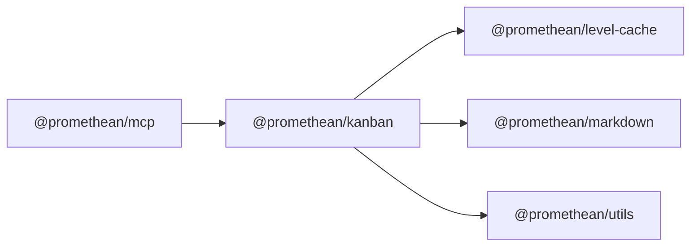

<!-- SYMPKG:PKG:BEGIN -->
# @promethean/kanban
**Folder:** `packages/kanban`  
**Version:** `0.1.0`  
**Domain:** `_root`

## Dependencies
- [@promethean/level-cache](../level-cache/README.md)
- [@promethean/markdown](../markdown/README.md)
- [@promethean/utils](../utils/README.md)
## Dependents
- [@promethean/mcp](../mcp/README.md)
<!-- SYMPKG:PKG:END -->