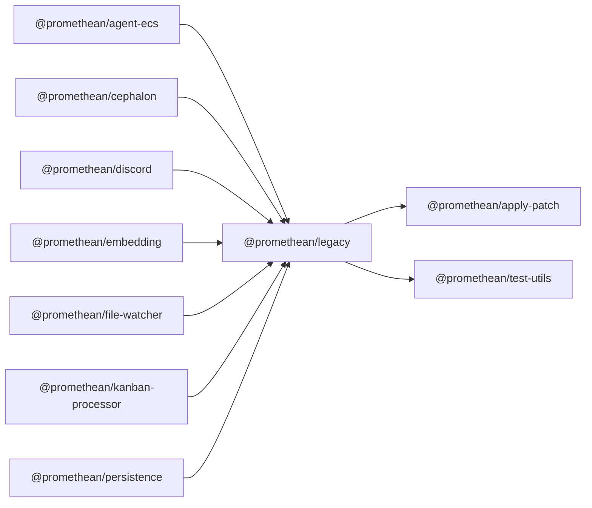

$$
<!-- SYMPKG:PKG:BEGIN -->
$$
# @promethean/legacy
$$
**Folder:** `packages/legacy`
$$
$$
**Version:** `0.0.0`
$$
$$
**Domain:** `_root`
$$

## Dependencies
- $@promethean/apply-patch$$../apply-patch/README.md$
- $@promethean/test-utils$$../test-utils/README.md$
## Dependents
- $@promethean/agent-ecs$$../agent-ecs/README.md$
- $@promethean/cephalon$$../cephalon/README.md$
- $@promethean/discord$$../discord/README.md$
- $@promethean/embedding$$../embedding/README.md$
- $@promethean/file-watcher$$../file-watcher/README.md$
- $@promethean/kanban-processor$$../kanban-processor/README.md$
- $@promethean/persistence$$../persistence/README.md$
$$
<!-- SYMPKG:PKG:END -->
$$