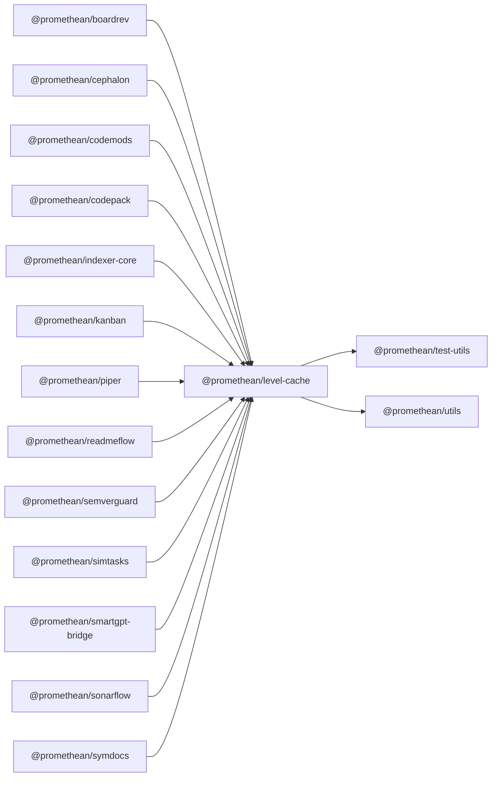

<!-- SYMPKG:PKG:BEGIN -->
# @promethean/level-cache
**Folder:** `packages/level-cache`  
**Version:** `0.1.0`  
**Domain:** `_root`

## Dependencies
- [@promethean/test-utils](../test-utils/README.md)
- [@promethean/utils](../utils/README.md)
## Dependents
- [@promethean/boardrev](../boardrev/README.md)
- [@promethean/cephalon](../cephalon/README.md)
- [@promethean/codemods](../codemods/README.md)
- [@promethean/codepack](../codepack/README.md)
- [@promethean/indexer-core](../indexer-core/README.md)
- [@promethean/kanban](../kanban/README.md)
- [@promethean/piper](../piper/README.md)
- [@promethean/readmeflow](../readmeflow/README.md)
- [@promethean/semverguard](../semverguard/README.md)
- [@promethean/simtasks](../simtask/README.md)
- [@promethean/smartgpt-bridge](../smartgpt-bridge/README.md)
- [@promethean/sonarflow](../sonarflow/README.md)
- [@promethean/symdocs](../symdocs/README.md)
<!-- SYMPKG:PKG:END -->