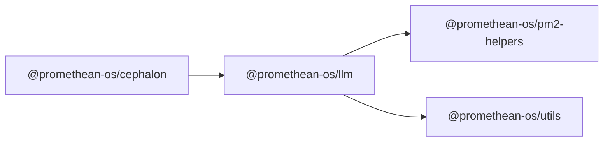

```
<!-- SYMPKG:PKG:BEGIN -->
```
# @promethean-os/llm
```
**Folder:** `packages/llm`
```
```
**Version:** `0.0.1`
```
```
**Domain:** `_root`
```

## Dependencies
- @promethean-os/pm2-helpers$../pm2-helpers/README.md
- @promethean-os/utils$../utils/README.md
## Dependents
- @promethean-os/cephalon$../cephalon/README.md
## 📁 Implementation

### Core Files
- **Main Entry**: [`src/index.ts`](../../../packages/llm/src/index.ts) (224 lines)
- **Drivers**: [`src/drivers/`](../../../packages/llm/src/drivers/) directory
  - [`base.ts`](../../../packages/llm/src/drivers/base.ts) - Base driver interface
  - [`ollama.ts`](../../../packages/llm/src/drivers/ollama.ts) - Ollama driver implementation
  - [`huggingface.ts`](../../../packages/llm/src/drivers/huggingface.ts) - HuggingFace driver
  - [`index.ts`](../../../packages/llm/src/drivers/index.ts) - Driver loader
- **Tools**: [`src/tools.ts`](../../../packages/llm/src/tools.ts) (18 lines)

### Key Functions
- **loadModel()**: [`loadModel()`](../../../packages/llm/src/index.ts#L36) - Load and cache LLM driver
- **generate()**: [`generate()`](../../../packages/llm/src/index.ts#L69) - Generate text using loaded model
- **handleTask()**: [`handleTask()`](../../../packages/llm/src/index.ts#L92) - Handle broker tasks
- **start()**: [`start()`](../../../packages/llm/src/index.ts#L210) - Start the LLM service
- **initServer()**: [`initServer()`](../../../packages/llm/src/index.ts#L185) - Initialize HTTP/WebSocket server

### View Source
- **GitHub**: [View on GitHub](https://github.com/promethean-ai/promethean/tree/main/packages/llm/src)
- **VS Code**: [Open in VS Code](vscode://file/packages/llm/src)

## 📚 API Reference

### Core Functions

#### loadModel()
**Location**: [`src/index.ts`](../../../packages/llm/src/index.ts#L36)

**Description**: Loads and caches the LLM driver for subsequent operations.

**Returns**: Promise<LLMDriver> - The loaded driver instance

#### generate()
**Location**: [`src/index.ts`](../../../packages/llm/src/index.ts#L69)

**Description**: Generates text using the loaded model with retry logic.

**Parameters**:
- `args` - GenerateArgs containing prompt, context, format, and tools

**Returns**: Promise<unknown> - Generated text response

#### handleTask()
**Location**: [`src/index.ts`](../../../packages/llm/src/index.ts#L92)

**Description**: Handles incoming tasks from the message broker.

**Parameters**:
- `task` - BrokerTask containing task payload and ID

#### start()
**Location**: [`src/index.ts`](../../../packages/llm/src/index.ts#L210)

**Description**: Starts the complete LLM service with broker, heartbeat, and server.

**Parameters**:
- `port` - Optional port number (defaults to 8888)

**Returns**: Promise<http.Server> - The started HTTP server

### Driver Functions

#### loadDriver()
**Location**: [`src/drivers/index.ts`](../../../packages/llm/src/drivers/index.ts#L27)

**Description**: Loads the appropriate LLM driver based on configuration.

**Returns**: Promise<LLMDriver> - Configured driver instance

#### createOllamaDriver()
**Location**: [`src/drivers/ollama.ts`](../../../packages/llm/src/drivers/ollama.ts#L5)

**Description**: Creates an Ollama-compatible LLM driver.

**Returns**: LLMDriver - Ollama driver implementation

#### createHuggingFaceDriver()
**Location**: [`src/drivers/huggingface.ts`](../../../packages/llm/src/drivers/huggingface.ts#L5)

**Description**: Creates a HuggingFace-compatible LLM driver.

**Returns**: LLMDriver - HuggingFace driver implementation

```
<!-- SYMPKG:PKG:END -->
```