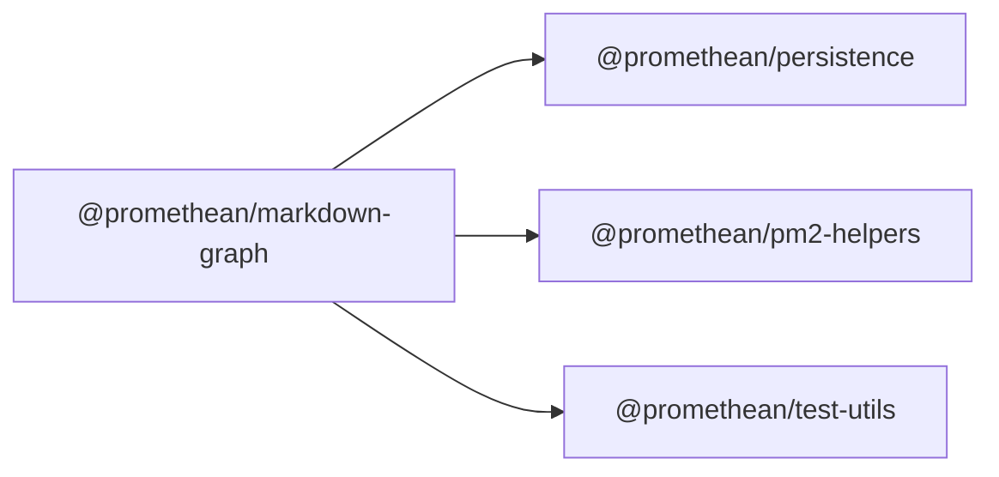

$$
<!-- SYMPKG:PKG:BEGIN -->
$$
# @promethean/markdown-graph
$$
**Folder:** `packages/markdown-graph`
$$
$$
**Version:** `0.1.0`
$$
$$
**Domain:** `_root`
$$

## Dependencies
- $@promethean/persistence$$../persistence/README.md$
- $@promethean/pm2-helpers$$../pm2-helpers/README.md$
- $@promethean/test-utils$$../test-utils/README.md$
## Dependents
- _None_
$$
<!-- SYMPKG:PKG:END -->
$$