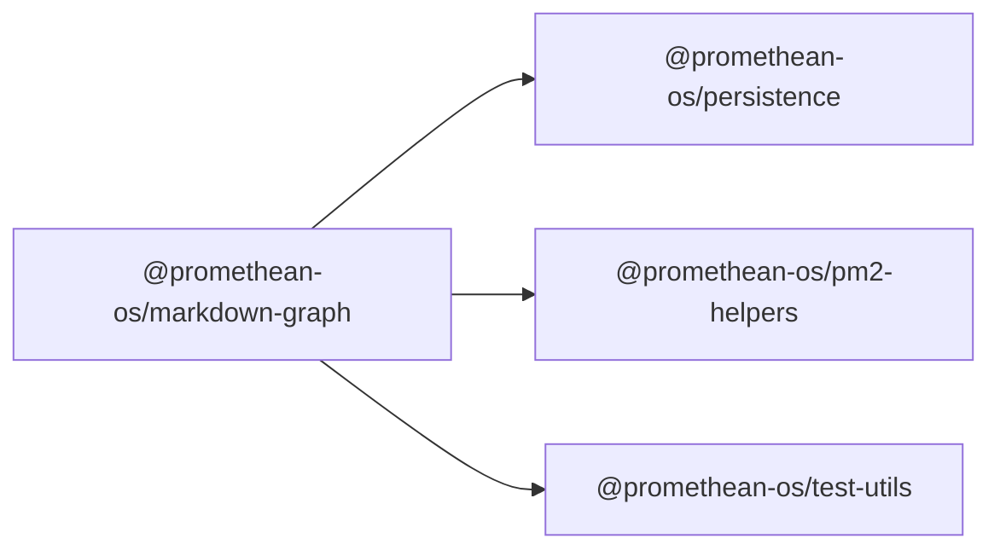

```
<!-- SYMPKG:PKG:BEGIN -->
```
# @promethean-os/markdown-graph
```
**Folder:** `packages/markdown-graph`
```
```
**Version:** `0.1.0`
```
```
**Domain:** `_root`
```

## Dependencies
- @promethean-os/persistence$../persistence/README.md
- @promethean-os/pm2-helpers$../pm2-helpers/README.md
- @promethean-os/test-utils$../test-utils/README.md
## Dependents
- _None_
```
<!-- SYMPKG:PKG:END -->
```