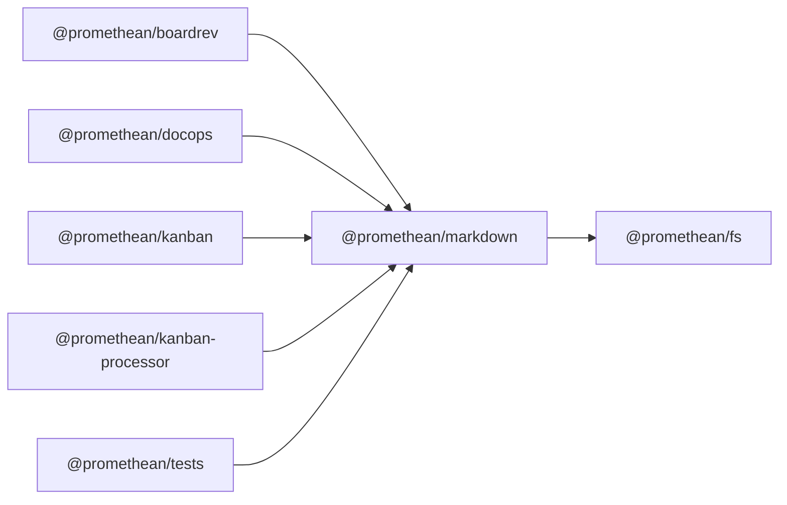

$$
<!-- SYMPKG:PKG:BEGIN -->
$$
# @promethean/markdown
$$
**Folder:** `packages/markdown`
$$
$$
**Version:** `0.0.1`
$$
$$
**Domain:** `_root`
$$

## Dependencies
- $@promethean/fs$$../fs/README.md$
## Dependents
- $@promethean/boardrev$$../boardrev/README.md$
- $@promethean/docops$$../docops/README.md$
- $@promethean/kanban$$../kanban/README.md$
- $@promethean/kanban-processor$$../kanban-processor/README.md$
- $@promethean/tests$$../tests/README.md$
$$
<!-- SYMPKG:PKG:END -->
$$