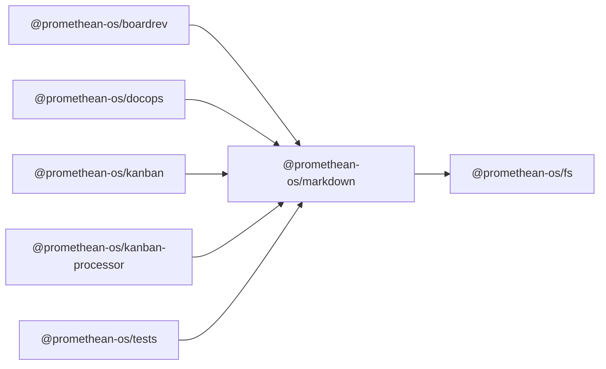

```
<!-- SYMPKG:PKG:BEGIN -->
```
# @promethean-os/markdown
```
**Folder:** `packages/markdown`
```
```
**Version:** `0.0.1`
```
```
**Domain:** `_root`
```

## Dependencies
- @promethean-os/fs$../fs/README.md
## Dependents
- @promethean-os/boardrev$../boardrev/README.md
- @promethean-os/docops$../docops/README.md
- @promethean-os/kanban$../kanban/README.md
- @promethean-os/kanban-processor$../kanban-processor/README.md
- @promethean-os/tests$../tests/README.md
```


## 📁 Implementation

### Core Files

- [56](../../../packages/markdown/src/56)

### View Source

- [GitHub](https://github.com/promethean-ai/promethean/tree/main/packages/markdown/src)
- [VS Code](vscode://file/packages/markdown/src)


## 📚 API Reference

### Interfaces

#### [- **anchors.ts**](../../../packages/markdown/src/[src/anchors.ts](../../../packages/markdown/src/anchors.ts) (121 lines)#L1)

#### [- **chunking.ts**](../../../packages/markdown/src/[src/chunking.ts](../../../packages/markdown/src/chunking.ts) (160 lines)#L1)

#### [- **frontmatter.ts**](../../../packages/markdown/src/[src/frontmatter.ts](../../../packages/markdown/src/frontmatter.ts) (217 lines)#L1)

#### [- **index.ts**](../../../packages/markdown/src/[src/index.ts](../../../packages/markdown/src/index.ts) (19 lines)#L1)

#### [- **kanban.ts**](../../../packages/markdown/src/[src/kanban.ts](../../../packages/markdown/src/kanban.ts) (456 lines)#L1)

#### [- **statuses.ts**](../../../packages/markdown/src/[src/statuses.ts](../../../packages/markdown/src/statuses.ts) (86 lines)#L1)

#### [- **sync.ts**](../../../packages/markdown/src/[src/sync.ts](../../../packages/markdown/src/sync.ts) (219 lines)#L1)

#### [- **system.ts**](../../../packages/markdown/src/[src/system.ts](../../../packages/markdown/src/system.ts) (781 lines)#L1)

#### [- **task.ts**](../../../packages/markdown/src/[src/task.ts](../../../packages/markdown/src/task.ts) (187 lines)#L1)

#### [- **template-enhanced.ts**](../../../packages/markdown/src/[src/template-enhanced.ts](../../../packages/markdown/src/template-enhanced.ts) (670 lines)#L1)

#### [- **template-original.ts**](../../../packages/markdown/src/[src/template-original.ts](../../../packages/markdown/src/template-original.ts) (460 lines)#L1)

#### [- **template.ts**](../../../packages/markdown/src/[src/template.ts](../../../packages/markdown/src/template.ts) (670 lines)#L1)

#### [- **tests/anchors.test.ts**](../../../packages/markdown/src/[src/tests/anchors.test.ts](../../../packages/markdown/src/tests/anchors.test.ts) (41 lines)#L1)

#### [- **tests/chunking.test.ts**](../../../packages/markdown/src/[src/tests/chunking.test.ts](../../../packages/markdown/src/tests/chunking.test.ts) (26 lines)#L1)

#### [- **tests/frontmatter.test.ts**](../../../packages/markdown/src/[src/tests/frontmatter.test.ts](../../../packages/markdown/src/tests/frontmatter.test.ts) (122 lines)#L1)

#### [- **tests/kanban.test.ts**](../../../packages/markdown/src/[src/tests/kanban.test.ts](../../../packages/markdown/src/tests/kanban.test.ts) (34 lines)#L1)

#### [- **tests/system.test.ts**](../../../packages/markdown/src/[src/tests/system.test.ts](../../../packages/markdown/src/tests/system.test.ts) (115 lines)#L1)

#### [- **tests/template.test.ts**](../../../packages/markdown/src/[src/tests/template.test.ts](../../../packages/markdown/src/tests/template.test.ts) (229 lines)#L1)

#### [- **types.ts**](../../../packages/markdown/src/[src/types.ts](../../../packages/markdown/src/types.ts) (10 lines)#L1)

#### [- **MarkdownBoard**](../../../packages/markdown/src/[MarkdownBoard](../../../packages/markdown/src/kanban.ts#L242)

#### [- **MarkdownTask**](../../../packages/markdown/src/[MarkdownTask](../../../packages/markdown/src/task.ts#L93)

#### [- **anchorId()**](../../../packages/markdown/src/[anchorId()](../../../packages/markdown/src/anchors.ts#L59)

#### [- **relMdLink()**](../../../packages/markdown/src/[relMdLink()](../../../packages/markdown/src/anchors.ts#L62)

#### [- **computeFenceMap()**](../../../packages/markdown/src/[computeFenceMap()](../../../packages/markdown/src/anchors.ts#L67)

#### [- **injectAnchors()**](../../../packages/markdown/src/[injectAnchors()](../../../packages/markdown/src/anchors.ts#L70)

#### [- **sentenceSplit()**](../../../packages/markdown/src/[sentenceSplit()](../../../packages/markdown/src/chunking.ts#L53)

#### [- **GitHub**](../../../packages/markdown/src/[View on GitHub](https#L1)

#### [- **VS Code**](../../../packages/markdown/src/[Open in VS Code](vscode#L1)

#### [**Location**](../../../packages/markdown/src/[MarkdownBoard](../../../packages/markdown/src/kanban.ts#L242)

#### [**Description**](../../../packages/markdown/src/Main class for markdownboard functionality.#L1)

#### [**File**](../../../packages/markdown/src/`src/kanban.ts`#L1)

#### [**Location**](../../../packages/markdown/src/[MarkdownTask](../../../packages/markdown/src/task.ts#L93)

#### [**Description**](../../../packages/markdown/src/Main class for markdowntask functionality.#L1)

#### [**File**](../../../packages/markdown/src/`src/task.ts`#L1)

#### [**Location**](../../../packages/markdown/src/[anchorId()](../../../packages/markdown/src/anchors.ts#L59)

#### [**Description**](../../../packages/markdown/src/Key function for anchorid operations.#L1)

#### [**File**](../../../packages/markdown/src/`src/anchors.ts`#L1)

#### [**Location**](../../../packages/markdown/src/[relMdLink()](../../../packages/markdown/src/anchors.ts#L62)

#### [**Description**](../../../packages/markdown/src/Key function for relmdlink operations.#L1)

#### [**File**](../../../packages/markdown/src/`src/anchors.ts`#L1)

#### [**Location**](../../../packages/markdown/src/[computeFenceMap()](../../../packages/markdown/src/anchors.ts#L67)

#### [**Description**](../../../packages/markdown/src/Key function for computefencemap operations.#L1)

#### [**File**](../../../packages/markdown/src/`src/anchors.ts`#L1)

#### [**Location**](../../../packages/markdown/src/[injectAnchors()](../../../packages/markdown/src/anchors.ts#L70)

#### [**Description**](../../../packages/markdown/src/Key function for injectanchors operations.#L1)

#### [**File**](../../../packages/markdown/src/`src/anchors.ts`#L1)

#### [**Location**](../../../packages/markdown/src/[sentenceSplit()](../../../packages/markdown/src/chunking.ts#L53)

#### [**Description**](../../../packages/markdown/src/Key function for sentencesplit operations.#L1)

#### [**File**](../../../packages/markdown/src/`src/chunking.ts`#L1)

#### [**Location**](../../../packages/markdown/src/[parseMarkdownChunks()](../../../packages/markdown/src/chunking.ts#L143)

#### [**Description**](../../../packages/markdown/src/Key function for parsemarkdownchunks operations.#L1)

#### [**File**](../../../packages/markdown/src/`src/chunking.ts`#L1)

#### [**Location**](../../../packages/markdown/src/[parseFrontmatter()](../../../packages/markdown/src/frontmatter.ts#L57)

#### [**Description**](../../../packages/markdown/src/Key function for parsefrontmatter operations.#L1)

#### [**File**](../../../packages/markdown/src/`src/frontmatter.ts`#L1)

#### [**Location**](../../../packages/markdown/src/[stringifyFrontmatter()](../../../packages/markdown/src/frontmatter.ts#L80)

#### [**Description**](../../../packages/markdown/src/Key function for stringifyfrontmatter operations.#L1)

#### [**File**](../../../packages/markdown/src/`src/frontmatter.ts`#L1)

#### [**Location**](../../../packages/markdown/src/[normalizeStringList()](../../../packages/markdown/src/frontmatter.ts#L85)

#### [**Description**](../../../packages/markdown/src/Key function for normalizestringlist operations.#L1)

#### [**File**](../../../packages/markdown/src/`src/frontmatter.ts`#L1)

#### [**Location**](../../../packages/markdown/src/[deriveFilenameFromPath()](../../../packages/markdown/src/frontmatter.ts#L95)

#### [**Description**](../../../packages/markdown/src/Key function for derivefilenamefrompath operations.#L1)

#### [**File**](../../../packages/markdown/src/`src/frontmatter.ts`#L1)

#### [**Location**](../../../packages/markdown/src/[ensureBaselineFrontmatter()](../../../packages/markdown/src/frontmatter.ts#L131)

#### [**Description**](../../../packages/markdown/src/Key function for ensurebaselinefrontmatter operations.#L1)

#### [**File**](../../../packages/markdown/src/`src/frontmatter.ts`#L1)

#### [**Location**](../../../packages/markdown/src/[mergeFrontmatterWithGenerated()](../../../packages/markdown/src/frontmatter.ts#L180)

#### [**Description**](../../../packages/markdown/src/Key function for mergefrontmatterwithgenerated operations.#L1)

#### [**File**](../../../packages/markdown/src/`src/frontmatter.ts`#L1)

#### [**Location**](../../../packages/markdown/src/[STATUS_ORDER()](../../../packages/markdown/src/statuses.ts#L1)

#### [**Description**](../../../packages/markdown/src/Key function for status_order operations.#L1)

#### [**File**](../../../packages/markdown/src/`src/statuses.ts`#L1)

#### [**Location**](../../../packages/markdown/src/[STATUS_SET()](../../../packages/markdown/src/statuses.ts#L16)

#### [**Description**](../../../packages/markdown/src/Key function for status_set operations.#L1)

#### [**File**](../../../packages/markdown/src/`src/statuses.ts`#L1)

#### [**Location**](../../../packages/markdown/src/[headerToStatus()](../../../packages/markdown/src/statuses.ts#L79)

#### [**Description**](../../../packages/markdown/src/Key function for headertostatus operations.#L1)

#### [**File**](../../../packages/markdown/src/`src/statuses.ts`#L1)

#### [**Location**](../../../packages/markdown/src/[stripHash()](../../../packages/markdown/src/sync.ts#L13)

#### [**Description**](../../../packages/markdown/src/Key function for striphash operations.#L1)

#### [**File**](../../../packages/markdown/src/`src/sync.ts`#L1)

#### [**Location**](../../../packages/markdown/src/[firstWikiTarget()](../../../packages/markdown/src/sync.ts#L31)

#### [**Description**](../../../packages/markdown/src/Key function for firstwikitarget operations.#L1)

#### [**File**](../../../packages/markdown/src/`src/sync.ts`#L1)

#### [**Location**](../../../packages/markdown/src/[ensureStatusInTags()](../../../packages/markdown/src/sync.ts#L48)

#### [**Description**](../../../packages/markdown/src/Key function for ensurestatusintags operations.#L1)

#### [**File**](../../../packages/markdown/src/`src/sync.ts`#L1)

#### [**Location**](../../../packages/markdown/src/[cardNeedsStatusUpdate()](../../../packages/markdown/src/sync.ts#L53)

#### [**Description**](../../../packages/markdown/src/Key function for cardneedsstatusupdate operations.#L1)

#### [**File**](../../../packages/markdown/src/`src/sync.ts`#L1)

#### [**Location**](../../../packages/markdown/src/[cardNeedsLink()](../../../packages/markdown/src/sync.ts#L61)

#### [**Description**](../../../packages/markdown/src/Key function for cardneedslink operations.#L1)

#### [**File**](../../../packages/markdown/src/`src/sync.ts`#L1)

#### [**Location**](../../../packages/markdown/src/[ensureCardStatus()](../../../packages/markdown/src/sync.ts#L67)

#### [**Description**](../../../packages/markdown/src/Key function for ensurecardstatus operations.#L1)

#### [**File**](../../../packages/markdown/src/`src/sync.ts`#L1)

#### [**Location**](../../../packages/markdown/src/[ensureTaskFile()](../../../packages/markdown/src/sync.ts#L75)

#### [**Description**](../../../packages/markdown/src/Key function for ensuretaskfile operations.#L1)

#### [**File**](../../../packages/markdown/src/`src/sync.ts`#L1)

#### [**Location**](../../../packages/markdown/src/[ensureCardLink()](../../../packages/markdown/src/sync.ts#L96)

#### [**Description**](../../../packages/markdown/src/Key function for ensurecardlink operations.#L1)

#### [**File**](../../../packages/markdown/src/`src/sync.ts`#L1)

#### [**Location**](../../../packages/markdown/src/[ensureTaskStatusForCard()](../../../packages/markdown/src/sync.ts#L118)

#### [**Description**](../../../packages/markdown/src/Key function for ensuretaskstatusforcard operations.#L1)

#### [**File**](../../../packages/markdown/src/`src/sync.ts`#L1)

#### [**Location**](../../../packages/markdown/src/[detectPendingChanges()](../../../packages/markdown/src/sync.ts#L181)

#### [**Description**](../../../packages/markdown/src/Key function for detectpendingchanges operations.#L1)

#### [**File**](../../../packages/markdown/src/`src/sync.ts`#L1)

#### [**Location**](../../../packages/markdown/src/[applyUpdates()](../../../packages/markdown/src/sync.ts#L189)

#### [**Description**](../../../packages/markdown/src/Key function for applyupdates operations.#L1)

#### [**File**](../../../packages/markdown/src/`src/sync.ts`#L1)

#### [**Location**](../../../packages/markdown/src/[normalizeBoardInstance()](../../../packages/markdown/src/sync.ts#L206)

#### [**Description**](../../../packages/markdown/src/Key function for normalizeboardinstance operations.#L1)

#### [**File**](../../../packages/markdown/src/`src/sync.ts`#L1)

#### [**Location**](../../../packages/markdown/src/[syncBoardStatuses()](../../../packages/markdown/src/sync.ts#L212)

#### [**Description**](../../../packages/markdown/src/Key function for syncboardstatuses operations.#L1)

#### [**File**](../../../packages/markdown/src/`src/sync.ts`#L1)

#### [**Location**](../../../packages/markdown/src/[parseSystemMarkdown()](../../../packages/markdown/src/system.ts#L729)

#### [**Description**](../../../packages/markdown/src/Key function for parsesystemmarkdown operations.#L1)

#### [**File**](../../../packages/markdown/src/`src/system.ts`#L1)

#### [**Location**](../../../packages/markdown/src/[summarizeSystemSections()](../../../packages/markdown/src/system.ts#L771)

#### [**Description**](../../../packages/markdown/src/Key function for summarizesystemsections operations.#L1)

#### [**File**](../../../packages/markdown/src/`src/system.ts`#L1)

#### [**Location**](../../../packages/markdown/src/[processMarkdownTemplate()](../../../packages/markdown/src/template-enhanced.ts#L525)

#### [**Description**](../../../packages/markdown/src/Key function for processmarkdowntemplate operations.#L1)

#### [**File**](../../../packages/markdown/src/`src/template-enhanced.ts`#L1)

#### [**Location**](../../../packages/markdown/src/[processTextTemplate()](../../../packages/markdown/src/template-enhanced.ts#L570)

#### [**Description**](../../../packages/markdown/src/Key function for processtexttemplate operations.#L1)

#### [**File**](../../../packages/markdown/src/`src/template-enhanced.ts`#L1)

#### [**Location**](../../../packages/markdown/src/[validateTemplate()](../../../packages/markdown/src/template-enhanced.ts#L588)

#### [**Description**](../../../packages/markdown/src/Key function for validatetemplate operations.#L1)

#### [**File**](../../../packages/markdown/src/`src/template-enhanced.ts`#L1)

#### [**Location**](../../../packages/markdown/src/[getBuiltinFilters()](../../../packages/markdown/src/template-enhanced.ts#L660)

#### [**Description**](../../../packages/markdown/src/Key function for getbuiltinfilters operations.#L1)

#### [**File**](../../../packages/markdown/src/`src/template-enhanced.ts`#L1)

#### [**Location**](../../../packages/markdown/src/[registerFilter()](../../../packages/markdown/src/template-enhanced.ts#L667)

#### [**Description**](../../../packages/markdown/src/Key function for registerfilter operations.#L1)

#### [**File**](../../../packages/markdown/src/`src/template-enhanced.ts`#L1)

#### [**Location**](../../../packages/markdown/src/[processMarkdownTemplate()](../../../packages/markdown/src/template-original.ts#L348)

#### [**Description**](../../../packages/markdown/src/Key function for processmarkdowntemplate operations.#L1)

#### [**File**](../../../packages/markdown/src/`src/template-original.ts`#L1)

#### [**Location**](../../../packages/markdown/src/[processTextTemplate()](../../../packages/markdown/src/template-original.ts#L393)

#### [**Description**](../../../packages/markdown/src/Key function for processtexttemplate operations.#L1)

#### [**File**](../../../packages/markdown/src/`src/template-original.ts`#L1)

#### [**Location**](../../../packages/markdown/src/[validateTemplate()](../../../packages/markdown/src/template-original.ts#L411)

#### [**Description**](../../../packages/markdown/src/Key function for validatetemplate operations.#L1)

#### [**File**](../../../packages/markdown/src/`src/template-original.ts`#L1)

#### [**Location**](../../../packages/markdown/src/[processMarkdownTemplate()](../../../packages/markdown/src/template.ts#L525)

#### [**Description**](../../../packages/markdown/src/Key function for processmarkdowntemplate operations.#L1)

#### [**File**](../../../packages/markdown/src/`src/template.ts`#L1)

#### [**Location**](../../../packages/markdown/src/[processTextTemplate()](../../../packages/markdown/src/template.ts#L570)

#### [**Description**](../../../packages/markdown/src/Key function for processtexttemplate operations.#L1)

#### [**File**](../../../packages/markdown/src/`src/template.ts`#L1)

#### [**Location**](../../../packages/markdown/src/[validateTemplate()](../../../packages/markdown/src/template.ts#L588)

#### [**Description**](../../../packages/markdown/src/Key function for validatetemplate operations.#L1)

#### [**File**](../../../packages/markdown/src/`src/template.ts`#L1)

#### [**Location**](../../../packages/markdown/src/[getBuiltinFilters()](../../../packages/markdown/src/template.ts#L660)

#### [**Description**](../../../packages/markdown/src/Key function for getbuiltinfilters operations.#L1)

#### [**File**](../../../packages/markdown/src/`src/template.ts`#L1)

#### [**Location**](../../../packages/markdown/src/[registerFilter()](../../../packages/markdown/src/template.ts#L667)

#### [**Description**](../../../packages/markdown/src/Key function for registerfilter operations.#L1)

#### [**File**](../../../packages/markdown/src/`src/template.ts`#L1)

#### [**Location**](../../../packages/markdown/src/[TemplateContext](../../../packages/markdown/src/template-enhanced.ts#L9)

#### [**Description**](../../../packages/markdown/src/Type definition for templatecontext.#L1)

#### [**File**](../../../packages/markdown/src/`src/template-enhanced.ts`#L1)

#### [**Location**](../../../packages/markdown/src/[TemplateFilter](../../../packages/markdown/src/template-enhanced.ts#L16)

#### [**Description**](../../../packages/markdown/src/Type definition for templatefilter.#L1)

#### [**File**](../../../packages/markdown/src/`src/template-enhanced.ts`#L1)

#### [**Location**](../../../packages/markdown/src/[TemplateOptions](../../../packages/markdown/src/template-enhanced.ts#L24)

#### [**Description**](../../../packages/markdown/src/Type definition for templateoptions.#L1)

#### [**File**](../../../packages/markdown/src/`src/template-enhanced.ts`#L1)

#### [**Location**](../../../packages/markdown/src/[TemplateResult](../../../packages/markdown/src/template-enhanced.ts#L36)

#### [**Description**](../../../packages/markdown/src/Type definition for templateresult.#L1)

#### [**File**](../../../packages/markdown/src/`src/template-enhanced.ts`#L1)

#### [**Location**](../../../packages/markdown/src/[TemplateContext](../../../packages/markdown/src/template-original.ts#L9)

#### [**Description**](../../../packages/markdown/src/Type definition for templatecontext.#L1)

#### [**File**](../../../packages/markdown/src/`src/template-original.ts`#L1)

#### [**Location**](../../../packages/markdown/src/[TemplateOptions](../../../packages/markdown/src/template-original.ts#L16)

#### [**Description**](../../../packages/markdown/src/Type definition for templateoptions.#L1)

#### [**File**](../../../packages/markdown/src/`src/template-original.ts`#L1)

#### [**Location**](../../../packages/markdown/src/[TemplateResult](../../../packages/markdown/src/template-original.ts#L27)

#### [**Description**](../../../packages/markdown/src/Type definition for templateresult.#L1)

#### [**File**](../../../packages/markdown/src/`src/template-original.ts`#L1)

#### [**Location**](../../../packages/markdown/src/[TemplateContext](../../../packages/markdown/src/template.ts#L9)

#### [**Description**](../../../packages/markdown/src/Type definition for templatecontext.#L1)

#### [**File**](../../../packages/markdown/src/`src/template.ts`#L1)

#### [**Location**](../../../packages/markdown/src/[TemplateFilter](../../../packages/markdown/src/template.ts#L16)

#### [**Description**](../../../packages/markdown/src/Type definition for templatefilter.#L1)

#### [**File**](../../../packages/markdown/src/`src/template.ts`#L1)

#### [**Location**](../../../packages/markdown/src/[TemplateOptions](../../../packages/markdown/src/template.ts#L24)

#### [**Description**](../../../packages/markdown/src/Type definition for templateoptions.#L1)

#### [**File**](../../../packages/markdown/src/`src/template.ts`#L1)

#### [**Location**](../../../packages/markdown/src/[TemplateResult](../../../packages/markdown/src/template.ts#L36)

#### [**Description**](../../../packages/markdown/src/Type definition for templateresult.#L1)

#### [**File**](../../../packages/markdown/src/`src/template.ts`#L1)

#### [Code links saved to](../../../packages/markdown/src//home/err/devel/promethean/tmp/markdown-code-links.json#L1)


---

*Enhanced with code links via SYMPKG documentation enhancer*