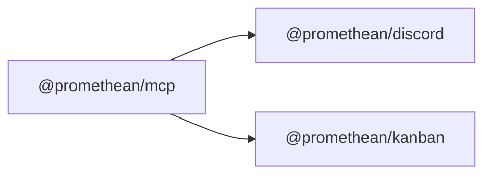

<!-- SYMPKG:PKG:BEGIN -->
# @promethean/mcp
**Folder:** `packages/mcp`  
**Version:** `0.1.0`  
**Domain:** `_root`

## Dependencies
- [@promethean/discord](../discord/README.md)
- [@promethean/kanban](../kanban/README.md)
## Dependents
- _None_
<!-- SYMPKG:PKG:END -->