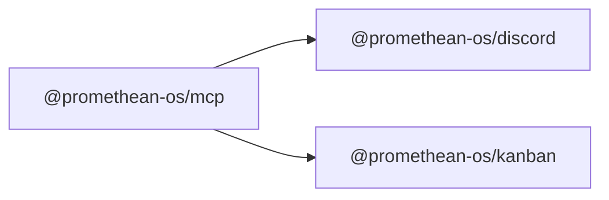

```
<!-- SYMPKG:PKG:BEGIN -->
```
# @promethean-os/mcp
```
**Folder:** `packages/mcp`
```
```
**Version:** `0.1.0`
```
```
**Domain:** `_root`
```

## Dependencies
- @promethean-os/discord$../discord/README.md
- @promethean-os/kanban$../kanban/README.md
## Dependents
- _None_

## Included modules
- `@promethean-os/mcp/github/conflicts` — GitHub merge assistance helpers and MCP server factory.
- `@promethean-os/mcp/ollama` — Task parsing and streaming execution helpers for Ollama MCP integrations.
```
<!-- SYMPKG:PKG:END -->
```