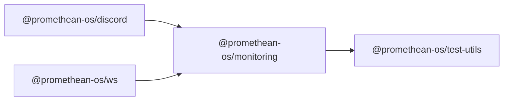

```
<!-- SYMPKG:PKG:BEGIN -->
```
# @promethean-os/monitoring
```
**Folder:** `packages/monitoring`
```
```
**Version:** `0.0.1`
```
```
**Domain:** `_root`
```

## Dependencies
- @promethean-os/test-utils$../test-utils/README.md
## Dependents
- @promethean-os/discord$../discord/README.md
- @promethean-os/ws$../ws/README.md
```


## 📁 Implementation

### Core Files

- [49](../../../packages/monitoring/src/49)

### View Source

- [GitHub](https://github.com/promethean-ai/promethean/tree/main/packages/monitoring/src)
- [VS Code](vscode://file/packages/monitoring/src)


## 📚 API Reference

### Interfaces

#### [- **alerting.ts**](../../../packages/monitoring/src/[src/alerting.ts](../../../packages/monitoring/src/alerting.ts) (576 lines)#L1)

#### [- **collection.ts**](../../../packages/monitoring/src/[src/collection.ts](../../../packages/monitoring/src/collection.ts) (392 lines)#L1)

#### [- **dashboard.ts**](../../../packages/monitoring/src/[src/dashboard.ts](../../../packages/monitoring/src/dashboard.ts) (514 lines)#L1)

#### [- **index.ts**](../../../packages/monitoring/src/[src/index.ts](../../../packages/monitoring/src/index.ts) (12 lines)#L1)

#### [- **limiter.ts**](../../../packages/monitoring/src/[src/limiter.ts](../../../packages/monitoring/src/limiter.ts) (73 lines)#L1)

#### [- **prom.ts**](../../../packages/monitoring/src/[src/prom.ts](../../../packages/monitoring/src/prom.ts) (133 lines)#L1)

#### [- **schemas.ts**](../../../packages/monitoring/src/[src/schemas.ts](../../../packages/monitoring/src/schemas.ts) (260 lines)#L1)

#### [- **storage.ts**](../../../packages/monitoring/src/[src/storage.ts](../../../packages/monitoring/src/storage.ts) (520 lines)#L1)

#### [- **tests/limiter.test.ts**](../../../packages/monitoring/src/[src/tests/limiter.test.ts](../../../packages/monitoring/src/tests/limiter.test.ts) (78 lines)#L1)

#### [- **tests/monitoring.test.ts**](../../../packages/monitoring/src/[src/tests/monitoring.test.ts](../../../packages/monitoring/src/tests/monitoring.test.ts) (390 lines)#L1)

#### [- **types.ts**](../../../packages/monitoring/src/[src/types.ts](../../../packages/monitoring/src/types.ts) (159 lines)#L1)

#### [- **AlertingService**](../../../packages/monitoring/src/[AlertingService](../../../packages/monitoring/src/alerting.ts#L72)

#### [- **MetricsCollectionService**](../../../packages/monitoring/src/[MetricsCollectionService](../../../packages/monitoring/src/collection.ts#L46)

#### [- **MonitoringDashboard**](../../../packages/monitoring/src/[MonitoringDashboard](../../../packages/monitoring/src/dashboard.ts#L80)

#### [- **TokenBucket**](../../../packages/monitoring/src/[TokenBucket](../../../packages/monitoring/src/limiter.ts#L14)

#### [- **PerformanceDataStorage**](../../../packages/monitoring/src/[PerformanceDataStorage](../../../packages/monitoring/src/storage.ts#L70)

#### [- **DEFAULT_ALERTING_CONFIG()**](../../../packages/monitoring/src/[DEFAULT_ALERTING_CONFIG()](../../../packages/monitoring/src/alerting.ts#L53)

#### [- **getAlertingService()**](../../../packages/monitoring/src/[getAlertingService()](../../../packages/monitoring/src/alerting.ts#L557)

#### [- **destroyAlertingService()**](../../../packages/monitoring/src/[destroyAlertingService()](../../../packages/monitoring/src/alerting.ts#L570)

#### [- **DEFAULT_COLLECTION_CONFIG()**](../../../packages/monitoring/src/[DEFAULT_COLLECTION_CONFIG()](../../../packages/monitoring/src/collection.ts#L24)

#### [- **getMetricsCollectionService()**](../../../packages/monitoring/src/[getMetricsCollectionService()](../../../packages/monitoring/src/collection.ts#L374)

#### [- **GitHub**](../../../packages/monitoring/src/[View on GitHub](https#L1)

#### [- **VS Code**](../../../packages/monitoring/src/[Open in VS Code](vscode#L1)

#### [**Location**](../../../packages/monitoring/src/[AlertingService](../../../packages/monitoring/src/alerting.ts#L72)

#### [**Description**](../../../packages/monitoring/src/Main class for alertingservice functionality.#L1)

#### [**File**](../../../packages/monitoring/src/`src/alerting.ts`#L1)

#### [**Location**](../../../packages/monitoring/src/[MetricsCollectionService](../../../packages/monitoring/src/collection.ts#L46)

#### [**Description**](../../../packages/monitoring/src/Main class for metricscollectionservice functionality.#L1)

#### [**File**](../../../packages/monitoring/src/`src/collection.ts`#L1)

#### [**Location**](../../../packages/monitoring/src/[MonitoringDashboard](../../../packages/monitoring/src/dashboard.ts#L80)

#### [**Description**](../../../packages/monitoring/src/Main class for monitoringdashboard functionality.#L1)

#### [**File**](../../../packages/monitoring/src/`src/dashboard.ts`#L1)

#### [**Location**](../../../packages/monitoring/src/[TokenBucket](../../../packages/monitoring/src/limiter.ts#L14)

#### [**Description**](../../../packages/monitoring/src/Main class for tokenbucket functionality.#L1)

#### [**File**](../../../packages/monitoring/src/`src/limiter.ts`#L1)

#### [**Location**](../../../packages/monitoring/src/[PerformanceDataStorage](../../../packages/monitoring/src/storage.ts#L70)

#### [**Description**](../../../packages/monitoring/src/Main class for performancedatastorage functionality.#L1)

#### [**File**](../../../packages/monitoring/src/`src/storage.ts`#L1)

#### [**Location**](../../../packages/monitoring/src/[DEFAULT_ALERTING_CONFIG()](../../../packages/monitoring/src/alerting.ts#L53)

#### [**Description**](../../../packages/monitoring/src/Key function for default_alerting_config operations.#L1)

#### [**File**](../../../packages/monitoring/src/`src/alerting.ts`#L1)

#### [**Location**](../../../packages/monitoring/src/[getAlertingService()](../../../packages/monitoring/src/alerting.ts#L557)

#### [**Description**](../../../packages/monitoring/src/Key function for getalertingservice operations.#L1)

#### [**File**](../../../packages/monitoring/src/`src/alerting.ts`#L1)

#### [**Location**](../../../packages/monitoring/src/[destroyAlertingService()](../../../packages/monitoring/src/alerting.ts#L570)

#### [**Description**](../../../packages/monitoring/src/Key function for destroyalertingservice operations.#L1)

#### [**File**](../../../packages/monitoring/src/`src/alerting.ts`#L1)

#### [**Location**](../../../packages/monitoring/src/[DEFAULT_COLLECTION_CONFIG()](../../../packages/monitoring/src/collection.ts#L24)

#### [**Description**](../../../packages/monitoring/src/Key function for default_collection_config operations.#L1)

#### [**File**](../../../packages/monitoring/src/`src/collection.ts`#L1)

#### [**Location**](../../../packages/monitoring/src/[getMetricsCollectionService()](../../../packages/monitoring/src/collection.ts#L374)

#### [**Description**](../../../packages/monitoring/src/Key function for getmetricscollectionservice operations.#L1)

#### [**File**](../../../packages/monitoring/src/`src/collection.ts`#L1)

#### [**Location**](../../../packages/monitoring/src/[destroyMetricsCollectionService()](../../../packages/monitoring/src/collection.ts#L386)

#### [**Description**](../../../packages/monitoring/src/Key function for destroymetricscollectionservice operations.#L1)

#### [**File**](../../../packages/monitoring/src/`src/collection.ts`#L1)

#### [**Location**](../../../packages/monitoring/src/[DEFAULT_DASHBOARD_CONFIG()](../../../packages/monitoring/src/dashboard.ts#L62)

#### [**Description**](../../../packages/monitoring/src/Key function for default_dashboard_config operations.#L1)

#### [**File**](../../../packages/monitoring/src/`src/dashboard.ts`#L1)

#### [**Location**](../../../packages/monitoring/src/[getMonitoringDashboard()](../../../packages/monitoring/src/dashboard.ts#L494)

#### [**Description**](../../../packages/monitoring/src/Key function for getmonitoringdashboard operations.#L1)

#### [**File**](../../../packages/monitoring/src/`src/dashboard.ts`#L1)

#### [**Location**](../../../packages/monitoring/src/[destroyMonitoringDashboard()](../../../packages/monitoring/src/dashboard.ts#L508)

#### [**Description**](../../../packages/monitoring/src/Key function for destroymonitoringdashboard operations.#L1)

#### [**File**](../../../packages/monitoring/src/`src/dashboard.ts`#L1)

#### [**Location**](../../../packages/monitoring/src/[metrics()](../../../packages/monitoring/src/prom.ts#L121)

#### [**Description**](../../../packages/monitoring/src/Key function for metrics operations.#L1)

#### [**File**](../../../packages/monitoring/src/`src/prom.ts`#L1)

#### [**Location**](../../../packages/monitoring/src/[METRIC_SCHEMAS()](../../../packages/monitoring/src/schemas.ts#L9)

#### [**Description**](../../../packages/monitoring/src/Key function for metric_schemas operations.#L1)

#### [**File**](../../../packages/monitoring/src/`src/schemas.ts`#L1)

#### [**Location**](../../../packages/monitoring/src/[METRIC_SCHEMA_REGISTRY()](../../../packages/monitoring/src/schemas.ts#L215)

#### [**Description**](../../../packages/monitoring/src/Key function for metric_schema_registry operations.#L1)

#### [**File**](../../../packages/monitoring/src/`src/schemas.ts`#L1)

#### [**Location**](../../../packages/monitoring/src/[DEFAULT_LABELS()](../../../packages/monitoring/src/schemas.ts#L220)

#### [**Description**](../../../packages/monitoring/src/Key function for default_labels operations.#L1)

#### [**File**](../../../packages/monitoring/src/`src/schemas.ts`#L1)

#### [**Location**](../../../packages/monitoring/src/[validateMetricName()](../../../packages/monitoring/src/schemas.ts#L229)

#### [**Description**](../../../packages/monitoring/src/Key function for validatemetricname operations.#L1)

#### [**File**](../../../packages/monitoring/src/`src/schemas.ts`#L1)

#### [**Location**](../../../packages/monitoring/src/[validateLabels()](../../../packages/monitoring/src/schemas.ts#L234)

#### [**Description**](../../../packages/monitoring/src/Key function for validatelabels operations.#L1)

#### [**File**](../../../packages/monitoring/src/`src/schemas.ts`#L1)

#### [**Location**](../../../packages/monitoring/src/[getMetricSchema()](../../../packages/monitoring/src/schemas.ts#L241)

#### [**Description**](../../../packages/monitoring/src/Key function for getmetricschema operations.#L1)

#### [**File**](../../../packages/monitoring/src/`src/schemas.ts`#L1)

#### [**Location**](../../../packages/monitoring/src/[isMetricSchemaValid()](../../../packages/monitoring/src/schemas.ts#L245)

#### [**Description**](../../../packages/monitoring/src/Key function for ismetricschemavalid operations.#L1)

#### [**File**](../../../packages/monitoring/src/`src/schemas.ts`#L1)

#### [**Location**](../../../packages/monitoring/src/[DEFAULT_STORAGE_CONFIG()](../../../packages/monitoring/src/storage.ts#L58)

#### [**Description**](../../../packages/monitoring/src/Key function for default_storage_config operations.#L1)

#### [**File**](../../../packages/monitoring/src/`src/storage.ts`#L1)

#### [**Location**](../../../packages/monitoring/src/[getPerformanceDataStorage()](../../../packages/monitoring/src/storage.ts#L502)

#### [**Description**](../../../packages/monitoring/src/Key function for getperformancedatastorage operations.#L1)

#### [**File**](../../../packages/monitoring/src/`src/storage.ts`#L1)

#### [**Location**](../../../packages/monitoring/src/[destroyPerformanceDataStorage()](../../../packages/monitoring/src/storage.ts#L514)

#### [**Description**](../../../packages/monitoring/src/Key function for destroyperformancedatastorage operations.#L1)

#### [**File**](../../../packages/monitoring/src/`src/storage.ts`#L1)

#### [**Location**](../../../packages/monitoring/src/[NotificationChannel](../../../packages/monitoring/src/alerting.ts#L10)

#### [**Description**](../../../packages/monitoring/src/Type definition for notificationchannel.#L1)

#### [**File**](../../../packages/monitoring/src/`src/alerting.ts`#L1)

#### [**Location**](../../../packages/monitoring/src/[AlertContext](../../../packages/monitoring/src/alerting.ts#L19)

#### [**Description**](../../../packages/monitoring/src/Type definition for alertcontext.#L1)

#### [**File**](../../../packages/monitoring/src/`src/alerting.ts`#L1)

#### [**Location**](../../../packages/monitoring/src/[AlertNotification](../../../packages/monitoring/src/alerting.ts#L27)

#### [**Description**](../../../packages/monitoring/src/Type definition for alertnotification.#L1)

#### [**File**](../../../packages/monitoring/src/`src/alerting.ts`#L1)

#### [**Location**](../../../packages/monitoring/src/[AlertingConfig](../../../packages/monitoring/src/alerting.ts#L43)

#### [**Description**](../../../packages/monitoring/src/Type definition for alertingconfig.#L1)

#### [**File**](../../../packages/monitoring/src/`src/alerting.ts`#L1)

#### [**Location**](../../../packages/monitoring/src/[CollectionServiceConfig](../../../packages/monitoring/src/collection.ts#L16)

#### [**Description**](../../../packages/monitoring/src/Type definition for collectionserviceconfig.#L1)

#### [**File**](../../../packages/monitoring/src/`src/collection.ts`#L1)

#### [**Location**](../../../packages/monitoring/src/[DashboardConfig](../../../packages/monitoring/src/dashboard.ts#L18)

#### [**Description**](../../../packages/monitoring/src/Type definition for dashboardconfig.#L1)

#### [**File**](../../../packages/monitoring/src/`src/dashboard.ts`#L1)

#### [**Location**](../../../packages/monitoring/src/[WidgetConfig](../../../packages/monitoring/src/dashboard.ts#L27)

#### [**Description**](../../../packages/monitoring/src/Type definition for widgetconfig.#L1)

#### [**File**](../../../packages/monitoring/src/`src/dashboard.ts`#L1)

#### [**Location**](../../../packages/monitoring/src/[DashboardData](../../../packages/monitoring/src/dashboard.ts#L44)

#### [**Description**](../../../packages/monitoring/src/Type definition for dashboarddata.#L1)

#### [**File**](../../../packages/monitoring/src/`src/dashboard.ts`#L1)

#### [**Location**](../../../packages/monitoring/src/[WidgetData](../../../packages/monitoring/src/dashboard.ts#L53)

#### [**Description**](../../../packages/monitoring/src/Type definition for widgetdata.#L1)

#### [**File**](../../../packages/monitoring/src/`src/dashboard.ts`#L1)

#### [**Location**](../../../packages/monitoring/src/[StorageConfig](../../../packages/monitoring/src/storage.ts#L15)

#### [**Description**](../../../packages/monitoring/src/Type definition for storageconfig.#L1)

#### [**File**](../../../packages/monitoring/src/`src/storage.ts`#L1)

#### [**Location**](../../../packages/monitoring/src/[MetricQuery](../../../packages/monitoring/src/storage.ts#L25)

#### [**Description**](../../../packages/monitoring/src/Type definition for metricquery.#L1)

#### [**File**](../../../packages/monitoring/src/`src/storage.ts`#L1)

#### [**Location**](../../../packages/monitoring/src/[QueryResult](../../../packages/monitoring/src/storage.ts#L36)

#### [**Description**](../../../packages/monitoring/src/Type definition for queryresult.#L1)

#### [**File**](../../../packages/monitoring/src/`src/storage.ts`#L1)

#### [**Location**](../../../packages/monitoring/src/[StorageStats](../../../packages/monitoring/src/storage.ts#L48)

#### [**Description**](../../../packages/monitoring/src/Type definition for storagestats.#L1)

#### [**File**](../../../packages/monitoring/src/`src/storage.ts`#L1)

#### [**Location**](../../../packages/monitoring/src/[MetricSchema](../../../packages/monitoring/src/types.ts#L6)

#### [**Description**](../../../packages/monitoring/src/Type definition for metricschema.#L1)

#### [**File**](../../../packages/monitoring/src/`src/types.ts`#L1)

#### [**Location**](../../../packages/monitoring/src/[PerformanceMetric](../../../packages/monitoring/src/types.ts#L16)

#### [**Description**](../../../packages/monitoring/src/Type definition for performancemetric.#L1)

#### [**File**](../../../packages/monitoring/src/`src/types.ts`#L1)

#### [**Location**](../../../packages/monitoring/src/[AgentPerformanceMetrics](../../../packages/monitoring/src/types.ts#L25)

#### [**Description**](../../../packages/monitoring/src/Type definition for agentperformancemetrics.#L1)

#### [**File**](../../../packages/monitoring/src/`src/types.ts`#L1)

#### [**Location**](../../../packages/monitoring/src/[PipelinePerformanceMetrics](../../../packages/monitoring/src/types.ts#L37)

#### [**Description**](../../../packages/monitoring/src/Type definition for pipelineperformancemetrics.#L1)

#### [**File**](../../../packages/monitoring/src/`src/types.ts`#L1)

#### [**Location**](../../../packages/monitoring/src/[SystemResourceMetrics](../../../packages/monitoring/src/types.ts#L49)

#### [**Description**](../../../packages/monitoring/src/Type definition for systemresourcemetrics.#L1)

#### [**File**](../../../packages/monitoring/src/`src/types.ts`#L1)

#### [**Location**](../../../packages/monitoring/src/[AlertRule](../../../packages/monitoring/src/types.ts#L62)

#### [**Description**](../../../packages/monitoring/src/Type definition for alertrule.#L1)

#### [**File**](../../../packages/monitoring/src/`src/types.ts`#L1)

#### [**Location**](../../../packages/monitoring/src/[AlertEvent](../../../packages/monitoring/src/types.ts#L76)

#### [**Description**](../../../packages/monitoring/src/Type definition for alertevent.#L1)

#### [**File**](../../../packages/monitoring/src/`src/types.ts`#L1)

#### [**Location**](../../../packages/monitoring/src/[OptimizationSuggestion](../../../packages/monitoring/src/types.ts#L90)

#### [**Description**](../../../packages/monitoring/src/Type definition for optimizationsuggestion.#L1)

#### [**File**](../../../packages/monitoring/src/`src/types.ts`#L1)

#### [**Location**](../../../packages/monitoring/src/[PerformanceTrend](../../../packages/monitoring/src/types.ts#L108)

#### [**Description**](../../../packages/monitoring/src/Type definition for performancetrend.#L1)

#### [**File**](../../../packages/monitoring/src/`src/types.ts`#L1)

#### [**Location**](../../../packages/monitoring/src/[MonitoringConfig](../../../packages/monitoring/src/types.ts#L131)

#### [**Description**](../../../packages/monitoring/src/Type definition for monitoringconfig.#L1)

#### [**File**](../../../packages/monitoring/src/`src/types.ts`#L1)

#### [**Location**](../../../packages/monitoring/src/[HealthCheck](../../../packages/monitoring/src/types.ts#L148)

#### [**Description**](../../../packages/monitoring/src/Type definition for healthcheck.#L1)

#### [**File**](../../../packages/monitoring/src/`src/types.ts`#L1)

#### [Code links saved to](../../../packages/monitoring/src//home/err/devel/promethean/tmp/monitoring-code-links.json#L1)


---

*Enhanced with code links via SYMPKG documentation enhancer*