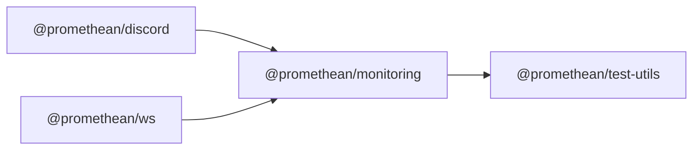

$$
<!-- SYMPKG:PKG:BEGIN -->
$$
# @promethean/monitoring
$$
**Folder:** `packages/monitoring`
$$
$$
**Version:** `0.0.1`
$$
$$
**Domain:** `_root`
$$

## Dependencies
- $@promethean/test-utils$$../test-utils/README.md$
## Dependents
- $@promethean/discord$$../discord/README.md$
- $@promethean/ws$$../ws/README.md$
$$
<!-- SYMPKG:PKG:END -->
$$