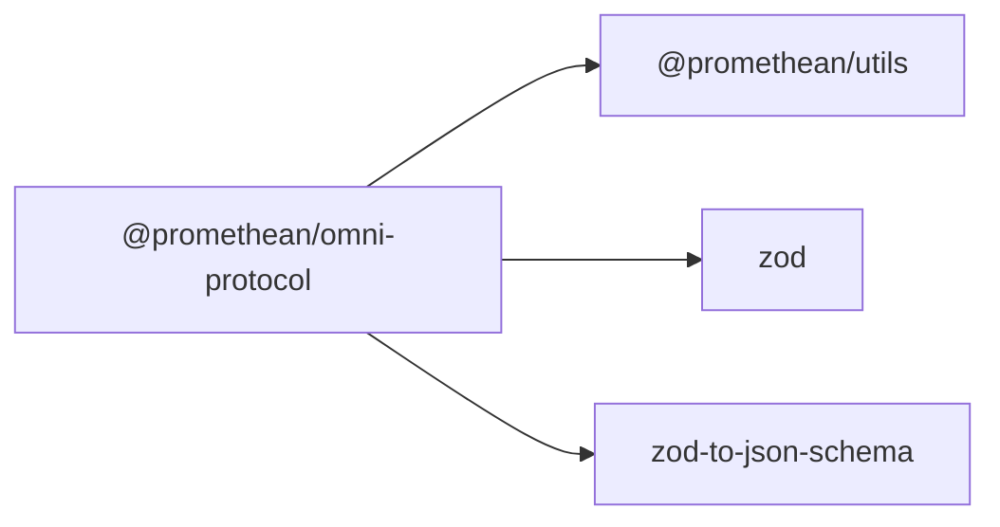

```
<!-- SYMPKG:PKG:BEGIN -->
```
# @promethean/omni-protocol
```
**Folder:** `packages/omni-protocol`
```
```
**Version:** `0.0.1`
```
```
**Domain:** `_root`
```


## Overview

The `@promethean/omni-protocol` package provides a unified protocol framework for communication within the Promethean ecosystem. It defines standardized message formats, validation schemas, and utilities that enable seamless integration between services, agents, and components.

## Key Features

- **Type-Safe Communication**: Full TypeScript support with comprehensive interfaces
- **Runtime Validation**: Zod-based validation for all message types
- **JSON Schema Support**: Generate JSON schemas for adapter integration
- **Streaming Support**: Built-in support for streaming data protocols
- **Error Handling**: Comprehensive error codes and handling patterns
- **Backward Compatibility**: Versioned protocol with migration support

## Installation

```bash
pnpm add @promethean/omni-protocol
```

## Quick Start

### Basic Message Creation and Validation

```typescript
import { OmniMessage, validateOmniMessage } from "@promethean/omni-protocol";

// Create a request message
const request: OmniMessage = {
  id: "req-123",
  type: "request",
  payload: {
    action: "getUser",
    params: { userId: "user-456" }
  },
  timestamp: new Date().toISOString(),
  source: "user-service"
};

// Validate the message
const validated = validateOmniMessage(request);
if (validated.success) {
  // Message is valid, proceed with processing
  console.log("Valid message:", validated.data);
} else {
  console.error("Invalid message:", validated.error);
}
```

### Response Handling

```typescript
import { OmniResponse } from "@promethean/omni-protocol";

const response: OmniResponse = {
  id: "resp-456",
  type: "response",
  payload: {
    success: true,
    data: { id: "user-456", name: "John Doe" }
  },
  timestamp: new Date().toISOString(),
  source: "user-service",
  correlationId: "req-123"
};
```

### Event Publishing

```typescript
import { OmniEvent } from "@promethean/omni-protocol";

const event: OmniEvent = {
  id: "evt-789",
  type: "event",
  payload: {
    event: "user.created",
    data: { userId: "user-456", timestamp: new Date().toISOString() }
  },
  timestamp: new Date().toISOString(),
  source: "user-service"
};
```

## API Reference

### Core Types

#### `OmniMessage`
Base interface for all protocol messages.

```typescript
interface OmniMessage {
  id: string;              // Unique identifier
  type: string;            // Message type
  payload: OmniPayload;    // Message payload
  headers?: OmniHeaders;   // Optional metadata
  timestamp: string;       // ISO timestamp
  source: string;          // Message source
  destination?: string;    // Optional destination
  correlationId?: string;  // Request/response correlation
}
```

#### `OmniRequest`
Request message type for RPC-style communication.

```typescript
interface OmniRequest extends OmniMessage {
  type: "request";
  payload: {
    action: string;                    // Action to invoke
    params?: Record<string, unknown>;  // Action parameters
  };
}
```

#### `OmniResponse`
Response message type for RPC replies.

```typescript
interface OmniResponse extends OmniMessage {
  type: "response";
  payload: {
    success: boolean;                 // Operation success
    data?: unknown;                   // Response data
    error?: {                         // Error details
      code: string;
      message: string;
      details?: Record<string, unknown>;
    };
  };
  correlationId: string;              // Required correlation ID
}
```

#### `OmniEvent`
Event message type for asynchronous notifications.

```typescript
interface OmniEvent extends OmniMessage {
  type: "event";
  payload: {
    event: string;        // Event name
    data?: unknown;       // Event data
  };
}
```

### Validation Functions

#### `validateOmniMessage(message: unknown): ValidationResult<OmniMessage>`
Validates any message against the Omni protocol schema.

```typescript
const result = validateOmniMessage(someData);
if (result.success) {
  // result.data is typed as OmniMessage
  console.log(result.data.id);
} else {
  // result.error contains validation details
  console.error(result.error);
}
```

#### `validateOmniRequest(message: unknown): ValidationResult<OmniRequest>`
Validates a message specifically as a request.

#### `validateOmniResponse(message: unknown): ValidationResult<OmniResponse>`
Validates a message specifically as a response.

#### `validateOmniEvent(message: unknown): ValidationResult<OmniEvent>`
Validates a message specifically as an event.

### Utility Functions

#### `createRequestId(): string`
Generates a unique request ID.

#### `createCorrelationId(): string`
Generates a unique correlation ID.

#### `isRequest(message: OmniMessage): message is OmniRequest`
Type guard for request messages.

#### `isResponse(message: OmniMessage): message is OmniResponse`
Type guard for response messages.

#### `isEvent(message: OmniMessage): message is OmniEvent`
Type guard for event messages.

### JSON Schema Generation

#### `getMessageJsonSchema(): object`
Returns the JSON schema for Omni messages.

#### `getRequestJsonSchema(): object`
Returns the JSON schema for request messages.

#### `getResponseJsonSchema(): object`
Returns the JSON schema for response messages.

#### `getEventJsonSchema(): object`
Returns the JSON schema for event messages.

## Error Codes

The Omni protocol defines standardized error codes for consistent error handling:

### Client Errors (4xx)

- `INVALID_REQUEST`: Malformed request message
- `MISSING_ACTION`: Request missing required action field
- `INVALID_PARAMS`: Invalid action parameters
- `UNAUTHORIZED`: Missing or invalid authentication
- `FORBIDDEN`: Insufficient permissions
- `NOT_FOUND`: Requested resource not found

### Server Errors (5xx)

- `INTERNAL_ERROR`: Unexpected server error
- `SERVICE_UNAVAILABLE`: Service temporarily unavailable
- `TIMEOUT`: Request processing timeout
- `VALIDATION_ERROR`: Server-side validation failed

### Protocol Errors

- `UNKNOWN_MESSAGE_TYPE`: Unrecognized message type
- `MALFORMED_MESSAGE`: Invalid message structure
- `VERSION_MISMATCH`: Protocol version incompatibility

## Streaming Support

For streaming data flows, the protocol supports chunked messages:

```typescript
import { OmniStreamChunk, validateOmniStreamChunk } from "@promethean/omni-protocol";

const chunk: OmniStreamChunk = {
  id: "stream-123",
  type: "stream-chunk",
  payload: {
    streamId: "stream-456",
    sequence: 1,
    data: "chunk data",
    isFinal: false
  },
  timestamp: new Date().toISOString(),
  source: "data-service"
};
```

## Security Considerations

### Message Authentication

Messages can include authentication headers:

```typescript
const authenticatedMessage: OmniMessage = {
  id: "msg-123",
  type: "request",
  payload: { /* ... */ },
  headers: {
    authorization: "Bearer token123",
    "x-request-signature": "signature123"
  },
  timestamp: new Date().toISOString(),
  source: "client"
};
```

### RBAC Support

The protocol supports role-based access control through headers:

```typescript
const rbacMessage: OmniMessage = {
  id: "msg-456",
  type: "request",
  payload: { /* ... */ },
  headers: {
    "x-user-role": "admin",
    "x-user-permissions": ["read", "write", "admin"]
  },
  timestamp: new Date().toISOString(),
  source: "admin-client"
};
```

## Implementation Examples

### Service Adapter

```typescript
import { OmniRequest, OmniResponse, validateOmniRequest } from "@promethean/omni-protocol";

class UserServiceAdapter {
  async handleRequest(rawMessage: unknown): Promise<OmniResponse> {
    // Validate incoming message
    const validated = validateOmniRequest(rawMessage);
    if (!validated.success) {
      return {
        id: generateId(),
        type: "response",
        payload: {
          success: false,
          error: {
            code: "INVALID_REQUEST",
            message: validated.error.message
          }
        },
        timestamp: new Date().toISOString(),
        source: "user-service",
        correlationId: validated.data?.correlationId || ""
      };
    }

    const request = validated.data;

    try {
      // Process the request
      const result = await this.processAction(
        request.payload.action,
        request.payload.params
      );

      return {
        id: generateId(),
        type: "response",
        payload: {
          success: true,
          data: result
        },
        timestamp: new Date().toISOString(),
        source: "user-service",
        correlationId: request.id
      };
    } catch (error) {
      return {
        id: generateId(),
        type: "response",
        payload: {
          success: false,
          error: {
            code: "INTERNAL_ERROR",
            message: error.message
          }
        },
        timestamp: new Date().toISOString(),
        source: "user-service",
        correlationId: request.id
      };
    }
  }

  private async processAction(action: string, params?: Record<string, unknown>) {
    // Implementation specific to your service
    switch (action) {
      case "getUser":
        return { id: params?.userId, name: "John Doe" };
      case "createUser":
        return { id: generateId(), ...params };
      default:
        throw new Error(`Unknown action: ${action}`);
    }
  }
}
```

### Event Publisher

```typescript
import { OmniEvent } from "@promethean/omni-protocol";

class EventPublisher {
  publishUserCreated(userId: string, userData: any): OmniEvent {
    return {
      id: generateId(),
      type: "event",
      payload: {
        event: "user.created",
        data: {
          userId,
          userData,
          timestamp: new Date().toISOString()
        }
      },
      timestamp: new Date().toISOString(),
      source: "user-service"
    };
  }

  publishUserUpdated(userId: string, changes: any): OmniEvent {
    return {
      id: generateId(),
      type: "event",
      payload: {
        event: "user.updated",
        data: {
          userId,
          changes,
          timestamp: new Date().toISOString()
        }
      },
      timestamp: new Date().toISOString(),
      source: "user-service"
    };
  }
}
```

## Migration from SmartGPT Bridge

If you're migrating from the legacy SmartGPT bridge, here's how to convert your message handling:

### Before (SmartGPT Bridge)

```typescript
interface SmartGPTMessage {
  id: string;
  type: string;
  data: any;
  timestamp: number;
}

function handleSmartGPTMessage(message: SmartGPTMessage) {
  // Legacy handling logic
}
```

### After (Omni Protocol)

```typescript
import { OmniMessage, validateOmniMessage } from "@promethean/omni-protocol";

function handleOmniMessage(rawMessage: unknown) {
  const validated = validateOmniMessage(rawMessage);
  if (!validated.success) {
    throw new Error(`Invalid message: ${validated.error.message}`);
  }

  const message = validated.data;

  // Convert legacy handling logic
  if (message.type === "request") {
    return handleRequest(message);
  } else if (message.type === "event") {
    return handleEvent(message);
  }
  // ... other message types
}
```

## Best Practices

### 1. Always Validate Messages
Never trust incoming messages. Always validate using the provided validation functions.

### 2. Use Correlation IDs
For request/response patterns, always include correlation IDs to track message flows.

### 3. Handle Errors Gracefully
Use standardized error codes and include helpful error messages.

### 4. Include Timestamps
Always include ISO timestamps for debugging and monitoring.

### 5. Secure Sensitive Data
Use authentication headers and encrypt sensitive payload data.

### 6. Version Your Payloads
Include version information in payloads when making breaking changes.

## Development

```bash
# Install dependencies
pnpm install

# Build the package
pnpm run build

# Run tests
pnpm run test

# Type checking
pnpm run typecheck

# Linting
pnpm run lint

# Generate documentation
pnpm run docs
```

## Contributing

1. Follow the existing code patterns and TypeScript conventions
2. Add comprehensive JSDoc comments for new APIs
3. Include unit tests for new functionality
4. Update documentation for any breaking changes
5. Ensure backward compatibility when possible

## License

This package is part of the Promethean project. See the main project LICENSE for details.