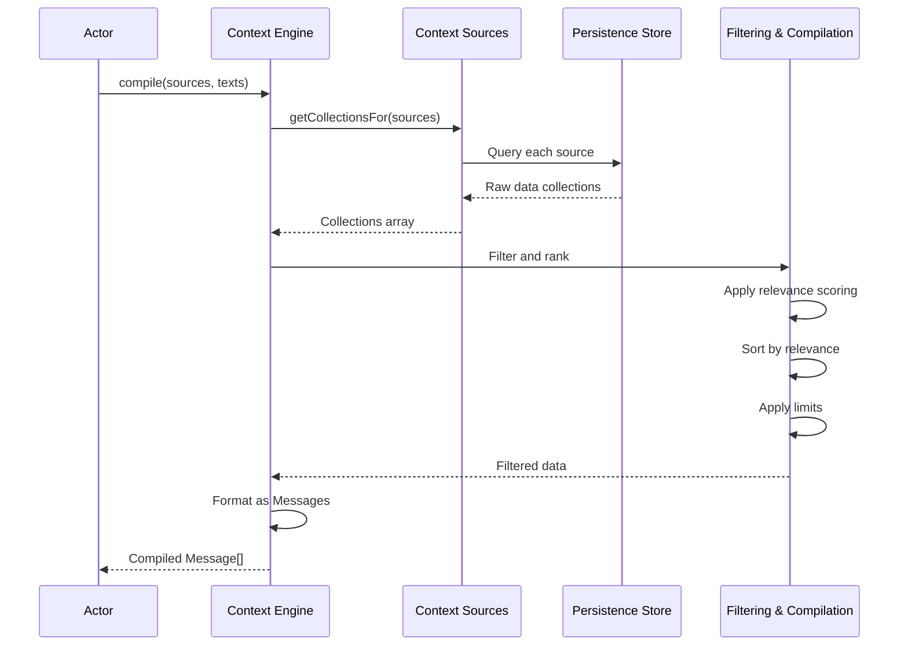

# Context Engine Guide

The Context Engine is a powerful component of the Pantheon Framework that provides dynamic semantic retrieval and compilation of context data. It enables actors to make informed decisions by aggregating and processing information from multiple sources.

## Overview

The Context Engine is responsible for:

- **Multi-Source Integration**: Aggregating data from various context sources
- **Semantic Filtering**: Intelligently filtering and ranking context based on relevance
- **Real-time Compilation**: On-demand assembly of context for actor consumption
- **Caching Optimization**: Efficient storage and retrieval of compiled contexts

## Core Concepts

### Context Sources

Context sources define where and how context data is retrieved:

```typescript
export type ContextSource = {
  id: string;
  label: string;
  where?: Record<string, unknown>;
  metadata?: Record<string, unknown>;
};
```

#### Types of Context Sources

1. **Session Data**: Chat history, user interactions
2. **Knowledge Base**: Documents, articles, reference materials
3. **Tool Results**: Outputs from previous tool executions
4. **External APIs**: Real-time data from external services
5. **File Systems**: Local or remote file content

#### Example Context Sources

```typescript
const contextSources = [
  {
    id: 'chat-sessions',
    label: 'Chat Sessions',
    where: { type: 'chat', status: 'active' },
    metadata: { priority: 'high', ttl: 3600000 },
  },
  {
    id: 'knowledge-base',
    label: 'Knowledge Base',
    where: { type: 'document', category: 'reference' },
    metadata: { priority: 'medium', ttl: 86400000 },
  },
  {
    id: 'tool-results',
    label: 'Tool Execution Results',
    where: { type: 'tool-result', status: 'completed' },
    metadata: { priority: 'low', ttl: 1800000 },
  },
];
```

### Context Compilation

The Context Engine compiles context from multiple sources into a unified format that actors can consume:

```typescript
export type ContextPort = {
  compile: (opts: {
    texts?: readonly string[];
    sources: readonly ContextSource[];
    recentLimit?: number;
    queryLimit?: number;
    limit?: number;
  }) => Promise<Message[]>;
};
```

#### Compilation Parameters

- `texts`: Optional array of text inputs to include in compilation
- `sources`: Array of context sources to query
- `recentLimit`: Maximum number of recent items to include
- `queryLimit`: Maximum number of query results per source
- `limit`: Overall limit on compiled context size

## Implementation Details

### Context Port Implementation

The framework provides a default implementation that integrates with the persistence system:

```typescript
import { makeContextPort } from '@promethean/pantheon-core';

const contextPort = makeContextPort({
  getCollectionsFor: async (sources) => {
    // Retrieve collections from persistence
    const collections = await Promise.all(
      sources.map((source) => persistenceStore.getCollection(source.id)),
    );
    return collections.filter(Boolean);
  },

  resolveRole: (meta) => {
    // Determine message role based on metadata
    if (meta?.role) return meta.role;
    if (meta?.type === 'user') return 'user';
    if (meta?.type === 'assistant') return 'assistant';
    return 'system';
  },

  resolveName: (meta) => {
    // Resolve display name from metadata
    return meta?.name || meta?.displayName || 'Unknown';
  },

  formatTime: (ms) => {
    // Format timestamp for display
    return new Date(ms).toLocaleString();
  },
});
```

### Context Compilation Process



## Advanced Features

### Semantic Filtering

The Context Engine implements intelligent filtering based on semantic relevance:

```typescript
// Semantic filtering implementation
const semanticFilter = (data: any[], query: string, limit: number) => {
  // Calculate relevance scores
  const scored = data.map((item) => ({
    ...item,
    score: calculateRelevanceScore(item, query),
  }));

  // Sort by relevance
  scored.sort((a, b) => b.score - a.score);

  // Apply limit
  return scored.slice(0, limit);
};

const calculateRelevanceScore = (item: any, query: string): number => {
  let score = 0;

  // Keyword matching
  const keywords = query.toLowerCase().split(' ');
  const content = (item.content || '').toLowerCase();

  keywords.forEach((keyword) => {
    if (content.includes(keyword)) {
      score += 10;
    }
  });

  // Recency boost
  if (item.timestamp) {
    const age = Date.now() - item.timestamp;
    const recencyBoost = Math.max(0, 1 - age / (7 * 24 * 60 * 60 * 1000)); // 7 days
    score += recencyBoost * 5;
  }

  // Priority boost
  if (item.metadata?.priority === 'high') score += 5;
  if (item.metadata?.priority === 'medium') score += 2;

  return score;
};
```

### Context Caching

To optimize performance, the Context Engine implements intelligent caching:

```typescript
interface ContextCache {
  get(key: string): Promise<Message[] | null>;
  set(key: string, value: Message[], ttl?: number): Promise<void>;
  invalidate(pattern?: string): Promise<void>;
}

class SmartContextCache implements ContextCache {
  private cache = new Map<string, { data: Message[]; expires: number }>();

  async get(key: string): Promise<Message[] | null> {
    const entry = this.cache.get(key);
    if (!entry) return null;

    if (Date.now() > entry.expires) {
      this.cache.delete(key);
      return null;
    }

    return entry.data;
  }

  async set(key: string, value: Message[], ttl: number = 300000): Promise<void> {
    const expires = Date.now() + ttl;
    this.cache.set(key, { data: value, expires });
  }

  async invalidate(pattern?: string): Promise<void> {
    if (!pattern) {
      this.cache.clear();
      return;
    }

    const regex = new RegExp(pattern);
    for (const [key] of this.cache) {
      if (regex.test(key)) {
        this.cache.delete(key);
      }
    }
  }
}
```

### Context Sharing

The Context Engine supports sharing context between sessions:

```typescript
export type ContextShare = {
  id: string;
  sourceSessionId: string;
  targetSessionId: string;
  contextIds: string[];
  permissions: ContextPermission[];
  expiresAt?: Date;
  createdAt: Date;
};

export type ContextPermission = {
  action: 'read' | 'write' | 'delete';
  resource: string;
  conditions?: Record<string, unknown>;
};
```

#### Sharing Context

```typescript
const shareContext = async (
  sourceSessionId: string,
  targetSessionId: string,
  contextIds: string[],
  permissions: ContextPermission[],
) => {
  const share: ContextShare = {
    id: `share-${Date.now()}-${Math.random().toString(36).substr(2, 9)}`,
    sourceSessionId,
    targetSessionId,
    contextIds,
    permissions,
    createdAt: new Date(),
    expiresAt: new Date(Date.now() + 24 * 60 * 60 * 1000), // 24 hours
  };

  await contextStore.saveShare(share);
  return share;
};
```

#### Accessing Shared Context

```typescript
const getSharedContext = async (sessionId: string) => {
  const shares = await contextStore.getSharesForSession(sessionId);
  const sharedContext: Message[] = [];

  for (const share of shares) {
    // Check permissions
    const hasReadPermission = share.permissions.some(
      (p) => p.action === 'read' && checkConditions(p.conditions),
    );

    if (hasReadPermission) {
      const context = await contextStore.getContexts(share.contextIds);
      sharedContext.push(...context);
    }
  }

  return sharedContext;
};
```

## Usage Patterns

### Basic Context Compilation

```typescript
import { makeContextPort } from '@promethean/pantheon-core';

const contextPort = makeContextPort({
  getCollectionsFor: async (sources) => {
    // Implementation for retrieving collections
    return await persistenceStore.getCollections(sources);
  },
  resolveRole: (meta) => meta?.role || 'system',
  resolveName: (meta) => meta?.name || 'Unknown',
  formatTime: (ms) => new Date(ms).toISOString(),
});

// Compile context for an actor
const context = await contextPort.compile({
  texts: ['What is the weather like today?'],
  sources: [
    { id: 'sessions', label: 'Chat Sessions' },
    { id: 'weather', label: 'Weather Data' },
  ],
  recentLimit: 10,
  queryLimit: 5,
  limit: 20,
});

console.log('Compiled context:', context);
```

### Context-Aware Actor

```typescript
const contextAwareBehavior = actorFactory.createBehavior(
  'context-aware-response',
  'active',
  async ({ goal, context }) => {
    // Analyze context for relevant information
    const recentMessages = context.filter(
      (msg) => msg.role === 'user' && Date.now() - new Date(msg.timestamp).getTime() < 3600000, // 1 hour
    );

    const hasWeatherContext = context.some((msg) => msg.content.toLowerCase().includes('weather'));

    let response = '';

    if (hasWeatherContext) {
      response = 'Based on the weather information I have...';
    } else if (recentMessages.length > 0) {
      response = 'Looking at our recent conversation...';
    } else {
      response = 'Let me help you with that.';
    }

    return {
      actions: [
        {
          type: 'message',
          content: `${response} Regarding ${goal}:`,
        },
      ],
    };
  },
);
```

### Dynamic Context Sources

```typescript
const dynamicContextBehavior = actorFactory.createBehavior(
  'dynamic-context',
  'active',
  async ({ goal, context }) => {
    // Extract keywords from goal
    const keywords = goal.toLowerCase().split(' ');

    // Dynamically select context sources based on keywords
    const dynamicSources = [];

    if (keywords.some((k) => ['weather', 'temperature', 'forecast'].includes(k))) {
      dynamicSources.push({ id: 'weather-api', label: 'Weather API' });
    }

    if (keywords.some((k) => ['news', 'article', 'information'].includes(k))) {
      dynamicSources.push({ id: 'news-feed', label: 'News Feed' });
    }

    if (keywords.some((k) => ['data', 'statistics', 'analytics'].includes(k))) {
      dynamicSources.push({ id: 'analytics', label: 'Analytics Data' });
    }

    // Compile additional context if needed
    if (dynamicSources.length > 0) {
      const additionalContext = await contextPort.compile({
        sources: dynamicSources,
        limit: 10,
      });

      // Merge with existing context
      context.push(...additionalContext);
    }

    return {
      actions: [
        {
          type: 'message',
          content: `I've gathered relevant information about: ${goal}`,
        },
      ],
    };
  },
);
```

## Performance Optimization

### Efficient Context Retrieval

```typescript
// Optimized context compilation with batching
const optimizedContextPort = makeContextPort({
  getCollectionsFor: async (sources) => {
    // Batch requests to persistence layer
    const batchResults = await persistenceStore.batchGet(
      sources.map((s) => ({ id: s.id, query: s.where })),
    );

    return batchResults.filter(Boolean);
  },
  // ... other dependencies
});
```

### Context Preloading

```typescript
class ContextPreloader {
  private preloadedContexts = new Map<string, Message[]>();

  async preload(sessionId: string, sources: ContextSource[]) {
    const key = `preload-${sessionId}`;
    const context = await contextPort.compile({
      sources,
      limit: 50,
    });

    this.preloadedContexts.set(key, context);
  }

  getPreloaded(sessionId: string): Message[] | null {
    const key = `preload-${sessionId}`;
    return this.preloadedContexts.get(key) || null;
  }
}
```

### Context Streaming

```typescript
const streamingContextPort = {
  async *compileStream(opts: { sources: ContextSource[]; limit?: number }) {
    for (const source of opts.sources) {
      const collection = await persistenceStore.getCollection(source.id);

      for (const item of collection) {
        if (opts.limit && this.yieldedCount >= opts.limit) break;

        const message = this.formatItemAsMessage(item);
        yield message;
        this.yieldedCount++;
      }
    }
  },
};
```

## Testing Context Engine

### Unit Testing Context Compilation

```typescript
import test from 'ava';
import { makeContextPort } from '@promethean/pantheon-core';

test('context compilation with multiple sources', async (t) => {
  const mockCollections = {
    sessions: [{ content: 'Hello world', role: 'user', timestamp: Date.now() }],
    knowledge: [{ content: 'Knowledge base entry', role: 'system', timestamp: Date.now() }],
  };

  const contextPort = makeContextPort({
    getCollectionsFor: async (sources) => {
      return sources.map((source) => mockCollections[source.id] || []);
    },
    resolveRole: (meta) => meta.role || 'system',
    resolveName: (meta) => 'Test',
    formatTime: (ms) => new Date(ms).toISOString(),
  });

  const result = await contextPort.compile({
    sources: [
      { id: 'sessions', label: 'Sessions' },
      { id: 'knowledge', label: 'Knowledge' },
    ],
    limit: 10,
  });

  t.is(result.length, 2);
  t.true(result.some((msg) => msg.content === 'Hello world'));
  t.true(result.some((msg) => msg.content === 'Knowledge base entry'));
});
```

### Integration Testing with Actors

```typescript
test('actor uses context effectively', async (t) => {
  const actorFactory = makeActorFactory();
  const orchestrator = makeOrchestrator({
    context: mockContextPort,
    // ... other dependencies
  });

  const contextAwareBehavior = actorFactory.createBehavior(
    'test',
    'active',
    async ({ goal, context }) => {
      const hasRelevantContext = context.some((msg) => msg.content.includes('relevant'));

      return {
        actions: [
          {
            type: 'message',
            content: hasRelevantContext ? 'Found relevant context!' : 'No relevant context found.',
          },
        ],
      };
    },
  );

  const talent = actorFactory.createTalent('test', [contextAwareBehavior]);
  const script = { name: 'test', contextSources: [], talents: [talent] };
  const actor = actorFactory.createActor(script, ['test goal']);

  const messages: any[] = [];
  mockDeps.bus.send = async (msg) => messages.push(msg);

  await orchestrator.tickActor(actor, {
    userMessage: 'test with relevant context',
  });

  t.is(messages[0].content, 'Found relevant context!');
});
```

## Troubleshooting

### Common Issues

#### 1. Empty Context Results

**Problem**: Context compilation returns empty results
**Solution**:

- Verify context sources are properly configured
- Check persistence store connectivity
- Ensure query conditions are correct

#### 2. Performance Issues

**Problem**: Context compilation is slow
**Solution**:

- Implement caching strategies
- Optimize database queries
- Use context streaming for large datasets

#### 3. Memory Usage

**Problem**: High memory usage with large contexts
**Solution**:

- Implement context size limits
- Use pagination for large datasets
- Implement context expiration policies

### Debugging Tools

```typescript
// Context debugging utility
const debugContextCompilation = async (sources: ContextSource[]) => {
  console.log('Debugging context compilation...');

  for (const source of sources) {
    console.log(`\nSource: ${source.id} (${source.label})`);

    try {
      const collection = await persistenceStore.getCollection(source.id);
      console.log(`Collection size: ${collection.length}`);

      if (collection.length > 0) {
        console.log('Sample items:');
        collection.slice(0, 3).forEach((item, i) => {
          console.log(`  ${i + 1}. ${JSON.stringify(item, null, 2)}`);
        });
      }
    } catch (error) {
      console.error(`Error fetching collection: ${error}`);
    }
  }
};
```

The Context Engine is a powerful component that enables actors to make intelligent, context-aware decisions. By leveraging multi-source integration, semantic filtering, and intelligent caching, it provides a robust foundation for building sophisticated AI agents.
