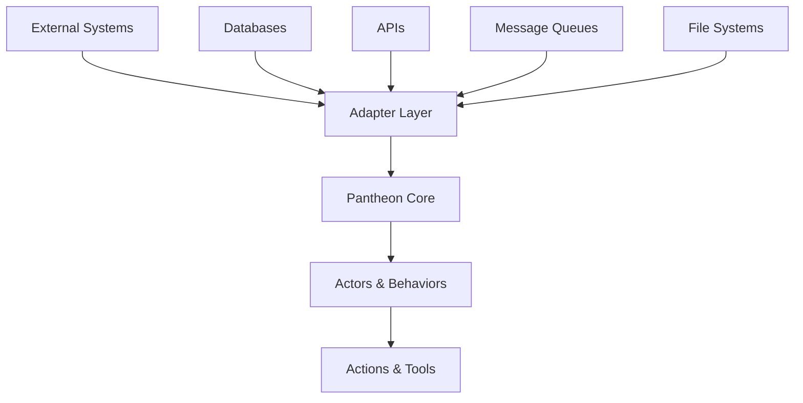

# Integration Guide

## Overview

This guide provides comprehensive information for integrating the Pantheon Framework with existing systems, databases, external APIs, and other services. It covers adapter implementations, data synchronization, authentication, and deployment strategies.

## Integration Architecture

### Integration Patterns

The Pantheon Framework supports several integration patterns:



### Key Integration Points

1. **Context Sources**: External data sources for actor context
2. **Tools**: External services and APIs
3. **Message Bus**: Integration with messaging systems
4. **Actor State**: Persistence and synchronization
5. **LLM Integration**: Multiple AI model providers

## Database Integration

### 1. MongoDB Integration

#### Actor State Adapter

```typescript
import { MongoClient, Db, Collection } from 'mongodb';
import type { ActorStatePort, Actor, ActorScript } from '@promethean-os/pantheon-core';

export class MongoActorStateAdapter implements ActorStatePort {
  private client: MongoClient;
  private db: Db;
  private collection: Collection<Actor>;

  constructor(connectionString: string, dbName: string = 'pantheon') {
    this.client = new MongoClient(connectionString);
    this.db = this.client.db(dbName);
    this.collection = this.db.collection('actors');
  }

  async connect(): Promise<void> {
    await this.client.connect();
    // Create indexes for better performance
    await this.collection.createIndex({ id: 1 }, { unique: true });
    await this.collection.createIndex({ 'script.name': 1 });
    await this.collection.createIndex({ metadata: 1 });
  }

  async disconnect(): Promise<void> {
    await this.client.close();
  }

  async spawn(script: ActorScript, goal: string): Promise<Actor> {
    const actor: Actor = {
      id: this.generateActorId(),
      script,
      goals: [goal],
      metadata: {
        createdAt: new Date(),
        updatedAt: new Date(),
        status: 'active',
      },
    };

    await this.collection.insertOne(actor);
    return actor;
  }

  async list(): Promise<Actor[]> {
    return await this.collection.find({}).toArray();
  }

  async get(id: string): Promise<Actor | null> {
    return await this.collection.findOne({ id });
  }

  async update(id: string, updates: Partial<Actor>): Promise<Actor> {
    const result = await this.collection.findOneAndUpdate(
      { id },
      {
        $set: {
          ...updates,
          'metadata.updatedAt': new Date(),
        },
      },
      { returnDocument: 'after' },
    );

    if (!result.value) {
      throw new Error(`Actor not found: ${id}`);
    }

    return result.value;
  }

  async delete(id: string): Promise<boolean> {
    const result = await this.collection.deleteOne({ id });
    return result.deletedCount > 0;
  }

  private generateActorId(): string {
    return `actor-${Date.now()}-${Math.random().toString(36).substr(2, 9)}`;
  }
}
```

#### Context Source Integration

```typescript
import type { ContextPort, ContextSource, Message } from '@promethean-os/pantheon-core';

export class MongoContextAdapter implements ContextPort {
  private client: MongoClient;
  private db: Db;
  private collection: Collection;

  constructor(connectionString: string, dbName: string = 'pantheon') {
    this.client = new MongoClient(connectionString);
    this.db = this.client.db(dbName);
    this.collection = this.db.collection('context');
  }

  async connect(): Promise<void> {
    await this.client.connect();
    // Create text index for search
    await this.collection.createIndex({ content: 'text', metadata: 1 });
  }

  async compile(opts: {
    texts?: readonly string[];
    sources: readonly ContextSource[];
    recentLimit?: number;
    queryLimit?: number;
    limit?: number;
  }): Promise<Message[]> {
    const messages: Message[] = [];

    // Add text inputs
    if (opts.texts) {
      messages.push(
        ...opts.texts.map((text) => ({
          role: 'user' as const,
          content: text,
        })),
      );
    }

    // Query MongoDB for relevant context
    for (const source of opts.sources) {
      const contextMessages = await this.queryContext(source, opts);
      messages.push(...contextMessages);
    }

    // Apply limits
    return this.applyLimits(messages, opts);
  }

  private async queryContext(source: ContextSource, opts: any): Promise<Message[]> {
    try {
      const query = this.buildQuery(source);
      const results = await this.collection
        .find(query)
        .sort({ score: { $meta: 'textScore' } })
        .limit(opts.queryLimit || 10)
        .toArray();

      return results.map((doc) => ({
        role: 'system' as const,
        content: doc.content,
        metadata: {
          source: 'mongodb',
          score: doc.score,
          category: doc.metadata?.category,
        },
      }));
    } catch (error) {
      console.error('MongoDB context query error:', error);
      return [];
    }
  }

  private buildQuery(source: ContextSource): any {
    const baseQuery = {
      'metadata.category': source.metadata?.category || 'default',
    };

    if (source.type === 'text' && source.content) {
      return {
        ...baseQuery,
        $text: { $search: source.content },
      };
    }

    return baseQuery;
  }

  private applyLimits(messages: Message[], opts: any): Message[] {
    let result = messages;

    if (opts.recentLimit) {
      result = result.slice(-opts.recentLimit);
    }

    if (opts.limit) {
      result = result.slice(0, opts.limit);
    }

    return result;
  }
}
```

### 2. PostgreSQL Integration

#### Actor State Adapter

```typescript
import { Pool, PoolClient } from 'pg';
import type { ActorStatePort, Actor, ActorScript } from '@promethean-os/pantheon-core';

export class PostgresActorStateAdapter implements ActorStatePort {
  private pool: Pool;

  constructor(config: {
    host: string;
    port: number;
    database: string;
    user: string;
    password: string;
  }) {
    this.pool = new Pool(config);
  }

  async initialize(): Promise<void> {
    const client = await this.pool.connect();
    try {
      // Create table if not exists
      await client.query(`
        CREATE TABLE IF NOT EXISTS actors (
          id VARCHAR(255) PRIMARY KEY,
          script JSONB NOT NULL,
          goals TEXT[] NOT NULL,
          metadata JSONB DEFAULT '{}',
          created_at TIMESTAMP DEFAULT CURRENT_TIMESTAMP,
          updated_at TIMESTAMP DEFAULT CURRENT_TIMESTAMP
        );
      `);

      // Create indexes
      await client.query(`
        CREATE INDEX IF NOT EXISTS idx_actors_script_name 
        ON actors ((script->>'name'));
      `);

      await client.query(`
        CREATE INDEX IF NOT EXISTS idx_actors_metadata 
        ON actors USING GIN(metadata);
      `);
    } finally {
      client.release();
    }
  }

  async spawn(script: ActorScript, goal: string): Promise<Actor> {
    const client = await this.pool.connect();
    try {
      const actor: Actor = {
        id: this.generateActorId(),
        script,
        goals: [goal],
        metadata: {
          createdAt: new Date(),
          updatedAt: new Date(),
          status: 'active',
        },
      };

      const result = await client.query(
        `INSERT INTO actors (id, script, goals, metadata) 
         VALUES ($1, $2, $3, $4) 
         RETURNING *`,
        [actor.id, actor.script as any, actor.goals, actor.metadata],
      );

      return this.mapRowToActor(result.rows[0]);
    } finally {
      client.release();
    }
  }

  async list(): Promise<Actor[]> {
    const client = await this.pool.connect();
    try {
      const result = await client.query('SELECT * FROM actors ORDER BY created_at');
      return result.rows.map(this.mapRowToActor);
    } finally {
      client.release();
    }
  }

  async get(id: string): Promise<Actor | null> {
    const client = await this.pool.connect();
    try {
      const result = await client.query('SELECT * FROM actors WHERE id = $1', [id]);
      return result.rows.length > 0 ? this.mapRowToActor(result.rows[0]) : null;
    } finally {
      client.release();
    }
  }

  async update(id: string, updates: Partial<Actor>): Promise<Actor> {
    const client = await this.pool.connect();
    try {
      const result = await client.query(
        `UPDATE actors 
         SET script = COALESCE($1, script),
             goals = COALESCE($2, goals),
             metadata = jsonb_set(
               COALESCE($3, metadata), 
               '{updatedAt}', 
               to_jsonb(now())
             )
         WHERE id = $4 
         RETURNING *`,
        [updates.script, updates.goals, updates.metadata, id],
      );

      if (result.rows.length === 0) {
        throw new Error(`Actor not found: ${id}`);
      }

      return this.mapRowToActor(result.rows[0]);
    } finally {
      client.release();
    }
  }

  private mapRowToActor(row: any): Actor {
    return {
      id: row.id,
      script: row.script,
      goals: row.goals,
      metadata: row.metadata,
    };
  }

  private generateActorId(): string {
    return `actor-${Date.now()}-${Math.random().toString(36).substr(2, 9)}`;
  }
}
```

## External API Integration

### 1. REST API Integration

#### Tool Adapter for External APIs

```typescript
import axios, { AxiosInstance } from 'axios';
import type { ToolPort, ToolSpec } from '@promethean-os/pantheon-core';

export class RestApiToolAdapter implements ToolPort {
  private axiosInstance: AxiosInstance;
  private tools = new Map<string, ToolSpec>();

  constructor(baseURL: string, apiKey?: string) {
    this.axiosInstance = axios.create({
      baseURL,
      timeout: 30000,
      headers: {
        'Content-Type': 'application/json',
        ...(apiKey && { Authorization: `Bearer ${apiKey}` }),
      },
    });
  }

  register(tool: ToolSpec): void {
    this.tools.set(tool.name, tool);
  }

  async invoke(name: string, args: Record<string, unknown>): Promise<unknown> {
    const tool = this.tools.get(name);
    if (!tool) {
      throw new Error(`Tool not found: ${name}`);
    }

    // Validate arguments
    this.validateArgs(tool, args);

    try {
      // Execute API call
      const response = await this.executeApiCall(tool, args);

      // Transform response
      return this.transformResponse(response, tool);
    } catch (error) {
      if (axios.isAxiosError(error)) {
        throw new Error(`API call failed: ${error.response?.data?.message || error.message}`);
      }
      throw error;
    }
  }

  private validateArgs(tool: ToolSpec, args: Record<string, unknown>): void {
    const requiredParams = tool.parameters.required || [];
    const missingParams = requiredParams.filter((param) => !(param in args));

    if (missingParams.length > 0) {
      throw new Error(`Missing required parameters: ${missingParams.join(', ')}`);
    }
  }

  private async executeApiCall(tool: ToolSpec, args: Record<string, unknown>): Promise<any> {
    const config = this.getApiConfig(tool, args);

    switch (config.method) {
      case 'GET':
        return await this.axiosInstance.get(config.url, { params: config.params });
      case 'POST':
        return await this.axiosInstance.post(config.url, config.data);
      case 'PUT':
        return await this.axiosInstance.put(config.url, config.data);
      case 'DELETE':
        return await this.axiosInstance.delete(config.url, { params: config.params });
      default:
        throw new Error(`Unsupported HTTP method: ${config.method}`);
    }
  }

  private getApiConfig(
    tool: ToolSpec,
    args: Record<string, unknown>,
  ): {
    method: string;
    url: string;
    params?: Record<string, unknown>;
    data?: Record<string, unknown>;
  } {
    // Extract API configuration from tool metadata
    const apiConfig = (tool as any).apiConfig || {
      method: 'POST',
      path: `/${tool.name}`,
    };

    const url = apiConfig.path.startsWith('/') ? apiConfig.path : `/${apiConfig.path}`;

    if (apiConfig.method === 'GET' || apiConfig.method === 'DELETE') {
      return {
        method: apiConfig.method,
        url,
        params: args,
      };
    } else {
      return {
        method: apiConfig.method,
        url,
        data: args,
      };
    }
  }

  private transformResponse(response: any, tool: ToolSpec): unknown {
    // Apply response transformation if configured
    const transform = (tool as any).responseTransform;
    if (transform) {
      return transform(response.data);
    }

    return response.data;
  }
}

// Example usage with weather API
const weatherTool: ToolSpec = {
  name: 'get-weather',
  description: 'Gets current weather information for a location',
  parameters: {
    type: 'object',
    properties: {
      location: {
        type: 'string',
        description: 'The location to get weather for',
      },
      units: {
        type: 'string',
        enum: ['metric', 'imperial'],
        default: 'metric',
        description: 'Temperature units',
      },
    },
    required: ['location'],
  },
  apiConfig: {
    method: 'GET',
    path: '/current.json',
  },
  responseTransform: (data: any) => {
    return {
      location: data.location.name,
      temperature: data.current.temp_c,
      condition: data.current.condition.text,
      humidity: data.current.humidity,
      wind: data.current.wind_kph,
    };
  },
  execute: async (args) => {
    // This will be handled by the adapter
    throw new Error('Should not be called directly');
  },
};

// Register with adapter
const apiAdapter = new RestApiToolAdapter(
  'https://api.weatherapi.com/v1',
  process.env.WEATHER_API_KEY,
);
apiAdapter.register(weatherTool);
```

### 2. GraphQL Integration

```typescript
import { GraphQLClient, gql } from 'graphql-request';
import type { ToolPort, ToolSpec } from '@promethean-os/pantheon-core';

export class GraphQLToolAdapter implements ToolPort {
  private client: GraphQLClient;
  private tools = new Map<string, ToolSpec>();

  constructor(endpoint: string, apiKey?: string) {
    const headers: Record<string, string> = {
      'Content-Type': 'application/json',
    };

    if (apiKey) {
      headers['Authorization'] = `Bearer ${apiKey}`;
    }

    this.client = new GraphQLClient(endpoint, { headers });
  }

  register(tool: ToolSpec): void {
    this.tools.set(tool.name, tool);
  }

  async invoke(name: string, args: Record<string, unknown>): Promise<unknown> {
    const tool = this.tools.get(name);
    if (!tool) {
      throw new Error(`Tool not found: ${name}`);
    }

    const query = this.getGraphQLQuery(tool);
    const variables = this.transformVariables(args, tool);

    try {
      const result = await this.client.request(query, variables);
      return this.transformResponse(result, tool);
    } catch (error) {
      throw new Error(`GraphQL request failed: ${error.message}`);
    }
  }

  private getGraphQLQuery(tool: ToolSpec): string {
    const graphqlConfig = (tool as any).graphqlConfig;
    if (!graphqlConfig) {
      throw new Error(`GraphQL configuration missing for tool: ${tool.name}`);
    }

    return graphqlConfig.query;
  }

  private transformVariables(
    args: Record<string, unknown>,
    tool: ToolSpec,
  ): Record<string, unknown> {
    const transform = (tool as any).variableTransform;
    if (transform) {
      return transform(args);
    }

    return args;
  }

  private transformResponse(response: any, tool: ToolSpec): unknown {
    const transform = (tool as any).responseTransform;
    if (transform) {
      return transform(response);
    }

    return response;
  }
}

// Example usage with GitHub GraphQL API
const githubRepoTool: ToolSpec = {
  name: 'get-repository-info',
  description: 'Gets information about a GitHub repository',
  parameters: {
    type: 'object',
    properties: {
      owner: {
        type: 'string',
        description: 'Repository owner',
      },
      name: {
        type: 'string',
        description: 'Repository name',
      },
    },
    required: ['owner', 'name'],
  },
  graphqlConfig: {
    query: gql`
      query GetRepository($owner: String!, $name: String!) {
        repository(owner: $owner, name: $name) {
          name
          description
          stargazerCount
          forkCount
          primaryLanguage {
            name
          }
          updatedAt
        }
      }
    `,
  },
  responseTransform: (data: any) => {
    return {
      name: data.repository.name,
      description: data.repository.description,
      stars: data.repository.stargazerCount,
      forks: data.repository.forkCount,
      language: data.repository.primaryLanguage?.name,
      lastUpdated: data.repository.updatedAt,
    };
  },
  execute: async (args) => {
    // Handled by adapter
    throw new Error('Should not be called directly');
  },
};

// Register with adapter
const graphqlAdapter = new GraphQLToolAdapter(
  'https://api.github.com/graphql',
  process.env.GITHUB_TOKEN,
);
graphqlAdapter.register(githubRepoTool);
```

## Message Queue Integration

### 1. Redis Message Bus

```typescript
import { createClient } from 'redis';
import type { MessageBus } from '@promethean-os/pantheon-core';

export class RedisMessageBus implements MessageBus {
  private client: any;
  private subscribers = new Map<string, Set<(msg: any) => void>>();
  private pubClient: any;
  private subClient: any;

  constructor(config: { host: string; port: number; password?: string; db?: number }) {
    this.pubClient = createClient(config);
    this.subClient = createClient(config);
  }

  async connect(): Promise<void> {
    await this.pubClient.connect();
    await this.subClient.connect();

    // Set up message handling
    this.subClient.on('message', (channel: string, message: string) => {
      const handlers = this.subscribers.get(channel);
      if (handlers) {
        const msg = JSON.parse(message);
        handlers.forEach((handler) => {
          try {
            handler(msg);
          } catch (error) {
            console.error('Message handler error:', error);
          }
        });
      }
    });
  }

  async disconnect(): Promise<void> {
    await this.pubClient.disconnect();
    await this.subClient.disconnect();
  }

  async send(msg: { from: string; to: string; content: string }): Promise<void> {
    const channel = `pantheon:${msg.to}`;
    const message = JSON.stringify(msg);

    await this.pubClient.publish(channel, message);

    // Also store in Redis for persistence
    await this.pubClient.lpush(`pantheon:messages:${msg.to}`, message);
    await this.pubClient.expire(`pantheon:messages:${msg.to}`, 86400); // 24 hours
  }

  subscribe(handler: (msg: { from: string; to: string; content: string }) => void): () => void {
    const channel = `pantheon:*`;

    if (!this.subscribers.has(channel)) {
      this.subscribers.set(channel, new Set());
      this.subClient.pSubscribe(channel);
    }

    const handlers = this.subscribers.get(channel)!;
    handlers.add(handler);

    // Return unsubscribe function
    return () => {
      handlers.delete(handler);
      if (handlers.size === 0) {
        this.subscribers.delete(channel);
        this.subClient.pUnsubscribe(channel);
      }
    };
  }

  async getMessages(
    target: string,
    limit: number = 10,
  ): Promise<Array<{ from: string; to: string; content: string }>> {
    const messages = await this.pubClient.lrange(`pantheon:messages:${target}`, 0, limit - 1);
    return messages.map((msg) => JSON.parse(msg));
  }
}
```

### 2. RabbitMQ Message Bus

```typescript
import * as amqp from 'amqplib';
import type { MessageBus } from '@promethean-os/pantheon-core';

export class RabbitMQMessageBus implements MessageBus {
  private connection: amqp.Connection | null = null;
  private channel: amqp.Channel | null = null;
  private subscribers = new Map<string, Set<(msg: any) => void>>();

  constructor(
    private config: {
      hostname: string;
      port: number;
      username: string;
      password: string;
      vhost?: string;
    },
  ) {}

  async connect(): Promise<void> {
    this.connection = await amqp.connect(this.config);
    this.channel = await this.connection.createChannel();

    // Set up message handling
    this.channel.on('message', (msg: amqp.Message) => {
      const content = msg.content.toString();
      const routingKey = msg.fields.routingKey;

      const handlers = this.subscribers.get(routingKey);
      if (handlers) {
        const message = JSON.parse(content);
        handlers.forEach((handler) => {
          try {
            handler(message);
          } catch (error) {
            console.error('Message handler error:', error);
          }
        });
      }

      msg.ack();
    });
  }

  async disconnect(): Promise<void> {
    if (this.channel) {
      await this.channel.close();
    }
    if (this.connection) {
      await this.connection.close();
    }
  }

  async send(msg: { from: string; to: string; content: string }): Promise<void> {
    if (!this.channel) {
      throw new Error('Not connected to RabbitMQ');
    }

    const exchange = 'pantheon';
    const routingKey = msg.to;
    const message = JSON.stringify(msg);

    await this.channel.assertExchange(exchange, 'topic', { durable: true });
    this.channel.publish(exchange, routingKey, Buffer.from(message));
  }

  subscribe(handler: (msg: { from: string; to: string; content: string }) => void): () => void {
    const exchange = 'pantheon';
    const queueName = `pantheon-${Date.now()}`;
    const pattern = 'pantheon.*';

    if (!this.channel) {
      throw new Error('Not connected to RabbitMQ');
    }

    // Set up queue and binding
    this.channel.assertExchange(exchange, 'topic', { durable: true });
    this.channel.assertQueue(queueName, { exclusive: true });
    this.channel.bindQueue(queueName, exchange, pattern);
    this.channel.consume(queueName, this.channel.emit.bind(this.channel, 'message'));

    // Store handler
    if (!this.subscribers.has(pattern)) {
      this.subscribers.set(pattern, new Set());
    }
    const handlers = this.subscribers.get(pattern)!;
    handlers.add(handler);

    // Return unsubscribe function
    return () => {
      handlers.delete(handler);
      if (handlers.size === 0) {
        this.subscribers.delete(pattern);
        if (this.channel) {
          this.channel.cancel(queueName);
          this.channel.unbindQueue(queueName, exchange, pattern);
          this.channel.deleteQueue(queueName);
        }
      }
    };
  }
}
```

## Authentication and Security

### 1. JWT Authentication

```typescript
import jwt from 'jsonwebtoken';
import type { ToolPort, ToolSpec } from '@promethean-os/pantheon-core';

export class AuthenticatedToolAdapter implements ToolPort {
  private delegate: ToolPort;
  private jwtSecret: string;
  private userContext = new Map<string, any>();

  constructor(delegate: ToolPort, jwtSecret: string) {
    this.delegate = delegate;
    this.jwtSecret = jwtSecret;
  }

  register(tool: ToolSpec): void {
    this.delegate.register(tool);
  }

  async invoke(name: string, args: Record<string, unknown>): Promise<unknown> {
    // Extract JWT from arguments
    const token = (args as any).token;
    if (!token) {
      throw new Error('Authentication token required');
    }

    // Verify token
    const decoded = jwt.verify(token, this.jwtSecret) as any;
    const userId = decoded.sub;

    // Get user context
    const userContext = this.userContext.get(userId) || {};

    // Add user context to arguments
    const authenticatedArgs = {
      ...args,
      userId,
      userContext,
    };

    // Remove token from arguments
    delete (authenticatedArgs as any).token;

    return this.delegate.invoke(name, authenticatedArgs);
  }

  setUserContext(userId: string, context: any): void {
    this.userContext.set(userId, context);
  }

  clearUserContext(userId: string): void {
    this.userContext.delete(userId);
  }
}

// Usage
const toolAdapter = new AuthenticatedToolAdapter(baseToolAdapter, process.env.JWT_SECRET!);

// Actor would need to include JWT in tool calls
const authenticatedBehavior: Behavior = {
  name: 'authenticated-action',
  description: 'Performs authenticated actions',
  mode: 'active',
  plan: async ({ goal, context }) => {
    // Get JWT from context (would be provided by user)
    const jwtToken = context.find((msg) => msg.metadata?.jwt)?.metadata?.jwt;

    return {
      actions: [
        {
          type: 'tool',
          name: 'secure-api',
          args: {
            data: 'sensitive data',
            token: jwtToken,
          },
        },
      ],
    };
  },
};
```

### 2. API Key Management

```typescript
export class ApiKeyToolAdapter implements ToolPort {
  private delegate: ToolPort;
  private apiKeys = new Map<string, string>();
  private keyPermissions = new Map<string, Set<string>>();

  constructor(delegate: ToolPort) {
    this.delegate = delegate;
  }

  register(tool: ToolSpec): void {
    this.delegate.register(tool);
  }

  async invoke(name: string, args: Record<string, unknown>): Promise<unknown> {
    // Extract API key from arguments
    const apiKey = (args as any).apiKey;
    if (!apiKey) {
      throw new Error('API key required');
    }

    // Validate API key
    if (!this.apiKeys.has(apiKey)) {
      throw new Error('Invalid API key');
    }

    // Check permissions
    const permissions = this.keyPermissions.get(apiKey) || new Set();
    if (!permissions.has(name)) {
      throw new Error(`API key does not have permission for tool: ${name}`);
    }

    // Remove API key from arguments
    const cleanArgs = { ...args };
    delete (cleanArgs as any).apiKey;

    return this.delegate.invoke(name, cleanArgs);
  }

  addApiKey(key: string, permissions: string[]): void {
    this.apiKeys.set(key, key);
    this.keyPermissions.set(key, new Set(permissions));
  }

  removeApiKey(key: string): void {
    this.apiKeys.delete(key);
    this.keyPermissions.delete(key);
  }

  getApiKeyPermissions(key: string): string[] {
    return Array.from(this.keyPermissions.get(key) || []);
  }
}

// Usage
const apiKeyAdapter = new ApiKeyToolAdapter(baseToolAdapter);

// Add API keys with permissions
apiKeyAdapter.addApiKey('key1', ['get-weather', 'get-repository-info']);
apiKeyAdapter.addApiKey('key2', ['get-weather']);

// Actor would include API key in tool calls
const apiKeyBehavior: Behavior = {
  name: 'api-key-action',
  description: 'Performs actions with API key',
  mode: 'active',
  plan: async ({ goal, context }) => {
    // Get API key from context
    const apiKey = context.find((msg) => msg.metadata?.apiKey)?.metadata?.apiKey;

    return {
      actions: [
        {
          type: 'tool',
          name: 'get-weather',
          args: {
            location: 'New York',
            apiKey: apiKey,
          },
        },
      ],
    };
  },
};
```

## Monitoring and Observability

### 1. Prometheus Integration

```typescript
import { Counter, Histogram, Gauge, Registry } from 'prom-client';
import type { OrchestratorDeps } from '@promethean-os/pantheon-core';

export class MonitoringOrchestratorDeps implements OrchestratorDeps {
  private delegate: OrchestratorDeps;
  private registry: Registry;
  private metrics = {
    actorTicks: new Counter({
      name: 'pantheon_actor_ticks_total',
      help: 'Total number of actor ticks',
      labelNames: ['actor_name', 'status'],
    }),
    actionExecution: new Histogram({
      name: 'pantheon_action_execution_duration_seconds',
      help: 'Duration of action execution',
      labelNames: ['action_type', 'status'],
      buckets: [0.1, 0.5, 1, 2, 5, 10],
    }),
    activeActors: new Gauge({
      name: 'pantheon_active_actors',
      help: 'Number of currently active actors',
    }),
    contextCompilation: new Histogram({
      name: 'pantheon_context_compilation_duration_seconds',
      help: 'Duration of context compilation',
      labelNames: ['adapter_type'],
      buckets: [0.01, 0.05, 0.1, 0.5, 1, 2],
    }),
  };

  constructor(delegate: OrchestratorDeps, registry: Registry = new Registry()) {
    this.delegate = delegate;
    this.registry = registry;

    // Register metrics
    Object.values(this.metrics).forEach((metric) => {
      this.registry.registerMetric(metric);
    });
  }

  get now() {
    return this.delegate.now;
  }

  log(msg: string, meta?: unknown): void {
    this.delegate.log(msg, meta);
  }

  get context() {
    return new MonitoringContextPort(this.delegate.context, this.metrics.contextCompilation);
  }

  get tools() {
    return new MonitoringToolPort(this.delegate.tools, this.metrics.actionExecution);
  }

  get llm() {
    return this.delegate.llm;
  }

  get bus() {
    return this.delegate.bus;
  }

  get schedule() {
    return this.delegate.schedule;
  }

  get state() {
    return new MonitoringActorStatePort(
      this.delegate.state,
      this.metrics.actorTicks,
      this.metrics.activeActors,
    );
  }

  getMetrics(): string {
    return this.registry.metrics();
  }
}

class MonitoringContextPort implements ContextPort {
  private delegate: ContextPort;
  private compilationMetric: Histogram;

  constructor(delegate: ContextPort, compilationMetric: Histogram) {
    this.delegate = delegate;
    this.compilationMetric = compilationMetric;
  }

  async compile(opts: any): Promise<any[]> {
    const startTime = Date.now();
    try {
      const result = await this.delegate.compile(opts);
      const duration = (Date.now() - startTime) / 1000;
      this.compilationMetric.observe({ adapter_type: 'unknown' }, duration);
      return result;
    } catch (error) {
      const duration = (Date.now() - startTime) / 1000;
      this.compilationMetric.observe({ adapter_type: 'unknown' }, duration);
      throw error;
    }
  }
}

class MonitoringToolPort implements ToolPort {
  private delegate: ToolPort;
  private executionMetric: Histogram;

  constructor(delegate: ToolPort, executionMetric: Histogram) {
    this.delegate = delegate;
    this.executionMetric = executionMetric;
  }

  register(tool: ToolSpec): void {
    this.delegate.register(tool);
  }

  async invoke(name: string, args: Record<string, unknown>): Promise<unknown> {
    const startTime = Date.now();
    try {
      const result = await this.delegate.invoke(name, args);
      const duration = (Date.now() - startTime) / 1000;
      this.executionMetric.observe({ action_type: 'tool', status: 'success' }, duration);
      return result;
    } catch (error) {
      const duration = (Date.now() - startTime) / 1000;
      this.executionMetric.observe({ action_type: 'tool', status: 'error' }, duration);
      throw error;
    }
  }
}

class MonitoringActorStatePort implements ActorStatePort {
  private delegate: ActorStatePort;
  private tickMetric: Counter;
  private activeActorsMetric: Gauge;

  constructor(delegate: ActorStatePort, tickMetric: Counter, activeActorsMetric: Gauge) {
    this.delegate = delegate;
    this.tickMetric = tickMetric;
    this.activeActorsMetric = activeActorsMetric;
  }

  async spawn(script: ActorScript, goal: string): Promise<Actor> {
    const actor = await this.delegate.spawn(script, goal);
    this.activeActorsMetric.inc();
    return actor;
  }

  async list(): Promise<Actor[]> {
    return this.delegate.list();
  }

  async get(id: string): Promise<Actor | null> {
    return this.delegate.get(id);
  }

  async update(id: string, updates: Partial<Actor>): Promise<Actor> {
    return this.delegate.update(id, updates);
  }

  recordTick(actorName: string, status: 'success' | 'error'): void {
    this.tickMetric.inc({ actor_name: actorName, status });
  }
}
```

### 2. Distributed Tracing

```typescript
import * as tracing from '@opentelemetry/api';
import type { OrchestratorDeps } from '@promethean-os/pantheon-core';

export class TracingOrchestratorDeps implements OrchestratorDeps {
  private delegate: OrchestratorDeps;
  private tracer: tracing.Tracer;

  constructor(delegate: OrchestratorDeps, tracer: tracing.Tracer) {
    this.delegate = delegate;
    this.tracer = tracer;
  }

  get now() {
    return this.delegate.now;
  }

  log(msg: string, meta?: unknown): void {
    this.delegate.log(msg, meta);
  }

  get context() {
    return new TracingContextPort(this.delegate.context, this.tracer);
  }

  get tools() {
    return new TracingToolPort(this.delegate.tools, this.tracer);
  }

  get llm() {
    return this.delegate.llm;
  }

  get bus() {
    return this.delegate.bus;
  }

  get schedule() {
    return this.delegate.schedule;
  }

  get state() {
    return this.delegate.state;
  }
}

class TracingContextPort implements ContextPort {
  private delegate: ContextPort;
  private tracer: tracing.Tracer;

  constructor(delegate: ContextPort, tracer: tracing.Tracer) {
    this.delegate = delegate;
    this.tracer = tracer;
  }

  async compile(opts: any): Promise<any[]> {
    const span = this.tracer.startSpan('context.compile');
    try {
      span.setAttribute('context.sources', opts.sources?.length || 0);
      span.setAttribute('context.texts', opts.texts?.length || 0);

      const result = await this.delegate.compile(opts);

      span.setAttribute('context.result_count', result.length);
      span.setStatus({ code: tracing.SpanStatusCode.OK });

      return result;
    } catch (error) {
      span.setStatus({
        code: tracing.SpanStatusCode.ERROR,
        message: error instanceof Error ? error.message : String(error),
      });
      throw error;
    } finally {
      span.end();
    }
  }
}

class TracingToolPort implements ToolPort {
  private delegate: ToolPort;
  private tracer: tracing.Tracer;

  constructor(delegate: ToolPort, tracer: tracing.Tracer) {
    this.delegate = delegate;
    this.tracer = tracer;
  }

  register(tool: ToolSpec): void {
    this.delegate.register(tool);
  }

  async invoke(name: string, args: Record<string, unknown>): Promise<unknown> {
    const span = this.tracer.startSpan('tool.invoke', {
      attributes: {
        'tool.name': name,
        'tool.args_count': Object.keys(args).length,
      },
    });

    try {
      const result = await this.delegate.invoke(name, args);

      span.setAttribute('tool.success', true);
      span.setStatus({ code: tracing.SpanStatusCode.OK });

      return result;
    } catch (error) {
      span.setAttribute('tool.success', false);
      span.setStatus({
        code: tracing.SpanStatusCode.ERROR,
        message: error instanceof Error ? error.message : String(error),
      });
      throw error;
    } finally {
      span.end();
    }
  }
}
```

## Deployment Strategies

### 1. Docker Deployment

```dockerfile
# Dockerfile for Pantheon application
FROM node:18-alpine

WORKDIR /app

# Copy package files
COPY package*.json ./
COPY pnpm-lock.yaml ./

# Install dependencies
RUN npm install -g pnpm
RUN pnpm install --frozen-lockfile

# Copy source code
COPY . .

# Build the application
RUN pnpm build

# Create non-root user
RUN addgroup -g 1001 -S nodejs
RUN adduser -S pantheon -u 1001

# Change ownership
USER pantheon

# Expose port
EXPOSE 3000

# Health check
HEALTHCHECK --interval=30s --timeout=3s --start-period=5s --retries=3 \
  CMD node healthcheck.js

# Start application
CMD ["pnpm", "start"]
```

### 2. Kubernetes Deployment

```yaml
# k8s-deployment.yaml
apiVersion: apps/v1
kind: Deployment
metadata:
  name: pantheon-app
  labels:
    app: pantheon
spec:
  replicas: 3
  selector:
    matchLabels:
      app: pantheon
  template:
    metadata:
      labels:
        app: pantheon
    spec:
      containers:
        - name: pantheon
          image: pantheon-app:latest
          ports:
            - containerPort: 3000
          env:
            - name: NODE_ENV
              value: 'production'
            - name: MONGODB_URI
              valueFrom:
                secretKeyRef:
                  name: pantheon-secrets
                  key: mongodb-uri
            - name: REDIS_URI
              valueFrom:
                secretKeyRef:
                  name: pantheon-secrets
                  key: redis-uri
            - name: OPENAI_API_KEY
              valueFrom:
                secretKeyRef:
                  name: pantheon-secrets
                  key: openai-api-key
          resources:
            requests:
              memory: '256Mi'
              cpu: '250m'
            limits:
              memory: '512Mi'
              cpu: '500m'
          livenessProbe:
            httpGet:
              path: /health
              port: 3000
            initialDelaySeconds: 30
            periodSeconds: 10
          readinessProbe:
            httpGet:
              path: /ready
              port: 3000
            initialDelaySeconds: 5
            periodSeconds: 5
---
apiVersion: v1
kind: Service
metadata:
  name: pantheon-service
spec:
  selector:
    app: pantheon
  ports:
    - protocol: TCP
      port: 80
      targetPort: 3000
  type: LoadBalancer
```

### 3. Serverless Deployment

```typescript
// serverless-function.ts
import { makeOrchestrator } from '@promethean-os/pantheon-core';
import { MongoActorStateAdapter } from './adapters/mongo-adapter';
import { RedisMessageBus } from './adapters/redis-adapter';
import { OpenAiAdapter } from '@promethean-os/pantheon-llm-openai';

// Initialize adapters (cached across invocations)
let orchestrator: ReturnType<typeof makeOrchestrator> | null = null;

async function initializeOrchestrator() {
  if (orchestrator) {
    return orchestrator;
  }

  // Create adapters
  const actorStateAdapter = new MongoActorStateAdapter(process.env.MONGODB_URI!);
  const messageBus = new RedisMessageBus({
    host: process.env.REDIS_HOST!,
    port: parseInt(process.env.REDIS_PORT!),
  });
  const llmAdapter = new OpenAiAdapter({ apiKey: process.env.OPENAI_API_KEY! });

  // Create orchestrator
  orchestrator = makeOrchestrator({
    now: () => Date.now(),
    log: console.log,
    context: contextAdapter,
    tools: toolAdapter,
    llm: llmAdapter,
    bus: messageBus,
    schedule: scheduler,
    state: actorStateAdapter,
  });

  return orchestrator;
}

export const handler = async (event: any) => {
  try {
    const orchestrator = await initializeOrchestrator();

    // Parse event
    const { actorId, message, action } = JSON.parse(event.body);

    if (message) {
      // Handle message
      const actor = await orchestrator.state.get(actorId);
      if (!actor) {
        return {
          statusCode: 404,
          body: JSON.stringify({ error: 'Actor not found' }),
        };
      }

      await orchestrator.tickActor(actor, { userMessage: message });

      return {
        statusCode: 200,
        body: JSON.stringify({ success: true }),
      };
    } else if (action) {
      // Handle direct action
      const actor = await orchestrator.state.get(actorId);
      if (!actor) {
        return {
          statusCode: 404,
          body: JSON.stringify({ error: 'Actor not found' }),
        };
      }

      await orchestrator.executeAction(action, actor);

      return {
        statusCode: 200,
        body: JSON.stringify({ success: true }),
      };
    } else {
      return {
        statusCode: 400,
        body: JSON.stringify({ error: 'Invalid request' }),
      };
    }
  } catch (error) {
    console.error('Handler error:', error);
    return {
      statusCode: 500,
      body: JSON.stringify({ error: 'Internal server error' }),
    };
  }
};
```

## Best Practices

### 1. Connection Management

```typescript
// Connection pool management
class ConnectionManager {
  private pools = new Map<string, any>();

  async getConnection(config: any, type: 'mongodb' | 'postgres' | 'redis'): Promise<any> {
    const key = this.generateKey(config, type);

    if (!this.pools.has(key)) {
      const pool = await this.createPool(config, type);
      this.pools.set(key, pool);
    }

    return this.pools.get(key);
  }

  async closeAllConnections(): Promise<void> {
    const closePromises = Array.from(this.pools.values()).map((pool) => {
      if (pool.close) {
        return pool.close();
      } else if (pool.end) {
        return pool.end();
      } else if (pool.disconnect) {
        return pool.disconnect();
      }
    });

    await Promise.all(closePromises);
    this.pools.clear();
  }

  private generateKey(config: any, type: string): string {
    return `${type}:${JSON.stringify(config)}`;
  }

  private async createPool(config: any, type: string): Promise<any> {
    switch (type) {
      case 'mongodb':
        const { MongoClient } = await import('mongodb');
        return new MongoClient(config.uri);
      case 'postgres':
        const { Pool } = await import('pg');
        return new Pool(config);
      case 'redis':
        const { createClient } = await import('redis');
        return createClient(config);
      default:
        throw new Error(`Unsupported connection type: ${type}`);
    }
  }
}
```

### 2. Error Handling and Retry Logic

```typescript
// Retry utility with exponential backoff
class RetryHandler {
  static async withRetry<T>(
    fn: () => Promise<T>,
    options: {
      maxRetries?: number;
      baseDelay?: number;
      maxDelay?: number;
      retryableErrors?: string[];
    } = {},
  ): Promise<T> {
    const {
      maxRetries = 3,
      baseDelay = 1000,
      maxDelay = 30000,
      retryableErrors = ['ECONNRESET', 'ETIMEDOUT', 'ECONNREFUSED'],
    } = options;

    let lastError: Error;

    for (let attempt = 0; attempt <= maxRetries; attempt++) {
      try {
        return await fn();
      } catch (error) {
        lastError = error as Error;

        if (attempt === maxRetries || !this.isRetryableError(error, retryableErrors)) {
          throw error;
        }

        const delay = Math.min(baseDelay * Math.pow(2, attempt), maxDelay);

        console.warn(`Attempt ${attempt + 1} failed, retrying in ${delay}ms:`, error.message);
        await this.delay(delay);
      }
    }

    throw lastError!;
  }

  private static isRetryableError(error: Error, retryableErrors: string[]): boolean {
    return retryableErrors.some((code) => error.message.includes(code));
  }

  private static delay(ms: number): Promise<void> {
    return new Promise((resolve) => setTimeout(resolve, ms));
  }
}

// Usage with adapter
class ResilientMongoAdapter implements ActorStatePort {
  private delegate: ActorStatePort;

  constructor(delegate: ActorStatePort) {
    this.delegate = delegate;
  }

  async spawn(script: ActorScript, goal: string): Promise<Actor> {
    return RetryHandler.withRetry(() => this.delegate.spawn(script, goal), {
      maxRetries: 3,
      baseDelay: 1000,
    });
  }

  async list(): Promise<Actor[]> {
    return RetryHandler.withRetry(() => this.delegate.list(), { maxRetries: 3, baseDelay: 1000 });
  }

  async get(id: string): Promise<Actor | null> {
    return RetryHandler.withRetry(() => this.delegate.get(id), { maxRetries: 3, baseDelay: 1000 });
  }

  async update(id: string, updates: Partial<Actor>): Promise<Actor> {
    return RetryHandler.withRetry(() => this.delegate.update(id, updates), {
      maxRetries: 3,
      baseDelay: 1000,
    });
  }
}
```

### 3. Configuration Management

```typescript
// Environment-based configuration
interface IntegrationConfig {
  database: {
    type: 'mongodb' | 'postgres';
    uri: string;
    poolSize: number;
  };
  cache: {
    type: 'redis' | 'memory';
    uri?: string;
    ttl: number;
  };
  messageBus: {
    type: 'redis' | 'rabbitmq' | 'in-memory';
    uri?: string;
  };
  llm: {
    type: 'openai' | 'claude' | 'opencode';
    apiKey: string;
    model: string;
  };
  monitoring: {
    enabled: boolean;
    prometheusPort?: number;
    tracingEnabled: boolean;
  };
}

class ConfigManager {
  static load(): IntegrationConfig {
    return {
      database: {
        type: (process.env.DB_TYPE as 'mongodb' | 'postgres') || 'mongodb',
        uri: process.env.DATABASE_URI || 'mongodb://localhost:27017/pantheon',
        poolSize: parseInt(process.env.DB_POOL_SIZE || '10'),
      },
      cache: {
        type: (process.env.CACHE_TYPE as 'redis' | 'memory') || 'memory',
        uri: process.env.REDIS_URI,
        ttl: parseInt(process.env.CACHE_TTL || '300000'),
      },
      messageBus: {
        type: (process.env.MESSAGE_BUS_TYPE as 'redis' | 'rabbitmq' | 'in-memory') || 'in-memory',
        uri: process.env.MESSAGE_BUS_URI,
      },
      llm: {
        type: (process.env.LLM_TYPE as 'openai' | 'claude' | 'opencode') || 'openai',
        apiKey: process.env.LLM_API_KEY || '',
        model: process.env.LLM_MODEL || 'gpt-4',
      },
      monitoring: {
        enabled: process.env.MONITORING_ENABLED === 'true',
        prometheusPort: process.env.PROMETHEUS_PORT
          ? parseInt(process.env.PROMETHEUS_PORT)
          : undefined,
        tracingEnabled: process.env.TRACING_ENABLED === 'true',
      },
    };
  }

  static validate(config: IntegrationConfig): void {
    if (!config.llm.apiKey) {
      throw new Error('LLM API key is required');
    }

    if (config.database.type === 'mongodb' && !config.database.uri) {
      throw new Error('MongoDB URI is required');
    }

    if (config.cache.type === 'redis' && !config.cache.uri) {
      throw new Error('Redis URI is required');
    }

    if (config.messageBus.type === 'redis' && !config.messageBus.uri) {
      throw new Error('Message bus URI is required');
    }
  }
}
```

## Related Documentation

- [[Developer Guide]]: For implementation examples and best practices
- [[Ports System Guide]]: For adapter development patterns
- [[API Reference]]: For complete API documentation
- [[architecture-overview.md|Architecture Overview]]: For system design principles
- [[Troubleshooting & FAQ]]: For common integration issues

## File Locations

- **Database Adapters**: `/packages/pantheon-adapters/src/database/`
- **API Integrations**: `/packages/pantheon-adapters/src/api/`
- **Message Bus**: `/packages/pantheon-adapters/src/message-bus/`
- **Authentication**: `/packages/pantheon-adapters/src/auth/`
- **Monitoring**: `/packages/pantheon-adapters/src/monitoring/`
- **Deployment**: `/packages/pantheon/deployment/`
