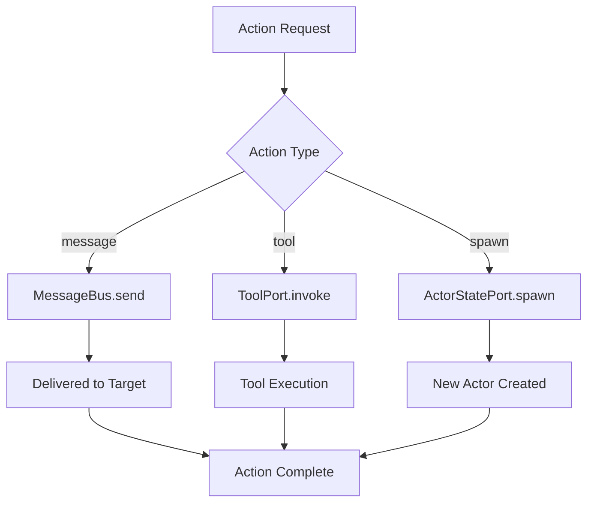

# Orchestrator Guide

## Overview

The Orchestrator is the core coordination engine of the Pantheon Framework, responsible for managing actor lifecycles, executing actions, and coordinating the flow of information between different components. It implements a reactive execution model that responds to events and user inputs while maintaining system stability and performance.

## Core Architecture

### Dependency Injection

The Orchestrator follows the hexagonal architecture pattern, receiving all external dependencies through a well-defined interface:

```typescript
export type OrchestratorDeps = {
  now: () => number;
  log: (msg: string, meta?: unknown) => void;
  context: IContextPort;
  tools: IToolPort;
  llm: ILlmPort;
  bus: IMessageBus;
  schedule: IScheduler;
  state: IActorStatePort;
};
```

### Key Responsibilities

1. **Action Execution**: Coordinates the execution of different action types
2. **Behavior Selection**: Determines which behaviors should be active based on system state
3. **Actor Lifecycle**: Manages actor execution loops and scheduling
4. **Error Handling**: Provides robust error handling and logging
5. **Resource Management**: Coordinates access to shared resources

## Action Execution System

### Action Types

The Orchestrator supports three primary action types:

#### 1. Message Actions

```typescript
case 'message':
  await deps.bus.send({
    from: actor.id,
    to: action.target ?? 'user',
    content: action.content,
  });
```

**Use Cases:**

- Sending responses to users
- Inter-agent communication
- System notifications
- Status updates

#### 2. Tool Actions

```typescript
case 'tool':
  await deps.tools.invoke(action.name, action.args);
```

**Use Cases:**

- External API calls
- File system operations
- Database interactions
- System utilities

#### 3. Spawn Actions

```typescript
case 'spawn':
  await deps.state.spawn(action.actor, action.goal);
```

**Use Cases:**

- Creating sub-agents for specialized tasks
- Dynamic agent instantiation
- Task delegation
- Parallel processing

### Action Execution Flow



## Behavior Selection System

### Behavior Modes

The Orchestrator implements a sophisticated behavior selection system that considers both the actor's capabilities and the current system state:

```typescript
const selectBehaviors = (
  actor: Actor,
  hasUserInput: boolean,
): (typeof actor.script.talents)[number]['behaviors'] => {
  const allBehaviors = actor.script.talents.flatMap((t) => t.behaviors);

  return allBehaviors.filter((behavior) => {
    if (hasUserInput) {
      return behavior.mode === 'active' || behavior.mode === 'persistent';
    }
    return behavior.mode !== 'active'; // passive + persistent
  });
};
```

### Behavior Selection Logic

| System State       | Active Behaviors | Passive Behaviors | Persistent Behaviors |
| ------------------ | ---------------- | ----------------- | -------------------- |
| **Has User Input** | ✅ Enabled       | ❌ Disabled       | ✅ Enabled           |
| **No User Input**  | ❌ Disabled      | ✅ Enabled        | ✅ Enabled           |

### Behavior Execution Order

1. **Filter Behaviors**: Based on current system state and user input presence
2. **Execute Sequentially**: Each behavior gets an opportunity to generate actions
3. **Error Isolation**: Failures in one behavior don't affect others
4. **Action Aggregation**: All generated actions are executed in order

## Actor Lifecycle Management

### Actor Ticking

The core execution unit is the "tick" - a single execution cycle for an actor:

```typescript
const tickActor = async (actor: Actor, input?: { userMessage?: string }): Promise<void> => {
  deps.log(`Ticking actor: ${actor.id}`, { goals: actor.goals, hasInput: !!input?.userMessage });

  const context = await deps.context.compile({
    texts: input?.userMessage ? [input.userMessage] : [],
    sources: actor.script.contextSources,
  });

  const allowedBehaviors = selectBehaviors(actor, !!input?.userMessage);
  const goal = actor.goals.join('; ');

  for (const behavior of allowedBehaviors) {
    try {
      const plan = await behavior.plan({ goal, context });

      for (const action of plan.actions) {
        await executeAction(action, actor);
      }
    } catch (error) {
      deps.log(`Behavior ${behavior.name} failed`, {
        error: error instanceof Error ? error.message : String(error),
      });
    }
  }
};
```

### Actor Loop Management

For continuous operation, actors can be configured with automatic looping:

```typescript
const startActorLoop = (actor: Actor, intervalMs: number = 5000): (() => void) => {
  return deps.schedule.every(intervalMs, async () => {
    try {
      await tickActor(actor);
    } catch (error) {
      deps.log(`Actor loop error for ${actor.id}`, {
        error: error instanceof Error ? error.message : String(error),
      });
    }
  });
};
```

### Loop Configuration

- **Default Interval**: 5000ms (5 seconds)
- **Customizable**: Each actor can have its own interval
- **Graceful Shutdown**: Returns a cleanup function to stop the loop
- **Error Resilience**: Loop continues even if individual ticks fail

## Error Handling and Logging

### Error Handling Strategy

The Orchestrator implements a defense-in-depth approach to error handling:

1. **Behavior-Level Isolation**: Errors in one behavior don't affect others
2. **Action-Level Isolation**: Failed actions are logged but don't stop execution
3. **Loop-Level Resilience**: Actor loops continue despite tick failures
4. **Comprehensive Logging**: All errors are logged with context

### Logging Implementation

```typescript
deps.log(`Executing action: ${action.type}`, { actorId: actor.id, action });
deps.log(`Behavior ${behavior.name} failed`, {
  error: error instanceof Error ? error.message : String(error),
});
deps.log(`Actor loop error for ${actor.id}`, {
  error: error instanceof Error ? error.message : String(error),
});
```

### Log Context

Each log entry includes relevant context:

- **Action Execution**: Actor ID, action type, action details
- **Behavior Failures**: Behavior name, error message
- **Loop Errors**: Actor ID, error message
- **Actor Ticking**: Actor ID, goals, input presence

## Performance Considerations

### Concurrent Execution

The Orchestrator is designed for concurrent operation:

- **Independent Actors**: Each actor runs in its own execution context
- **Parallel Behaviors**: Multiple behaviors can execute simultaneously
- **Non-blocking Actions**: Actions are executed asynchronously
- **Resource Sharing**: Coordinated access to shared resources

### Memory Management

- **Context Compilation**: Context is compiled on-demand and not retained
- **Action Cleanup**: Actions are executed and then discarded
- **Loop Management**: Proper cleanup of scheduled tasks
- **Error Recovery**: Memory leaks prevented by error isolation

### Optimization Strategies

1. **Behavior Filtering**: Only relevant behaviors are considered
2. **Lazy Context Compilation**: Context is compiled only when needed
3. **Asynchronous Execution**: Non-blocking action execution
4. **Error Bubbling**: Errors are contained at appropriate levels

## Usage Examples

### Basic Actor Execution

```typescript
import { makeOrchestrator } from '@promethean/pantheon-core';

// Create orchestrator with dependencies
const orchestrator = makeOrchestrator({
  now: () => Date.now(),
  log: console.log,
  context: contextPort,
  tools: toolPort,
  llm: llmPort,
  bus: messageBus,
  schedule: scheduler,
  state: actorStatePort,
});

// Execute a single tick
await orchestrator.tickActor(actor, { userMessage: 'Hello' });
```

### Continuous Actor Operation

```typescript
// Start an actor loop with custom interval
const stopLoop = orchestrator.startActorLoop(actor, 3000);

// Later, stop the loop
stopLoop();
```

### Manual Action Execution

```typescript
// Execute a specific action
const action: Action = {
  type: 'message',
  content: 'Hello, world!',
  target: 'user',
};

await orchestrator.executeAction(action, actor);
```

## Best Practices

### 1. Actor Design

- Keep actors focused on specific responsibilities
- Use appropriate loop intervals based on actor needs
- Implement proper error handling in behaviors
- Log meaningful information for debugging

### 2. Behavior Development

- Make behaviors idempotent where possible
- Handle errors gracefully within behaviors
- Provide clear action plans
- Use appropriate action types for different operations

### 3. Action Implementation

- Choose the right action type for the task
- Provide sufficient context in action parameters
- Handle action-specific errors appropriately
- Consider the impact on system resources

### 4. Error Handling

- Log errors with sufficient context
- Implement retry logic for transient failures
- Use appropriate error types
- Monitor error patterns for system health

### 5. Performance Optimization

- Use appropriate loop intervals
- Minimize context compilation overhead
- Implement caching where appropriate
- Monitor resource usage

## Integration Patterns

### 1. Event-Driven Architecture

```typescript
// Subscribe to message bus for inter-agent communication
deps.bus.subscribe((msg) => {
  if (msg.to === actor.id) {
    orchestrator.tickActor(actor, { userMessage: msg.content });
  }
});
```

### 2. Scheduled Tasks

```typescript
// Schedule periodic tasks
const cleanupTask = deps.schedule.every(60000, async () => {
  await orchestrator.tickActor(actor);
});
```

### 3. User Interaction

```typescript
// Handle user input
async function handleUserInput(actorId: string, message: string) {
  const actor = await deps.state.get(actorId);
  if (actor) {
    await orchestrator.tickActor(actor, { userMessage: message });
  }
}
```

## Troubleshooting

### Common Issues

1. **Actor Not Responding**

   - Check if actor loop is running
   - Verify actor state in ActorStatePort
   - Review logs for error messages

2. **Behavior Failures**

   - Check behavior implementation
   - Verify context compilation
   - Review error logs for specific failures

3. **Action Execution Errors**

   - Verify action parameters
   - Check port implementations
   - Review target system availability

4. **Performance Issues**
   - Monitor loop intervals
   - Check context compilation performance
   - Review resource usage patterns

### Debugging Tools

1. **Logging**: Enable detailed logging for execution tracing
2. **Monitoring**: Track actor execution times and error rates
3. **Profiling**: Monitor resource usage and performance metrics
4. **Testing**: Use unit tests to verify orchestrator behavior

## Related Documentation

- [[Type System Reference]]: For Action and Actor type definitions
- [[Actor Model Guide]]: For behavior development and actor design
- [[Context Engine Guide]]: For context compilation and management
- [[Ports System Guide]]: For port implementations and dependency injection
- [[architecture-overview.md|Architecture Overview]]: For system design principles

## File Locations

- **Core Implementation**: `/packages/pantheon-core/src/core/orchestrator.ts`
- **Type Definitions**: `/packages/pantheon-core/src/core/types.ts`
- **Port Definitions**: `/packages/pantheon-core/src/core/ports.ts`
- **Examples**: `/packages/pantheon/examples/`
