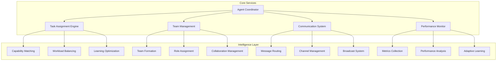

# Pantheon Coordination

> **Agent Coordination System** - Advanced multi-agent coordination, task assignment, and team management

## Overview

`@promethean-os/pantheon-coordination` provides a comprehensive type system and framework for coordinating multiple agents in complex workflows. It enables intelligent task assignment, team formation, communication management, and performance optimization across distributed agent ecosystems.

**Key Features**: Intelligent task assignment, capability matching, team formation, communication channels, performance tracking, and adaptive learning.

## Architecture

### Coordination Framework



### Data Flow

1. **Task Requirements** are analyzed and matched to agent capabilities
2. **Assignment Decisions** consider performance, availability, and learning opportunities
3. **Team Formation** optimizes for complementary skills and collaboration styles
4. **Communication** flows through structured channels with routing and moderation
5. **Performance Data** feeds back into the learning system for continuous improvement

## Core Types

### Agent Coordinator Interface

```typescript
interface AgentCoordinator {
  // Agent Management
  registerAgent(agent: AgentInstance): Promise<void>;
  unregisterAgent(agentId: string): Promise<void>;
  getAgent(agentId: string): Promise<AgentInstance | null>;
  listAgents(filter?: AgentFilter): Promise<AgentInstance[]>;

  // Task Assignment
  assignTask(taskId: string, requirements: TaskRequirements): Promise<TaskAssignment>;
  reassignTask(taskId: string, newAgentId: string): Promise<TaskAssignment>;
  unassignTask(taskId: string): Promise<void>;
  getAgentTasks(agentId: string): Promise<AssignedTask[]>;

  // Team Management
  createTeam(config: TeamConfig): Promise<Team>;
  dissolveTeam(teamId: string): Promise<void>;
  addToTeam(teamId: string, agentId: string): Promise<void>;
  removeFromTeam(teamId: string, agentId: string): Promise<void>;

  // Communication
  sendMessage(message: AgentMessage): Promise<void>;
  broadcastMessage(message: BroadcastMessage): Promise<void>;
  createChannel(config: ChannelConfig): Promise<CommunicationChannel>;

  // Monitoring
  getCoordinationStatus(): Promise<CoordinationStatus>;
  getAgentMetrics(agentId: string): Promise<AgentMetrics>;
  getTeamMetrics(teamId: string): Promise<TeamMetrics>;
}
```

## Task Assignment System

### Task Requirements Analysis

```typescript
interface TaskRequirements {
  taskId: string;
  title: string;
  description: string;

  // Requirements
  requiredCapabilities: CapabilityRequirement[];
  skillLevel: SkillLevel;
  securityLevel: SecurityLevel;
  resourceRequirements: ResourceRequirement[];

  // Constraints
  deadline?: Date;
  priority: TaskPriority;
  estimatedDuration: number; // minutes
  location?: string;

  // Preferences
  preferredAgents?: string[];
  excludedAgents?: string[];
  teamPreference?: string;

  // Context
  dependencies: string[];
  collaborationNeeds: CollaborationNeed[];
  taskType: TaskType;
}
```

### Capability Matching

```typescript
interface CapabilityRequirement {
  capabilityId: string;
  name: string;
  minimumLevel: number;
  preferredLevel?: number;
  required: boolean;
  weight: number; // 0-1
}

interface AgentCandidate {
  agentId: string;
  agent: AgentInstance;

  // Match Scores
  overallScore: number; // 0-1
  capabilityScore: CapabilityMatchScore;
  availabilityScore: number; // 0-1
  workloadScore: number; // 0-1
  performanceScore: number; // 0-1
  costScore: number; // 0-1
  learningScore: number; // 0-1

  // Detailed Analysis
  capabilityGaps: CapabilityGap[];
  riskFactors: RiskFactor[];
  collaborationPotential: CollaborationPotential;

  // Practical Info
  availability: AvailabilityInfo;
  estimatedCost: CostEstimate;
  estimatedDuration: number;
  confidence: number; // 0-1

  // Recommendations
  recommendation: AssignmentRecommendation;
  reasoning: AssignmentReasoning[];
}
```

## Usage Examples

### Basic Task Assignment

```typescript
import {
  AgentCoordinator,
  TaskRequirements,
  CapabilityRequirement,
} from '@promethean-os/pantheon-coordination';

// Create task requirements
const taskRequirements: TaskRequirements = {
  taskId: 'task-123',
  title: 'Data Analysis Report',
  description: 'Analyze Q4 sales data and generate insights report',

  requiredCapabilities: [
    {
      capabilityId: 'data-analysis',
      name: 'Data Analysis',
      minimumLevel: 3,
      preferredLevel: 4,
      required: true,
      weight: 0.8,
    },
    {
      capabilityId: 'report-generation',
      name: 'Report Generation',
      minimumLevel: 2,
      required: true,
      weight: 0.6,
    },
  ],

  skillLevel: 'intermediate',
  securityLevel: 'internal',
  resourceRequirements: [
    {
      type: 'cpu',
      amount: 2,
      unit: 'cores',
      optional: false,
    },
    {
      type: 'memory',
      amount: 4,
      unit: 'GB',
      optional: false,
    },
  ],

  priority: 'P1',
  estimatedDuration: 120, // 2 hours
  taskType: 'analysis',
  dependencies: [],
  collaborationNeeds: [
    {
      type: 'communication',
      description: 'May need to clarify data requirements',
      coordinationComplexity: 0.3,
    },
  ],
};

// Assign task
const coordinator = new AgentCoordinator();
const assignment = await coordinator.assignTask('task-123', taskRequirements);

console.log(
  `Task assigned to agent ${assignment.agentId} with confidence ${assignment.confidence}`,
);
```

### Advanced Team Formation

```typescript
interface TeamConfig {
  name: string;
  description: string;
  purpose: TeamPurpose;
  collaborationStyle: CollaborationStyle;
  decisionMaking: DecisionMakingStyle;
  maxMembers: number;
  requiredCapabilities: string[];
  securityLevel: SecurityLevel;
  initialMembers?: string[];
  leadAgentId?: string;
}

const teamConfig: TeamConfig = {
  name: 'Product Development Team',
  description: 'Cross-functional team for new product development',

  purpose: {
    primary: 'Develop new product features',
    secondary: ['quality assurance', 'documentation'],
    objectives: [
      'Deliver features on schedule',
      'Maintain code quality',
      'Ensure comprehensive testing',
    ],
    successCriteria: [
      'All features pass QA',
      'Documentation complete',
      'Performance benchmarks met',
    ],
  },

  collaborationStyle: 'cooperative',
  decisionMaking: 'consensus',
  maxMembers: 6,
  requiredCapabilities: [
    'frontend-development',
    'backend-development',
    'testing',
    'ui-design',
    'project-management',
  ],
  securityLevel: 'internal',
  initialMembers: ['agent-frontend', 'agent-backend'],
};

const team = await coordinator.createTeam(teamConfig);
console.log(`Team ${team.id} created with ${team.members.length} members`);
```

### Communication Management

```typescript
interface AgentMessage {
  id: string;
  from: string;
  to: string | string[];
  type: MessageType;
  priority: MessagePriority;

  // Content
  subject?: string;
  content: string;
  attachments?: MessageAttachment[];
  metadata?: Record<string, any>;

  // Context
  taskId?: string;
  teamId?: string;
  channelId?: string;
  threadId?: string;

  // Timing
  sentAt: Date;
  expiresAt?: Date;
  readAt?: Date[];

  // Status
  status: MessageStatus;
  deliveryReceipts?: DeliveryReceipt[];
}

// Send direct message
const message: AgentMessage = {
  id: 'msg-456',
  from: 'agent-coordinator',
  to: ['agent-developer'],
  type: 'task_assignment',
  priority: 'high',

  subject: 'New Feature Development',
  content: 'Please implement the user authentication feature',

  taskId: 'task-789',
  sentAt: new Date(),
  status: 'pending',
};

await coordinator.sendMessage(message);

// Broadcast to team
const broadcast: BroadcastMessage = {
  id: 'msg-789',
  from: 'team-lead',
  type: 'status_update',
  priority: 'normal',

  subject: 'Sprint Update',
  content: 'Sprint is 75% complete, on track for deadline',

  audience: {
    type: 'team',
    target: 'team-dev',
  },

  sentAt: new Date(),
  status: 'pending',
};

await coordinator.broadcastMessage(broadcast);
```

## Advanced Features

### Intelligent Assignment Strategies

```typescript
interface AssignmentStrategy {
  type: 'capability_based' | 'workload_balanced' | 'learning_focused' | 'cost_optimized' | 'hybrid';
  weights: AssignmentWeights;
  algorithm: string;
}

interface AssignmentWeights {
  capability: number;
  workload: number;
  learning: number;
  cost: number;
  performance: number;
  availability: number;
  collaboration: number;
}

// Learning-focused strategy
const learningStrategy: AssignmentStrategy = {
  type: 'learning_focused',
  weights: {
    capability: 0.3,
    workload: 0.1,
    learning: 0.4, // High weight on learning opportunities
    cost: 0.05,
    performance: 0.1,
    availability: 0.05,
  },
  algorithm: 'learning_optimized_v2',
};

// Cost-optimized strategy
const costStrategy: AssignmentStrategy = {
  type: 'cost_optimized',
  weights: {
    capability: 0.2,
    workload: 0.15,
    learning: 0.05,
    cost: 0.4, // High weight on cost efficiency
    performance: 0.15,
    availability: 0.05,
  },
  algorithm: 'cost_balanced_v1',
};
```

### Performance Monitoring

```typescript
interface AgentMetrics {
  agentId: string;

  // Task Metrics
  totalTasks: number;
  completedTasks: number;
  failedTasks: number;
  averageTaskDuration: number;
  taskSuccessRate: number;

  // Performance Metrics
  utilizationRate: number;
  efficiencyScore: number;
  qualityScore: number;
  reliabilityScore: number;

  // Collaboration Metrics
  messagesSent: number;
  messagesReceived: number;
  collaborationsInitiated: number;
  collaborationsParticipated: number;

  // Learning Metrics
  capabilitiesImproved: number;
  newSkillsAcquired: number;
  learningVelocity: number;

  // Resource Metrics
  resourceUtilization: number;
  costEfficiency: number;

  // Timestamp
  period: string; // '1h', '24h', '7d', '30d'
  timestamp: Date;
}

// Get agent performance
const metrics = await coordinator.getAgentMetrics('agent-123');
console.log(`Agent success rate: ${metrics.taskSuccessRate}`);
console.log(`Agent efficiency: ${metrics.efficiencyScore}`);
console.log(`Learning velocity: ${metrics.learningVelocity}`);
```

### Adaptive Learning System

```typescript
interface AssignmentLearningModel {
  // Model Info
  version: string;
  lastTrained: Date;
  trainingDataSize: number;
  accuracy: number; // 0-1

  // Learning Methods
  updateModel(performance: AssignmentPerformance): Promise<void>;
  predictScore(agent: AgentInstance, task: TaskAnalysis): Promise<number>;
  identifyPatterns(): Promise<AssignmentPattern[]>;
  suggestWeights(): Promise<AssignmentWeights>;

  // Adaptation
  adaptStrategy(currentStrategy: AssignmentStrategy): Promise<AssignmentStrategy>;
  detectAnomalies(): Promise<AssignmentAnomaly[]>;
  recommendImprovements(): Promise<ImprovementRecommendation[]>;
}

// Use learning model for continuous improvement
const learningModel = new AssignmentLearningModel();

// Update model with performance data
const performance: AssignmentPerformance = {
  assignmentId: 'assign-123',
  taskId: 'task-456',
  agentId: 'agent-789',

  predictedDuration: 120,
  actualDuration: 135,
  predictedQuality: 0.85,
  actualQuality: 0.82,

  efficiency: 0.89,
  effectiveness: 0.91,
  satisfaction: 0.88,
};

await learningModel.updateModel(performance);

// Get improved assignment weights
const improvedWeights = await learningModel.suggestWeights();
console.log('Improved assignment weights:', improvedWeights);
```

## Integration Examples

### Complete Workflow Coordination

```typescript
class WorkflowCoordinator {
  constructor(private coordinator: AgentCoordinator) {}

  async coordinateComplexWorkflow(workflow: ComplexWorkflow): Promise<WorkflowExecution> {
    // Step 1: Analyze workflow requirements
    const analysis = await this.analyzeWorkflow(workflow);

    // Step 2: Form optimal teams
    const teams = await this.formWorkflowTeams(analysis);

    // Step 3: Assign tasks to teams and agents
    const assignments = await this.assignWorkflowTasks(workflow, teams);

    // Step 4: Establish communication channels
    const channels = await this.setupCommunicationChannels(teams);

    // Step 5: Monitor execution
    const execution = await this.monitorWorkflowExecution(assignments, channels);

    return execution;
  }

  private async analyzeWorkflow(workflow: ComplexWorkflow): Promise<WorkflowAnalysis> {
    // Break down workflow into tasks
    const tasks = this.decomposeWorkflow(workflow);

    // Identify dependencies and collaboration needs
    const dependencies = this.identifyDependencies(tasks);
    const collaborationNeeds = this.identifyCollaborationNeeds(tasks);

    // Estimate resource requirements
    const resourceRequirements = this.estimateResourceRequirements(tasks);

    return {
      tasks,
      dependencies,
      collaborationNeeds,
      resourceRequirements,
      complexity: this.calculateComplexity(tasks),
      estimatedDuration: this.estimateDuration(tasks),
    };
  }

  private async formWorkflowTeams(analysis: WorkflowAnalysis): Promise<Team[]> {
    const teams: Team[] = [];

    // Group tasks by collaboration needs
    const taskGroups = this.groupTasksByCollaboration(analysis.tasks);

    for (const group of taskGroups) {
      const teamConfig = this.createTeamConfig(group, analysis);
      const team = await this.coordinator.createTeam(teamConfig);
      teams.push(team);
    }

    return teams;
  }

  private async assignWorkflowTasks(
    workflow: ComplexWorkflow,
    teams: Team[],
  ): Promise<TaskAssignment[]> {
    const assignments: TaskAssignment[] = [];

    for (const task of workflow.tasks) {
      // Find suitable team
      const suitableTeam = this.findSuitableTeam(task, teams);

      if (suitableTeam) {
        // Assign to best agent in team
        const assignment = await this.coordinator.assignTask(task.id, {
          taskId: task.id,
          title: task.title,
          description: task.description,
          requiredCapabilities: task.requiredCapabilities,
          priority: task.priority,
          estimatedDuration: task.estimatedDuration,
          taskType: task.type,
          preferredAgents: suitableTeam.members.map((m) => m.agentId),
        });

        assignments.push(assignment);
      }
    }

    return assignments;
  }
}
```

### Real-time Coordination Dashboard

```typescript
class CoordinationDashboard {
  private coordinator: AgentCoordinator;
  private updateInterval: number = 5000; // 5 seconds

  constructor(coordinator: AgentCoordinator) {
    this.coordinator = coordinator;
    this.startRealTimeUpdates();
  }

  async getDashboardData(): Promise<DashboardData> {
    const [status, agents, teams] = await Promise.all([
      this.coordinator.getCoordinationStatus(),
      this.coordinator.listAgents(),
      this.getTeamsData(),
    ]);

    return {
      status,
      agents: this.processAgentsData(agents),
      teams,
      alerts: await this.getActiveAlerts(),
      recommendations: await this.getRecommendations(),
    };
  }

  private async getTeamsData(): Promise<TeamData[]> {
    // Get all teams and their metrics
    const teams = await this.coordinator.listTeams();
    const teamsData = await Promise.all(
      teams.map(async (team) => ({
        team,
        metrics: await this.coordinator.getTeamMetrics(team.id),
      })),
    );

    return teamsData;
  }

  private processAgentsData(agents: AgentInstance[]): ProcessedAgentData[] {
    return agents.map((agent) => ({
      id: agent.id,
      name: agent.name,
      status: agent.status,
      capabilities: agent.capabilities,
      currentLoad: agent.currentWorkload,
      performance: agent.recentPerformance,
      availability: agent.availability,
      lastActive: agent.lastActivity,
    }));
  }

  private startRealTimeUpdates(): void {
    setInterval(async () => {
      try {
        const data = await this.getDashboardData();
        this.updateUI(data);
        this.checkForAlerts(data);
      } catch (error) {
        console.error('Dashboard update failed:', error);
      }
    }, this.updateInterval);
  }

  private checkForAlerts(data: DashboardData): void {
    // Check for system issues
    if (data.status.systemHealth !== 'healthy') {
      this.triggerAlert({
        type: 'system_health',
        severity: 'high',
        message: `System health: ${data.status.systemHealth}`,
        data: data.status.activeIssues,
      });
    }

    // Check for overloaded agents
    const overloadedAgents = data.agents.filter((a) => a.currentLoad > 0.9);
    if (overloadedAgents.length > 0) {
      this.triggerAlert({
        type: 'agent_overload',
        severity: 'medium',
        message: `${overloadedAgents.length} agents are overloaded`,
        data: overloadedAgents,
      });
    }

    // Check for task failures
    const recentFailures = data.status.failedTasks - this.lastFailedTasks;
    if (recentFailures > 5) {
      this.triggerAlert({
        type: 'high_failure_rate',
        severity: 'high',
        message: `High task failure rate: ${recentFailures} recent failures`,
        data: { failureCount: recentFailures },
      });
    }
  }
}
```

## Best Practices

### 1. Task Assignment Optimization

```typescript
// Use multi-criteria decision making
const optimizedAssignment = await coordinator.assignTask(taskId, {
  ...taskRequirements,

  // Enable learning opportunities
  learningPreference: {
    enableLearning: true,
    learningWeight: 0.3,
    focusAreas: ['data-analysis', 'visualization'],
    avoidAreas: ['system-administration'],
  },

  // Balance workload
  maxWorkload: 0.8,

  // Consider collaboration history
  collaborationHistory: true,

  // Optimize for team synergy
  teamSynergy: true,
});
```

### 2. Team Formation Strategies

```typescript
// Form diverse, complementary teams
const teamConfig: TeamConfig = {
  name: 'Innovation Team',
  collaborationStyle: 'consensus',
  decisionMaking: 'democratic',

  // Ensure skill diversity
  requiredCapabilities: ['research', 'design', 'development', 'testing', 'analysis'],

  // Limit team size for effective communication
  maxMembers: 5,

  // Include mix of experience levels
  experienceDistribution: {
    junior: 0.3,
    mid: 0.4,
    senior: 0.3,
  },

  // Enable learning and knowledge sharing
  learningEnabled: true,
  knowledgeSharing: true,
};
```

### 3. Communication Protocols

```typescript
// Establish clear communication guidelines
const communicationStrategy: CommunicationStrategy = {
  type: 'hybrid',
  protocols: [
    {
      messageType: 'task_assignment',
      protocol: 'structured',
      encryption: true,
      persistence: true,
    },
    {
      messageType: 'general_communication',
      protocol: 'casual',
      encryption: false,
      persistence: true,
    },
  ],
  routing: {
    strategy: 'intelligent',
    rules: [
      {
        condition: 'priority == "critical"',
        action: 'immediate_delivery',
        priority: 1,
      },
      {
        condition: 'messageType == "error_report"',
        action: 'escalate_to_team_lead',
        priority: 2,
      },
    ],
  },
  moderation: {
    level: 'basic',
    rules: [
      {
        pattern: 'offensive_language',
        action: 'block',
        severity: 'high',
      },
    ],
    autoActions: [
      {
        trigger: 'spam_detected',
        action: 'temporary_mute',
        parameters: { duration: 300 },
      },
    ],
  },
};
```

## Testing

### Unit Testing Assignment Logic

```typescript
import { test } from 'ava';

test('task assignment - capability matching', async (t) => {
  const mockCoordinator = createMockCoordinator();

  const taskRequirements: TaskRequirements = {
    taskId: 'test-task',
    title: 'Test Task',
    requiredCapabilities: [
      {
        capabilityId: 'test-capability',
        name: 'Test Capability',
        minimumLevel: 3,
        required: true,
        weight: 1.0,
      },
    ],
    skillLevel: 'intermediate',
    securityLevel: 'public',
    resourceRequirements: [],
    priority: 'medium',
    estimatedDuration: 60,
    taskType: 'testing',
    dependencies: [],
    collaborationNeeds: [],
  };

  const assignment = await mockCoordinator.assignTask('test-task', taskRequirements);

  t.truthy(assignment);
  t.true(assignment.confidence > 0.5);
  t.is(assignment.taskId, 'test-task');
});
```

### Integration Testing

```typescript
test('full coordination workflow', async (t) => {
  const coordinator = new AgentCoordinator();

  // Register test agents
  await coordinator.registerAgent(createTestAgent('agent-1', ['capability-1']));
  await coordinator.registerAgent(createTestAgent('agent-2', ['capability-2']));

  // Create team
  const team = await coordinator.createTeam({
    name: 'Test Team',
    purpose: { primary: 'Testing', objectives: [], successCriteria: [] },
    collaborationStyle: 'cooperative',
    decisionMaking: 'consensus',
    maxMembers: 2,
    requiredCapabilities: ['capability-1', 'capability-2'],
    securityLevel: 'public',
  });

  // Assign task
  const assignment = await coordinator.assignTask('workflow-task', {
    taskId: 'workflow-task',
    title: 'Workflow Task',
    requiredCapabilities: [
      {
        capabilityId: 'capability-1',
        name: 'Capability 1',
        minimumLevel: 1,
        required: true,
        weight: 0.5,
      },
      {
        capabilityId: 'capability-2',
        name: 'Capability 2',
        minimumLevel: 1,
        required: true,
        weight: 0.5,
      },
    ],
    skillLevel: 'beginner',
    securityLevel: 'public',
    resourceRequirements: [],
    priority: 'medium',
    estimatedDuration: 30,
    taskType: 'testing',
    dependencies: [],
    collaborationNeeds: [],
  });

  t.truthy(assignment);
  t.truthy(assignment.agentId);

  // Verify team membership
  const updatedTeam = await coordinator.getTeam(team.id);
  t.true(updatedTeam.members.some((m) => m.agentId === assignment.agentId));
});
```

## Troubleshooting

### Common Issues

1. **Assignment Conflicts**

   ```typescript
   // Detect and resolve assignment conflicts
   const conflicts = await coordinator.detectAssignmentConflicts();

   for (const conflict of conflicts) {
     if (conflict.type === 'double_booking') {
       await coordinator.resolveDoubleBooking(conflict);
     } else if (conflict.type === 'capability_mismatch') {
       await coordinator.reassignWithCapabilityCheck(conflict.taskId);
     }
   }
   ```

2. **Team Communication Breakdown**

   ```typescript
   // Monitor team communication health
   const teamHealth = await coordinator.getTeamCommunicationHealth(teamId);

   if (teamHealth.healthScore < 0.7) {
     // Intervene with communication facilitation
     await coordinator.facilitateTeamCommunication(teamId, {
       type: 'structured_meeting',
       agenda: ['communication_issues', 'process_improvement'],
       facilitator: 'agent-coordinator',
     });
   }
   ```

3. **Performance Degradation**

   ```typescript
   // Identify performance bottlenecks
   const performanceAnalysis = await coordinator.analyzeSystemPerformance();

   for (const bottleneck of performanceAnalysis.bottlenecks) {
     if (bottleneck.type === 'agent_overload') {
       await coordinator.redistributeWorkload(bottleneck.affectedAgents);
     } else if (bottleneck.type === 'coordination_latency') {
       await coordinator.optimizeCoordinationPaths(bottleneck.affectedTasks);
     }
   }
   ```

## Related Documentation

- [[pantheon-core]] - Core agent system
- [[pantheon-orchestrator]] - Agent orchestration
- [[pantheon-state]] - Agent state management
- [[pantheon-protocol]] - Communication protocols

## License

GPL-3.0-only - see [[LICENSE]] for details.
