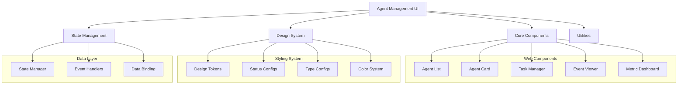

# Pantheon UI

> **Agent Management Interface** - Web components for managing and monitoring Pantheon agents

## Overview

`@promethean-os/pantheon-ui` provides a comprehensive set of web components and design system for building agent management interfaces. Built with LitElement and modern web standards, it offers reusable components for displaying agent status, metrics, tasks, and events.

**Key Features**: LitElement web components, comprehensive design system, responsive design, real-time updates, and extensive customization options.

## Architecture

### Component Structure



### Design System Hierarchy

1. **Base Design Tokens** - Inherited from `@promethean-os/ui-components`
2. **Agent-Specific Tokens** - Status colors, type colors, metrics colors
3. **Component Styles** - Component-specific CSS with design token integration
4. **Theme System** - Light/dark theme support with CSS custom properties

## Installation

```bash
pnpm add @promethean-os/pantheon-ui
```

## Quick Start

### Basic Agent List

```typescript
import { AgentList } from '@promethean-os/pantheon-ui';
import { applyAgentDesignTokens } from '@promethean-os/pantheon-ui';

// Apply design tokens
applyAgentDesignTokens();

// Define sample agents
const agents = [
  {
    id: 'agent-1',
    name: 'Data Processor',
    status: 'active',
    type: 'specialist',
    model: { provider: 'openai', name: 'gpt-4' },
    capabilities: ['data-analysis', 'processing'],
    metrics: {
      tasksCompleted: 42,
      tasksFailed: 2,
      averageResponseTime: 1200,
      cpuUsage: 45,
      memoryUsage: 512,
      uptime: 86400,
      errorRate: 0.05,
      lastUpdated: new Date(),
    },
    config: {
      maxConcurrentTasks: 5,
      timeout: 30000,
      retryAttempts: 3,
      priority: 1,
      autoRestart: true,
      logging: { level: 'info', enableMetrics: true, enableTracing: false },
      resources: { maxMemory: 1024, maxCpu: 80, maxTokens: 4096 },
    },
    createdAt: new Date(),
    updatedAt: new Date(),
    lastActive: new Date(),
  },
];

// Use in HTML
const agentList = new AgentList();
agentList.agents = agents;
document.body.appendChild(agentList);
```

### React Integration

```tsx
import React, { useEffect, useRef } from 'react';
import { AgentList } from '@promethean-os/pantheon-ui';
import { applyAgentDesignTokens } from '@promethean-os/pantheon-ui';

const AgentManagementDashboard: React.FC = () => {
  const containerRef = useRef<HTMLDivElement>(null);
  const agentListRef = useRef<AgentList>();

  useEffect(() => {
    // Apply design tokens once
    applyAgentDesignTokens();

    // Create agent list component
    if (containerRef.current && !agentListRef.current) {
      const agentList = new AgentList();
      agentList.agents = sampleAgents;

      // Add event listeners
      agentList.addEventListener('agent-selected', (event: any) => {
        console.log('Agent selected:', event.detail.agent);
      });

      agentList.addEventListener('agent-action', (event: any) => {
        console.log('Agent action:', event.detail.action, event.detail.agent);
      });

      containerRef.current.appendChild(agentList);
      agentListRef.current = agentList;
    }
  }, []);

  return (
    <div>
      <h1>Agent Management</h1>
      <div ref={containerRef}></div>
    </div>
  );
};
```

## Core Components

### AgentList

Displays agents in a tabular list format with sorting, filtering, and actions.

```typescript
interface AgentListProps {
  agents: Agent[];
  selectedAgentId?: string;
  compact?: boolean;
}

// Events
interface AgentSelectedEvent {
  detail: { agent: Agent };
}

interface AgentActionEvent {
  detail: { agent: Agent; action: string };
}
```

#### Usage

```html
<agent-list .agents="${agents}" .selectedAgentId="${selectedId}" .compact="${false}"></agent-list>
```

### AgentCard

Displays agent information in a card format suitable for grid layouts.

```typescript
// Usage
<agent-card
  .agent=${agent}
  .showMetrics=${true}
  .showActions=${true}
></agent-card>
```

### Design System

#### Design Tokens

```typescript
import { agentDesignTokens } from '@promethean-os/pantheon-ui';

// Access tokens
const primaryColor = agentDesignTokens.typeGeneral;
const statusColor = agentDesignTokens.statusActive;
const spacing = agentDesignTokens.spacingMedium;
```

#### Status Configuration

```typescript
import { agentStatusConfig } from '@promethean-os/pantheon-ui';

// Get status styling
const activeStatus = agentStatusConfig.active;
// Returns: { color: '#10B981', label: 'Active', icon: '✅', description: '...' }
```

#### Type Configuration

```typescript
import { agentTypeConfig } from '@promethean-os/pantheon-ui';

// Get type styling
const specialistType = agentTypeConfig.specialist;
// Returns: { color: '#EC4899', label: 'Specialist', icon: '🎯', description: '...' }
```

## Advanced Usage

### Custom Agent List with Filtering

```typescript
class FilteredAgentList extends AgentList {
  @property({ type: String })
  filterStatus?: string;

  @property({ type: String })
  filterType?: string;

  @property({ type: String })
  searchTerm?: string;

  get filteredAgents(): Agent[] {
    return this.agents.filter((agent) => {
      if (this.filterStatus && agent.status !== this.filterStatus) {
        return false;
      }
      if (this.filterType && agent.type !== this.filterType) {
        return false;
      }
      if (this.searchTerm) {
        const searchLower = this.searchTerm.toLowerCase();
        return (
          agent.name.toLowerCase().includes(searchLower) ||
          agent.capabilities.some((cap) => cap.toLowerCase().includes(searchLower))
        );
      }
      return true;
    });
  }

  render() {
    // Override render to use filtered agents
    const originalAgents = this.agents;
    this.agents = this.filteredAgents;
    const result = super.render();
    this.agents = originalAgents;
    return result;
  }
}
```

### Real-time Updates

```typescript
class LiveAgentDashboard extends LitElement {
  @property({ type: Array })
  agents: Agent[] = [];

  @property({ type: Boolean })
  autoRefresh = true;

  @property({ type: Number })
  refreshInterval = 5000; // 5 seconds

  private refreshTimer?: number;

  connectedCallback() {
    super.connectedCallback();
    this.startAutoRefresh();
  }

  disconnectedCallback() {
    super.disconnectedCallback();
    this.stopAutoRefresh();
  }

  private startAutoRefresh() {
    if (this.autoRefresh) {
      this.refreshTimer = window.setInterval(() => {
        this.refreshAgentData();
      }, this.refreshInterval);
    }
  }

  private stopAutoRefresh() {
    if (this.refreshTimer) {
      clearInterval(this.refreshTimer);
      this.refreshTimer = undefined;
    }
  }

  private async refreshAgentData() {
    try {
      const response = await fetch('/api/agents');
      const agents = await response.json();
      this.agents = agents;
    } catch (error) {
      console.error('Failed to refresh agent data:', error);
    }
  }

  render() {
    return html`
      <div class="dashboard">
        <agent-list .agents=${this.agents}></agent-list>
      </div>
    `;
  }
}
```

### Custom Theme

```typescript
// Create custom theme
const customTheme = {
  ...agentDesignTokens,
  statusActive: '#00D084', // Custom green
  typeSpecialist: '#FF6900', // Custom orange
  borderRadius: '12px', // Custom border radius
  spacingMedium: '12px', // Custom spacing
};

// Apply custom theme
function applyCustomTheme(root: HTMLElement = document.documentElement) {
  Object.entries(customTheme).forEach(([key, value]) => {
    const cssVar = `--agent-${key.replace(/[A-Z]/g, (m) => '-' + m.toLowerCase())}`;
    root.style.setProperty(cssVar, String(value));
  });
}

// Use in component
class ThemedAgentList extends AgentList {
  connectedCallback() {
    super.connectedCallback();
    applyCustomTheme(this.shadowRoot!);
  }
}
```

## State Management

### State Manager Utility

```typescript
import { createAgentStateManager } from '@promethean-os/pantheon-ui';

const stateManager = createAgentStateManager({
  apiEndpoint: '/api/agents',
  refreshInterval: 5000,
  errorRetryAttempts: 3,
});

// Subscribe to state changes
stateManager.subscribe('agents', (agents) => {
  console.log('Agents updated:', agents);
});

stateManager.subscribe('selectedAgent', (agent) => {
  console.log('Agent selected:', agent);
});

// Get current state
const currentAgents = stateManager.getAgents();
const selectedAgent = stateManager.getSelectedAgent();

// Update state
stateManager.selectAgent('agent-123');
stateManager.updateAgent('agent-123', { status: 'active' });
```

### Event Handling

```typescript
class AgentEventHandler {
  constructor(private element: HTMLElement) {
    this.setupEventListeners();
  }

  private setupEventListeners() {
    this.element.addEventListener('agent-selected', this.handleAgentSelected.bind(this));
    this.element.addEventListener('agent-action', this.handleAgentAction.bind(this));
  }

  private handleAgentSelected(event: CustomEvent) {
    const { agent } = event.detail;

    // Update URL
    history.pushState({}, '', `/agents/${agent.id}`);

    // Load agent details
    this.loadAgentDetails(agent.id);

    // Track analytics
    this.trackEvent('agent_selected', { agentId: agent.id, agentType: agent.type });
  }

  private handleAgentAction(event: CustomEvent) {
    const { agent, action } = event.detail;

    switch (action) {
      case 'start':
        this.startAgent(agent.id);
        break;
      case 'stop':
        this.stopAgent(agent.id);
        break;
      case 'restart':
        this.restartAgent(agent.id);
        break;
      case 'configure':
        this.openConfiguration(agent.id);
        break;
      case 'logs':
        this.viewLogs(agent.id);
        break;
    }
  }

  private async startAgent(agentId: string) {
    try {
      await fetch(`/api/agents/${agentId}/start`, { method: 'POST' });
      this.showNotification('Agent started successfully', 'success');
    } catch (error) {
      this.showNotification('Failed to start agent', 'error');
    }
  }

  // ... other action methods
}
```

## Integration Examples

### Full Dashboard Application

```typescript
class AgentDashboard extends LitElement {
  @property({ type: Array })
  agents: Agent[] = [];

  @property({ type: Object })
  selectedAgent?: Agent;

  @property({ type: Object })
  systemMetrics?: SystemMetrics;

  @property({ type: String })
  view: 'grid' | 'list' | 'metrics' = 'grid';

  static styles = css`
    :host {
      display: block;
      padding: var(--agent-spacingLarge);
      background: var(--agent-background, #f9fafb);
    }

    .dashboard-header {
      display: flex;
      justify-content: space-between;
      align-items: center;
      margin-bottom: var(--agent-spacingLarge);
    }

    .view-controls {
      display: flex;
      gap: var(--agent-spacingSmall);
    }

    .metrics-overview {
      display: grid;
      grid-template-columns: repeat(auto-fit, minmax(200px, 1fr));
      gap: var(--agent-spacingMedium);
      margin-bottom: var(--agent-spacingLarge);
    }

    .metric-card {
      background: white;
      padding: var(--agent-spacingLarge);
      border-radius: var(--agent-borderRadius);
      box-shadow: var(--agent-shadowSmall);
    }

    .agents-container {
      background: white;
      border-radius: var(--agent-borderRadius);
      box-shadow: var(--agent-shadowSmall);
      overflow: hidden;
    }
  `;

  render() {
    return html`
      <div class="dashboard-header">
        <h1>Agent Management Dashboard</h1>
        <div class="view-controls">
          <button
            @click=${() => (this.view = 'grid')}
            class=${this.view === 'grid' ? 'active' : ''}
          >
            Grid View
          </button>
          <button
            @click=${() => (this.view = 'list')}
            class=${this.view === 'list' ? 'active' : ''}
          >
            List View
          </button>
          <button
            @click=${() => (this.view = 'metrics')}
            class=${this.view === 'metrics' ? 'active' : ''}
          >
            Metrics
          </button>
        </div>
      </div>

      ${this.renderMetricsOverview()} ${this.renderAgentsView()}
    `;
  }

  private renderMetricsOverview() {
    if (!this.systemMetrics) return '';

    return html`
      <div class="metrics-overview">
        <div class="metric-card">
          <h3>Total Agents</h3>
          <div class="metric-value">${this.systemMetrics.totalAgents}</div>
        </div>
        <div class="metric-card">
          <h3>Active Agents</h3>
          <div class="metric-value">${this.systemMetrics.activeAgents}</div>
        </div>
        <div class="metric-card">
          <h3>Completed Tasks</h3>
          <div class="metric-value">${this.systemMetrics.completedTasks}</div>
        </div>
        <div class="metric-card">
          <h3>System Load</h3>
          <div class="metric-value">${Math.round(this.systemMetrics.systemLoad)}%</div>
        </div>
      </div>
    `;
  }

  private renderAgentsView() {
    if (this.view === 'grid') {
      return html`
        <div class="agents-container">
          <div class="agents-grid">
            ${this.agents.map(
              (agent) => html`
                <agent-card
                  .agent=${agent}
                  .selected=${this.selectedAgent?.id === agent.id}
                  @agent-selected=${this.handleAgentSelected}
                ></agent-card>
              `,
            )}
          </div>
        </div>
      `;
    }

    return html`
      <div class="agents-container">
        <agent-list
          .agents=${this.agents}
          .selectedAgentId=${this.selectedAgent?.id}
          @agent-selected=${this.handleAgentSelected}
          @agent-action=${this.handleAgentAction}
        ></agent-list>
      </div>
    `;
  }

  private handleAgentSelected(event: CustomEvent) {
    this.selectedAgent = event.detail.agent;
  }

  private handleAgentAction(event: CustomEvent) {
    const { agent, action } = event.detail;
    this.executeAgentAction(agent, action);
  }

  private async executeAgentAction(agent: Agent, action: string) {
    try {
      const response = await fetch(`/api/agents/${agent.id}/${action}`, {
        method: 'POST',
      });

      if (response.ok) {
        this.showNotification(`${action} completed successfully`, 'success');
        this.refreshAgentData();
      } else {
        throw new Error(`Action failed: ${action}`);
      }
    } catch (error) {
      this.showNotification(`Failed to ${action} agent`, 'error');
    }
  }

  private showNotification(message: string, type: 'success' | 'error' | 'info') {
    // Implement notification system
    console.log(`${type.toUpperCase()}: ${message}`);
  }

  private async refreshAgentData() {
    try {
      const response = await fetch('/api/agents');
      this.agents = await response.json();
    } catch (error) {
      console.error('Failed to refresh agents:', error);
    }
  }
}

customElements.define('agent-dashboard', AgentDashboard);
```

## Testing

### Component Testing

```typescript
import { test } from 'ava';
import { AgentList } from '@promethean-os/pantheon-ui';

test('agent-list - renders agents correctly', async (t) => {
  const agentList = new AgentList();
  agentList.agents = [
    {
      id: 'test-agent',
      name: 'Test Agent',
      status: 'active',
      type: 'general',
      model: { provider: 'openai', name: 'gpt-4' },
      capabilities: ['test'],
      metrics: {
        tasksCompleted: 10,
        tasksFailed: 0,
        averageResponseTime: 1000,
        cpuUsage: 50,
        memoryUsage: 256,
        uptime: 3600,
        errorRate: 0,
        lastUpdated: new Date(),
      },
      config: {
        maxConcurrentTasks: 1,
        timeout: 30000,
        retryAttempts: 3,
        priority: 1,
        autoRestart: true,
        logging: { level: 'info', enableMetrics: true, enableTracing: false },
        resources: { maxMemory: 512, maxCpu: 80, maxTokens: 2048 },
      },
      createdAt: new Date(),
      updatedAt: new Date(),
    },
  ];

  // Wait for render
  await agentList.updateComplete;

  // Check that agent is rendered
  const agentElements = agentList.shadowRoot?.querySelectorAll('.list-item');
  t.is(agentElements?.length, 1);

  // Check agent name is displayed
  const nameElement = agentList.shadowRoot?.querySelector('.agent-name span');
  t.is(nameElement?.textContent, 'Test Agent');
});

test('agent-list - handles selection events', async (t) => {
  const agentList = new AgentList();
  agentList.agents = [sampleAgent];

  let selectedAgent: any = null;
  agentList.addEventListener('agent-selected', (event: any) => {
    selectedAgent = event.detail.agent;
  });

  await agentList.updateComplete;

  // Simulate click
  const agentItem = agentList.shadowRoot?.querySelector('.list-item');
  agentItem?.dispatchEvent(new Event('click'));

  t.truthy(selectedAgent);
  t.is(selectedAgent.id, sampleAgent.id);
});
```

## Best Practices

### 1. Performance Optimization

```typescript
// Use virtual scrolling for large agent lists
class VirtualAgentList extends LitElement {
  @property({ type: Array })
  agents: Agent[] = [];

  @property({ type: Number })
  itemHeight = 60;

  @property({ type: Number })
  visibleCount = 20;

  private get visibleAgents(): Agent[] {
    const scrollTop = this.scrollTop || 0;
    const startIndex = Math.floor(scrollTop / this.itemHeight);
    const endIndex = Math.min(startIndex + this.visibleCount, this.agents.length);

    return this.agents.slice(startIndex, endIndex);
  }

  render() {
    const totalHeight = this.agents.length * this.itemHeight;

    return html`
      <div style="height: ${totalHeight}px; position: relative;">
        ${this.visibleAgents.map((agent, index) => {
          const actualIndex = this.agents.indexOf(agent);
          const top = actualIndex * this.itemHeight;

          return html`
            <agent-card
              style="position: absolute; top: ${top}px; height: ${this.itemHeight}px;"
              .agent=${agent}
            ></agent-card>
          `;
        })}
      </div>
    `;
  }
}
```

### 2. Accessibility

```typescript
// Ensure components are accessible
class AccessibleAgentList extends AgentList {
  render() {
    return html`
      <div role="table" aria-label="Agents">
        <div role="row" aria-rowindex="1">
          <div role="columnheader">Agent</div>
          <div role="columnheader">Status</div>
          <div role="columnheader">Type</div>
        </div>
        ${this.agents.map(
          (agent, index) => html`
            <div
              role="row"
              aria-rowindex=${index + 2}
              aria-selected=${agent.id === this.selectedAgentId}
              tabindex="0"
              @keydown=${this.handleKeyDown}
            >
              <div role="cell">${agent.name}</div>
              <div role="cell">${agent.status}</div>
              <div role="cell">${agent.type}</div>
            </div>
          `,
        )}
      </div>
    `;
  }

  private handleKeyDown(event: KeyboardEvent) {
    switch (event.key) {
      case 'Enter':
      case ' ':
        // Activate selection
        break;
      case 'ArrowUp':
      case 'ArrowDown':
        // Navigate between rows
        break;
    }
  }
}
```

### 3. Error Boundaries

```typescript
class ErrorBoundaryAgentList extends AgentList {
  @property({ type: Boolean })
  hasError = false;

  @property({ type: String })
  errorMessage?: string;

  protected createRenderRoot() {
    try {
      return super.createRenderRoot();
    } catch (error) {
      this.hasError = true;
      this.errorMessage = error instanceof Error ? error.message : 'Unknown error';
      return this.attachShadow({ mode: 'open' });
    }
  }

  render() {
    if (this.hasError) {
      return html`
        <div class="error-boundary">
          <h3>Something went wrong</h3>
          <p>${this.errorMessage}</p>
          <button @click=${this.handleRetry}>Retry</button>
        </div>
      `;
    }

    try {
      return super.render();
    } catch (error) {
      this.hasError = true;
      this.errorMessage = error instanceof Error ? error.message : 'Render error';
      return this.render();
    }
  }

  private handleRetry() {
    this.hasError = false;
    this.errorMessage = undefined;
    this.requestUpdate();
  }
}
```

## Troubleshooting

### Common Issues

1. **Components Not Rendering**

   ```typescript
   // Ensure design tokens are applied
   import { applyAgentDesignTokens } from '@promethean-os/pantheon-ui';

   // Apply before using components
   document.addEventListener('DOMContentLoaded', () => {
     applyAgentDesignTokens();
   });
   ```

2. **Events Not Firing**

   ```typescript
   // Ensure proper event listener setup
   const agentList = new AgentList();

   // Use proper event names
   agentList.addEventListener('agent-selected', (event: CustomEvent) => {
     console.log('Agent selected:', event.detail.agent);
   });
   ```

3. **Styling Issues**
   ```typescript
   // Check if design tokens are applied
   const root = document.documentElement;
   const tokenValue = getComputedStyle(root).getPropertyValue('--agent-statusActive');
   console.log('Status color token:', tokenValue);
   ```

## Related Documentation

- [[pantheon-core]] - Core agent system
- [[pantheon-orchestrator]] - Agent orchestration
- [[pantheon-state]] - Agent state management
- [[@promethean-os/ui-components]] - Base UI components

## License

GPL-3.0-only - see [[LICENSE]] for details.
