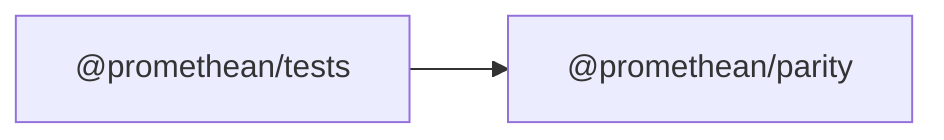

<!-- SYMPKG:PKG:BEGIN -->
# @promethean/parity
**Folder:** `packages/parity`  
**Version:** `0.0.1`  
**Domain:** `_root`

## Dependencies
- _None_
## Dependents
- [@promethean/tests](../tests/README.md)
<!-- SYMPKG:PKG:END -->