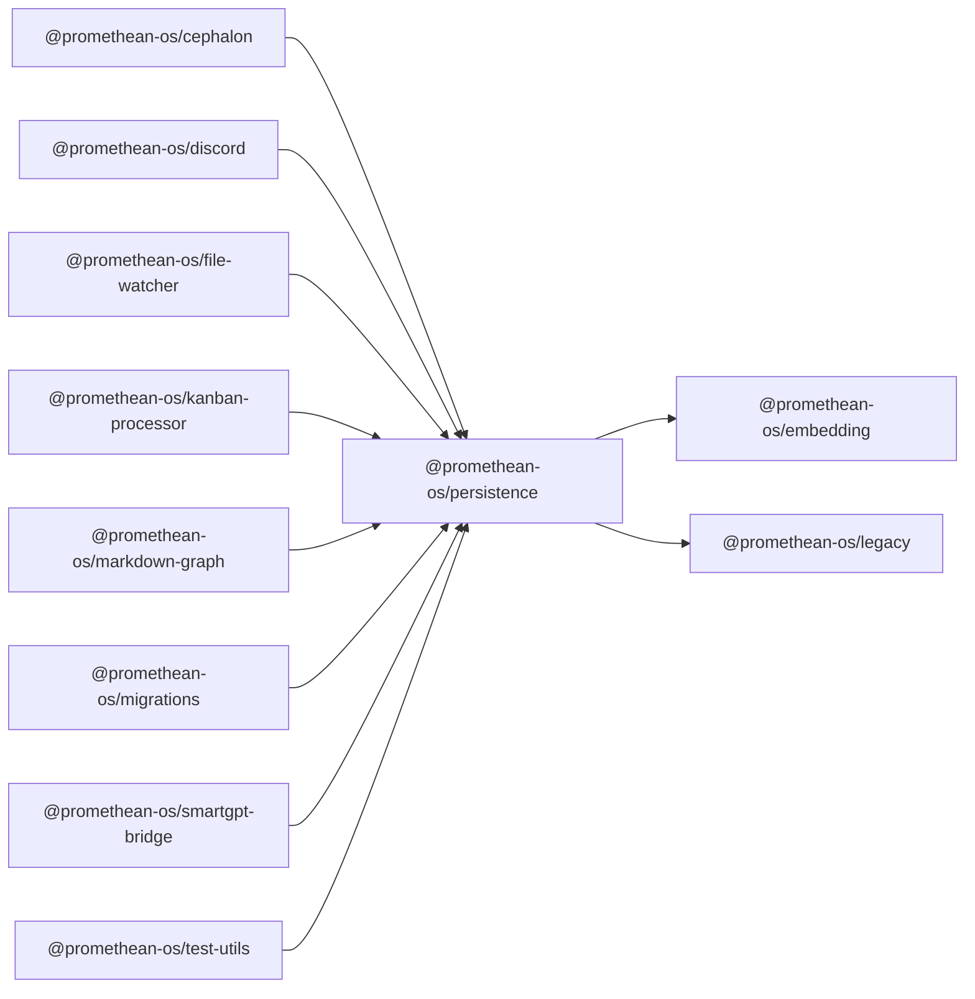

```
<!-- SYMPKG:PKG:BEGIN -->
```
# @promethean-os/persistence
```
**Folder:** `packages/persistence`
```
```
**Version:** `0.0.1`
```
```
**Domain:** `_root`
```

## Dependencies
- @promethean-os/embedding$../embedding/README.md
- @promethean-os/legacy$../legacy/README.md
## Dependents
- @promethean-os/cephalon$../cephalon/README.md
- @promethean-os/discord$../discord/README.md
- @promethean-os/file-watcher$../file-watcher/README.md
- @promethean-os/kanban-processor$../kanban-processor/README.md
- @promethean-os/markdown-graph$../markdown-graph/README.md
- @promethean-os/migrations$../migrations/README.md
- @promethean-os/smartgpt-bridge$../smartgpt-bridge/README.md
- @promethean-os/test-utils$../test-utils/README.md
```


## 📁 Implementation

### Core Files

- [116](../../../packages/persistence/src/116)

### View Source

- [GitHub](https://github.com/promethean-ai/promethean/tree/main/packages/persistence/src)
- [VS Code](vscode://file/packages/persistence/src)


## 📚 API Reference

### Interfaces

#### [- **actions/context-store/collectionInfo.ts**](../../../packages/persistence/src/[src/actions/context-store/collectionInfo.ts](../../../packages/persistence/src/actions/context-store/collectionInfo.ts) (8 lines)#L1)

#### [- **actions/context-store/compileContext.ts**](../../../packages/persistence/src/[src/actions/context-store/compileContext.ts](../../../packages/persistence/src/actions/context-store/compileContext.ts) (59 lines)#L1)

#### [- **actions/context-store/createCollection.ts**](../../../packages/persistence/src/[src/actions/context-store/createCollection.ts](../../../packages/persistence/src/actions/context-store/createCollection.ts) (29 lines)#L1)

#### [- **actions/context-store/getAllRelatedDocuments.ts**](../../../packages/persistence/src/[src/actions/context-store/getAllRelatedDocuments.ts](../../../packages/persistence/src/actions/context-store/getAllRelatedDocuments.ts) (23 lines)#L1)

#### [- **actions/context-store/getCollection.ts**](../../../packages/persistence/src/[src/actions/context-store/getCollection.ts](../../../packages/persistence/src/actions/context-store/getCollection.ts) (14 lines)#L1)

#### [- **actions/context-store/getLatestDocuments.ts**](../../../packages/persistence/src/[src/actions/context-store/getLatestDocuments.ts](../../../packages/persistence/src/actions/context-store/getLatestDocuments.ts) (15 lines)#L1)

#### [- **actions/context-store/getOrCreateCollection.ts**](../../../packages/persistence/src/[src/actions/context-store/getOrCreateCollection.ts](../../../packages/persistence/src/actions/context-store/getOrCreateCollection.ts) (34 lines)#L1)

#### [- **actions/context-store/index.ts**](../../../packages/persistence/src/[src/actions/context-store/index.ts](../../../packages/persistence/src/actions/context-store/index.ts) (11 lines)#L1)

#### [- **actions/context-store/types.ts**](../../../packages/persistence/src/[src/actions/context-store/types.ts](../../../packages/persistence/src/actions/context-store/types.ts) (70 lines)#L1)

#### [- **actions/context-store/utils.ts**](../../../packages/persistence/src/[src/actions/context-store/utils.ts](../../../packages/persistence/src/actions/context-store/utils.ts) (71 lines)#L1)

#### [- **actions/dual-store/addEntry.ts**](../../../packages/persistence/src/[src/actions/dual-store/addEntry.ts](../../../packages/persistence/src/actions/dual-store/addEntry.ts) (10 lines)#L1)

#### [- **actions/dual-store/checkConsistency.ts**](../../../packages/persistence/src/[src/actions/dual-store/checkConsistency.ts](../../../packages/persistence/src/actions/dual-store/checkConsistency.ts) (40 lines)#L1)

#### [- **actions/dual-store/cleanup.ts**](../../../packages/persistence/src/[src/actions/dual-store/cleanup.ts](../../../packages/persistence/src/actions/dual-store/cleanup.ts) (18 lines)#L1)

#### [- **actions/dual-store/get.ts**](../../../packages/persistence/src/[src/actions/dual-store/get.ts](../../../packages/persistence/src/actions/dual-store/get.ts) (25 lines)#L1)

#### [- **actions/dual-store/getChromaQueueStats.ts**](../../../packages/persistence/src/[src/actions/dual-store/getChromaQueueStats.ts](../../../packages/persistence/src/actions/dual-store/getChromaQueueStats.ts) (8 lines)#L1)

#### [- **actions/dual-store/getConsistencyReport.ts**](../../../packages/persistence/src/[src/actions/dual-store/getConsistencyReport.ts](../../../packages/persistence/src/actions/dual-store/getConsistencyReport.ts) (65 lines)#L1)

#### [- **actions/dual-store/getMostRecent.ts**](../../../packages/persistence/src/[src/actions/dual-store/getMostRecent.ts](../../../packages/persistence/src/actions/dual-store/getMostRecent.ts) (49 lines)#L1)

#### [- **actions/dual-store/getMostRelevant.ts**](../../../packages/persistence/src/[src/actions/dual-store/getMostRelevant.ts](../../../packages/persistence/src/actions/dual-store/getMostRelevant.ts) (60 lines)#L1)

#### [- **actions/dual-store/index.ts**](../../../packages/persistence/src/[src/actions/dual-store/index.ts](../../../packages/persistence/src/actions/dual-store/index.ts) (13 lines)#L1)

#### [- **actions/dual-store/insert.ts**](../../../packages/persistence/src/[src/actions/dual-store/insert.ts](../../../packages/persistence/src/actions/dual-store/insert.ts) (83 lines)#L1)

#### [- **actions/dual-store/retryVectorWrite.ts**](../../../packages/persistence/src/[src/actions/dual-store/retryVectorWrite.ts](../../../packages/persistence/src/actions/dual-store/retryVectorWrite.ts) (92 lines)#L1)

#### [- **actions/dual-store/types.ts**](../../../packages/persistence/src/[src/actions/dual-store/types.ts](../../../packages/persistence/src/actions/dual-store/types.ts) (95 lines)#L1)

#### [- **actions/dual-store/utils.ts**](../../../packages/persistence/src/[src/actions/dual-store/utils.ts](../../../packages/persistence/src/actions/dual-store/utils.ts) (87 lines)#L1)

#### [- **chroma-write-queue.ts**](../../../packages/persistence/src/[src/chroma-write-queue.ts](../../../packages/persistence/src/chroma-write-queue.ts) (224 lines)#L1)

#### [- **clients.ts**](../../../packages/persistence/src/[src/clients.ts](../../../packages/persistence/src/clients.ts) (186 lines)#L1)

#### [- **contextStore.ts**](../../../packages/persistence/src/[src/contextStore.ts](../../../packages/persistence/src/contextStore.ts) (228 lines)#L1)

#### [- **dualStore.ts**](../../../packages/persistence/src/[src/dualStore.ts](../../../packages/persistence/src/dualStore.ts) (237 lines)#L1)

#### [- **factories/contextStore.ts**](../../../packages/persistence/src/[src/factories/contextStore.ts](../../../packages/persistence/src/factories/contextStore.ts) (107 lines)#L1)

#### [- **factories/dualStore.ts**](../../../packages/persistence/src/[src/factories/dualStore.ts](../../../packages/persistence/src/factories/dualStore.ts) (252 lines)#L1)

#### [- **index.ts**](../../../packages/persistence/src/[src/index.ts](../../../packages/persistence/src/index.ts) (9 lines)#L1)

#### [- **maintenance.ts**](../../../packages/persistence/src/[src/maintenance.ts](../../../packages/persistence/src/maintenance.ts) (28 lines)#L1)

#### [- **semantic-store/drivers/chromadb.ts**](../../../packages/persistence/src/[src/semantic-store/drivers/chromadb.ts](../../../packages/persistence/src/semantic-store/drivers/chromadb.ts) (252 lines)#L1)

#### [- **semantic-store/drivers/mongodb.ts**](../../../packages/persistence/src/[src/semantic-store/drivers/mongodb.ts](../../../packages/persistence/src/semantic-store/drivers/mongodb.ts) (182 lines)#L1)

#### [- **semantic-store/interfaces.ts**](../../../packages/persistence/src/[src/semantic-store/interfaces.ts](../../../packages/persistence/src/semantic-store/interfaces.ts) (216 lines)#L1)

#### [- **serializers/pickTimestamp.ts**](../../../packages/persistence/src/[src/serializers/pickTimestamp.ts](../../../packages/persistence/src/serializers/pickTimestamp.ts) (11 lines)#L1)

#### [- **serializers/toChromaMetadata.ts**](../../../packages/persistence/src/[src/serializers/toChromaMetadata.ts](../../../packages/persistence/src/serializers/toChromaMetadata.ts) (28 lines)#L1)

#### [- **serializers/toEpochMilliseconds.ts**](../../../packages/persistence/src/[src/serializers/toEpochMilliseconds.ts](../../../packages/persistence/src/serializers/toEpochMilliseconds.ts) (9 lines)#L1)

#### [- **serializers/withTimestampMetadata.ts**](../../../packages/persistence/src/[src/serializers/withTimestampMetadata.ts](../../../packages/persistence/src/serializers/withTimestampMetadata.ts) (12 lines)#L1)

#### [- **test-support/simple-mocks.ts**](../../../packages/persistence/src/[src/test-support/simple-mocks.ts](../../../packages/persistence/src/test-support/simple-mocks.ts) (266 lines)#L1)

#### [- **tests/chroma-write-queue.test.ts**](../../../packages/persistence/src/[src/tests/chroma-write-queue.test.ts](../../../packages/persistence/src/tests/chroma-write-queue.test.ts) (136 lines)#L1)

#### [- **tests/contextStore.class.test.ts**](../../../packages/persistence/src/[src/tests/contextStore.class.test.ts](../../../packages/persistence/src/tests/contextStore.class.test.ts) (189 lines)#L1)

#### [- **tests/dualStoreManager.class.test.ts**](../../../packages/persistence/src/[src/tests/dualStoreManager.class.test.ts](../../../packages/persistence/src/tests/dualStoreManager.class.test.ts) (508 lines)#L1)

#### [- **tests/regression.test.ts**](../../../packages/persistence/src/[src/tests/regression.test.ts](../../../packages/persistence/src/tests/regression.test.ts) (102 lines)#L1)

#### [- **tests/types/simple-search-types.test.ts**](../../../packages/persistence/src/[src/tests/types/simple-search-types.test.ts](../../../packages/persistence/src/tests/types/simple-search-types.test.ts) (286 lines)#L1)

#### [- **tests/types/simple-service-types.test.ts**](../../../packages/persistence/src/[src/tests/types/simple-service-types.test.ts](../../../packages/persistence/src/tests/types/simple-service-types.test.ts) (209 lines)#L1)

#### [- **types.ts**](../../../packages/persistence/src/[src/types.ts](../../../packages/persistence/src/types.ts) (51 lines)#L1)

#### [- **unified-content-model.ts**](../../../packages/persistence/src/[src/unified-content-model.ts](../../../packages/persistence/src/unified-content-model.ts) (729 lines)#L1)

#### [- **unified-indexing-api.ts**](../../../packages/persistence/src/[src/unified-indexing-api.ts](../../../packages/persistence/src/unified-indexing-api.ts) (172 lines)#L1)

#### [- **ChromaWriteQueue**](../../../packages/persistence/src/[ChromaWriteQueue](../../../packages/persistence/src/chroma-write-queue.ts#L21)

#### [- **ContextStore**](../../../packages/persistence/src/[ContextStore](../../../packages/persistence/src/contextStore.ts#L162)

#### [- **DualStoreManager**](../../../packages/persistence/src/[DualStoreManager](../../../packages/persistence/src/dualStore.ts#L90)

#### [- **ChromaDriver**](../../../packages/persistence/src/[ChromaDriver](../../../packages/persistence/src/semantic-store/drivers/chromadb.ts#L11)

#### [- **ChromaDriverFactory**](../../../packages/persistence/src/[ChromaDriverFactory](../../../packages/persistence/src/semantic-store/drivers/chromadb.ts#L237)

#### [- **collectionCount()**](../../../packages/persistence/src/[collectionCount()](../../../packages/persistence/src/actions/context-store/collectionInfo.ts#L3)

#### [- **listCollectionNames()**](../../../packages/persistence/src/[listCollectionNames()](../../../packages/persistence/src/actions/context-store/collectionInfo.ts#L5)

#### [- **compileContext()**](../../../packages/persistence/src/[compileContext()](../../../packages/persistence/src/actions/context-store/compileContext.ts#L30)

#### [- **createCollection()**](../../../packages/persistence/src/[createCollection()](../../../packages/persistence/src/actions/context-store/createCollection.ts#L5)

#### [- **getAllRelatedDocuments()**](../../../packages/persistence/src/[getAllRelatedDocuments()](../../../packages/persistence/src/actions/context-store/getAllRelatedDocuments.ts#L5)

#### [- **GitHub**](../../../packages/persistence/src/[View on GitHub](https#L1)

#### [- **VS Code**](../../../packages/persistence/src/[Open in VS Code](vscode#L1)

#### [**Location**](../../../packages/persistence/src/[ChromaWriteQueue](../../../packages/persistence/src/chroma-write-queue.ts#L21)

#### [**Description**](../../../packages/persistence/src/Main class for chromawritequeue functionality.#L1)

#### [**File**](../../../packages/persistence/src/`src/chroma-write-queue.ts`#L1)

#### [**Location**](../../../packages/persistence/src/[ContextStore](../../../packages/persistence/src/contextStore.ts#L162)

#### [**Description**](../../../packages/persistence/src/Main class for contextstore functionality.#L1)

#### [**File**](../../../packages/persistence/src/`src/contextStore.ts`#L1)

#### [**Location**](../../../packages/persistence/src/[DualStoreManager](../../../packages/persistence/src/dualStore.ts#L90)

#### [**Description**](../../../packages/persistence/src/Main class for dualstoremanager functionality.#L1)

#### [**File**](../../../packages/persistence/src/`src/dualStore.ts`#L1)

#### [**Location**](../../../packages/persistence/src/[ChromaDriver](../../../packages/persistence/src/semantic-store/drivers/chromadb.ts#L11)

#### [**Description**](../../../packages/persistence/src/Main class for chromadriver functionality.#L1)

#### [**File**](../../../packages/persistence/src/`src/semantic-store/drivers/chromadb.ts`#L1)

#### [**Location**](../../../packages/persistence/src/[ChromaDriverFactory](../../../packages/persistence/src/semantic-store/drivers/chromadb.ts#L237)

#### [**Description**](../../../packages/persistence/src/Main class for chromadriverfactory functionality.#L1)

#### [**File**](../../../packages/persistence/src/`src/semantic-store/drivers/chromadb.ts`#L1)

#### [**Location**](../../../packages/persistence/src/[MongoDriver](../../../packages/persistence/src/semantic-store/drivers/mongodb.ts#L10)

#### [**Description**](../../../packages/persistence/src/Main class for mongodriver functionality.#L1)

#### [**File**](../../../packages/persistence/src/`src/semantic-store/drivers/mongodb.ts`#L1)

#### [**Location**](../../../packages/persistence/src/[MongoDriverFactory](../../../packages/persistence/src/semantic-store/drivers/mongodb.ts#L167)

#### [**Description**](../../../packages/persistence/src/Main class for mongodriverfactory functionality.#L1)

#### [**File**](../../../packages/persistence/src/`src/semantic-store/drivers/mongodb.ts`#L1)

#### [**Location**](../../../packages/persistence/src/[SemanticStoreError](../../../packages/persistence/src/semantic-store/interfaces.ts#L182)

#### [**Description**](../../../packages/persistence/src/Main class for semanticstoreerror functionality.#L1)

#### [**File**](../../../packages/persistence/src/`src/semantic-store/interfaces.ts`#L1)

#### [**Location**](../../../packages/persistence/src/[collectionCount()](../../../packages/persistence/src/actions/context-store/collectionInfo.ts#L3)

#### [**Description**](../../../packages/persistence/src/Key function for collectioncount operations.#L1)

#### [**File**](../../../packages/persistence/src/`src/actions/context-store/collectionInfo.ts`#L1)

#### [**Location**](../../../packages/persistence/src/[listCollectionNames()](../../../packages/persistence/src/actions/context-store/collectionInfo.ts#L5)

#### [**Description**](../../../packages/persistence/src/Key function for listcollectionnames operations.#L1)

#### [**File**](../../../packages/persistence/src/`src/actions/context-store/collectionInfo.ts`#L1)

#### [**Location**](../../../packages/persistence/src/[compileContext()](../../../packages/persistence/src/actions/context-store/compileContext.ts#L30)

#### [**Description**](../../../packages/persistence/src/Key function for compilecontext operations.#L1)

#### [**File**](../../../packages/persistence/src/`src/actions/context-store/compileContext.ts`#L1)

#### [**Location**](../../../packages/persistence/src/[createCollection()](../../../packages/persistence/src/actions/context-store/createCollection.ts#L5)

#### [**Description**](../../../packages/persistence/src/Key function for createcollection operations.#L1)

#### [**File**](../../../packages/persistence/src/`src/actions/context-store/createCollection.ts`#L1)

#### [**Location**](../../../packages/persistence/src/[getAllRelatedDocuments()](../../../packages/persistence/src/actions/context-store/getAllRelatedDocuments.ts#L5)

#### [**Description**](../../../packages/persistence/src/Key function for getallrelateddocuments operations.#L1)

#### [**File**](../../../packages/persistence/src/`src/actions/context-store/getAllRelatedDocuments.ts`#L1)

#### [**Location**](../../../packages/persistence/src/[getCollection()](../../../packages/persistence/src/actions/context-store/getCollection.ts#L3)

#### [**Description**](../../../packages/persistence/src/Key function for getcollection operations.#L1)

#### [**File**](../../../packages/persistence/src/`src/actions/context-store/getCollection.ts`#L1)

#### [**Location**](../../../packages/persistence/src/[getLatestDocuments()](../../../packages/persistence/src/actions/context-store/getLatestDocuments.ts#L5)

#### [**Description**](../../../packages/persistence/src/Key function for getlatestdocuments operations.#L1)

#### [**File**](../../../packages/persistence/src/`src/actions/context-store/getLatestDocuments.ts`#L1)

#### [**Location**](../../../packages/persistence/src/[getOrCreateCollection()](../../../packages/persistence/src/actions/context-store/getOrCreateCollection.ts#L10)

#### [**Description**](../../../packages/persistence/src/Key function for getorcreatecollection operations.#L1)

#### [**File**](../../../packages/persistence/src/`src/actions/context-store/getOrCreateCollection.ts`#L1)

#### [**Location**](../../../packages/persistence/src/[formatMessage()](../../../packages/persistence/src/actions/context-store/utils.ts#L12)

#### [**Description**](../../../packages/persistence/src/Key function for formatmessage operations.#L1)

#### [**File**](../../../packages/persistence/src/`src/actions/context-store/utils.ts`#L1)

#### [**Location**](../../../packages/persistence/src/[dedupeByText()](../../../packages/persistence/src/actions/context-store/utils.ts#L23)

#### [**Description**](../../../packages/persistence/src/Key function for dedupebytext operations.#L1)

#### [**File**](../../../packages/persistence/src/`src/actions/context-store/utils.ts`#L1)

#### [**Location**](../../../packages/persistence/src/[sortByTimestamp()](../../../packages/persistence/src/actions/context-store/utils.ts#L32)

#### [**Description**](../../../packages/persistence/src/Key function for sortbytimestamp operations.#L1)

#### [**File**](../../../packages/persistence/src/`src/actions/context-store/utils.ts`#L1)

#### [**Location**](../../../packages/persistence/src/[limitByCollectionCount()](../../../packages/persistence/src/actions/context-store/utils.ts#L35)

#### [**Description**](../../../packages/persistence/src/Key function for limitbycollectioncount operations.#L1)

#### [**File**](../../../packages/persistence/src/`src/actions/context-store/utils.ts`#L1)

#### [**Location**](../../../packages/persistence/src/[toMessage()](../../../packages/persistence/src/actions/context-store/utils.ts#L45)

#### [**Description**](../../../packages/persistence/src/Key function for tomessage operations.#L1)

#### [**File**](../../../packages/persistence/src/`src/actions/context-store/utils.ts`#L1)

#### [**Location**](../../../packages/persistence/src/[getCollections()](../../../packages/persistence/src/actions/context-store/utils.ts#L69)

#### [**Description**](../../../packages/persistence/src/Key function for getcollections operations.#L1)

#### [**File**](../../../packages/persistence/src/`src/actions/context-store/utils.ts`#L1)

#### [**Location**](../../../packages/persistence/src/[addEntry()](../../../packages/persistence/src/actions/dual-store/addEntry.ts#L5)

#### [**Description**](../../../packages/persistence/src/Key function for addentry operations.#L1)

#### [**File**](../../../packages/persistence/src/`src/actions/dual-store/addEntry.ts`#L1)

#### [**Location**](../../../packages/persistence/src/[checkConsistency()](../../../packages/persistence/src/actions/dual-store/checkConsistency.ts#L6)

#### [**Description**](../../../packages/persistence/src/Key function for checkconsistency operations.#L1)

#### [**File**](../../../packages/persistence/src/`src/actions/dual-store/checkConsistency.ts`#L1)

#### [**Location**](../../../packages/persistence/src/[cleanup()](../../../packages/persistence/src/actions/dual-store/cleanup.ts#L3)

#### [**Description**](../../../packages/persistence/src/Key function for cleanup operations.#L1)

#### [**File**](../../../packages/persistence/src/`src/actions/dual-store/cleanup.ts`#L1)

#### [**Location**](../../../packages/persistence/src/[get()](../../../packages/persistence/src/actions/dual-store/get.ts#L8)

#### [**Description**](../../../packages/persistence/src/Key function for get operations.#L1)

#### [**File**](../../../packages/persistence/src/`src/actions/dual-store/get.ts`#L1)

#### [**Location**](../../../packages/persistence/src/[getChromaQueueStats()](../../../packages/persistence/src/actions/dual-store/getChromaQueueStats.ts#L3)

#### [**Description**](../../../packages/persistence/src/Key function for getchromaqueuestats operations.#L1)

#### [**File**](../../../packages/persistence/src/`src/actions/dual-store/getChromaQueueStats.ts`#L1)

#### [**Location**](../../../packages/persistence/src/[getConsistencyReport()](../../../packages/persistence/src/actions/dual-store/getConsistencyReport.ts#L4)

#### [**Description**](../../../packages/persistence/src/Key function for getconsistencyreport operations.#L1)

#### [**File**](../../../packages/persistence/src/`src/actions/dual-store/getConsistencyReport.ts`#L1)

#### [**Location**](../../../packages/persistence/src/[getMostRecent()](../../../packages/persistence/src/actions/dual-store/getMostRecent.ts#L8)

#### [**Description**](../../../packages/persistence/src/Key function for getmostrecent operations.#L1)

#### [**File**](../../../packages/persistence/src/`src/actions/dual-store/getMostRecent.ts`#L1)

#### [**Location**](../../../packages/persistence/src/[getMostRelevant()](../../../packages/persistence/src/actions/dual-store/getMostRelevant.ts#L6)

#### [**Description**](../../../packages/persistence/src/Key function for getmostrelevant operations.#L1)

#### [**File**](../../../packages/persistence/src/`src/actions/dual-store/getMostRelevant.ts`#L1)

#### [**Location**](../../../packages/persistence/src/[insert()](../../../packages/persistence/src/actions/dual-store/insert.ts#L9)

#### [**Description**](../../../packages/persistence/src/Key function for insert operations.#L1)

#### [**File**](../../../packages/persistence/src/`src/actions/dual-store/insert.ts`#L1)

#### [**Location**](../../../packages/persistence/src/[retryVectorWrite()](../../../packages/persistence/src/actions/dual-store/retryVectorWrite.ts#L11)

#### [**Description**](../../../packages/persistence/src/Key function for retryvectorwrite operations.#L1)

#### [**File**](../../../packages/persistence/src/`src/actions/dual-store/retryVectorWrite.ts`#L1)

#### [**Location**](../../../packages/persistence/src/[normaliseTimestamp()](../../../packages/persistence/src/actions/dual-store/utils.ts#L5)

#### [**Description**](../../../packages/persistence/src/Key function for normalisetimestamp operations.#L1)

#### [**File**](../../../packages/persistence/src/`src/actions/dual-store/utils.ts`#L1)

#### [**Location**](../../../packages/persistence/src/[normaliseMetadataValue()](../../../packages/persistence/src/actions/dual-store/utils.ts#L22)

#### [**Description**](../../../packages/persistence/src/Key function for normalisemetadatavalue operations.#L1)

#### [**File**](../../../packages/persistence/src/`src/actions/dual-store/utils.ts`#L1)

#### [**Location**](../../../packages/persistence/src/[buildChromaMetadata()](../../../packages/persistence/src/actions/dual-store/utils.ts#L38)

#### [**Description**](../../../packages/persistence/src/Key function for buildchromametadata operations.#L1)

#### [**File**](../../../packages/persistence/src/`src/actions/dual-store/utils.ts`#L1)

#### [**Location**](../../../packages/persistence/src/[fromMongoDocument()](../../../packages/persistence/src/actions/dual-store/utils.ts#L60)

#### [**Description**](../../../packages/persistence/src/Key function for frommongodocument operations.#L1)

#### [**File**](../../../packages/persistence/src/`src/actions/dual-store/utils.ts`#L1)

#### [**Location**](../../../packages/persistence/src/[getOrCreateQueue()](../../../packages/persistence/src/chroma-write-queue.ts#L204)

#### [**Description**](../../../packages/persistence/src/Key function for getorcreatequeue operations.#L1)

#### [**File**](../../../packages/persistence/src/`src/chroma-write-queue.ts`#L1)

#### [**Location**](../../../packages/persistence/src/[shutdownAllQueues()](../../../packages/persistence/src/chroma-write-queue.ts#L219)

#### [**Description**](../../../packages/persistence/src/Key function for shutdownallqueues operations.#L1)

#### [**File**](../../../packages/persistence/src/`src/chroma-write-queue.ts`#L1)

#### [**Location**](../../../packages/persistence/src/[validateMongoConnection()](../../../packages/persistence/src/clients.ts#L52)

#### [**Description**](../../../packages/persistence/src/Key function for validatemongoconnection operations.#L1)

#### [**File**](../../../packages/persistence/src/`src/clients.ts`#L1)

#### [**Location**](../../../packages/persistence/src/[getMongoClient()](../../../packages/persistence/src/clients.ts#L94)

#### [**Description**](../../../packages/persistence/src/Key function for getmongoclient operations.#L1)

#### [**File**](../../../packages/persistence/src/`src/clients.ts`#L1)

#### [**Location**](../../../packages/persistence/src/[getChromaClient()](../../../packages/persistence/src/clients.ts#L120)

#### [**Description**](../../../packages/persistence/src/Key function for getchromaclient operations.#L1)

#### [**File**](../../../packages/persistence/src/`src/clients.ts`#L1)

#### [**Location**](../../../packages/persistence/src/[__setMongoClientForTests()](../../../packages/persistence/src/clients.ts#L144)

#### [**Description**](../../../packages/persistence/src/Key function for __setmongoclientfortests operations.#L1)

#### [**File**](../../../packages/persistence/src/`src/clients.ts`#L1)

#### [**Location**](../../../packages/persistence/src/[__setChromaClientForTests()](../../../packages/persistence/src/clients.ts#L147)

#### [**Description**](../../../packages/persistence/src/Key function for __setchromaclientfortests operations.#L1)

#### [**File**](../../../packages/persistence/src/`src/clients.ts`#L1)

#### [**Location**](../../../packages/persistence/src/[__resetPersistenceClientsForTests()](../../../packages/persistence/src/clients.ts#L150)

#### [**Description**](../../../packages/persistence/src/Key function for __resetpersistenceclientsfortests operations.#L1)

#### [**File**](../../../packages/persistence/src/`src/clients.ts`#L1)

#### [**Location**](../../../packages/persistence/src/[cleanupClients()](../../../packages/persistence/src/clients.ts#L160)

#### [**Description**](../../../packages/persistence/src/Key function for cleanupclients operations.#L1)

#### [**File**](../../../packages/persistence/src/`src/clients.ts`#L1)

#### [**Location**](../../../packages/persistence/src/[createContextStore()](../../../packages/persistence/src/contextStore.ts#L82)

#### [**Description**](../../../packages/persistence/src/Key function for createcontextstore operations.#L1)

#### [**File**](../../../packages/persistence/src/`src/contextStore.ts`#L1)

#### [**Location**](../../../packages/persistence/src/[createCollection()](../../../packages/persistence/src/contextStore.ts#L91)

#### [**Description**](../../../packages/persistence/src/Key function for createcollection operations.#L1)

#### [**File**](../../../packages/persistence/src/`src/contextStore.ts`#L1)

#### [**Location**](../../../packages/persistence/src/[getOrCreateCollection()](../../../packages/persistence/src/contextStore.ts#L102)

#### [**Description**](../../../packages/persistence/src/Key function for getorcreatecollection operations.#L1)

#### [**File**](../../../packages/persistence/src/`src/contextStore.ts`#L1)

#### [**Location**](../../../packages/persistence/src/[getCollection()](../../../packages/persistence/src/contextStore.ts#L111)

#### [**Description**](../../../packages/persistence/src/Key function for getcollection operations.#L1)

#### [**File**](../../../packages/persistence/src/`src/contextStore.ts`#L1)

#### [**Location**](../../../packages/persistence/src/[collectionCount()](../../../packages/persistence/src/contextStore.ts#L114)

#### [**Description**](../../../packages/persistence/src/Key function for collectioncount operations.#L1)

#### [**File**](../../../packages/persistence/src/`src/contextStore.ts`#L1)

#### [**Location**](../../../packages/persistence/src/[listCollectionNames()](../../../packages/persistence/src/contextStore.ts#L117)

#### [**Description**](../../../packages/persistence/src/Key function for listcollectionnames operations.#L1)

#### [**File**](../../../packages/persistence/src/`src/contextStore.ts`#L1)

#### [**Location**](../../../packages/persistence/src/[getAllRelatedDocuments()](../../../packages/persistence/src/contextStore.ts#L120)

#### [**Description**](../../../packages/persistence/src/Key function for getallrelateddocuments operations.#L1)

#### [**File**](../../../packages/persistence/src/`src/contextStore.ts`#L1)

#### [**Location**](../../../packages/persistence/src/[getLatestDocuments()](../../../packages/persistence/src/contextStore.ts#L130)

#### [**Description**](../../../packages/persistence/src/Key function for getlatestdocuments operations.#L1)

#### [**File**](../../../packages/persistence/src/`src/contextStore.ts`#L1)

#### [**Location**](../../../packages/persistence/src/[compileContext()](../../../packages/persistence/src/contextStore.ts#L136)

#### [**Description**](../../../packages/persistence/src/Key function for compilecontext operations.#L1)

#### [**File**](../../../packages/persistence/src/`src/contextStore.ts`#L1)

#### [**Location**](../../../packages/persistence/src/[createContextStoreFactory()](../../../packages/persistence/src/contextStore.ts#L226)

#### [**Description**](../../../packages/persistence/src/Key function for createcontextstorefactory operations.#L1)

#### [**File**](../../../packages/persistence/src/`src/contextStore.ts`#L1)

#### [**Location**](../../../packages/persistence/src/[createDualStoreManager()](../../../packages/persistence/src/dualStore.ts#L236)

#### [**Description**](../../../packages/persistence/src/Key function for createdualstoremanager operations.#L1)

#### [**File**](../../../packages/persistence/src/`src/dualStore.ts`#L1)

#### [**Location**](../../../packages/persistence/src/[createContextStoreImplementation()](../../../packages/persistence/src/factories/contextStore.ts#L57)

#### [**Description**](../../../packages/persistence/src/Key function for createcontextstoreimplementation operations.#L1)

#### [**File**](../../../packages/persistence/src/`src/factories/contextStore.ts`#L1)

#### [**Location**](../../../packages/persistence/src/[createDualStoreImplementation()](../../../packages/persistence/src/factories/dualStore.ts#L130)

#### [**Description**](../../../packages/persistence/src/Key function for createdualstoreimplementation operations.#L1)

#### [**File**](../../../packages/persistence/src/`src/factories/dualStore.ts`#L1)

#### [**Location**](../../../packages/persistence/src/[registerPendingDualStoreConfig()](../../../packages/persistence/src/factories/dualStore.ts#L162)

#### [**Description**](../../../packages/persistence/src/Key function for registerpendingdualstoreconfig operations.#L1)

#### [**File**](../../../packages/persistence/src/`src/factories/dualStore.ts`#L1)

#### [**Location**](../../../packages/persistence/src/[consumePendingDualStoreConfig()](../../../packages/persistence/src/factories/dualStore.ts#L168)

#### [**Description**](../../../packages/persistence/src/Key function for consumependingdualstoreconfig operations.#L1)

#### [**File**](../../../packages/persistence/src/`src/factories/dualStore.ts`#L1)

#### [**Location**](../../../packages/persistence/src/[resolveDualStoreResources()](../../../packages/persistence/src/factories/dualStore.ts#L193)

#### [**Description**](../../../packages/persistence/src/Key function for resolvedualstoreresources operations.#L1)

#### [**File**](../../../packages/persistence/src/`src/factories/dualStore.ts`#L1)

#### [**Location**](../../../packages/persistence/src/[createDualStore()](../../../packages/persistence/src/factories/dualStore.ts#L246)

#### [**Description**](../../../packages/persistence/src/Key function for createdualstore operations.#L1)

#### [**File**](../../../packages/persistence/src/`src/factories/dualStore.ts`#L1)

#### [**Location**](../../../packages/persistence/src/[cleanupMongo()](../../../packages/persistence/src/maintenance.ts#L8)

#### [**Description**](../../../packages/persistence/src/Key function for cleanupmongo operations.#L1)

#### [**File**](../../../packages/persistence/src/`src/maintenance.ts`#L1)

#### [**Location**](../../../packages/persistence/src/[cleanupChroma()](../../../packages/persistence/src/maintenance.ts#L18)

#### [**Description**](../../../packages/persistence/src/Key function for cleanupchroma operations.#L1)

#### [**File**](../../../packages/persistence/src/`src/maintenance.ts`#L1)

#### [**Location**](../../../packages/persistence/src/[pickTimestamp()](../../../packages/persistence/src/serializers/pickTimestamp.ts#L3)

#### [**Description**](../../../packages/persistence/src/Key function for picktimestamp operations.#L1)

#### [**File**](../../../packages/persistence/src/`src/serializers/pickTimestamp.ts`#L1)

#### [**Location**](../../../packages/persistence/src/[toChromaMetadata()](../../../packages/persistence/src/serializers/toChromaMetadata.ts#L21)

#### [**Description**](../../../packages/persistence/src/Key function for tochromametadata operations.#L1)

#### [**File**](../../../packages/persistence/src/`src/serializers/toChromaMetadata.ts`#L1)

#### [**Location**](../../../packages/persistence/src/[toEpochMilliseconds()](../../../packages/persistence/src/serializers/toEpochMilliseconds.ts#L3)

#### [**Description**](../../../packages/persistence/src/Key function for toepochmilliseconds operations.#L1)

#### [**File**](../../../packages/persistence/src/`src/serializers/toEpochMilliseconds.ts`#L1)

#### [**Location**](../../../packages/persistence/src/[withTimestampMetadata()](../../../packages/persistence/src/serializers/withTimestampMetadata.ts#L3)

#### [**Description**](../../../packages/persistence/src/Key function for withtimestampmetadata operations.#L1)

#### [**File**](../../../packages/persistence/src/`src/serializers/withTimestampMetadata.ts`#L1)

#### [**Location**](../../../packages/persistence/src/[createMockIndexableContent()](../../../packages/persistence/src/test-support/simple-mocks.ts#L22)

#### [**Description**](../../../packages/persistence/src/Key function for createmockindexablecontent operations.#L1)

#### [**File**](../../../packages/persistence/src/`src/test-support/simple-mocks.ts`#L1)

#### [**Location**](../../../packages/persistence/src/[createMockSearchQuery()](../../../packages/persistence/src/test-support/simple-mocks.ts#L49)

#### [**Description**](../../../packages/persistence/src/Key function for createmocksearchquery operations.#L1)

#### [**File**](../../../packages/persistence/src/`src/test-support/simple-mocks.ts`#L1)

#### [**Location**](../../../packages/persistence/src/[createMockSearchResult()](../../../packages/persistence/src/test-support/simple-mocks.ts#L64)

#### [**Description**](../../../packages/persistence/src/Key function for createmocksearchresult operations.#L1)

#### [**File**](../../../packages/persistence/src/`src/test-support/simple-mocks.ts`#L1)

#### [**Location**](../../../packages/persistence/src/[createMockSearchResponse()](../../../packages/persistence/src/test-support/simple-mocks.ts#L76)

#### [**Description**](../../../packages/persistence/src/Key function for createmocksearchresponse operations.#L1)

#### [**File**](../../../packages/persistence/src/`src/test-support/simple-mocks.ts`#L1)

#### [**Location**](../../../packages/persistence/src/[createMockIndexingStats()](../../../packages/persistence/src/test-support/simple-mocks.ts#L91)

#### [**Description**](../../../packages/persistence/src/Key function for createmockindexingstats operations.#L1)

#### [**File**](../../../packages/persistence/src/`src/test-support/simple-mocks.ts`#L1)

#### [**Location**](../../../packages/persistence/src/[createMockIndexingOptions()](../../../packages/persistence/src/test-support/simple-mocks.ts#L128)

#### [**Description**](../../../packages/persistence/src/Key function for createmockindexingoptions operations.#L1)

#### [**File**](../../../packages/persistence/src/`src/test-support/simple-mocks.ts`#L1)

#### [**Location**](../../../packages/persistence/src/[createMockUnifiedIndexingConfig()](../../../packages/persistence/src/test-support/simple-mocks.ts#L144)

#### [**Description**](../../../packages/persistence/src/Key function for createmockunifiedindexingconfig operations.#L1)

#### [**File**](../../../packages/persistence/src/`src/test-support/simple-mocks.ts`#L1)

#### [**Location**](../../../packages/persistence/src/[isValidIndexableContent()](../../../packages/persistence/src/test-support/simple-mocks.ts#L179)

#### [**Description**](../../../packages/persistence/src/Key function for isvalidindexablecontent operations.#L1)

#### [**File**](../../../packages/persistence/src/`src/test-support/simple-mocks.ts`#L1)

#### [**Location**](../../../packages/persistence/src/[isValidSearchQuery()](../../../packages/persistence/src/test-support/simple-mocks.ts#L199)

#### [**Description**](../../../packages/persistence/src/Key function for isvalidsearchquery operations.#L1)

#### [**File**](../../../packages/persistence/src/`src/test-support/simple-mocks.ts`#L1)

#### [**Location**](../../../packages/persistence/src/[isValidSearchResult()](../../../packages/persistence/src/test-support/simple-mocks.ts#L218)

#### [**Description**](../../../packages/persistence/src/Key function for isvalidsearchresult operations.#L1)

#### [**File**](../../../packages/persistence/src/`src/test-support/simple-mocks.ts`#L1)

#### [**Location**](../../../packages/persistence/src/[isValidSearchResponse()](../../../packages/persistence/src/test-support/simple-mocks.ts#L229)

#### [**Description**](../../../packages/persistence/src/Key function for isvalidsearchresponse operations.#L1)

#### [**File**](../../../packages/persistence/src/`src/test-support/simple-mocks.ts`#L1)

#### [**Location**](../../../packages/persistence/src/[isValidIndexingStats()](../../../packages/persistence/src/test-support/simple-mocks.ts#L250)

#### [**Description**](../../../packages/persistence/src/Key function for isvalidindexingstats operations.#L1)

#### [**File**](../../../packages/persistence/src/`src/test-support/simple-mocks.ts`#L1)

#### [**Location**](../../../packages/persistence/src/[transformDualStoreEntry()](../../../packages/persistence/src/unified-content-model.ts#L340)

#### [**Description**](../../../packages/persistence/src/Key function for transformdualstoreentry operations.#L1)

#### [**File**](../../../packages/persistence/src/`src/unified-content-model.ts`#L1)

#### [**Location**](../../../packages/persistence/src/[transformIndexedFile()](../../../packages/persistence/src/unified-content-model.ts#L388)

#### [**Description**](../../../packages/persistence/src/Key function for transformindexedfile operations.#L1)

#### [**File**](../../../packages/persistence/src/`src/unified-content-model.ts`#L1)

#### [**Location**](../../../packages/persistence/src/[transformDiscordMessage()](../../../packages/persistence/src/unified-content-model.ts#L422)

#### [**Description**](../../../packages/persistence/src/Key function for transformdiscordmessage operations.#L1)

#### [**File**](../../../packages/persistence/src/`src/unified-content-model.ts`#L1)

#### [**Location**](../../../packages/persistence/src/[transformOpenCodeSession()](../../../packages/persistence/src/unified-content-model.ts#L488)

#### [**Description**](../../../packages/persistence/src/Key function for transformopencodesession operations.#L1)

#### [**File**](../../../packages/persistence/src/`src/unified-content-model.ts`#L1)

#### [**Location**](../../../packages/persistence/src/[transformOpenCodeMessage()](../../../packages/persistence/src/unified-content-model.ts#L530)

#### [**Description**](../../../packages/persistence/src/Key function for transformopencodemessage operations.#L1)

#### [**File**](../../../packages/persistence/src/`src/unified-content-model.ts`#L1)

#### [**Location**](../../../packages/persistence/src/[transformOpencodeEvent()](../../../packages/persistence/src/unified-content-model.ts#L566)

#### [**Description**](../../../packages/persistence/src/Key function for transformopencodeevent operations.#L1)

#### [**File**](../../../packages/persistence/src/`src/unified-content-model.ts`#L1)

#### [**Location**](../../../packages/persistence/src/[transformKanbanTask()](../../../packages/persistence/src/unified-content-model.ts#L601)

#### [**Description**](../../../packages/persistence/src/Key function for transformkanbantask operations.#L1)

#### [**File**](../../../packages/persistence/src/`src/unified-content-model.ts`#L1)

#### [**Location**](../../../packages/persistence/src/[validateIndexableContent()](../../../packages/persistence/src/unified-content-model.ts#L653)

#### [**Description**](../../../packages/persistence/src/Key function for validateindexablecontent operations.#L1)

#### [**File**](../../../packages/persistence/src/`src/unified-content-model.ts`#L1)

#### [**Location**](../../../packages/persistence/src/[createUnifiedIndexingClient()](../../../packages/persistence/src/unified-indexing-api.ts#L166)

#### [**Description**](../../../packages/persistence/src/Key function for createunifiedindexingclient operations.#L1)

#### [**File**](../../../packages/persistence/src/`src/unified-indexing-api.ts`#L1)

#### [**Location**](../../../packages/persistence/src/[PrimaryDatabaseConfig](../../../packages/persistence/src/semantic-store/interfaces.ts#L9)

#### [**Description**](../../../packages/persistence/src/Type definition for primarydatabaseconfig.#L1)

#### [**File**](../../../packages/persistence/src/`src/semantic-store/interfaces.ts`#L1)

#### [**Location**](../../../packages/persistence/src/[VectorSearchConfig](../../../packages/persistence/src/semantic-store/interfaces.ts#L19)

#### [**Description**](../../../packages/persistence/src/Type definition for vectorsearchconfig.#L1)

#### [**File**](../../../packages/persistence/src/`src/semantic-store/interfaces.ts`#L1)

#### [**Location**](../../../packages/persistence/src/[SemanticStoreConfig](../../../packages/persistence/src/semantic-store/interfaces.ts#L35)

#### [**Description**](../../../packages/persistence/src/Type definition for semanticstoreconfig.#L1)

#### [**File**](../../../packages/persistence/src/`src/semantic-store/interfaces.ts`#L1)

#### [**Location**](../../../packages/persistence/src/[PrimaryDatabaseDriver](../../../packages/persistence/src/semantic-store/interfaces.ts#L56)

#### [**Description**](../../../packages/persistence/src/Type definition for primarydatabasedriver.#L1)

#### [**File**](../../../packages/persistence/src/`src/semantic-store/interfaces.ts`#L1)

#### [**Location**](../../../packages/persistence/src/[VectorSearchDriver](../../../packages/persistence/src/semantic-store/interfaces.ts#L99)

#### [**Description**](../../../packages/persistence/src/Type definition for vectorsearchdriver.#L1)

#### [**File**](../../../packages/persistence/src/`src/semantic-store/interfaces.ts`#L1)

#### [**Location**](../../../packages/persistence/src/[QueueStats](../../../packages/persistence/src/semantic-store/interfaces.ts#L152)

#### [**Description**](../../../packages/persistence/src/Type definition for queuestats.#L1)

#### [**File**](../../../packages/persistence/src/`src/semantic-store/interfaces.ts`#L1)

#### [**Location**](../../../packages/persistence/src/[ConsistencyReport](../../../packages/persistence/src/semantic-store/interfaces.ts#L167)

#### [**Description**](../../../packages/persistence/src/Type definition for consistencyreport.#L1)

#### [**File**](../../../packages/persistence/src/`src/semantic-store/interfaces.ts`#L1)

#### [**Location**](../../../packages/persistence/src/[SemanticStoreEvent](../../../packages/persistence/src/semantic-store/interfaces.ts#L200)

#### [**Description**](../../../packages/persistence/src/Type definition for semanticstoreevent.#L1)

#### [**File**](../../../packages/persistence/src/`src/semantic-store/interfaces.ts`#L1)

#### [**Location**](../../../packages/persistence/src/[DriverFactory](../../../packages/persistence/src/semantic-store/interfaces.ts#L211)

#### [**Description**](../../../packages/persistence/src/Type definition for driverfactory.#L1)

#### [**File**](../../../packages/persistence/src/`src/semantic-store/interfaces.ts`#L1)

#### [**Location**](../../../packages/persistence/src/[BaseContentMetadata](../../../packages/persistence/src/unified-content-model.ts#L32)

#### [**Description**](../../../packages/persistence/src/Type definition for basecontentmetadata.#L1)

#### [**File**](../../../packages/persistence/src/`src/unified-content-model.ts`#L1)

#### [**Location**](../../../packages/persistence/src/[FileMetadata](../../../packages/persistence/src/unified-content-model.ts#L76)

#### [**Description**](../../../packages/persistence/src/Type definition for filemetadata.#L1)

#### [**File**](../../../packages/persistence/src/`src/unified-content-model.ts`#L1)

#### [**Location**](../../../packages/persistence/src/[MessageMetadata](../../../packages/persistence/src/unified-content-model.ts#L101)

#### [**Description**](../../../packages/persistence/src/Type definition for messagemetadata.#L1)

#### [**File**](../../../packages/persistence/src/`src/unified-content-model.ts`#L1)

#### [**Location**](../../../packages/persistence/src/[EventMetadata](../../../packages/persistence/src/unified-content-model.ts#L129)

#### [**Description**](../../../packages/persistence/src/Type definition for eventmetadata.#L1)

#### [**File**](../../../packages/persistence/src/`src/unified-content-model.ts`#L1)

#### [**Location**](../../../packages/persistence/src/[SessionMetadata](../../../packages/persistence/src/unified-content-model.ts#L150)

#### [**Description**](../../../packages/persistence/src/Type definition for sessionmetadata.#L1)

#### [**File**](../../../packages/persistence/src/`src/unified-content-model.ts`#L1)

#### [**Location**](../../../packages/persistence/src/[AttachmentMetadata](../../../packages/persistence/src/unified-content-model.ts#L173)

#### [**Description**](../../../packages/persistence/src/Type definition for attachmentmetadata.#L1)

#### [**File**](../../../packages/persistence/src/`src/unified-content-model.ts`#L1)

#### [**Location**](../../../packages/persistence/src/[ThoughtMetadata](../../../packages/persistence/src/unified-content-model.ts#L197)

#### [**Description**](../../../packages/persistence/src/Type definition for thoughtmetadata.#L1)

#### [**File**](../../../packages/persistence/src/`src/unified-content-model.ts`#L1)

#### [**Location**](../../../packages/persistence/src/[DocumentMetadata](../../../packages/persistence/src/unified-content-model.ts#L216)

#### [**Description**](../../../packages/persistence/src/Type definition for documentmetadata.#L1)

#### [**File**](../../../packages/persistence/src/`src/unified-content-model.ts`#L1)

#### [**Location**](../../../packages/persistence/src/[TaskMetadata](../../../packages/persistence/src/unified-content-model.ts#L245)

#### [**Description**](../../../packages/persistence/src/Type definition for taskmetadata.#L1)

#### [**File**](../../../packages/persistence/src/`src/unified-content-model.ts`#L1)

#### [**Location**](../../../packages/persistence/src/[BoardMetadata](../../../packages/persistence/src/unified-content-model.ts#L269)

#### [**Description**](../../../packages/persistence/src/Type definition for boardmetadata.#L1)

#### [**File**](../../../packages/persistence/src/`src/unified-content-model.ts`#L1)

#### [**Location**](../../../packages/persistence/src/[IndexableContent](../../../packages/persistence/src/unified-content-model.ts#L305)

#### [**Description**](../../../packages/persistence/src/Type definition for indexablecontent.#L1)

#### [**File**](../../../packages/persistence/src/`src/unified-content-model.ts`#L1)

#### [**Location**](../../../packages/persistence/src/[SearchQuery](../../../packages/persistence/src/unified-indexing-api.ts#L13)

#### [**Description**](../../../packages/persistence/src/Type definition for searchquery.#L1)

#### [**File**](../../../packages/persistence/src/`src/unified-indexing-api.ts`#L1)

#### [**Location**](../../../packages/persistence/src/[SearchResult](../../../packages/persistence/src/unified-indexing-api.ts#L40)

#### [**Description**](../../../packages/persistence/src/Type definition for searchresult.#L1)

#### [**File**](../../../packages/persistence/src/`src/unified-indexing-api.ts`#L1)

#### [**Location**](../../../packages/persistence/src/[SearchResponse](../../../packages/persistence/src/unified-indexing-api.ts#L49)

#### [**Description**](../../../packages/persistence/src/Type definition for searchresponse.#L1)

#### [**File**](../../../packages/persistence/src/`src/unified-indexing-api.ts`#L1)

#### [**Location**](../../../packages/persistence/src/[IndexingStats](../../../packages/persistence/src/unified-indexing-api.ts#L59)

#### [**Description**](../../../packages/persistence/src/Type definition for indexingstats.#L1)

#### [**File**](../../../packages/persistence/src/`src/unified-indexing-api.ts`#L1)

#### [**Location**](../../../packages/persistence/src/[IndexingOptions](../../../packages/persistence/src/unified-indexing-api.ts#L74)

#### [**Description**](../../../packages/persistence/src/Type definition for indexingoptions.#L1)

#### [**File**](../../../packages/persistence/src/`src/unified-indexing-api.ts`#L1)

#### [**Location**](../../../packages/persistence/src/[UnifiedIndexingClient](../../../packages/persistence/src/unified-indexing-api.ts#L92)

#### [**Description**](../../../packages/persistence/src/Type definition for unifiedindexingclient.#L1)

#### [**File**](../../../packages/persistence/src/`src/unified-indexing-api.ts`#L1)

#### [**Location**](../../../packages/persistence/src/[UnifiedIndexingConfig](../../../packages/persistence/src/unified-indexing-api.ts#L125)

#### [**Description**](../../../packages/persistence/src/Type definition for unifiedindexingconfig.#L1)

#### [**File**](../../../packages/persistence/src/`src/unified-indexing-api.ts`#L1)

#### [Code links saved to](../../../packages/persistence/src//home/err/devel/promethean/tmp/persistence-code-links.json#L1)


---

*Enhanced with code links via SYMPKG documentation enhancer*