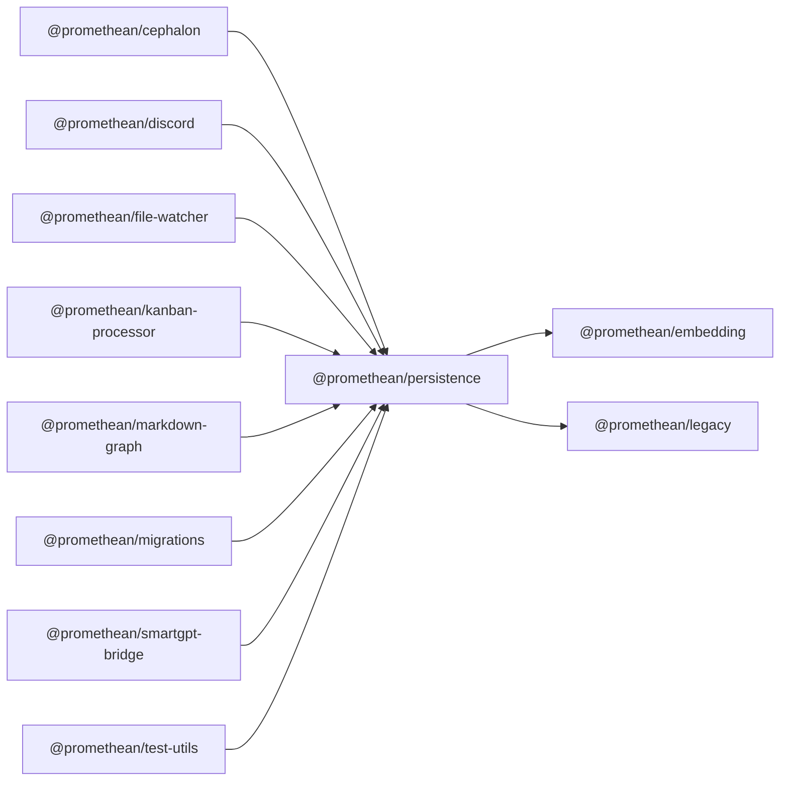

<!-- SYMPKG:PKG:BEGIN -->
# @promethean/persistence
**Folder:** `packages/persistence`  
**Version:** `0.0.1`  
**Domain:** `_root`

## Dependencies
- [@promethean/embedding](../embedding/README.md)
- [@promethean/legacy](../legacy/README.md)
## Dependents
- [@promethean/cephalon](../cephalon/README.md)
- [@promethean/discord](../discord/README.md)
- [@promethean/file-watcher](../file-watcher/README.md)
- [@promethean/kanban-processor](../kanban-processor/README.md)
- [@promethean/markdown-graph](../markdown-graph/README.md)
- [@promethean/migrations](../migrations/README.md)
- [@promethean/smartgpt-bridge](../smartgpt-bridge/README.md)
- [@promethean/test-utils](../test-utils/README.md)
<!-- SYMPKG:PKG:END -->