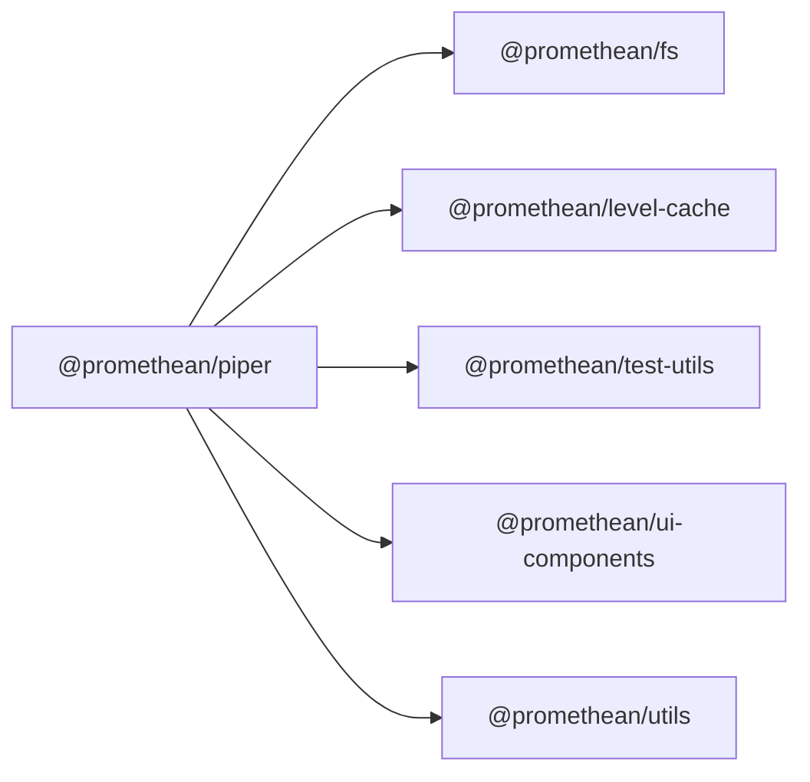

<!-- SYMPKG:PKG:BEGIN -->
# @promethean/piper
**Folder:** `packages/piper`  
**Version:** `0.1.0`  
**Domain:** `_root`

## Dependencies
- [@promethean/fs](../fs/README.md)
- [@promethean/level-cache](../level-cache/README.md)
- [@promethean/test-utils](../test-utils/README.md)
- [@promethean/ui-components](../ui-components/README.md)
- [@promethean/utils](../utils/README.md)
## Dependents
- _None_
<!-- SYMPKG:PKG:END -->