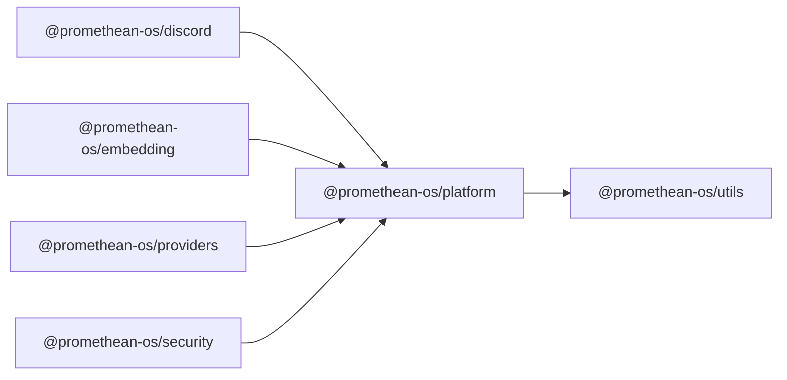

```
<!-- SYMPKG:PKG:BEGIN -->
```
# @promethean-os/platform
```
**Folder:** `packages/platform`
```
```
**Version:** `0.0.1`
```
```
**Domain:** `_root`
```

## Dependencies
- @promethean-os/utils$../utils/README.md
## Dependents
- @promethean-os/discord$../discord/README.md
- @promethean-os/embedding$../embedding/README.md
- @promethean-os/providers$../providers/README.md
- @promethean-os/security$../security/README.md
```


## 📁 Implementation

### Core Files

- [6](../../../packages/platform/src/6)

### View Source

- [GitHub](https://github.com/promethean-ai/promethean/tree/main/packages/platform/src)
- [VS Code](vscode://file/packages/platform/src)


## 📚 API Reference

### Interfaces

#### [- **events.ts**](../../../packages/platform/src/[src/events.ts](../../../packages/platform/src/events.ts) (21 lines)#L1)

#### [- **index.ts**](../../../packages/platform/src/[src/index.ts](../../../packages/platform/src/index.ts) (6 lines)#L1)

#### [- **provider-registry.ts**](../../../packages/platform/src/[src/provider-registry.ts](../../../packages/platform/src/provider-registry.ts) (91 lines)#L1)

#### [- **tests/provider-registry.test.ts**](../../../packages/platform/src/[src/tests/provider-registry.test.ts](../../../packages/platform/src/tests/provider-registry.test.ts) (23 lines)#L1)

#### [- **tests/topic.test.ts**](../../../packages/platform/src/[src/tests/topic.test.ts](../../../packages/platform/src/tests/topic.test.ts) (9 lines)#L1)

#### [- **tests/urn.test.ts**](../../../packages/platform/src/[src/tests/urn.test.ts](../../../packages/platform/src/tests/urn.test.ts) (11 lines)#L1)

#### [- **topic.ts**](../../../packages/platform/src/[src/topic.ts](../../../packages/platform/src/topic.ts) (12 lines)#L1)

#### [- **urn.ts**](../../../packages/platform/src/[src/urn.ts](../../../packages/platform/src/urn.ts) (20 lines)#L1)

#### [- **voice-events.ts**](../../../packages/platform/src/[src/voice-events.ts](../../../packages/platform/src/voice-events.ts) (33 lines)#L1)

#### [- **ProvidersFileSchema()**](../../../packages/platform/src/[ProvidersFileSchema()](../../../packages/platform/src/provider-registry.ts#L43)

#### [- **fileBackedRegistry()**](../../../packages/platform/src/[fileBackedRegistry()](../../../packages/platform/src/provider-registry.ts#L46)

#### [- **expandEnv()**](../../../packages/platform/src/[expandEnv()](../../../packages/platform/src/provider-registry.ts#L87)

#### [- **topic()**](../../../packages/platform/src/[topic()](../../../packages/platform/src/topic.ts#L10)

#### [- **toUrn()**](../../../packages/platform/src/[toUrn()](../../../packages/platform/src/urn.ts#L1)

#### [- **GitHub**](../../../packages/platform/src/[View on GitHub](https#L1)

#### [- **VS Code**](../../../packages/platform/src/[Open in VS Code](vscode#L1)

#### [**Location**](../../../packages/platform/src/[ProvidersFileSchema()](../../../packages/platform/src/provider-registry.ts#L43)

#### [**Description**](../../../packages/platform/src/Key function for providersfileschema operations.#L1)

#### [**File**](../../../packages/platform/src/`src/provider-registry.ts`#L1)

#### [**Location**](../../../packages/platform/src/[fileBackedRegistry()](../../../packages/platform/src/provider-registry.ts#L46)

#### [**Description**](../../../packages/platform/src/Key function for filebackedregistry operations.#L1)

#### [**File**](../../../packages/platform/src/`src/provider-registry.ts`#L1)

#### [**Location**](../../../packages/platform/src/[expandEnv()](../../../packages/platform/src/provider-registry.ts#L87)

#### [**Description**](../../../packages/platform/src/Key function for expandenv operations.#L1)

#### [**File**](../../../packages/platform/src/`src/provider-registry.ts`#L1)

#### [**Location**](../../../packages/platform/src/[topic()](../../../packages/platform/src/topic.ts#L10)

#### [**Description**](../../../packages/platform/src/Key function for topic operations.#L1)

#### [**File**](../../../packages/platform/src/`src/topic.ts`#L1)

#### [**Location**](../../../packages/platform/src/[toUrn()](../../../packages/platform/src/urn.ts#L1)

#### [**Description**](../../../packages/platform/src/Key function for tourn operations.#L1)

#### [**File**](../../../packages/platform/src/`src/urn.ts`#L1)

#### [**Location**](../../../packages/platform/src/[fromUrn()](../../../packages/platform/src/urn.ts#L11)

#### [**Description**](../../../packages/platform/src/Key function for fromurn operations.#L1)

#### [**File**](../../../packages/platform/src/`src/urn.ts`#L1)

#### [Code links saved to](../../../packages/platform/src//home/err/devel/promethean/tmp/platform-code-links.json#L1)


---

*Enhanced with code links via SYMPKG documentation enhancer*