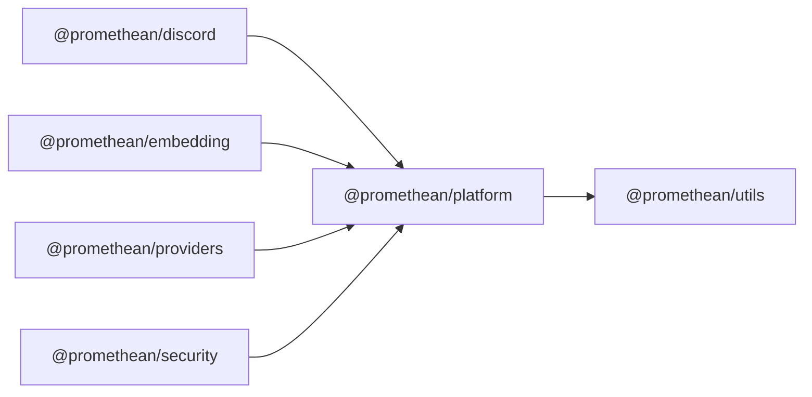

$$
<!-- SYMPKG:PKG:BEGIN -->
$$
# @promethean/platform
$$
**Folder:** `packages/platform`
$$
$$
**Version:** `0.0.1`
$$
$$
**Domain:** `_root`
$$

## Dependencies
- $@promethean/utils$$../utils/README.md$
## Dependents
- $@promethean/discord$$../discord/README.md$
- $@promethean/embedding$$../embedding/README.md$
- $@promethean/providers$$../providers/README.md$
- $@promethean/security$$../security/README.md$
$$
<!-- SYMPKG:PKG:END -->
$$