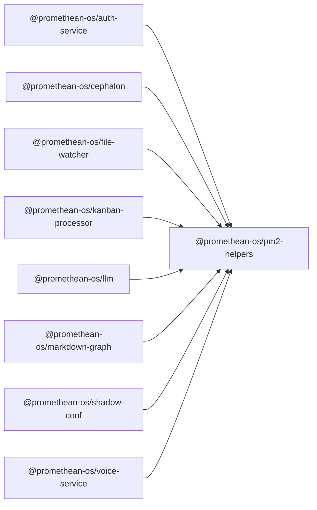

```
<!-- SYMPKG:PKG:BEGIN -->
```
# @promethean-os/pm2-helpers
```
**Folder:** `packages/pm2-helpers`
```
```
**Version:** `0.0.0`
```
```
**Domain:** `_root`
```

## Dependencies
- _None_
## Dependents
- @promethean-os/auth-service$../auth-service/README.md
- @promethean-os/cephalon$../cephalon/README.md
- @promethean-os/file-watcher$../file-watcher/README.md
- @promethean-os/kanban-processor$../kanban-processor/README.md
- @promethean-os/llm$../llm/README.md
- @promethean-os/markdown-graph$../markdown-graph/README.md
- @promethean-os/shadow-conf$../shadow-conf/README.md
- @promethean-os/voice-service$../voice/README.md
```


## 📁 Implementation

### Core Files

- [4](../../../packages/pm2-helpers/src/4)

### View Source

- [GitHub](https://github.com/promethean-ai/promethean/tree/main/packages/pm2-helpers/src)
- [VS Code](vscode://file/packages/pm2-helpers/src)


## 📚 API Reference

### Interfaces

#### [- **index.ts**](../../../packages/pm2-helpers/src/[src/index.ts](../../../packages/pm2-helpers/src/index.ts) (164 lines)#L1)

#### [- **tests/pm2-helpers.test.ts**](../../../packages/pm2-helpers/src/[src/tests/pm2-helpers.test.ts](../../../packages/pm2-helpers/src/tests/pm2-helpers.test.ts) (71 lines)#L1)

#### [- **defineApp()**](../../../packages/pm2-helpers/src/[defineApp()](../../../packages/pm2-helpers/src/index.ts#L95)

#### [- **definePythonService()**](../../../packages/pm2-helpers/src/[definePythonService()](../../../packages/pm2-helpers/src/index.ts#L110)

#### [- **defineNodeService()**](../../../packages/pm2-helpers/src/[defineNodeService()](../../../packages/pm2-helpers/src/index.ts#L121)

#### [- **defineAgent()**](../../../packages/pm2-helpers/src/[defineAgent()](../../../packages/pm2-helpers/src/index.ts#L140)

#### [- **GitHub**](../../../packages/pm2-helpers/src/[View on GitHub](https#L1)

#### [- **VS Code**](../../../packages/pm2-helpers/src/[Open in VS Code](vscode#L1)

#### [**Location**](../../../packages/pm2-helpers/src/[defineApp()](../../../packages/pm2-helpers/src/index.ts#L95)

#### [**Description**](../../../packages/pm2-helpers/src/Key function for defineapp operations.#L1)

#### [**File**](../../../packages/pm2-helpers/src/`src/index.ts`#L1)

#### [**Location**](../../../packages/pm2-helpers/src/[definePythonService()](../../../packages/pm2-helpers/src/index.ts#L110)

#### [**Description**](../../../packages/pm2-helpers/src/Key function for definepythonservice operations.#L1)

#### [**File**](../../../packages/pm2-helpers/src/`src/index.ts`#L1)

#### [**Location**](../../../packages/pm2-helpers/src/[defineNodeService()](../../../packages/pm2-helpers/src/index.ts#L121)

#### [**Description**](../../../packages/pm2-helpers/src/Key function for definenodeservice operations.#L1)

#### [**File**](../../../packages/pm2-helpers/src/`src/index.ts`#L1)

#### [**Location**](../../../packages/pm2-helpers/src/[defineAgent()](../../../packages/pm2-helpers/src/index.ts#L140)

#### [**Description**](../../../packages/pm2-helpers/src/Key function for defineagent operations.#L1)

#### [**File**](../../../packages/pm2-helpers/src/`src/index.ts`#L1)

#### [Code links saved to](../../../packages/pm2-helpers/src//home/err/devel/promethean/tmp/pm2-helpers-code-links.json#L1)


---

*Enhanced with code links via SYMPKG documentation enhancer*