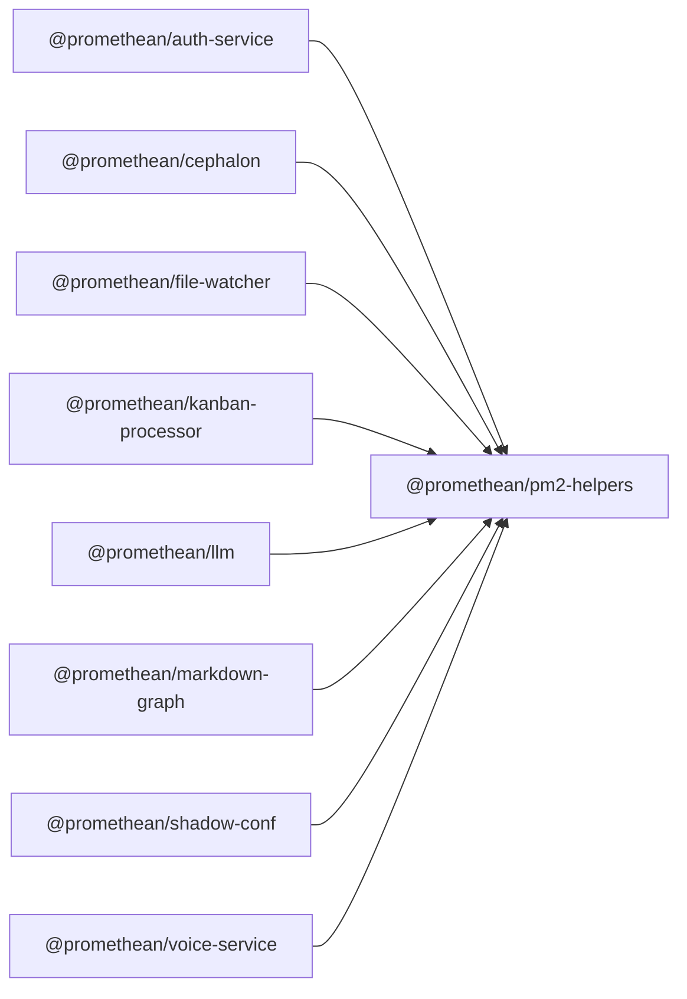

<!-- SYMPKG:PKG:BEGIN -->
# @promethean/pm2-helpers
**Folder:** `packages/pm2-helpers`  
**Version:** `0.0.0`  
**Domain:** `_root`

## Dependencies
- _None_
## Dependents
- [@promethean/auth-service](../auth-service/README.md)
- [@promethean/cephalon](../cephalon/README.md)
- [@promethean/file-watcher](../file-watcher/README.md)
- [@promethean/kanban-processor](../kanban-processor/README.md)
- [@promethean/llm](../llm/README.md)
- [@promethean/markdown-graph](../markdown-graph/README.md)
- [@promethean/shadow-conf](../shadow-conf/README.md)
- [@promethean/voice-service](../voice/README.md)
<!-- SYMPKG:PKG:END -->