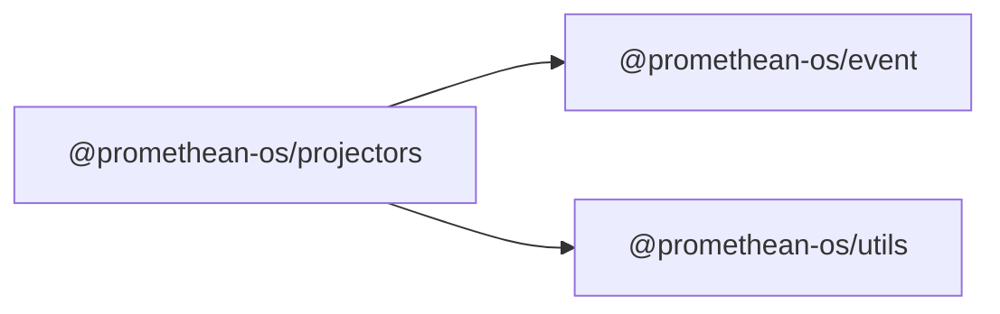

```
<!-- SYMPKG:PKG:BEGIN -->
```
# @promethean-os/projectors
```
**Folder:** `packages/projectors`
```
```
**Version:** `0.0.1`
```
```
**Domain:** `_root`
```

## Dependencies
- @promethean-os/event$../event/README.md
- @promethean-os/utils$../utils/README.md
## Dependents
- _None_
```


## 📁 Implementation

### Core Files

- [1](../../../packages/projectors/src/1)

### View Source

- [GitHub](https://github.com/promethean-ai/promethean/tree/main/packages/projectors/src)
- [VS Code](vscode://file/packages/projectors/src)


## 📚 API Reference

### Interfaces

#### [- **tests/smoke.test.ts**](../../../packages/projectors/src/[src/tests/smoke.test.ts](../../../packages/projectors/src/tests/smoke.test.ts) (8 lines)#L1)

#### [- **transactional.ts**](../../../packages/projectors/src/[src/transactional.ts](../../../packages/projectors/src/transactional.ts) (52 lines)#L1)

#### [- **startTransactionalProjector()**](../../../packages/projectors/src/[startTransactionalProjector()](../../../packages/projectors/src/transactional.ts#L14)

#### [- **GitHub**](../../../packages/projectors/src/[View on GitHub](https#L1)

#### [- **VS Code**](../../../packages/projectors/src/[Open in VS Code](vscode#L1)

#### [**Location**](../../../packages/projectors/src/[startTransactionalProjector()](../../../packages/projectors/src/transactional.ts#L14)

#### [**Description**](../../../packages/projectors/src/Key function for starttransactionalprojector operations.#L1)

#### [**File**](../../../packages/projectors/src/`src/transactional.ts`#L1)

#### [Code links saved to](../../../packages/projectors/src//home/err/devel/promethean/tmp/projectors-code-links.json#L1)


---

*Enhanced with code links via SYMPKG documentation enhancer*