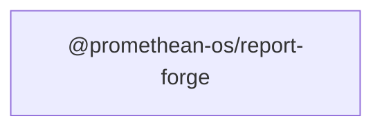

```
<!-- SYMPKG:PKG:BEGIN -->
```
# @promethean-os/report-forge
```
**Folder:** `packages/report-forge`
```
```
**Version:** `0.0.1`
```
```
**Domain:** `_root`
```

## Dependencies
- _None_
## Dependents
- _None_
```


## 📁 Implementation

### Core Files

- [4](../../../packages/report-forge/src/4)

### View Source

- [GitHub](https://github.com/promethean-ai/promethean/tree/main/packages/report-forge/src)
- [VS Code](vscode://file/packages/report-forge/src)


## 📚 API Reference

### Interfaces

#### [- **index.ts**](../../../packages/report-forge/src/[src/index.ts](../../../packages/report-forge/src/index.ts) (3 lines)#L1)

#### [- **lib/generateReport.ts**](../../../packages/report-forge/src/[src/lib/generateReport.ts](../../../packages/report-forge/src/lib/generateReport.ts) (41 lines)#L1)

#### [- **lib/github.ts**](../../../packages/report-forge/src/[src/lib/github.ts](../../../packages/report-forge/src/lib/github.ts) (52 lines)#L1)

#### [- **lib/ollama.ts**](../../../packages/report-forge/src/[src/lib/ollama.ts](../../../packages/report-forge/src/lib/ollama.ts) (54 lines)#L1)

#### [- **lib/render.ts**](../../../packages/report-forge/src/[src/lib/render.ts](../../../packages/report-forge/src/lib/render.ts) (47 lines)#L1)

#### [- **lib/types.ts**](../../../packages/report-forge/src/[src/lib/types.ts](../../../packages/report-forge/src/lib/types.ts) (42 lines)#L1)

#### [- **tests/generate.test.ts**](../../../packages/report-forge/src/[src/tests/generate.test.ts](../../../packages/report-forge/src/tests/generate.test.ts) (36 lines)#L1)

#### [- **generateReport()**](../../../packages/report-forge/src/[generateReport()](../../../packages/report-forge/src/lib/generateReport.ts#L10)

#### [- **github()**](../../../packages/report-forge/src/[github()](../../../packages/report-forge/src/lib/github.ts#L21)

#### [- **ollamaClient()**](../../../packages/report-forge/src/[ollamaClient()](../../../packages/report-forge/src/lib/ollama.ts#L26)

#### [- **renderMarkdown()**](../../../packages/report-forge/src/[renderMarkdown()](../../../packages/report-forge/src/lib/render.ts#L41)

#### [- **GitHub**](../../../packages/report-forge/src/[View on GitHub](https#L1)

#### [- **VS Code**](../../../packages/report-forge/src/[Open in VS Code](vscode#L1)

#### [**Location**](../../../packages/report-forge/src/[generateReport()](../../../packages/report-forge/src/lib/generateReport.ts#L10)

#### [**Description**](../../../packages/report-forge/src/Key function for generatereport operations.#L1)

#### [**File**](../../../packages/report-forge/src/`src/lib/generateReport.ts`#L1)

#### [**Location**](../../../packages/report-forge/src/[github()](../../../packages/report-forge/src/lib/github.ts#L21)

#### [**Description**](../../../packages/report-forge/src/Key function for github operations.#L1)

#### [**File**](../../../packages/report-forge/src/`src/lib/github.ts`#L1)

#### [**Location**](../../../packages/report-forge/src/[ollamaClient()](../../../packages/report-forge/src/lib/ollama.ts#L26)

#### [**Description**](../../../packages/report-forge/src/Key function for ollamaclient operations.#L1)

#### [**File**](../../../packages/report-forge/src/`src/lib/ollama.ts`#L1)

#### [**Location**](../../../packages/report-forge/src/[renderMarkdown()](../../../packages/report-forge/src/lib/render.ts#L41)

#### [**Description**](../../../packages/report-forge/src/Key function for rendermarkdown operations.#L1)

#### [**File**](../../../packages/report-forge/src/`src/lib/render.ts`#L1)

#### [Code links saved to](../../../packages/report-forge/src//home/err/devel/promethean/tmp/report-forge-code-links.json#L1)


---

*Enhanced with code links via SYMPKG documentation enhancer*