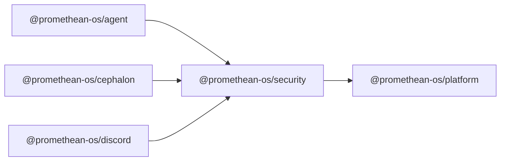

```
<!-- SYMPKG:PKG:BEGIN -->
```
# @promethean-os/security
```
**Folder:** `packages/security`
```
```
**Version:** `0.0.1`
```
```
**Domain:** `_root`
```

## Dependencies
- @promethean-os/platform$../platform/README.md
## Dependents
- @promethean-os/agent$../agent/README.md
- @promethean-os/cephalon$../cephalon/README.md
- @promethean-os/discord$../discord/README.md
```


## 📁 Implementation

*Source code analysis not available*


## 📚 API Reference

### Classes

#### [-](../../../packages/security/src/**index.ts**:#LNaN)

#### [-](../../../packages/security/src/**path-validation.ts**:#LNaN)

#### [-](../../../packages/security/src/**policy.ts**:#LNaN)

#### [-](../../../packages/security/src/**secure-file-operations.ts**:#LNaN)

#### [-](../../../packages/security/src/**testing/auth-testing.ts**:#LNaN)

#### [-](../../../packages/security/src/**testing/fuzzing.ts**:#LNaN)

#### [-](../../../packages/security/src/**testing/index.ts**:#LNaN)

#### [-](../../../packages/security/src/**testing/prompt-injection.ts**:#LNaN)

#### [-](../../../packages/security/src/**tests/comprehensive-security.test.ts**:#LNaN)

#### [-](../../../packages/security/src/**tests/fuzzing.test.ts**:#LNaN)

#### [-](../../../packages/security/src/**tests/integration-security-comprehensive.test.ts**:#LNaN)

#### [-](../../../packages/security/src/**tests/path-validation.test.ts**:#LNaN)

#### [-](../../../packages/security/src/**tests/policy.test.ts**:#LNaN)

#### [-](../../../packages/security/src/**tests/prompt-injection.test.ts**:#LNaN)

#### [-](../../../packages/security/src/**tests/secure-file-operations.test.ts**:#LNaN)

#### [-](../../../packages/security/src/**NotAllowedError**:#LNaN)

#### [-](../../../packages/security/src/**JWTSecurityTester**:#LNaN)

#### [-](../../../packages/security/src/**OAuthSecurityTester**:#LNaN)

#### [-](../../../packages/security/src/**SessionSecurityTester**:#LNaN)

#### [-](../../../packages/security/src/**RateLimitTester**:#LNaN)

#### [-](../../../packages/security/src/**validatePath()**:#LNaN)

#### [-](../../../packages/security/src/**sanitizeFileName()**:#LNaN)

#### [-](../../../packages/security/src/**createSecurePath()**:#LNaN)

#### [-](../../../packages/security/src/**isCrossPlatformSafe()**:#LNaN)

#### [-](../../../packages/security/src/**validatePaths()**:#LNaN)

#### [**Location**](../../../packages/security/src/[NotAllowedError](../../../packages/security/src/policy.ts#L1)#L1)

#### [**File**](../../../packages/security/src/`src/policy.ts`#L1)

#### [**Location**](../../../packages/security/src/[JWTSecurityTester](../../../packages/security/src/testing/auth-testing.ts#L48)#L1)

#### [**File**](../../../packages/security/src/`src/testing/auth-testing.ts`#L1)

#### [**Location**](../../../packages/security/src/[OAuthSecurityTester](../../../packages/security/src/testing/auth-testing.ts#L163)#L1)

#### [**File**](../../../packages/security/src/`src/testing/auth-testing.ts`#L1)

#### [**Location**](../../../packages/security/src/[SessionSecurityTester](../../../packages/security/src/testing/auth-testing.ts#L332)#L1)

#### [**File**](../../../packages/security/src/`src/testing/auth-testing.ts`#L1)

#### [**Location**](../../../packages/security/src/[RateLimitTester](../../../packages/security/src/testing/auth-testing.ts#L406)#L1)

#### [**File**](../../../packages/security/src/`src/testing/auth-testing.ts`#L1)

#### [**Location**](../../../packages/security/src/[ReplayAttackTester](../../../packages/security/src/testing/auth-testing.ts#L498)#L1)

#### [**File**](../../../packages/security/src/`src/testing/auth-testing.ts`#L1)

#### [**Location**](../../../packages/security/src/[ComprehensiveAuthTester](../../../packages/security/src/testing/auth-testing.ts#L575)#L1)

#### [**File**](../../../packages/security/src/`src/testing/auth-testing.ts`#L1)

#### [**Location**](../../../packages/security/src/[Fuzzer](../../../packages/security/src/testing/fuzzing.ts#L23)#L1)

#### [**File**](../../../packages/security/src/`src/testing/fuzzing.ts`#L1)

#### [**Location**](../../../packages/security/src/[FuzzRunner](../../../packages/security/src/testing/fuzzing.ts#L259)#L1)

#### [**File**](../../../packages/security/src/`src/testing/fuzzing.ts`#L1)

#### [**Location**](../../../packages/security/src/[SecurityTestFramework](../../../packages/security/src/testing/index.ts#L43)#L1)

#### [**File**](../../../packages/security/src/`src/testing/index.ts`#L1)

#### [**Location**](../../../packages/security/src/[PromptInjectionTester](../../../packages/security/src/testing/prompt-injection.ts#L54)#L1)

#### [**File**](../../../packages/security/src/`src/testing/prompt-injection.ts`#L1)

#### [**Location**](../../../packages/security/src/[BasicPromptInjectionDetector](../../../packages/security/src/testing/prompt-injection.ts#L497)#L1)

#### [**File**](../../../packages/security/src/`src/testing/prompt-injection.ts`#L1)

#### [**Location**](../../../packages/security/src/[validatePath()](../../../packages/security/src/path-validation.ts#L131)#L1)

#### [**File**](../../../packages/security/src/`src/path-validation.ts`#L1)

#### [**Location**](../../../packages/security/src/[sanitizeFileName()](../../../packages/security/src/path-validation.ts#L383)#L1)

#### [**File**](../../../packages/security/src/`src/path-validation.ts`#L1)

#### [**Location**](../../../packages/security/src/[createSecurePath()](../../../packages/security/src/path-validation.ts#L412)#L1)

#### [**File**](../../../packages/security/src/`src/path-validation.ts`#L1)

#### [**Location**](../../../packages/security/src/[isCrossPlatformSafe()](../../../packages/security/src/path-validation.ts#L420)#L1)

#### [**File**](../../../packages/security/src/`src/path-validation.ts`#L1)

#### [**Location**](../../../packages/security/src/[validatePaths()](../../../packages/security/src/path-validation.ts#L457)#L1)

#### [**File**](../../../packages/security/src/`src/path-validation.ts`#L1)

#### [**Location**](../../../packages/security/src/[createSecureTempPath()](../../../packages/security/src/path-validation.ts#L472)#L1)

#### [**File**](../../../packages/security/src/`src/path-validation.ts`#L1)

#### [**Location**](../../../packages/security/src/[makePolicy()](../../../packages/security/src/policy.ts#L43)#L1)

#### [**File**](../../../packages/security/src/`src/policy.ts`#L1)

#### [**Location**](../../../packages/security/src/[secureReadFile()](../../../packages/security/src/secure-file-operations.ts#L40)#L1)

#### [**File**](../../../packages/security/src/`src/secure-file-operations.ts`#L1)

#### [**Location**](../../../packages/security/src/[secureWriteFile()](../../../packages/security/src/secure-file-operations.ts#L80)#L1)

#### [**File**](../../../packages/security/src/`src/secure-file-operations.ts`#L1)

#### [**Location**](../../../packages/security/src/[secureAppendFile()](../../../packages/security/src/secure-file-operations.ts#L146)#L1)

#### [**File**](../../../packages/security/src/`src/secure-file-operations.ts`#L1)

#### [**Location**](../../../packages/security/src/[secureDeleteFile()](../../../packages/security/src/secure-file-operations.ts#L199)#L1)

#### [**File**](../../../packages/security/src/`src/secure-file-operations.ts`#L1)

#### [**Location**](../../../packages/security/src/[secureListDirectory()](../../../packages/security/src/secure-file-operations.ts#L255)#L1)

#### [**File**](../../../packages/security/src/`src/secure-file-operations.ts`#L1)

#### [**Location**](../../../packages/security/src/[secureCreateDirectory()](../../../packages/security/src/secure-file-operations.ts#L313)#L1)

#### [**File**](../../../packages/security/src/`src/secure-file-operations.ts`#L1)

#### [**Location**](../../../packages/security/src/[secureCopyFile()](../../../packages/security/src/secure-file-operations.ts#L379)#L1)

#### [**File**](../../../packages/security/src/`src/secure-file-operations.ts`#L1)

#### [**Location**](../../../packages/security/src/[secureMoveFile()](../../../packages/security/src/secure-file-operations.ts#L460)#L1)

#### [**File**](../../../packages/security/src/`src/secure-file-operations.ts`#L1)

#### [**Location**](../../../packages/security/src/[secureBatchOperation()](../../../packages/security/src/secure-file-operations.ts#L502)#L1)

#### [**File**](../../../packages/security/src/`src/secure-file-operations.ts`#L1)

#### [**Location**](../../../packages/security/src/[quickAuthTest()](../../../packages/security/src/testing/auth-testing.ts#L570)#L1)

#### [**File**](../../../packages/security/src/`src/testing/auth-testing.ts`#L1)

#### [**Location**](../../../packages/security/src/[quickFuzzTest()](../../../packages/security/src/testing/fuzzing.ts#L248)#L1)

#### [**File**](../../../packages/security/src/`src/testing/fuzzing.ts`#L1)

#### [**Location**](../../../packages/security/src/[quickFuzzTest()](../../../packages/security/src/testing/index.ts#L400)#L1)

#### [**File**](../../../packages/security/src/`src/testing/index.ts`#L1)

#### [**Location**](../../../packages/security/src/[quickPromptInjectionTest()](../../../packages/security/src/testing/index.ts#L411)#L1)

#### [**File**](../../../packages/security/src/`src/testing/index.ts`#L1)

#### [**Location**](../../../packages/security/src/[quickAuthTest()](../../../packages/security/src/testing/index.ts#L418)#L1)

#### [**File**](../../../packages/security/src/`src/testing/index.ts`#L1)

#### [**Location**](../../../packages/security/src/[quickPromptInjectionTest()](../../../packages/security/src/testing/prompt-injection.ts#L490)#L1)

#### [**File**](../../../packages/security/src/`src/testing/prompt-injection.ts`#L1)

#### [**Location**](../../../packages/security/src/[PathSecurityConfig](../../../packages/security/src/path-validation.ts#L7)#L1)

#### [**File**](../../../packages/security/src/`src/path-validation.ts`#L1)

#### [**Location**](../../../packages/security/src/[PathValidationResult](../../../packages/security/src/path-validation.ts#L25)#L1)

#### [**File**](../../../packages/security/src/`src/path-validation.ts`#L1)

#### [**Location**](../../../packages/security/src/[SecureFileOptions](../../../packages/security/src/secure-file-operations.ts#L8)#L1)

#### [**File**](../../../packages/security/src/`src/secure-file-operations.ts`#L1)

#### [**Location**](../../../packages/security/src/[SecureFileResult](../../../packages/security/src/secure-file-operations.ts#L20)#L1)

#### [**File**](../../../packages/security/src/`src/secure-file-operations.ts`#L1)

#### [**Location**](../../../packages/security/src/[AuthTester](../../../packages/security/src/testing/auth-testing.ts#L43)#L1)

#### [**File**](../../../packages/security/src/`src/testing/auth-testing.ts`#L1)

#### [**Location**](../../../packages/security/src/[PromptInjectionDetector](../../../packages/security/src/testing/prompt-injection.ts#L48)#L1)

#### [**File**](../../../packages/security/src/`src/testing/prompt-injection.ts`#L1)


---

*Enhanced with code links via automated documentation updater*