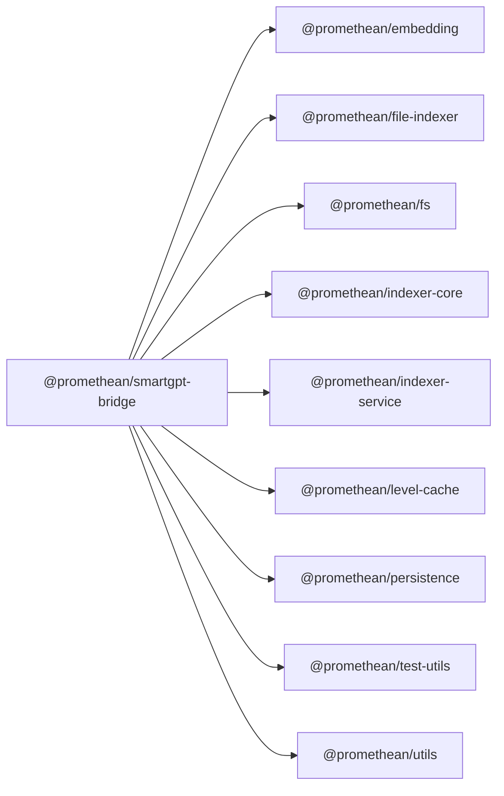

<!-- SYMPKG:PKG:BEGIN -->
# @promethean/smartgpt-bridge
**Folder:** `packages/smartgpt-bridge`  
**Version:** `1.0.0`  
**Domain:** `_root`

## Dependencies
- [@promethean/embedding](../embedding/README.md)
- [@promethean/file-indexer](../file-indexer/README.md)
- [@promethean/fs](../fs/README.md)
- [@promethean/indexer-core](../indexer-core/README.md)
- [@promethean/indexer-service](../indexer-service/README.md)
- [@promethean/level-cache](../level-cache/README.md)
- [@promethean/persistence](../persistence/README.md)
- [@promethean/test-utils](../test-utils/README.md)
- [@promethean/utils](../utils/README.md)
## Dependents
- _None_
<!-- SYMPKG:PKG:END -->