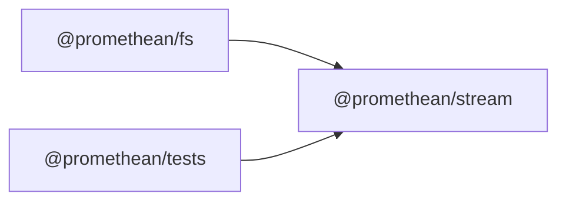

<!-- SYMPKG:PKG:BEGIN -->
# @promethean/stream
**Folder:** `packages/stream`  
**Version:** `0.0.1`  
**Domain:** `_root`

## Dependencies
- _None_
## Dependents
- [@promethean/fs](../fs/README.md)
- [@promethean/tests](../tests/README.md)
<!-- SYMPKG:PKG:END -->