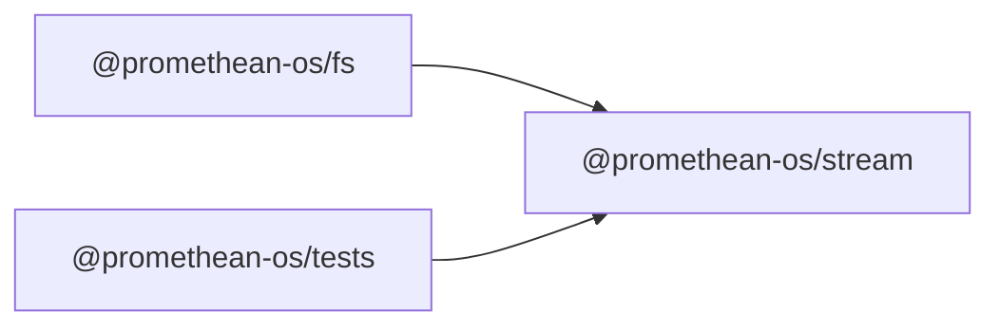

```
<!-- SYMPKG:PKG:BEGIN -->
```
# @promethean-os/stream
```
**Folder:** `packages/stream`
```
```
**Version:** `0.0.1`
```
```
**Domain:** `_root`
```

## Dependencies
- _None_
## Dependents
- @promethean-os/fs$../fs/README.md
- @promethean-os/tests$../tests/README.md
```


## 📁 Implementation

### Core Files

- [5](../../../packages/stream/src/5)

### View Source

- [GitHub](https://github.com/promethean-ai/promethean/tree/main/packages/stream/src)
- [VS Code](vscode://file/packages/stream/src)


## 📚 API Reference

### Interfaces

#### [- **tests/title.test.ts**](../../../packages/stream/src/[src/tests/title.test.ts](../../../packages/stream/src/tests/title.test.ts) (168 lines)#L1)

#### [- **title.ts**](../../../packages/stream/src/[src/title.ts](../../../packages/stream/src/title.ts) (137 lines)#L1)

#### [- **MemoryTitleStore**](../../../packages/stream/src/[MemoryTitleStore](../../../packages/stream/src/title.ts#L18)

#### [- **DiscordTranscriptSource**](../../../packages/stream/src/[DiscordTranscriptSource](../../../packages/stream/src/title.ts#L35)

#### [- **generateTwitchStreamTitle()**](../../../packages/stream/src/[generateTwitchStreamTitle()](../../../packages/stream/src/title.ts#L89)

#### [- **generateAndStoreTitle()**](../../../packages/stream/src/[generateAndStoreTitle()](../../../packages/stream/src/title.ts#L112)

#### [- **watchContextAndGenerate()**](../../../packages/stream/src/[watchContextAndGenerate()](../../../packages/stream/src/title.ts#L125)

#### [- **GitHub**](../../../packages/stream/src/[View on GitHub](https#L1)

#### [- **VS Code**](../../../packages/stream/src/[Open in VS Code](vscode#L1)

#### [**Location**](../../../packages/stream/src/[MemoryTitleStore](../../../packages/stream/src/title.ts#L18)

#### [**Description**](../../../packages/stream/src/Main class for memorytitlestore functionality.#L1)

#### [**File**](../../../packages/stream/src/`src/title.ts`#L1)

#### [**Location**](../../../packages/stream/src/[DiscordTranscriptSource](../../../packages/stream/src/title.ts#L35)

#### [**Description**](../../../packages/stream/src/Main class for discordtranscriptsource functionality.#L1)

#### [**File**](../../../packages/stream/src/`src/title.ts`#L1)

#### [**Location**](../../../packages/stream/src/[generateTwitchStreamTitle()](../../../packages/stream/src/title.ts#L89)

#### [**Description**](../../../packages/stream/src/Key function for generatetwitchstreamtitle operations.#L1)

#### [**File**](../../../packages/stream/src/`src/title.ts`#L1)

#### [**Location**](../../../packages/stream/src/[generateAndStoreTitle()](../../../packages/stream/src/title.ts#L112)

#### [**Description**](../../../packages/stream/src/Key function for generateandstoretitle operations.#L1)

#### [**File**](../../../packages/stream/src/`src/title.ts`#L1)

#### [**Location**](../../../packages/stream/src/[watchContextAndGenerate()](../../../packages/stream/src/title.ts#L125)

#### [**Description**](../../../packages/stream/src/Key function for watchcontextandgenerate operations.#L1)

#### [**File**](../../../packages/stream/src/`src/title.ts`#L1)

#### [Code links saved to](../../../packages/stream/src//home/err/devel/promethean/tmp/stream-code-links.json#L1)


---

*Enhanced with code links via SYMPKG documentation enhancer*