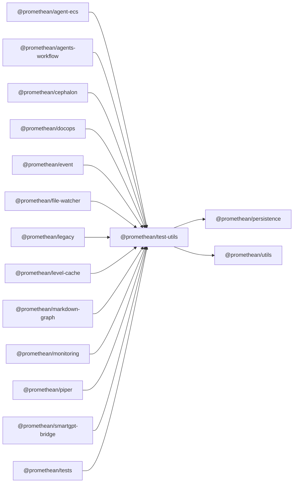

$$
<!-- SYMPKG:PKG:BEGIN -->
$$
# @promethean/test-utils
$$
**Folder:** `packages/test-utils`
$$
$$
**Version:** `0.0.1`
$$
$$
**Domain:** `_root`
$$

## Dependencies
- $@promethean/persistence$$../persistence/README.md$
- $@promethean/utils$$../utils/README.md$
## Dependents
- $@promethean/agent-ecs$$../agent-ecs/README.md$
- $@promethean/agents-workflow$$../agents-workflow/README.md$
- $@promethean/cephalon$$../cephalon/README.md$
- $@promethean/docops$$../docops/README.md$
- $@promethean/event$$../event/README.md$
- $@promethean/file-watcher$$../file-watcher/README.md$
- $@promethean/legacy$$../legacy/README.md$
- $@promethean/level-cache$$../level-cache/README.md$
- $@promethean/markdown-graph$$../markdown-graph/README.md$
- $@promethean/monitoring$$../monitoring/README.md$
- $@promethean/piper$$../piper/README.md$
- $@promethean/smartgpt-bridge$$../smartgpt-bridge/README.md$
- $@promethean/tests$$../tests/README.md$
$$
<!-- SYMPKG:PKG:END -->
$$