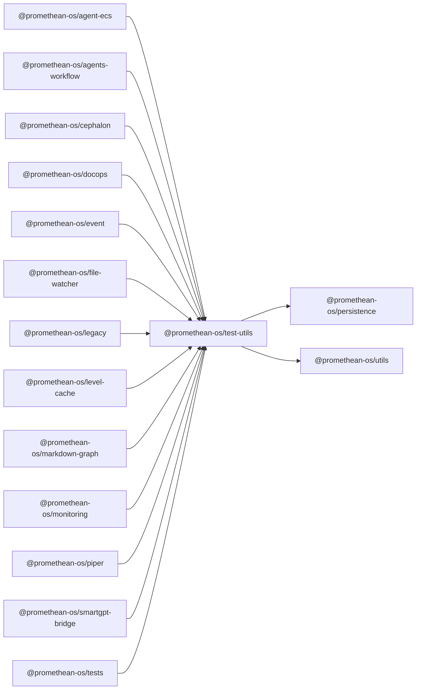

```
<!-- SYMPKG:PKG:BEGIN -->
```
# @promethean-os/test-utils
```
**Folder:** `packages/test-utils`
```
```
**Version:** `0.0.1`
```
```
**Domain:** `_root`
```

## Dependencies
- @promethean-os/persistence$../persistence/README.md
- @promethean-os/utils$../utils/README.md
## Dependents
- @promethean-os/agent-ecs$../agent-ecs/README.md
- @promethean-os/agents-workflow$../agents-workflow/README.md
- @promethean-os/cephalon$../cephalon/README.md
- @promethean-os/docops$../docops/README.md
- @promethean-os/event$../event/README.md
- @promethean-os/file-watcher$../file-watcher/README.md
- @promethean-os/legacy$../legacy/README.md
- @promethean-os/level-cache$../level-cache/README.md
- @promethean-os/markdown-graph$../markdown-graph/README.md
- @promethean-os/monitoring$../monitoring/README.md
- @promethean-os/piper$../piper/README.md
- @promethean-os/smartgpt-bridge$../smartgpt-bridge/README.md
- @promethean-os/tests$../tests/README.md
```


## 📁 Implementation

### Core Files

- [25](../../../packages/test-utils/src/25)

### View Source

- [GitHub](https://github.com/promethean-ai/promethean/tree/main/packages/test-utils/src)
- [VS Code](vscode://file/packages/test-utils/src)


## 📚 API Reference

### Interfaces

#### [- **broker.ts**](../../../packages/test-utils/src/[src/broker.ts](../../../packages/test-utils/src/broker.ts) (144 lines)#L1)

#### [- **browser.ts**](../../../packages/test-utils/src/[src/browser.ts](../../../packages/test-utils/src/browser.ts) (39 lines)#L1)

#### [- **dummy-server.ts**](../../../packages/test-utils/src/[src/dummy-server.ts](../../../packages/test-utils/src/dummy-server.ts) (32 lines)#L1)

#### [- **e2e.ts**](../../../packages/test-utils/src/[src/e2e.ts](../../../packages/test-utils/src/e2e.ts) (40 lines)#L1)

#### [- **index.ts**](../../../packages/test-utils/src/[src/index.ts](../../../packages/test-utils/src/index.ts) (7 lines)#L1)

#### [- **page.ts**](../../../packages/test-utils/src/[src/page.ts](../../../packages/test-utils/src/page.ts) (34 lines)#L1)

#### [- **persistence.ts**](../../../packages/test-utils/src/[src/persistence.ts](../../../packages/test-utils/src/persistence.ts) (209 lines)#L1)

#### [- **port-pool.ts**](../../../packages/test-utils/src/[src/port-pool.ts](../../../packages/test-utils/src/port-pool.ts) (21 lines)#L1)

#### [- **process.ts**](../../../packages/test-utils/src/[src/process.ts](../../../packages/test-utils/src/process.ts) (137 lines)#L1)

#### [- **startProcess.ts**](../../../packages/test-utils/src/[src/startProcess.ts](../../../packages/test-utils/src/startProcess.ts) (58 lines)#L1)

#### [- **tests/broker.spec.ts**](../../../packages/test-utils/src/[src/tests/broker.spec.ts](../../../packages/test-utils/src/tests/broker.spec.ts) (89 lines)#L1)

#### [- **tests/dummy-server-body.spec.ts**](../../../packages/test-utils/src/[src/tests/dummy-server-body.spec.ts](../../../packages/test-utils/src/tests/dummy-server-body.spec.ts) (19 lines)#L1)

#### [- **tests/dummy-server.spec.ts**](../../../packages/test-utils/src/[src/tests/dummy-server.spec.ts](../../../packages/test-utils/src/tests/dummy-server.spec.ts) (19 lines)#L1)

#### [- **tests/e2e-url.spec.ts**](../../../packages/test-utils/src/[src/tests/e2e-url.spec.ts](../../../packages/test-utils/src/tests/e2e-url.spec.ts) (16 lines)#L1)

#### [- **tests/page-title.spec.ts**](../../../packages/test-utils/src/[src/tests/page-title.spec.ts](../../../packages/test-utils/src/tests/page-title.spec.ts) (12 lines)#L1)

#### [- **tests/persistence-install.spec.ts**](../../../packages/test-utils/src/[src/tests/persistence-install.spec.ts](../../../packages/test-utils/src/tests/persistence-install.spec.ts) (27 lines)#L1)

#### [- **tests/persistence.spec.ts**](../../../packages/test-utils/src/[src/tests/persistence.spec.ts](../../../packages/test-utils/src/tests/persistence.spec.ts) (71 lines)#L1)

#### [- **tests/process-readiness.spec.ts**](../../../packages/test-utils/src/[src/tests/process-readiness.spec.ts](../../../packages/test-utils/src/tests/process-readiness.spec.ts) (72 lines)#L1)

#### [- **tests/process.spec.ts**](../../../packages/test-utils/src/[src/tests/process.spec.ts](../../../packages/test-utils/src/tests/process.spec.ts) (116 lines)#L1)

#### [- **tests/waits-cleanup.spec.ts**](../../../packages/test-utils/src/[src/tests/waits-cleanup.spec.ts](../../../packages/test-utils/src/tests/waits-cleanup.spec.ts) (17 lines)#L1)

#### [- **tests/waits.spec.ts**](../../../packages/test-utils/src/[src/tests/waits.spec.ts](../../../packages/test-utils/src/tests/waits.spec.ts) (112 lines)#L1)

#### [- **tests/with-proc.spec.ts**](../../../packages/test-utils/src/[src/tests/with-proc.spec.ts](../../../packages/test-utils/src/tests/with-proc.spec.ts) (31 lines)#L1)

#### [- **waitForHttp.ts**](../../../packages/test-utils/src/[src/waitForHttp.ts](../../../packages/test-utils/src/waitForHttp.ts) (21 lines)#L1)

#### [- **waitForLog.ts**](../../../packages/test-utils/src/[src/waitForLog.ts](../../../packages/test-utils/src/waitForLog.ts) (26 lines)#L1)

#### [- **waitForTcp.ts**](../../../packages/test-utils/src/[src/waitForTcp.ts](../../../packages/test-utils/src/waitForTcp.ts) (21 lines)#L1)

#### [- **withPlaywrightContext.ts**](../../../packages/test-utils/src/[src/withPlaywrightContext.ts](../../../packages/test-utils/src/withPlaywrightContext.ts) (16 lines)#L1)

#### [- **withProc.ts**](../../../packages/test-utils/src/[src/withProc.ts](../../../packages/test-utils/src/withProc.ts) (17 lines)#L1)

#### [- **MemoryBroker**](../../../packages/test-utils/src/[MemoryBroker](../../../packages/test-utils/src/broker.ts#L35)

#### [- **InMemoryCollection**](../../../packages/test-utils/src/[InMemoryCollection](../../../packages/test-utils/src/persistence.ts#L19)

#### [- **FakeDb**](../../../packages/test-utils/src/[FakeDb](../../../packages/test-utils/src/persistence.ts#L152)

#### [- **FakeMongoClient**](../../../packages/test-utils/src/[FakeMongoClient](../../../packages/test-utils/src/persistence.ts#L160)

#### [- **FakeChromaCollection**](../../../packages/test-utils/src/[FakeChromaCollection](../../../packages/test-utils/src/persistence.ts#L176)

#### [- **getMemoryBroker()**](../../../packages/test-utils/src/[getMemoryBroker()](../../../packages/test-utils/src/broker.ts#L130)

#### [- **resetMemoryBroker()**](../../../packages/test-utils/src/[resetMemoryBroker()](../../../packages/test-utils/src/broker.ts#L135)

#### [- **getBrowser()**](../../../packages/test-utils/src/[getBrowser()](../../../packages/test-utils/src/browser.ts#L11)

#### [- **newIsolatedPage()**](../../../packages/test-utils/src/[newIsolatedPage()](../../../packages/test-utils/src/browser.ts#L13)

#### [- **shutdown()**](../../../packages/test-utils/src/[shutdown()](../../../packages/test-utils/src/browser.ts#L28)

#### [- **GitHub**](../../../packages/test-utils/src/[View on GitHub](https#L1)

#### [- **VS Code**](../../../packages/test-utils/src/[Open in VS Code](vscode#L1)

#### [**Location**](../../../packages/test-utils/src/[MemoryBroker](../../../packages/test-utils/src/broker.ts#L35)

#### [**Description**](../../../packages/test-utils/src/Main class for memorybroker functionality.#L1)

#### [**File**](../../../packages/test-utils/src/`src/broker.ts`#L1)

#### [**Location**](../../../packages/test-utils/src/[InMemoryCollection](../../../packages/test-utils/src/persistence.ts#L19)

#### [**Description**](../../../packages/test-utils/src/Main class for inmemorycollection functionality.#L1)

#### [**File**](../../../packages/test-utils/src/`src/persistence.ts`#L1)

#### [**Location**](../../../packages/test-utils/src/[FakeDb](../../../packages/test-utils/src/persistence.ts#L152)

#### [**Description**](../../../packages/test-utils/src/Main class for fakedb functionality.#L1)

#### [**File**](../../../packages/test-utils/src/`src/persistence.ts`#L1)

#### [**Location**](../../../packages/test-utils/src/[FakeMongoClient](../../../packages/test-utils/src/persistence.ts#L160)

#### [**Description**](../../../packages/test-utils/src/Main class for fakemongoclient functionality.#L1)

#### [**File**](../../../packages/test-utils/src/`src/persistence.ts`#L1)

#### [**Location**](../../../packages/test-utils/src/[FakeChromaCollection](../../../packages/test-utils/src/persistence.ts#L176)

#### [**Description**](../../../packages/test-utils/src/Main class for fakechromacollection functionality.#L1)

#### [**File**](../../../packages/test-utils/src/`src/persistence.ts`#L1)

#### [**Location**](../../../packages/test-utils/src/[FakeChromaClient](../../../packages/test-utils/src/persistence.ts#L186)

#### [**Description**](../../../packages/test-utils/src/Main class for fakechromaclient functionality.#L1)

#### [**File**](../../../packages/test-utils/src/`src/persistence.ts`#L1)

#### [**Location**](../../../packages/test-utils/src/[getMemoryBroker()](../../../packages/test-utils/src/broker.ts#L130)

#### [**Description**](../../../packages/test-utils/src/Key function for getmemorybroker operations.#L1)

#### [**File**](../../../packages/test-utils/src/`src/broker.ts`#L1)

#### [**Location**](../../../packages/test-utils/src/[resetMemoryBroker()](../../../packages/test-utils/src/broker.ts#L135)

#### [**Description**](../../../packages/test-utils/src/Key function for resetmemorybroker operations.#L1)

#### [**File**](../../../packages/test-utils/src/`src/broker.ts`#L1)

#### [**Location**](../../../packages/test-utils/src/[getBrowser()](../../../packages/test-utils/src/browser.ts#L11)

#### [**Description**](../../../packages/test-utils/src/Key function for getbrowser operations.#L1)

#### [**File**](../../../packages/test-utils/src/`src/browser.ts`#L1)

#### [**Location**](../../../packages/test-utils/src/[newIsolatedPage()](../../../packages/test-utils/src/browser.ts#L13)

#### [**Description**](../../../packages/test-utils/src/Key function for newisolatedpage operations.#L1)

#### [**File**](../../../packages/test-utils/src/`src/browser.ts`#L1)

#### [**Location**](../../../packages/test-utils/src/[shutdown()](../../../packages/test-utils/src/browser.ts#L28)

#### [**Description**](../../../packages/test-utils/src/Key function for shutdown operations.#L1)

#### [**File**](../../../packages/test-utils/src/`src/browser.ts`#L1)

#### [**Location**](../../../packages/test-utils/src/[startDummyServer()](../../../packages/test-utils/src/dummy-server.ts#L10)

#### [**Description**](../../../packages/test-utils/src/Key function for startdummyserver operations.#L1)

#### [**File**](../../../packages/test-utils/src/`src/dummy-server.ts`#L1)

#### [**Location**](../../../packages/test-utils/src/[mkUrlBuilder()](../../../packages/test-utils/src/e2e.ts#L17)

#### [**Description**](../../../packages/test-utils/src/Key function for mkurlbuilder operations.#L1)

#### [**File**](../../../packages/test-utils/src/`src/e2e.ts`#L1)

#### [**Location**](../../../packages/test-utils/src/[withE2EContext()](../../../packages/test-utils/src/e2e.ts#L22)

#### [**Description**](../../../packages/test-utils/src/Key function for withe2econtext operations.#L1)

#### [**File**](../../../packages/test-utils/src/`src/e2e.ts`#L1)

#### [**Location**](../../../packages/test-utils/src/[withPage()](../../../packages/test-utils/src/page.ts#L18)

#### [**Description**](../../../packages/test-utils/src/Key function for withpage operations.#L1)

#### [**File**](../../../packages/test-utils/src/`src/page.ts`#L1)

#### [**Location**](../../../packages/test-utils/src/[installInMemoryPersistence()](../../../packages/test-utils/src/persistence.ts#L192)

#### [**Description**](../../../packages/test-utils/src/Key function for installinmemorypersistence operations.#L1)

#### [**File**](../../../packages/test-utils/src/`src/persistence.ts`#L1)

#### [**Location**](../../../packages/test-utils/src/[getFreePort()](../../../packages/test-utils/src/port-pool.ts#L6)

#### [**Description**](../../../packages/test-utils/src/Key function for getfreeport operations.#L1)

#### [**File**](../../../packages/test-utils/src/`src/port-pool.ts`#L1)

#### [**Location**](../../../packages/test-utils/src/[registerProcForFile()](../../../packages/test-utils/src/process.ts#L46)

#### [**Description**](../../../packages/test-utils/src/Key function for registerprocforfile operations.#L1)

#### [**File**](../../../packages/test-utils/src/`src/process.ts`#L1)

#### [**Location**](../../../packages/test-utils/src/[registerProcForFileWithPort()](../../../packages/test-utils/src/process.ts#L71)

#### [**Description**](../../../packages/test-utils/src/Key function for registerprocforfilewithport operations.#L1)

#### [**File**](../../../packages/test-utils/src/`src/process.ts`#L1)

#### [**Location**](../../../packages/test-utils/src/[startProcessWithPort()](../../../packages/test-utils/src/process.ts#L102)

#### [**Description**](../../../packages/test-utils/src/Key function for startprocesswithport operations.#L1)

#### [**File**](../../../packages/test-utils/src/`src/process.ts`#L1)

#### [**Location**](../../../packages/test-utils/src/[startProcess()](../../../packages/test-utils/src/startProcess.ts#L24)

#### [**Description**](../../../packages/test-utils/src/Key function for startprocess operations.#L1)

#### [**File**](../../../packages/test-utils/src/`src/startProcess.ts`#L1)

#### [**Location**](../../../packages/test-utils/src/[waitForHttp()](../../../packages/test-utils/src/waitForHttp.ts#L5)

#### [**Description**](../../../packages/test-utils/src/Key function for waitforhttp operations.#L1)

#### [**File**](../../../packages/test-utils/src/`src/waitForHttp.ts`#L1)

#### [**Location**](../../../packages/test-utils/src/[waitForLog()](../../../packages/test-utils/src/waitForLog.ts#L3)

#### [**Description**](../../../packages/test-utils/src/Key function for waitforlog operations.#L1)

#### [**File**](../../../packages/test-utils/src/`src/waitForLog.ts`#L1)

#### [**Location**](../../../packages/test-utils/src/[waitForTcp()](../../../packages/test-utils/src/waitForTcp.ts#L5)

#### [**Description**](../../../packages/test-utils/src/Key function for waitfortcp operations.#L1)

#### [**File**](../../../packages/test-utils/src/`src/waitForTcp.ts`#L1)

#### [**Location**](../../../packages/test-utils/src/[withPlaywrightContext()](../../../packages/test-utils/src/withPlaywrightContext.ts#L5)

#### [**Description**](../../../packages/test-utils/src/Key function for withplaywrightcontext operations.#L1)

#### [**File**](../../../packages/test-utils/src/`src/withPlaywrightContext.ts`#L1)

#### [**Location**](../../../packages/test-utils/src/[withProc()](../../../packages/test-utils/src/withProc.ts#L6)

#### [**Description**](../../../packages/test-utils/src/Key function for withproc operations.#L1)

#### [**File**](../../../packages/test-utils/src/`src/withProc.ts`#L1)

#### [Code links saved to](../../../packages/test-utils/src//home/err/devel/promethean/tmp/test-utils-code-links.json#L1)


---

*Enhanced with code links via SYMPKG documentation enhancer*