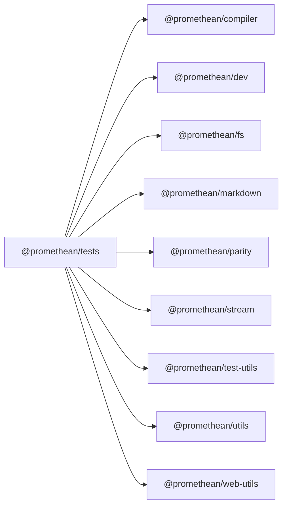

```
<!-- SYMPKG:PKG:BEGIN -->
```
# @promethean/tests
```
**Folder:** `packages/tests`
```
```
**Version:** `0.0.1`
```
```
**Domain:** `_root`
```

## Dependencies
- @promethean/compiler$../compiler/README.md
- @promethean/dev$../dev/README.md
- @promethean/fs$../fs/README.md
- @promethean/markdown$../markdown/README.md
- @promethean/parity$../parity/README.md
- @promethean/stream$../stream/README.md
- @promethean/test-utils$../test-utils/README.md
- @promethean/utils$../utils/README.md
- @promethean/web-utils$../web-utils/README.md
## Dependents
- _None_
```
<!-- SYMPKG:PKG:END -->
```