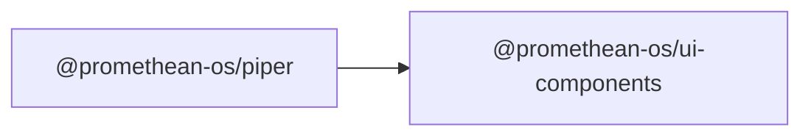

```
<!-- SYMPKG:PKG:BEGIN -->
```
# @promethean-os/ui-components
```
**Folder:** `packages/ui-components`
```
```
**Version:** `0.0.0`
```
```
**Domain:** `_root`
```

## Dependencies
- _None_
## Dependents
- @promethean-os/piper$../piper/README.md
```


## 📁 Implementation

### Core Files

- [5](../../../packages/ui-components/src/5)

### View Source

- [GitHub](https://github.com/promethean-ai/promethean/tree/main/packages/ui-components/src)
- [VS Code](vscode://file/packages/ui-components/src)


## 📚 API Reference

### Interfaces

#### [- **chat-panel.ts**](../../../packages/ui-components/src/[src/chat-panel.ts](../../../packages/ui-components/src/chat-panel.ts) (22 lines)#L1)

#### [- **design-tokens.ts**](../../../packages/ui-components/src/[src/design-tokens.ts](../../../packages/ui-components/src/design-tokens.ts) (24 lines)#L1)

#### [- **file-explorer.ts**](../../../packages/ui-components/src/[src/file-explorer.ts](../../../packages/ui-components/src/file-explorer.ts) (15 lines)#L1)

#### [- **index.ts**](../../../packages/ui-components/src/[src/index.ts](../../../packages/ui-components/src/index.ts) (5 lines)#L1)

#### [- **register.ts**](../../../packages/ui-components/src/[src/register.ts](../../../packages/ui-components/src/register.ts) (13 lines)#L1)

#### [- **tests/ui-components.test.ts**](../../../packages/ui-components/src/[src/tests/ui-components.test.ts](../../../packages/ui-components/src/tests/ui-components.test.ts) (43 lines)#L1)

#### [- **UiChatPanel**](../../../packages/ui-components/src/[UiChatPanel](../../../packages/ui-components/src/chat-panel.ts#L5)

#### [- **UiFileExplorer**](../../../packages/ui-components/src/[UiFileExplorer](../../../packages/ui-components/src/file-explorer.ts#L5)

#### [- **designTokens()**](../../../packages/ui-components/src/[designTokens()](../../../packages/ui-components/src/design-tokens.ts#L1)

#### [- **applyDesignTokens()**](../../../packages/ui-components/src/[applyDesignTokens()](../../../packages/ui-components/src/design-tokens.ts#L13)

#### [- **registerUiComponents()**](../../../packages/ui-components/src/[registerUiComponents()](../../../packages/ui-components/src/register.ts#L4)

#### [- **GitHub**](../../../packages/ui-components/src/[View on GitHub](https#L1)

#### [- **VS Code**](../../../packages/ui-components/src/[Open in VS Code](vscode#L1)

#### [**Location**](../../../packages/ui-components/src/[UiChatPanel](../../../packages/ui-components/src/chat-panel.ts#L5)

#### [**Description**](../../../packages/ui-components/src/Main class for uichatpanel functionality.#L1)

#### [**File**](../../../packages/ui-components/src/`src/chat-panel.ts`#L1)

#### [**Location**](../../../packages/ui-components/src/[UiFileExplorer](../../../packages/ui-components/src/file-explorer.ts#L5)

#### [**Description**](../../../packages/ui-components/src/Main class for uifileexplorer functionality.#L1)

#### [**File**](../../../packages/ui-components/src/`src/file-explorer.ts`#L1)

#### [**Location**](../../../packages/ui-components/src/[designTokens()](../../../packages/ui-components/src/design-tokens.ts#L1)

#### [**Description**](../../../packages/ui-components/src/Key function for designtokens operations.#L1)

#### [**File**](../../../packages/ui-components/src/`src/design-tokens.ts`#L1)

#### [**Location**](../../../packages/ui-components/src/[applyDesignTokens()](../../../packages/ui-components/src/design-tokens.ts#L13)

#### [**Description**](../../../packages/ui-components/src/Key function for applydesigntokens operations.#L1)

#### [**File**](../../../packages/ui-components/src/`src/design-tokens.ts`#L1)

#### [**Location**](../../../packages/ui-components/src/[registerUiComponents()](../../../packages/ui-components/src/register.ts#L4)

#### [**Description**](../../../packages/ui-components/src/Key function for registeruicomponents operations.#L1)

#### [**File**](../../../packages/ui-components/src/`src/register.ts`#L1)

#### [Code links saved to](../../../packages/ui-components/src//home/err/devel/promethean/tmp/ui-components-code-links.json#L1)


---

*Enhanced with code links via SYMPKG documentation enhancer*