```
<!-- SYMPKG:PKG:BEGIN -->
```
# @promethean/utils
```
**Folder:** `packages/utils`
```
```
**Version:** `0.0.1`
```
```
**Domain:** `_root`
```

```mermaid
graph LR
  A["@promethean/utils"]
  R1["@promethean/agent-ecs"]
  R2["@promethean/boardrev"]
  R3["@promethean/buildfix"]
  R4["@promethean/cephalon"]
  R5["@promethean/changefeed"]
  R6["@promethean/codemods"]
  R7["@promethean/codepack"]
  R8["@promethean/compaction"]
  R9["@promethean/cookbookflow"]
  R10["@promethean/docops"]
  R11["@promethean/embedding"]
  R12["@promethean/event"]
  R13["@promethean/file-indexer"]
  R14["@promethean/file-watcher"]
  R15["@promethean/indexer-core"]
  R16["@promethean/indexer-service"]
  R17["@promethean/kanban"]
  R18["@promethean/level-cache"]
  R19["@promethean/llm"]
  R20["@promethean/openai-server"]
  R21["@promethean/piper"]
  R22["@promethean/platform"]
  R23["@promethean/projectors"]
  R24["@promethean/readmeflow"]
  R25["@promethean/semverguard"]
  R26["@promethean/simtasks"]
  R27["@promethean/smartgpt-bridge"]
  R28["@promethean/snapshots"]
  R29["@promethean/sonarflow"]
  R30["@promethean/symdocs"]
  R31["@promethean/test-utils"]
  R32["@promethean/testgap"]
  R33["@promethean/tests"]
  R34["@promethean/voice-service"]
  R1["@promethean/agent-ecs"] --> A
  R2["@promethean/boardrev"] --> A
  R3["@promethean/buildfix"] --> A
  R4["@promethean/cephalon"] --> A
  R5["@promethean/changefeed"] --> A
  R6["@promethean/codemods"] --> A
  R7["@promethean/codepack"] --> A
  R8["@promethean/compaction"] --> A
  R9["@promethean/cookbookflow"] --> A
  R10["@promethean/docops"] --> A
  R11["@promethean/embedding"] --> A
  R12["@promethean/event"] --> A
  R13["@promethean/file-indexer"] --> A
  R14["@promethean/file-watcher"] --> A
  R15["@promethean/indexer-core"] --> A
  R16["@promethean/indexer-service"] --> A
  R17["@promethean/kanban"] --> A
  R18["@promethean/level-cache"] --> A
  R19["@promethean/llm"] --> A
  R20["@promethean/openai-server"] --> A
  R21["@promethean/piper"] --> A
  R22["@promethean/platform"] --> A
  R23["@promethean/projectors"] --> A
  R24["@promethean/readmeflow"] --> A
  R25["@promethean/semverguard"] --> A
  R26["@promethean/simtasks"] --> A
  R27["@promethean/smartgpt-bridge"] --> A
  R28["@promethean/snapshots"] --> A
  R29["@promethean/sonarflow"] --> A
  R30["@promethean/symdocs"] --> A
  R31["@promethean/test-utils"] --> A
  R32["@promethean/testgap"] --> A
  R33["@promethean/tests"] --> A
  R34["@promethean/voice-service"] --> A
  click R1 "../agent-ecs/README.md" "@promethean/agent-ecs"
  click R2 "../boardrev/README.md" "@promethean/boardrev"
  click R3 "../buildfix/README.md" "@promethean/buildfix"
  click R4 "../cephalon/README.md" "@promethean/cephalon"
  click R5 "../changefeed/README.md" "@promethean/changefeed"
  click R6 "../codemods/README.md" "@promethean/codemods"
  click R7 "../codepack/README.md" "@promethean/codepack"
  click R8 "../compaction/README.md" "@promethean/compaction"
  click R9 "../cookbookflow/README.md" "@promethean/cookbookflow"
  click R10 "../docops/README.md" "@promethean/docops"
  click R11 "../embedding/README.md" "@promethean/embedding"
  click R12 "../event/README.md" "@promethean/event"
  click R13 "../file-indexer/README.md" "@promethean/file-indexer"
  click R14 "../file-watcher/README.md" "@promethean/file-watcher"
  click R15 "../indexer-core/README.md" "@promethean/indexer-core"
  click R16 "../indexer-service/README.md" "@promethean/indexer-service"
  click R17 "../kanban/README.md" "@promethean/kanban"
  click R18 "../level-cache/README.md" "@promethean/level-cache"
  click R19 "../llm/README.md" "@promethean/llm"
  click R20 "../openai-server/README.md" "@promethean/openai-server"
  click R21 "../piper/README.md" "@promethean/piper"
  click R22 "../platform/README.md" "@promethean/platform"
  click R23 "../projectors/README.md" "@promethean/projectors"
  click R24 "../readmeflow/README.md" "@promethean/readmeflow"
  click R25 "../semverguard/README.md" "@promethean/semverguard"
  click R26 "../simtask/README.md" "@promethean/simtasks"
  click R27 "../smartgpt-bridge/README.md" "@promethean/smartgpt-bridge"
  click R28 "../snapshots/README.md" "@promethean/snapshots"
  click R29 "../sonarflow/README.md" "@promethean/sonarflow"
  click R30 "../symdocs/README.md" "@promethean/symdocs"
  click R31 "../test-utils/README.md" "@promethean/test-utils"
  click R32 "../testgap/README.md" "@promethean/testgap"
  click R33 "../tests/README.md" "@promethean/tests"
  click R34 "../voice/README.md" "@promethean/voice-service"
```

## Dependencies
- _None_
## Dependents
- @promethean/agent-ecs$../agent-ecs/README.md
- @promethean/boardrev$../boardrev/README.md
- @promethean/buildfix$../buildfix/README.md
- @promethean/cephalon$../cephalon/README.md
- @promethean/changefeed$../changefeed/README.md
- @promethean/codemods$../codemods/README.md
- @promethean/codepack$../codepack/README.md
- @promethean/compaction$../compaction/README.md
- @promethean/cookbookflow$../cookbookflow/README.md
- @promethean/docops$../docops/README.md
- @promethean/embedding$../embedding/README.md
- @promethean/event$../event/README.md
- @promethean/file-indexer$../file-indexer/README.md
- @promethean/file-watcher$../file-watcher/README.md
- @promethean/indexer-core$../indexer-core/README.md
- @promethean/indexer-service$../indexer-service/README.md
- @promethean/kanban$../kanban/README.md
- @promethean/level-cache$../level-cache/README.md
- @promethean/llm$../llm/README.md
- @promethean/openai-server$../openai-server/README.md
- @promethean/piper$../piper/README.md
- @promethean/platform$../platform/README.md
- @promethean/projectors$../projectors/README.md
- @promethean/readmeflow$../readmeflow/README.md
- @promethean/semverguard$../semverguard/README.md
- @promethean/simtasks$../simtask/README.md
- @promethean/smartgpt-bridge$../smartgpt-bridge/README.md
- @promethean/snapshots$../snapshots/README.md
- @promethean/sonarflow$../sonarflow/README.md
- @promethean/symdocs$../symdocs/README.md
- @promethean/test-utils$../test-utils/README.md
- @promethean/testgap$../testgap/README.md
- @promethean/tests$../tests/README.md
- @promethean/voice-service$../voice/README.md
```
<!-- SYMPKG:PKG:END -->
```