```
<!-- SYMPKG:PKG:BEGIN -->
```
# @promethean-os/utils
```
**Folder:** `packages/utils`
```
```
**Version:** `0.0.1`
```
```
**Domain:** `_root`
```

```mermaid
graph LR
  A["@promethean-os/utils"]
  R1["@promethean-os/agent-ecs"]
  R2["@promethean-os/boardrev"]
  R3["@promethean-os/buildfix"]
  R4["@promethean-os/cephalon"]
  R5["@promethean-os/changefeed"]
  R6["@promethean-os/codemods"]
  R7["@promethean-os/codepack"]
  R8["@promethean-os/compaction"]
  R9["@promethean-os/cookbookflow"]
  R10["@promethean-os/docops"]
  R11["@promethean-os/embedding"]
  R12["@promethean-os/event"]
  R13["@promethean-os/file-indexer"]
  R14["@promethean-os/file-watcher"]
  R15["@promethean-os/indexer-core"]
  R16["@promethean-os/indexer-service"]
  R17["@promethean-os/kanban"]
  R18["@promethean-os/level-cache"]
  R19["@promethean-os/llm"]
  R20["@promethean-os/openai-server"]
  R21["@promethean-os/piper"]
  R22["@promethean-os/platform"]
  R23["@promethean-os/projectors"]
  R24["@promethean-os/readmeflow"]
  R25["@promethean-os/semverguard"]
  R26["@promethean-os/simtasks"]
  R27["@promethean-os/smartgpt-bridge"]
  R28["@promethean-os/snapshots"]
  R29["@promethean-os/sonarflow"]
  R30["@promethean-os/symdocs"]
  R31["@promethean-os/test-utils"]
  R32["@promethean-os/testgap"]
  R33["@promethean-os/tests"]
  R34["@promethean-os/voice-service"]
  R1["@promethean-os/agent-ecs"] --> A
  R2["@promethean-os/boardrev"] --> A
  R3["@promethean-os/buildfix"] --> A
  R4["@promethean-os/cephalon"] --> A
  R5["@promethean-os/changefeed"] --> A
  R6["@promethean-os/codemods"] --> A
  R7["@promethean-os/codepack"] --> A
  R8["@promethean-os/compaction"] --> A
  R9["@promethean-os/cookbookflow"] --> A
  R10["@promethean-os/docops"] --> A
  R11["@promethean-os/embedding"] --> A
  R12["@promethean-os/event"] --> A
  R13["@promethean-os/file-indexer"] --> A
  R14["@promethean-os/file-watcher"] --> A
  R15["@promethean-os/indexer-core"] --> A
  R16["@promethean-os/indexer-service"] --> A
  R17["@promethean-os/kanban"] --> A
  R18["@promethean-os/level-cache"] --> A
  R19["@promethean-os/llm"] --> A
  R20["@promethean-os/openai-server"] --> A
  R21["@promethean-os/piper"] --> A
  R22["@promethean-os/platform"] --> A
  R23["@promethean-os/projectors"] --> A
  R24["@promethean-os/readmeflow"] --> A
  R25["@promethean-os/semverguard"] --> A
  R26["@promethean-os/simtasks"] --> A
  R27["@promethean-os/smartgpt-bridge"] --> A
  R28["@promethean-os/snapshots"] --> A
  R29["@promethean-os/sonarflow"] --> A
  R30["@promethean-os/symdocs"] --> A
  R31["@promethean-os/test-utils"] --> A
  R32["@promethean-os/testgap"] --> A
  R33["@promethean-os/tests"] --> A
  R34["@promethean-os/voice-service"] --> A
  click R1 "../agent-ecs/README.md" "@promethean-os/agent-ecs"
  click R2 "../boardrev/README.md" "@promethean-os/boardrev"
  click R3 "../buildfix/README.md" "@promethean-os/buildfix"
  click R4 "../cephalon/README.md" "@promethean-os/cephalon"
  click R5 "../changefeed/README.md" "@promethean-os/changefeed"
  click R6 "../codemods/README.md" "@promethean-os/codemods"
  click R7 "../codepack/README.md" "@promethean-os/codepack"
  click R8 "../compaction/README.md" "@promethean-os/compaction"
  click R9 "../cookbookflow/README.md" "@promethean-os/cookbookflow"
  click R10 "../docops/README.md" "@promethean-os/docops"
  click R11 "../embedding/README.md" "@promethean-os/embedding"
  click R12 "../event/README.md" "@promethean-os/event"
  click R13 "../file-indexer/README.md" "@promethean-os/file-indexer"
  click R14 "../file-watcher/README.md" "@promethean-os/file-watcher"
  click R15 "../indexer-core/README.md" "@promethean-os/indexer-core"
  click R16 "../indexer-service/README.md" "@promethean-os/indexer-service"
  click R17 "../kanban/README.md" "@promethean-os/kanban"
  click R18 "../level-cache/README.md" "@promethean-os/level-cache"
  click R19 "../llm/README.md" "@promethean-os/llm"
  click R20 "../openai-server/README.md" "@promethean-os/openai-server"
  click R21 "../piper/README.md" "@promethean-os/piper"
  click R22 "../platform/README.md" "@promethean-os/platform"
  click R23 "../projectors/README.md" "@promethean-os/projectors"
  click R24 "../readmeflow/README.md" "@promethean-os/readmeflow"
  click R25 "../semverguard/README.md" "@promethean-os/semverguard"
  click R26 "../simtask/README.md" "@promethean-os/simtasks"
  click R27 "../smartgpt-bridge/README.md" "@promethean-os/smartgpt-bridge"
  click R28 "../snapshots/README.md" "@promethean-os/snapshots"
  click R29 "../sonarflow/README.md" "@promethean-os/sonarflow"
  click R30 "../symdocs/README.md" "@promethean-os/symdocs"
  click R31 "../test-utils/README.md" "@promethean-os/test-utils"
  click R32 "../testgap/README.md" "@promethean-os/testgap"
  click R33 "../tests/README.md" "@promethean-os/tests"
  click R34 "../voice/README.md" "@promethean-os/voice-service"
```

## Dependencies
- _None_
## Dependents
- @promethean-os/agent-ecs$../agent-ecs/README.md
- @promethean-os/boardrev$../boardrev/README.md
- @promethean-os/buildfix$../buildfix/README.md
- @promethean-os/cephalon$../cephalon/README.md
- @promethean-os/changefeed$../changefeed/README.md
- @promethean-os/codemods$../codemods/README.md
- @promethean-os/codepack$../codepack/README.md
- @promethean-os/compaction$../compaction/README.md
- @promethean-os/cookbookflow$../cookbookflow/README.md
- @promethean-os/docops$../docops/README.md
- @promethean-os/embedding$../embedding/README.md
- @promethean-os/event$../event/README.md
- @promethean-os/file-indexer$../file-indexer/README.md
- @promethean-os/file-watcher$../file-watcher/README.md
- @promethean-os/indexer-core$../indexer-core/README.md
- @promethean-os/indexer-service$../indexer-service/README.md
- @promethean-os/kanban$../kanban/README.md
- @promethean-os/level-cache$../level-cache/README.md
- @promethean-os/llm$../llm/README.md
- @promethean-os/openai-server$../openai-server/README.md
- @promethean-os/piper$../piper/README.md
- @promethean-os/platform$../platform/README.md
- @promethean-os/projectors$../projectors/README.md
- @promethean-os/readmeflow$../readmeflow/README.md
- @promethean-os/semverguard$../semverguard/README.md
- @promethean-os/simtasks$../simtask/README.md
- @promethean-os/smartgpt-bridge$../smartgpt-bridge/README.md
- @promethean-os/snapshots$../snapshots/README.md
- @promethean-os/sonarflow$../sonarflow/README.md
- @promethean-os/symdocs$../symdocs/README.md
- @promethean-os/test-utils$../test-utils/README.md
- @promethean-os/testgap$../testgap/README.md
- @promethean-os/tests$../tests/README.md
- @promethean-os/voice-service$../voice/README.md
```


## 📁 Implementation

### Core Files

- [26](../../../packages/utils/src/26)

### View Source

- [GitHub](https://github.com/promethean-ai/promethean/tree/main/packages/utils/src)
- [VS Code](vscode://file/packages/utils/src)


## 📚 API Reference

### Interfaces

#### [- **cosine.ts**](../../../packages/utils/src/[src/cosine.ts](../../../packages/utils/src/cosine.ts) (17 lines)#L1)

#### [- **fileBackedRegistry.ts**](../../../packages/utils/src/[src/fileBackedRegistry.ts](../../../packages/utils/src/fileBackedRegistry.ts) (51 lines)#L1)

#### [- **files.ts**](../../../packages/utils/src/[src/files.ts](../../../packages/utils/src/files.ts) (20 lines)#L1)

#### [- **hash.ts**](../../../packages/utils/src/[src/hash.ts](../../../packages/utils/src/hash.ts) (9 lines)#L1)

#### [- **in-memory-chroma.ts**](../../../packages/utils/src/[src/in-memory-chroma.ts](../../../packages/utils/src/in-memory-chroma.ts) (142 lines)#L1)

#### [- **index.ts**](../../../packages/utils/src/[src/index.ts](../../../packages/utils/src/index.ts) (29 lines)#L1)

#### [- **list-files-rec.ts**](../../../packages/utils/src/[src/list-files-rec.ts](../../../packages/utils/src/list-files-rec.ts) (52 lines)#L1)

#### [- **logger.ts**](../../../packages/utils/src/[src/logger.ts](../../../packages/utils/src/logger.ts) (156 lines)#L1)

#### [- **ollama.ts**](../../../packages/utils/src/[src/ollama.ts](../../../packages/utils/src/ollama.ts) (158 lines)#L1)

#### [- **parse-args.d.ts**](../../../packages/utils/src/[src/parse-args.d.ts](../../../packages/utils/src/parse-args.d.ts) (17 lines)#L1)

#### [- **parse-args.ts**](../../../packages/utils/src/[src/parse-args.ts](../../../packages/utils/src/parse-args.ts) (42 lines)#L1)

#### [- **path.ts**](../../../packages/utils/src/[src/path.ts](../../../packages/utils/src/path.ts) (13 lines)#L1)

#### [- **retry.ts**](../../../packages/utils/src/[src/retry.ts](../../../packages/utils/src/retry.ts) (55 lines)#L1)

#### [- **sleep.ts**](../../../packages/utils/src/[src/sleep.ts](../../../packages/utils/src/sleep.ts) (13 lines)#L1)

#### [- **slug.ts**](../../../packages/utils/src/[src/slug.ts](../../../packages/utils/src/slug.ts) (58 lines)#L1)

#### [- **strip-generated-sections.ts**](../../../packages/utils/src/[src/strip-generated-sections.ts](../../../packages/utils/src/strip-generated-sections.ts) (14 lines)#L1)

#### [- **tests/cosine.test.ts**](../../../packages/utils/src/[src/tests/cosine.test.ts](../../../packages/utils/src/tests/cosine.test.ts) (9 lines)#L1)

#### [- **tests/fileBackedRegistry.test.ts**](../../../packages/utils/src/[src/tests/fileBackedRegistry.test.ts](../../../packages/utils/src/tests/fileBackedRegistry.test.ts) (32 lines)#L1)

#### [- **tests/hash.test.ts**](../../../packages/utils/src/[src/tests/hash.test.ts](../../../packages/utils/src/tests/hash.test.ts) (8 lines)#L1)

#### [- **tests/in-memory-chroma.test.ts**](../../../packages/utils/src/[src/tests/in-memory-chroma.test.ts](../../../packages/utils/src/tests/in-memory-chroma.test.ts) (87 lines)#L1)

#### [- **tests/list-files-rec.test.ts**](../../../packages/utils/src/[src/tests/list-files-rec.test.ts](../../../packages/utils/src/tests/list-files-rec.test.ts) (44 lines)#L1)

#### [- **tests/logger.test.ts**](../../../packages/utils/src/[src/tests/logger.test.ts](../../../packages/utils/src/tests/logger.test.ts) (149 lines)#L1)

#### [- **tests/ollama.test.ts**](../../../packages/utils/src/[src/tests/ollama.test.ts](../../../packages/utils/src/tests/ollama.test.ts) (63 lines)#L1)

#### [- **tests/parse-args.test.ts**](../../../packages/utils/src/[src/tests/parse-args.test.ts](../../../packages/utils/src/tests/parse-args.test.ts) (16 lines)#L1)

#### [- **tests/rel-from-repo.test.ts**](../../../packages/utils/src/[src/tests/rel-from-repo.test.ts](../../../packages/utils/src/tests/rel-from-repo.test.ts) (12 lines)#L1)

#### [- **tests/retry.test.ts**](../../../packages/utils/src/[src/tests/retry.test.ts](../../../packages/utils/src/tests/retry.test.ts) (80 lines)#L1)

#### [- **tests/slug.test.ts**](../../../packages/utils/src/[src/tests/slug.test.ts](../../../packages/utils/src/tests/slug.test.ts) (22 lines)#L1)

#### [- **tests/strip-generated-sections.test.ts**](../../../packages/utils/src/[src/tests/strip-generated-sections.test.ts](../../../packages/utils/src/tests/strip-generated-sections.test.ts) (16 lines)#L1)

#### [- **tests/ts-ast.test.ts**](../../../packages/utils/src/[src/tests/ts-ast.test.ts](../../../packages/utils/src/tests/ts-ast.test.ts) (25 lines)#L1)

#### [- **tests/uuid.test.ts**](../../../packages/utils/src/[src/tests/uuid.test.ts](../../../packages/utils/src/tests/uuid.test.ts) (28 lines)#L1)

#### [- **ts-ast.ts**](../../../packages/utils/src/[src/ts-ast.ts](../../../packages/utils/src/ts-ast.ts) (35 lines)#L1)

#### [- **uuid.ts**](../../../packages/utils/src/[src/uuid.ts](../../../packages/utils/src/uuid.ts) (6 lines)#L1)

#### [- **InMemoryChroma**](../../../packages/utils/src/[InMemoryChroma](../../../packages/utils/src/in-memory-chroma.ts#L20)

#### [- **OllamaError**](../../../packages/utils/src/[OllamaError](../../../packages/utils/src/ollama.ts#L5)

#### [- **MemoryStream**](../../../packages/utils/src/[MemoryStream](../../../packages/utils/src/tests/logger.test.ts#L7)

#### [- **cosine()**](../../../packages/utils/src/[cosine()](../../../packages/utils/src/cosine.ts#L1)

#### [- **fileBackedRegistry()**](../../../packages/utils/src/[fileBackedRegistry()](../../../packages/utils/src/fileBackedRegistry.ts#L18)

#### [- **readText()**](../../../packages/utils/src/[readText()](../../../packages/utils/src/files.ts#L4)

#### [- **writeText()**](../../../packages/utils/src/[writeText()](../../../packages/utils/src/files.ts#L8)

#### [- **readMaybe()**](../../../packages/utils/src/[readMaybe()](../../../packages/utils/src/files.ts#L13)

#### [- **GitHub**](../../../packages/utils/src/[View on GitHub](https#L1)

#### [- **VS Code**](../../../packages/utils/src/[Open in VS Code](vscode#L1)

#### [**Location**](../../../packages/utils/src/[InMemoryChroma](../../../packages/utils/src/in-memory-chroma.ts#L20)

#### [**Description**](../../../packages/utils/src/Main class for inmemorychroma functionality.#L1)

#### [**File**](../../../packages/utils/src/`src/in-memory-chroma.ts`#L1)

#### [**Location**](../../../packages/utils/src/[OllamaError](../../../packages/utils/src/ollama.ts#L5)

#### [**Description**](../../../packages/utils/src/Main class for ollamaerror functionality.#L1)

#### [**File**](../../../packages/utils/src/`src/ollama.ts`#L1)

#### [**Location**](../../../packages/utils/src/[MemoryStream](../../../packages/utils/src/tests/logger.test.ts#L7)

#### [**Description**](../../../packages/utils/src/Main class for memorystream functionality.#L1)

#### [**File**](../../../packages/utils/src/`src/tests/logger.test.ts`#L1)

#### [**Location**](../../../packages/utils/src/[cosine()](../../../packages/utils/src/cosine.ts#L1)

#### [**Description**](../../../packages/utils/src/Key function for cosine operations.#L1)

#### [**File**](../../../packages/utils/src/`src/cosine.ts`#L1)

#### [**Location**](../../../packages/utils/src/[fileBackedRegistry()](../../../packages/utils/src/fileBackedRegistry.ts#L18)

#### [**Description**](../../../packages/utils/src/Key function for filebackedregistry operations.#L1)

#### [**File**](../../../packages/utils/src/`src/fileBackedRegistry.ts`#L1)

#### [**Location**](../../../packages/utils/src/[readText()](../../../packages/utils/src/files.ts#L4)

#### [**Description**](../../../packages/utils/src/Key function for readtext operations.#L1)

#### [**File**](../../../packages/utils/src/`src/files.ts`#L1)

#### [**Location**](../../../packages/utils/src/[writeText()](../../../packages/utils/src/files.ts#L8)

#### [**Description**](../../../packages/utils/src/Key function for writetext operations.#L1)

#### [**File**](../../../packages/utils/src/`src/files.ts`#L1)

#### [**Location**](../../../packages/utils/src/[readMaybe()](../../../packages/utils/src/files.ts#L13)

#### [**Description**](../../../packages/utils/src/Key function for readmaybe operations.#L1)

#### [**File**](../../../packages/utils/src/`src/files.ts`#L1)

#### [**Location**](../../../packages/utils/src/[sha1()](../../../packages/utils/src/hash.ts#L6)

#### [**Description**](../../../packages/utils/src/Key function for sha1 operations.#L1)

#### [**File**](../../../packages/utils/src/`src/hash.ts`#L1)

#### [**Location**](../../../packages/utils/src/[listFilesRec()](../../../packages/utils/src/list-files-rec.ts#L28)

#### [**Description**](../../../packages/utils/src/Key function for listfilesrec operations.#L1)

#### [**File**](../../../packages/utils/src/`src/list-files-rec.ts`#L1)

#### [**Location**](../../../packages/utils/src/[createLogger()](../../../packages/utils/src/logger.ts#L130)

#### [**Description**](../../../packages/utils/src/Key function for createlogger operations.#L1)

#### [**File**](../../../packages/utils/src/`src/logger.ts`#L1)

#### [**Location**](../../../packages/utils/src/[OLLAMA_URL()](../../../packages/utils/src/ollama.ts#L3)

#### [**Description**](../../../packages/utils/src/Key function for ollama_url operations.#L1)

#### [**File**](../../../packages/utils/src/`src/ollama.ts`#L1)

#### [**Location**](../../../packages/utils/src/[ollamaEmbed()](../../../packages/utils/src/ollama.ts#L57)

#### [**Description**](../../../packages/utils/src/Key function for ollamaembed operations.#L1)

#### [**File**](../../../packages/utils/src/`src/ollama.ts`#L1)

#### [**Location**](../../../packages/utils/src/[ollamaJSON()](../../../packages/utils/src/ollama.ts#L103)

#### [**Description**](../../../packages/utils/src/Key function for ollamajson operations.#L1)

#### [**File**](../../../packages/utils/src/`src/ollama.ts`#L1)

#### [**Location**](../../../packages/utils/src/[parseArgs()](../../../packages/utils/src/parse-args.d.ts#L13)

#### [**Description**](../../../packages/utils/src/Key function for parseargs operations.#L1)

#### [**File**](../../../packages/utils/src/`src/parse-args.d.ts`#L1)

#### [**Location**](../../../packages/utils/src/[parseArgs()](../../../packages/utils/src/parse-args.ts#L13)

#### [**Description**](../../../packages/utils/src/Key function for parseargs operations.#L1)

#### [**File**](../../../packages/utils/src/`src/parse-args.ts`#L1)

#### [**Location**](../../../packages/utils/src/[relFromRepo()](../../../packages/utils/src/path.ts#L7)

#### [**Description**](../../../packages/utils/src/Key function for relfromrepo operations.#L1)

#### [**File**](../../../packages/utils/src/`src/path.ts`#L1)

#### [**Location**](../../../packages/utils/src/[retry()](../../../packages/utils/src/retry.ts#L39)

#### [**Description**](../../../packages/utils/src/Key function for retry operations.#L1)

#### [**File**](../../../packages/utils/src/`src/retry.ts`#L1)

#### [**Location**](../../../packages/utils/src/[sleep()](../../../packages/utils/src/sleep.ts#L8)

#### [**Description**](../../../packages/utils/src/Key function for sleep operations.#L1)

#### [**File**](../../../packages/utils/src/`src/sleep.ts`#L1)

#### [**Location**](../../../packages/utils/src/[slug()](../../../packages/utils/src/slug.ts#L47)

#### [**Description**](../../../packages/utils/src/Key function for slug operations.#L1)

#### [**File**](../../../packages/utils/src/`src/slug.ts`#L1)

#### [**Location**](../../../packages/utils/src/[START_MARK()](../../../packages/utils/src/strip-generated-sections.ts#L1)

#### [**Description**](../../../packages/utils/src/Key function for start_mark operations.#L1)

#### [**File**](../../../packages/utils/src/`src/strip-generated-sections.ts`#L1)

#### [**Location**](../../../packages/utils/src/[END_MARK()](../../../packages/utils/src/strip-generated-sections.ts#L2)

#### [**Description**](../../../packages/utils/src/Key function for end_mark operations.#L1)

#### [**File**](../../../packages/utils/src/`src/strip-generated-sections.ts`#L1)

#### [**Location**](../../../packages/utils/src/[stripGeneratedSections()](../../../packages/utils/src/strip-generated-sections.ts#L4)

#### [**Description**](../../../packages/utils/src/Key function for stripgeneratedsections operations.#L1)

#### [**File**](../../../packages/utils/src/`src/strip-generated-sections.ts`#L1)

#### [**Location**](../../../packages/utils/src/[getJsDocText()](../../../packages/utils/src/ts-ast.ts#L7)

#### [**Description**](../../../packages/utils/src/Key function for getjsdoctext operations.#L1)

#### [**File**](../../../packages/utils/src/`src/ts-ast.ts`#L1)

#### [**Location**](../../../packages/utils/src/[getNodeText()](../../../packages/utils/src/ts-ast.ts#L21)

#### [**Description**](../../../packages/utils/src/Key function for getnodetext operations.#L1)

#### [**File**](../../../packages/utils/src/`src/ts-ast.ts`#L1)

#### [**Location**](../../../packages/utils/src/[posToLine()](../../../packages/utils/src/ts-ast.ts#L28)

#### [**Description**](../../../packages/utils/src/Key function for postoline operations.#L1)

#### [**File**](../../../packages/utils/src/`src/ts-ast.ts`#L1)

#### [**Location**](../../../packages/utils/src/[randomUUID()](../../../packages/utils/src/uuid.ts#L3)

#### [**Description**](../../../packages/utils/src/Key function for randomuuid operations.#L1)

#### [**File**](../../../packages/utils/src/`src/uuid.ts`#L1)

#### [Code links saved to](../../../packages/utils/src//home/err/devel/promethean/tmp/utils-code-links.json#L1)


---

*Enhanced with code links via SYMPKG documentation enhancer*