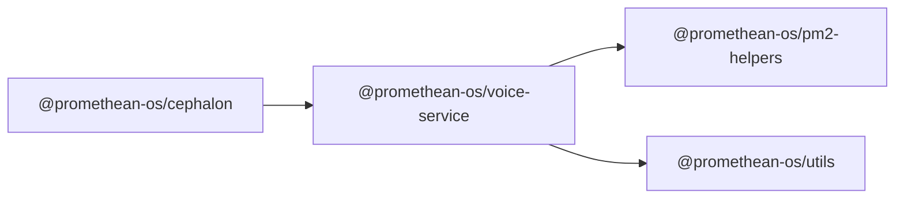

```
<!-- SYMPKG:PKG:BEGIN -->
```
# @promethean-os/voice-service
```
**Folder:** `packages/voice`
```
```
**Version:** `0.0.1`
```
```
**Domain:** `_root`
```

## Dependencies
- @promethean-os/pm2-helpers$../pm2-helpers/README.md
- @promethean-os/utils$../utils/README.md
## Dependents
- @promethean-os/cephalon$../cephalon/README.md
```


## 📁 Implementation

### Core Files

- [6](../../../packages/voice/src/6)

### View Source

- [GitHub](https://github.com/promethean-ai/promethean/tree/main/packages/voice/src)
- [VS Code](vscode://file/packages/voice/src)


## 📚 API Reference

### Interfaces

#### [- **index.ts**](../../../packages/voice/src/[src/index.ts](../../../packages/voice/src/index.ts) (254 lines)#L1)

#### [- **speaker.ts**](../../../packages/voice/src/[src/speaker.ts](../../../packages/voice/src/speaker.ts) (111 lines)#L1)

#### [- **tests/dummy.test.ts**](../../../packages/voice/src/[src/tests/dummy.test.ts](../../../packages/voice/src/tests/dummy.test.ts) (6 lines)#L1)

#### [- **tests/speaker.test.ts**](../../../packages/voice/src/[src/tests/speaker.test.ts](../../../packages/voice/src/tests/speaker.test.ts) (27 lines)#L1)

#### [- **tests/voice-recorder.test.ts**](../../../packages/voice/src/[src/tests/voice-recorder.test.ts](../../../packages/voice/src/tests/voice-recorder.test.ts) (50 lines)#L1)

#### [- **transcriber.ts**](../../../packages/voice/src/[src/transcriber.ts](../../../packages/voice/src/transcriber.ts) (116 lines)#L1)

#### [- **voice-recorder.ts**](../../../packages/voice/src/[src/voice-recorder.ts](../../../packages/voice/src/voice-recorder.ts) (70 lines)#L1)

#### [- **voice-session.ts**](../../../packages/voice/src/[src/voice-session.ts](../../../packages/voice/src/voice-session.ts) (198 lines)#L1)

#### [- **voice-synth.ts**](../../../packages/voice/src/[src/voice-synth.ts](../../../packages/voice/src/voice-synth.ts) (118 lines)#L1)

#### [- **OpusSilenceFilter**](../../../packages/voice/src/[OpusSilenceFilter](../../../packages/voice/src/speaker.ts#L18)

#### [- **Speaker**](../../../packages/voice/src/[Speaker](../../../packages/voice/src/speaker.ts#L44)

#### [- **Transcriber**](../../../packages/voice/src/[Transcriber](../../../packages/voice/src/transcriber.ts#L41)

#### [- **VoiceRecorder**](../../../packages/voice/src/[VoiceRecorder](../../../packages/voice/src/voice-recorder.ts#L27)

#### [- **VoiceSession**](../../../packages/voice/src/[VoiceSession](../../../packages/voice/src/voice-session.ts#L40)

#### [- **createVoiceService()**](../../../packages/voice/src/[createVoiceService()](../../../packages/voice/src/index.ts#L205)

#### [- **GitHub**](../../../packages/voice/src/[View on GitHub](https#L1)

#### [- **VS Code**](../../../packages/voice/src/[Open in VS Code](vscode#L1)

#### [**Location**](../../../packages/voice/src/[OpusSilenceFilter](../../../packages/voice/src/speaker.ts#L18)

#### [**Description**](../../../packages/voice/src/Main class for opussilencefilter functionality.#L1)

#### [**File**](../../../packages/voice/src/`src/speaker.ts`#L1)

#### [**Location**](../../../packages/voice/src/[Speaker](../../../packages/voice/src/speaker.ts#L44)

#### [**Description**](../../../packages/voice/src/Main class for speaker functionality.#L1)

#### [**File**](../../../packages/voice/src/`src/speaker.ts`#L1)

#### [**Location**](../../../packages/voice/src/[Transcriber](../../../packages/voice/src/transcriber.ts#L41)

#### [**Description**](../../../packages/voice/src/Main class for transcriber functionality.#L1)

#### [**File**](../../../packages/voice/src/`src/transcriber.ts`#L1)

#### [**Location**](../../../packages/voice/src/[VoiceRecorder](../../../packages/voice/src/voice-recorder.ts#L27)

#### [**Description**](../../../packages/voice/src/Main class for voicerecorder functionality.#L1)

#### [**File**](../../../packages/voice/src/`src/voice-recorder.ts`#L1)

#### [**Location**](../../../packages/voice/src/[VoiceSession](../../../packages/voice/src/voice-session.ts#L40)

#### [**Description**](../../../packages/voice/src/Main class for voicesession functionality.#L1)

#### [**File**](../../../packages/voice/src/`src/voice-session.ts`#L1)

#### [**Location**](../../../packages/voice/src/[VoiceSynth](../../../packages/voice/src/voice-synth.ts#L14)

#### [**Description**](../../../packages/voice/src/Main class for voicesynth functionality.#L1)

#### [**File**](../../../packages/voice/src/`src/voice-synth.ts`#L1)

#### [**Location**](../../../packages/voice/src/[createVoiceService()](../../../packages/voice/src/index.ts#L205)

#### [**Description**](../../../packages/voice/src/Key function for createvoiceservice operations.#L1)

#### [**File**](../../../packages/voice/src/`src/index.ts`#L1)

#### [Code links saved to](../../../packages/voice/src//home/err/devel/promethean/tmp/voice-code-links.json#L1)


---

*Enhanced with code links via SYMPKG documentation enhancer*